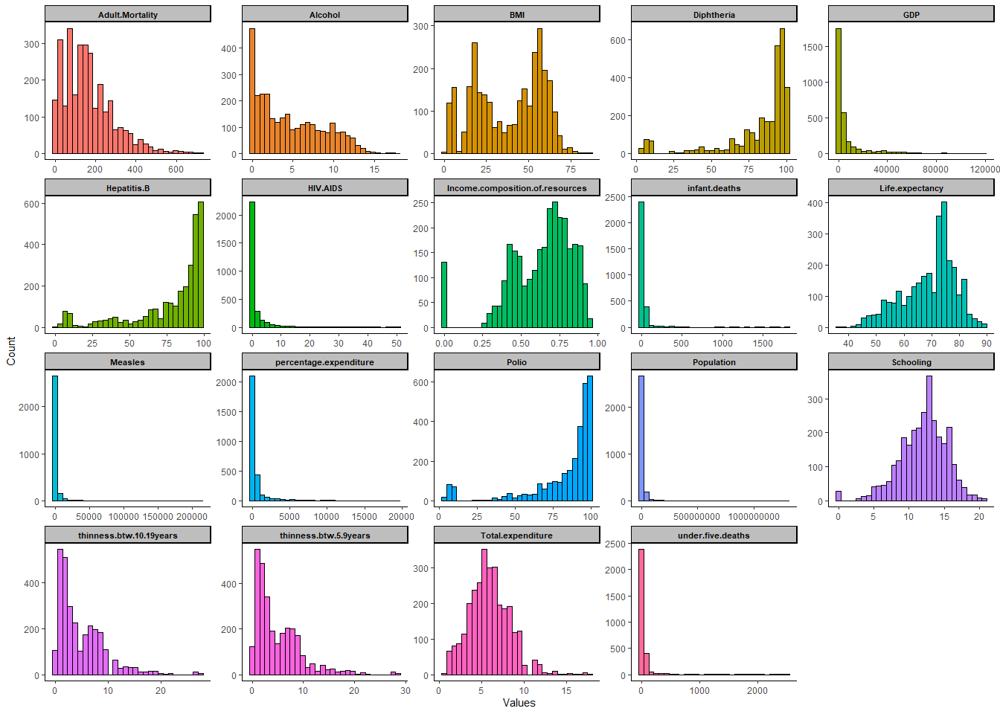
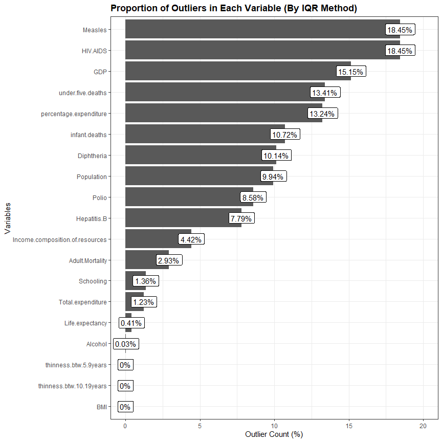
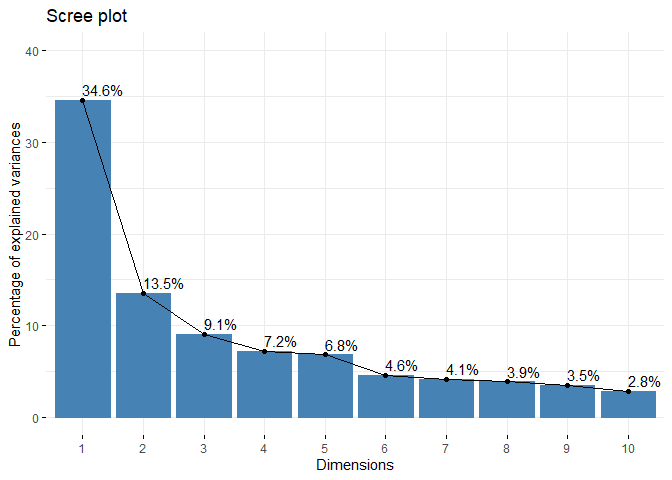
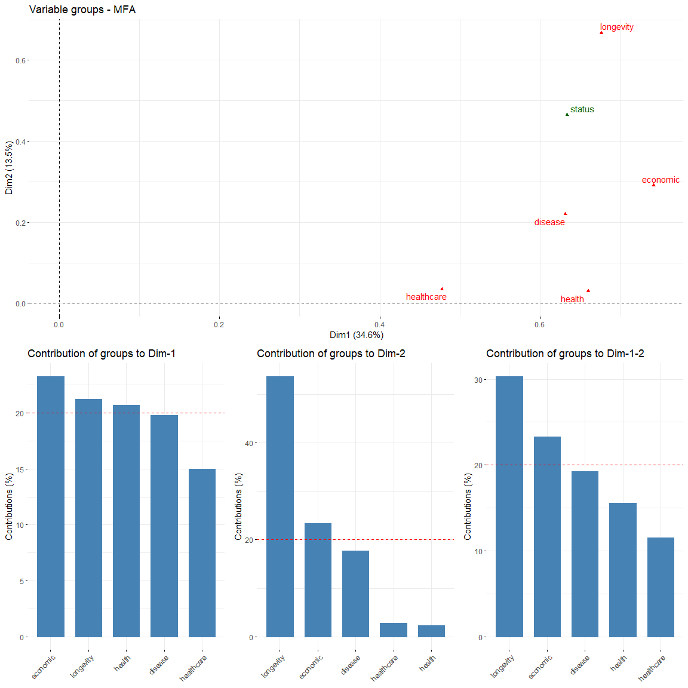
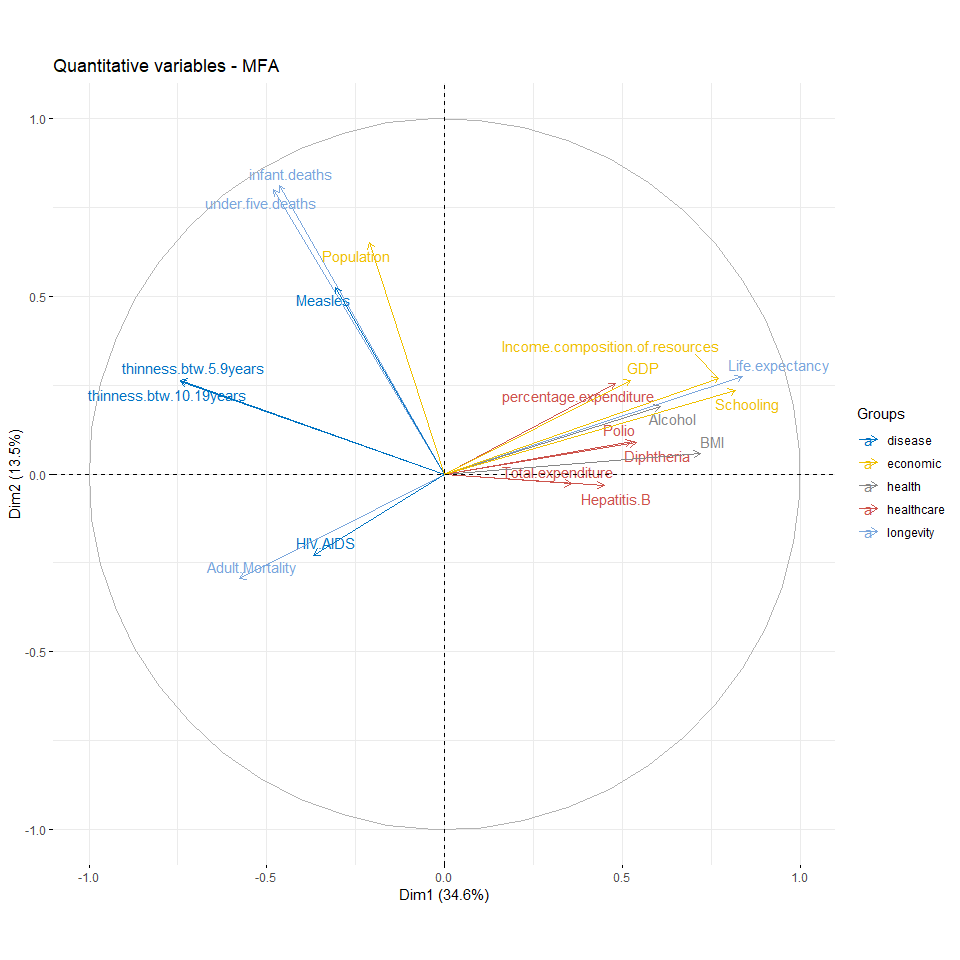
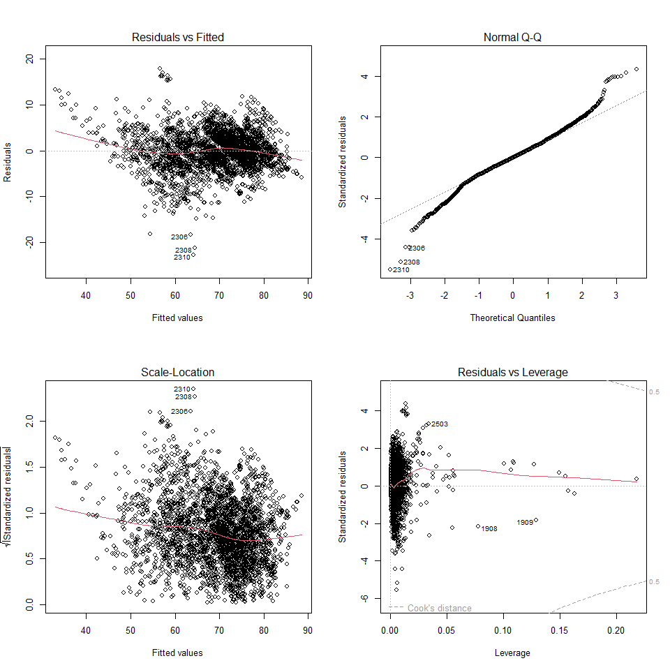

Life Expectancy Statistical Analysis (WHO)
================
Kar
2022-06-23

-   [R PACKAGES](#r-packages)
-   [INTRODUCTION](#introduction)
-   [DATA PREPARATION](#data-preparation)
    -   [Data Import](#data-import)
    -   [Data Description](#data-description)
    -   [Data Exploration](#data-exploration)
        -   [Data type and structure](#data-type-and-structure)
        -   [Vertical NA Check (Column)](#vertical-na-check-column)
        -   [Horizontal NA Check (Row)](#horizontal-na-check-row)
-   [DATA CLEANING](#data-cleaning)
    -   [White Space Trimming and punctuation
        remove](#white-space-trimming-and-punctuation-remove)
    -   [Rename Levels](#rename-levels)
    -   [Factor conversion](#factor-conversion)
    -   [Bag imputation](#bag-imputation)
-   [EDA](#eda)
    -   [Histogram for Distribution](#histogram-for-distribution)
    -   [Boxplot for Outliers](#boxplot-for-outliers)
    -   [MFA](#mfa)
    -   [Defining the themes of grouping and found that the variables in
        the dataset can be grouped into following 6 subcategories for
        MFA.](#defining-the-themes-of-grouping-and-found-that-the-variables-in-the-dataset-can-be-grouped-into-following-6-subcategories-for-mfa)
-   [SUMMARY STATISTICS](#summary-statistics)
-   [STATISTICAL ANALYSIS](#statistical-analysis)
    -   [Q1. Interaction of Year with Country
        Status](#q1-interaction-of-year-with-country-status)
    -   [Q2. Factors that Affacting Life
        Expectancy](#q2-factors-that-affacting-life-expectancy)
        -   [Multicollinearity Test](#multicollinearity-test)
        -   [Multiple Linear Regression
            Model](#multiple-linear-regression-model)
        -   [VIF check](#vif-check)
        -   [Assumption diagnostics](#assumption-diagnostics)
    -   [3. Investigate the Effectiveness of Health
        Expenditure](#3-investigate-the-effectiveness-of-health-expenditure)
    -   [4. How does Infant and Adult mortality rates affect life
        expectancy?](#4-how-does-infant-and-adult-mortality-rates-affect-life-expectancy)
    -   [5. Does Life Expectancy has positive or negative correlation
        with eating habits, lifestyle, exercise, smoking, drinking
        alcohol etc. What is the impact of schooling on the lifespan of
        humans?](#5-does-life-expectancy-has-positive-or-negative-correlation-with-eating-habits-lifestyle-exercise-smoking-drinking-alcohol-etc-what-is-the-impact-of-schooling-on-the-lifespan-of-humans)
    -   [6. Does Life Expectancy have positive or negative relationship
        with drinking
        alcohol?](#6-does-life-expectancy-have-positive-or-negative-relationship-with-drinking-alcohol)
    -   [7. Do densely populated countries tend to have lower life
        expectancy?](#7-do-densely-populated-countries-tend-to-have-lower-life-expectancy)
    -   [8. What is the impact of Immunization coverage on life
        Expectancy?](#8-what-is-the-impact-of-immunization-coverage-on-life-expectancy)
-   [ACKNOWLEDGEMENTS](#acknowledgements)
-   [REFERENCE](#reference)

# R PACKAGES

``` r
# Environment setting (to remove scientific notation)

options(scipen = 999)  

# Packages loaded

library(tidyverse)
library(kableExtra)
library(skimr)
library(caret)
library(tableone)
library(factoextra)
library(FactoMineR)
library(car)
library(mvnormtest)
library(biotools)
library(corrplot)
library(cowplot)
library(hrbrthemes)
```

# INTRODUCTION

# DATA PREPARATION

The dataset used in this project is a public dataset available on Kaggle
website. Kaggle website is a well-known website for data analyst and
data scientist for sharing data, codes, resources, and ideas. The
dataset is accessible via this
[Link](https://www.kaggle.com/datasets/kumarajarshi/life-expectancy-who).

## Data Import

Following show 10 randomly selected rows from the dataset:

``` r
life <- read.csv("Life Expectancy Data.csv")
  
sample_n(life, 10)
```

<div data-pagedtable="false">

<script data-pagedtable-source type="application/json">
{"columns":[{"label":["Country"],"name":[1],"type":["chr"],"align":["left"]},{"label":["Year"],"name":[2],"type":["int"],"align":["right"]},{"label":["Status"],"name":[3],"type":["chr"],"align":["left"]},{"label":["Life.expectancy"],"name":[4],"type":["dbl"],"align":["right"]},{"label":["Adult.Mortality"],"name":[5],"type":["int"],"align":["right"]},{"label":["infant.deaths"],"name":[6],"type":["int"],"align":["right"]},{"label":["Alcohol"],"name":[7],"type":["dbl"],"align":["right"]},{"label":["percentage.expenditure"],"name":[8],"type":["dbl"],"align":["right"]},{"label":["Hepatitis.B"],"name":[9],"type":["int"],"align":["right"]},{"label":["Measles"],"name":[10],"type":["int"],"align":["right"]},{"label":["BMI"],"name":[11],"type":["dbl"],"align":["right"]},{"label":["under.five.deaths"],"name":[12],"type":["int"],"align":["right"]},{"label":["Polio"],"name":[13],"type":["int"],"align":["right"]},{"label":["Total.expenditure"],"name":[14],"type":["dbl"],"align":["right"]},{"label":["Diphtheria"],"name":[15],"type":["int"],"align":["right"]},{"label":["HIV.AIDS"],"name":[16],"type":["dbl"],"align":["right"]},{"label":["GDP"],"name":[17],"type":["dbl"],"align":["right"]},{"label":["Population"],"name":[18],"type":["dbl"],"align":["right"]},{"label":["thinness..1.19.years"],"name":[19],"type":["dbl"],"align":["right"]},{"label":["thinness.5.9.years"],"name":[20],"type":["dbl"],"align":["right"]},{"label":["Income.composition.of.resources"],"name":[21],"type":["dbl"],"align":["right"]},{"label":["Schooling"],"name":[22],"type":["dbl"],"align":["right"]}],"data":[{"1":"Yemen","2":"2012","3":"Developing","4":"64.7","5":"236","6":"36","7":"0.04","8":"0.000000","9":"67","10":"2177","11":"38.7","12":"46","13":"68","14":"5.73","15":"67","16":"0.1","17":"NA","18":"NA","19":"13.7","20":"13.6","21":"0.494","22":"9.0"},{"1":"Gabon","2":"2009","3":"Developing","4":"61.7","5":"31","6":"2","7":"8.64","8":"52.310863","9":"79","10":"0","11":"33.0","12":"3","13":"74","14":"3.43","15":"76","16":"8.0","17":"763.6622","18":"1586754","19":"6.7","20":"6.5","21":"0.652","22":"12.4"},{"1":"Swaziland","2":"2006","3":"Developing","4":"47.8","5":"564","6":"3","7":"5.53","8":"437.080244","9":"93","10":"0","11":"28.2","12":"4","13":"88","14":"6.81","15":"87","16":"43.7","17":"2937.3672","18":"112514","19":"6.9","20":"7.1","21":"0.502","22":"9.9"},{"1":"Nigeria","2":"2008","3":"Developing","4":"59.0","5":"386","6":"536","7":"9.30","8":"105.591063","9":"41","10":"9960","11":"21.0","12":"848","13":"6","14":"4.00","15":"53","16":"5.0","17":"1383.8934","18":"1534739","19":"12.0","20":"11.9","21":"0.481","22":"9.2"},{"1":"Fiji","2":"2004","3":"Developing","4":"68.1","5":"218","6":"0","7":"1.63","8":"43.994525","9":"99","10":"37","11":"54.2","12":"0","13":"96","14":"3.61","15":"95","16":"0.1","17":"3332.9185","18":"818354","19":"4.2","20":"3.9","21":"0.691","22":"13.4"},{"1":"Republic of Korea","2":"2000","3":"Developing","4":"76.0","5":"116","6":"4","7":"10.33","8":"0.000000","9":"93","10":"32647","11":"24.7","12":"4","13":"99","14":"4.23","15":"97","16":"0.1","17":"NA","18":"NA","19":"1.6","20":"1.1","21":"NA","22":"NA"},{"1":"Pakistan","2":"2015","3":"Developing","4":"66.4","5":"161","6":"352","7":"NA","8":"0.000000","9":"72","10":"386","11":"25.4","12":"433","13":"72","14":"NA","15":"72","16":"0.1","17":"1431.2449","18":"18938513","19":"19.2","20":"19.6","21":"0.548","22":"8.1"},{"1":"Guinea","2":"2002","3":"Developing","4":"52.9","5":"337","6":"35","7":"0.21","8":"21.337818","9":"NA","10":"2151","11":"17.3","12":"56","13":"56","14":"3.76","15":"53","16":"3.0","17":"322.8112","18":"9137345","19":"9.9","20":"9.9","21":"0.329","22":"5.5"},{"1":"Tunisia","2":"2002","3":"Developing","4":"73.5","5":"19","6":"4","7":"1.17","8":"262.818494","9":"93","10":"98","11":"49.7","12":"5","13":"96","14":"5.32","15":"96","16":"0.1","17":"2346.5937","18":"9864326","19":"6.5","20":"6.4","21":"0.662","22":"13.3"},{"1":"Ethiopia","2":"2004","3":"Developing","4":"55.0","5":"354","6":"217","7":"0.86","8":"1.506962","9":"NA","10":"73","11":"13.5","12":"342","13":"54","14":"4.23","15":"4","16":"4.1","17":"135.7624","18":"7462445","19":"11.5","20":"11.3","21":"0.310","22":"5.4"}],"options":{"columns":{"min":{},"max":[10]},"rows":{"min":[10],"max":[10]},"pages":{}}}
  </script>

</div>

## Data Description

``` r
No. <- c(1:22)

Variable <- c("Country", 
              "Year",
              "Status",
              "Life expectancy",
              "Adult Mortality",
              "infant deaths",
              "Alcohol",
              "percentage expenditure",
              "Hepatitis B",
              "Measles",
              "BMI",
              "under-five deaths",
              "Polio",
              "Total expenditure",
              "Diphtheria",
              "HIV/AIDS",
              "GDP",
              "Population",
              "thinness 1-19 years",
              "thinness 5-9 years",
              "Income composition of resources",
              "Schooling")

Description <- c("Country", 
                 "Year",
                 "Developed or Developing status",
                 "Life Expectancy in age",
                 "Adult Mortality Rates of both sexes (probability of dying between 15 and 60 years per 1000 population)",
                 "Number of Infant Deaths per 1000 population",
                 "Alcohol, recorded per capita (15+) consumption (in litres of pure alcohol)",
                 "Expenditure on health as a percentage of Gross Domestic Product per capita(%)",
                 "Hepatitis B (HepB) immunization coverage among 1-year-olds (%)",
                 "Measles - number of reported cases per 1000 population",
                 "Average Body Mass Index of entire population",
                 "Number of under-five deaths per 1000 population",
                 "Polio (Pol3) immunization coverage among 1-year-olds (%)",
                 "General government expenditure on health as a percentage of total government expenditure (%)",
                 "Diphtheria tetanus toxoid and pertussis (DTP3) immunization coverage among 1-year-olds (%)",
                 "Deaths per 1 000 live births HIV/AIDS (0-4 years)",
                 "Gross Domestic Product per capita (in USD)",
                 "Population of the country",
                 "Prevalence of thinness among children and adolescents for Age 10 to 19 (%)",
                 "Prevalence of thinness among children for Age 5 to 9(%)",
                 "Human Development Index in terms of income composition of resources (index ranging from 0 to 1)",
                 "Number of years of Schooling(years)"
                 )

data.frame(No., Variable, Description) %>% 
  kbl() %>% 
  kable_styling(bootstrap_options = c("bordered", "stripped", "hover"), 
                full_width = T)
```

<table class="table table-bordered table-hover" style="margin-left: auto; margin-right: auto;">
<thead>
<tr>
<th style="text-align:right;">
No. 
</th>
<th style="text-align:left;">
Variable
</th>
<th style="text-align:left;">
Description
</th>
</tr>
</thead>
<tbody>
<tr>
<td style="text-align:right;">
1
</td>
<td style="text-align:left;">
Country
</td>
<td style="text-align:left;">
Country
</td>
</tr>
<tr>
<td style="text-align:right;">
2
</td>
<td style="text-align:left;">
Year
</td>
<td style="text-align:left;">
Year
</td>
</tr>
<tr>
<td style="text-align:right;">
3
</td>
<td style="text-align:left;">
Status
</td>
<td style="text-align:left;">
Developed or Developing status
</td>
</tr>
<tr>
<td style="text-align:right;">
4
</td>
<td style="text-align:left;">
Life expectancy
</td>
<td style="text-align:left;">
Life Expectancy in age
</td>
</tr>
<tr>
<td style="text-align:right;">
5
</td>
<td style="text-align:left;">
Adult Mortality
</td>
<td style="text-align:left;">
Adult Mortality Rates of both sexes (probability of dying between 15 and
60 years per 1000 population)
</td>
</tr>
<tr>
<td style="text-align:right;">
6
</td>
<td style="text-align:left;">
infant deaths
</td>
<td style="text-align:left;">
Number of Infant Deaths per 1000 population
</td>
</tr>
<tr>
<td style="text-align:right;">
7
</td>
<td style="text-align:left;">
Alcohol
</td>
<td style="text-align:left;">
Alcohol, recorded per capita (15+) consumption (in litres of pure
alcohol)
</td>
</tr>
<tr>
<td style="text-align:right;">
8
</td>
<td style="text-align:left;">
percentage expenditure
</td>
<td style="text-align:left;">
Expenditure on health as a percentage of Gross Domestic Product per
capita(%)
</td>
</tr>
<tr>
<td style="text-align:right;">
9
</td>
<td style="text-align:left;">
Hepatitis B
</td>
<td style="text-align:left;">
Hepatitis B (HepB) immunization coverage among 1-year-olds (%)
</td>
</tr>
<tr>
<td style="text-align:right;">
10
</td>
<td style="text-align:left;">
Measles
</td>
<td style="text-align:left;">
Measles - number of reported cases per 1000 population
</td>
</tr>
<tr>
<td style="text-align:right;">
11
</td>
<td style="text-align:left;">
BMI
</td>
<td style="text-align:left;">
Average Body Mass Index of entire population
</td>
</tr>
<tr>
<td style="text-align:right;">
12
</td>
<td style="text-align:left;">
under-five deaths
</td>
<td style="text-align:left;">
Number of under-five deaths per 1000 population
</td>
</tr>
<tr>
<td style="text-align:right;">
13
</td>
<td style="text-align:left;">
Polio
</td>
<td style="text-align:left;">
Polio (Pol3) immunization coverage among 1-year-olds (%)
</td>
</tr>
<tr>
<td style="text-align:right;">
14
</td>
<td style="text-align:left;">
Total expenditure
</td>
<td style="text-align:left;">
General government expenditure on health as a percentage of total
government expenditure (%)
</td>
</tr>
<tr>
<td style="text-align:right;">
15
</td>
<td style="text-align:left;">
Diphtheria
</td>
<td style="text-align:left;">
Diphtheria tetanus toxoid and pertussis (DTP3) immunization coverage
among 1-year-olds (%)
</td>
</tr>
<tr>
<td style="text-align:right;">
16
</td>
<td style="text-align:left;">
HIV/AIDS
</td>
<td style="text-align:left;">
Deaths per 1 000 live births HIV/AIDS (0-4 years)
</td>
</tr>
<tr>
<td style="text-align:right;">
17
</td>
<td style="text-align:left;">
GDP
</td>
<td style="text-align:left;">
Gross Domestic Product per capita (in USD)
</td>
</tr>
<tr>
<td style="text-align:right;">
18
</td>
<td style="text-align:left;">
Population
</td>
<td style="text-align:left;">
Population of the country
</td>
</tr>
<tr>
<td style="text-align:right;">
19
</td>
<td style="text-align:left;">
thinness 1-19 years
</td>
<td style="text-align:left;">
Prevalence of thinness among children and adolescents for Age 10 to 19
(%)
</td>
</tr>
<tr>
<td style="text-align:right;">
20
</td>
<td style="text-align:left;">
thinness 5-9 years
</td>
<td style="text-align:left;">
Prevalence of thinness among children for Age 5 to 9(%)
</td>
</tr>
<tr>
<td style="text-align:right;">
21
</td>
<td style="text-align:left;">
Income composition of resources
</td>
<td style="text-align:left;">
Human Development Index in terms of income composition of resources
(index ranging from 0 to 1)
</td>
</tr>
<tr>
<td style="text-align:right;">
22
</td>
<td style="text-align:left;">
Schooling
</td>
<td style="text-align:left;">
Number of years of Schooling(years)
</td>
</tr>
</tbody>
</table>

## Data Exploration

### Data type and structure

There are 2938 rows of data and 22 columns of variables.

``` r
glimpse(life)
```

    ## Rows: 2,938
    ## Columns: 22
    ## $ Country                         <chr> "Afghanistan", "Afghanistan", "Afghani…
    ## $ Year                            <int> 2015, 2014, 2013, 2012, 2011, 2010, 20…
    ## $ Status                          <chr> "Developing", "Developing", "Developin…
    ## $ Life.expectancy                 <dbl> 65.0, 59.9, 59.9, 59.5, 59.2, 58.8, 58…
    ## $ Adult.Mortality                 <int> 263, 271, 268, 272, 275, 279, 281, 287…
    ## $ infant.deaths                   <int> 62, 64, 66, 69, 71, 74, 77, 80, 82, 84…
    ## $ Alcohol                         <dbl> 0.01, 0.01, 0.01, 0.01, 0.01, 0.01, 0.…
    ## $ percentage.expenditure          <dbl> 71.279624, 73.523582, 73.219243, 78.18…
    ## $ Hepatitis.B                     <int> 65, 62, 64, 67, 68, 66, 63, 64, 63, 64…
    ## $ Measles                         <int> 1154, 492, 430, 2787, 3013, 1989, 2861…
    ## $ BMI                             <dbl> 19.1, 18.6, 18.1, 17.6, 17.2, 16.7, 16…
    ## $ under.five.deaths               <int> 83, 86, 89, 93, 97, 102, 106, 110, 113…
    ## $ Polio                           <int> 6, 58, 62, 67, 68, 66, 63, 64, 63, 58,…
    ## $ Total.expenditure               <dbl> 8.16, 8.18, 8.13, 8.52, 7.87, 9.20, 9.…
    ## $ Diphtheria                      <int> 65, 62, 64, 67, 68, 66, 63, 64, 63, 58…
    ## $ HIV.AIDS                        <dbl> 0.1, 0.1, 0.1, 0.1, 0.1, 0.1, 0.1, 0.1…
    ## $ GDP                             <dbl> 584.25921, 612.69651, 631.74498, 669.9…
    ## $ Population                      <dbl> 33736494, 327582, 31731688, 3696958, 2…
    ## $ thinness..1.19.years            <dbl> 17.2, 17.5, 17.7, 17.9, 18.2, 18.4, 18…
    ## $ thinness.5.9.years              <dbl> 17.3, 17.5, 17.7, 18.0, 18.2, 18.4, 18…
    ## $ Income.composition.of.resources <dbl> 0.479, 0.476, 0.470, 0.463, 0.454, 0.4…
    ## $ Schooling                       <dbl> 10.1, 10.0, 9.9, 9.8, 9.5, 9.2, 8.9, 8…

### Vertical NA Check (Column)

There are 2 character variables “Country” and “Status”, and the rest of
the variables are numerical.

``` r
skim_without_charts(life)
```

<table style="width: auto;" class="table table-condensed">
<caption>
Data summary
</caption>
<tbody>
<tr>
<td style="text-align:left;">
Name
</td>
<td style="text-align:left;">
life
</td>
</tr>
<tr>
<td style="text-align:left;">
Number of rows
</td>
<td style="text-align:left;">
2938
</td>
</tr>
<tr>
<td style="text-align:left;">
Number of columns
</td>
<td style="text-align:left;">
22
</td>
</tr>
<tr>
<td style="text-align:left;">
\_\_\_\_\_\_\_\_\_\_\_\_\_\_\_\_\_\_\_\_\_\_\_
</td>
<td style="text-align:left;">
</td>
</tr>
<tr>
<td style="text-align:left;">
Column type frequency:
</td>
<td style="text-align:left;">
</td>
</tr>
<tr>
<td style="text-align:left;">
character
</td>
<td style="text-align:left;">
2
</td>
</tr>
<tr>
<td style="text-align:left;">
numeric
</td>
<td style="text-align:left;">
20
</td>
</tr>
<tr>
<td style="text-align:left;">
\_\_\_\_\_\_\_\_\_\_\_\_\_\_\_\_\_\_\_\_\_\_\_\_
</td>
<td style="text-align:left;">
</td>
</tr>
<tr>
<td style="text-align:left;">
Group variables
</td>
<td style="text-align:left;">
None
</td>
</tr>
</tbody>
</table>

**Variable type: character**

<table>
<thead>
<tr>
<th style="text-align:left;">
skim_variable
</th>
<th style="text-align:right;">
n_missing
</th>
<th style="text-align:right;">
complete_rate
</th>
<th style="text-align:right;">
min
</th>
<th style="text-align:right;">
max
</th>
<th style="text-align:right;">
empty
</th>
<th style="text-align:right;">
n_unique
</th>
<th style="text-align:right;">
whitespace
</th>
</tr>
</thead>
<tbody>
<tr>
<td style="text-align:left;">
Country
</td>
<td style="text-align:right;">
0
</td>
<td style="text-align:right;">
1
</td>
<td style="text-align:right;">
4
</td>
<td style="text-align:right;">
52
</td>
<td style="text-align:right;">
0
</td>
<td style="text-align:right;">
193
</td>
<td style="text-align:right;">
0
</td>
</tr>
<tr>
<td style="text-align:left;">
Status
</td>
<td style="text-align:right;">
0
</td>
<td style="text-align:right;">
1
</td>
<td style="text-align:right;">
9
</td>
<td style="text-align:right;">
10
</td>
<td style="text-align:right;">
0
</td>
<td style="text-align:right;">
2
</td>
<td style="text-align:right;">
0
</td>
</tr>
</tbody>
</table>

**Variable type: numeric**

<table>
<thead>
<tr>
<th style="text-align:left;">
skim_variable
</th>
<th style="text-align:right;">
n_missing
</th>
<th style="text-align:right;">
complete_rate
</th>
<th style="text-align:right;">
mean
</th>
<th style="text-align:right;">
sd
</th>
<th style="text-align:right;">
p0
</th>
<th style="text-align:right;">
p25
</th>
<th style="text-align:right;">
p50
</th>
<th style="text-align:right;">
p75
</th>
<th style="text-align:right;">
p100
</th>
</tr>
</thead>
<tbody>
<tr>
<td style="text-align:left;">
Year
</td>
<td style="text-align:right;">
0
</td>
<td style="text-align:right;">
1.00
</td>
<td style="text-align:right;">
2007.52
</td>
<td style="text-align:right;">
4.61
</td>
<td style="text-align:right;">
2000.00
</td>
<td style="text-align:right;">
2004.00
</td>
<td style="text-align:right;">
2008.00
</td>
<td style="text-align:right;">
2012.00
</td>
<td style="text-align:right;">
2015.00
</td>
</tr>
<tr>
<td style="text-align:left;">
Life.expectancy
</td>
<td style="text-align:right;">
10
</td>
<td style="text-align:right;">
1.00
</td>
<td style="text-align:right;">
69.22
</td>
<td style="text-align:right;">
9.52
</td>
<td style="text-align:right;">
36.30
</td>
<td style="text-align:right;">
63.10
</td>
<td style="text-align:right;">
72.10
</td>
<td style="text-align:right;">
75.70
</td>
<td style="text-align:right;">
89.00
</td>
</tr>
<tr>
<td style="text-align:left;">
Adult.Mortality
</td>
<td style="text-align:right;">
10
</td>
<td style="text-align:right;">
1.00
</td>
<td style="text-align:right;">
164.80
</td>
<td style="text-align:right;">
124.29
</td>
<td style="text-align:right;">
1.00
</td>
<td style="text-align:right;">
74.00
</td>
<td style="text-align:right;">
144.00
</td>
<td style="text-align:right;">
228.00
</td>
<td style="text-align:right;">
723.00
</td>
</tr>
<tr>
<td style="text-align:left;">
infant.deaths
</td>
<td style="text-align:right;">
0
</td>
<td style="text-align:right;">
1.00
</td>
<td style="text-align:right;">
30.30
</td>
<td style="text-align:right;">
117.93
</td>
<td style="text-align:right;">
0.00
</td>
<td style="text-align:right;">
0.00
</td>
<td style="text-align:right;">
3.00
</td>
<td style="text-align:right;">
22.00
</td>
<td style="text-align:right;">
1800.00
</td>
</tr>
<tr>
<td style="text-align:left;">
Alcohol
</td>
<td style="text-align:right;">
194
</td>
<td style="text-align:right;">
0.93
</td>
<td style="text-align:right;">
4.60
</td>
<td style="text-align:right;">
4.05
</td>
<td style="text-align:right;">
0.01
</td>
<td style="text-align:right;">
0.88
</td>
<td style="text-align:right;">
3.76
</td>
<td style="text-align:right;">
7.70
</td>
<td style="text-align:right;">
17.87
</td>
</tr>
<tr>
<td style="text-align:left;">
percentage.expenditure
</td>
<td style="text-align:right;">
0
</td>
<td style="text-align:right;">
1.00
</td>
<td style="text-align:right;">
738.25
</td>
<td style="text-align:right;">
1987.91
</td>
<td style="text-align:right;">
0.00
</td>
<td style="text-align:right;">
4.69
</td>
<td style="text-align:right;">
64.91
</td>
<td style="text-align:right;">
441.53
</td>
<td style="text-align:right;">
19479.91
</td>
</tr>
<tr>
<td style="text-align:left;">
Hepatitis.B
</td>
<td style="text-align:right;">
553
</td>
<td style="text-align:right;">
0.81
</td>
<td style="text-align:right;">
80.94
</td>
<td style="text-align:right;">
25.07
</td>
<td style="text-align:right;">
1.00
</td>
<td style="text-align:right;">
77.00
</td>
<td style="text-align:right;">
92.00
</td>
<td style="text-align:right;">
97.00
</td>
<td style="text-align:right;">
99.00
</td>
</tr>
<tr>
<td style="text-align:left;">
Measles
</td>
<td style="text-align:right;">
0
</td>
<td style="text-align:right;">
1.00
</td>
<td style="text-align:right;">
2419.59
</td>
<td style="text-align:right;">
11467.27
</td>
<td style="text-align:right;">
0.00
</td>
<td style="text-align:right;">
0.00
</td>
<td style="text-align:right;">
17.00
</td>
<td style="text-align:right;">
360.25
</td>
<td style="text-align:right;">
212183.00
</td>
</tr>
<tr>
<td style="text-align:left;">
BMI
</td>
<td style="text-align:right;">
34
</td>
<td style="text-align:right;">
0.99
</td>
<td style="text-align:right;">
38.32
</td>
<td style="text-align:right;">
20.04
</td>
<td style="text-align:right;">
1.00
</td>
<td style="text-align:right;">
19.30
</td>
<td style="text-align:right;">
43.50
</td>
<td style="text-align:right;">
56.20
</td>
<td style="text-align:right;">
87.30
</td>
</tr>
<tr>
<td style="text-align:left;">
under.five.deaths
</td>
<td style="text-align:right;">
0
</td>
<td style="text-align:right;">
1.00
</td>
<td style="text-align:right;">
42.04
</td>
<td style="text-align:right;">
160.45
</td>
<td style="text-align:right;">
0.00
</td>
<td style="text-align:right;">
0.00
</td>
<td style="text-align:right;">
4.00
</td>
<td style="text-align:right;">
28.00
</td>
<td style="text-align:right;">
2500.00
</td>
</tr>
<tr>
<td style="text-align:left;">
Polio
</td>
<td style="text-align:right;">
19
</td>
<td style="text-align:right;">
0.99
</td>
<td style="text-align:right;">
82.55
</td>
<td style="text-align:right;">
23.43
</td>
<td style="text-align:right;">
3.00
</td>
<td style="text-align:right;">
78.00
</td>
<td style="text-align:right;">
93.00
</td>
<td style="text-align:right;">
97.00
</td>
<td style="text-align:right;">
99.00
</td>
</tr>
<tr>
<td style="text-align:left;">
Total.expenditure
</td>
<td style="text-align:right;">
226
</td>
<td style="text-align:right;">
0.92
</td>
<td style="text-align:right;">
5.94
</td>
<td style="text-align:right;">
2.50
</td>
<td style="text-align:right;">
0.37
</td>
<td style="text-align:right;">
4.26
</td>
<td style="text-align:right;">
5.76
</td>
<td style="text-align:right;">
7.49
</td>
<td style="text-align:right;">
17.60
</td>
</tr>
<tr>
<td style="text-align:left;">
Diphtheria
</td>
<td style="text-align:right;">
19
</td>
<td style="text-align:right;">
0.99
</td>
<td style="text-align:right;">
82.32
</td>
<td style="text-align:right;">
23.72
</td>
<td style="text-align:right;">
2.00
</td>
<td style="text-align:right;">
78.00
</td>
<td style="text-align:right;">
93.00
</td>
<td style="text-align:right;">
97.00
</td>
<td style="text-align:right;">
99.00
</td>
</tr>
<tr>
<td style="text-align:left;">
HIV.AIDS
</td>
<td style="text-align:right;">
0
</td>
<td style="text-align:right;">
1.00
</td>
<td style="text-align:right;">
1.74
</td>
<td style="text-align:right;">
5.08
</td>
<td style="text-align:right;">
0.10
</td>
<td style="text-align:right;">
0.10
</td>
<td style="text-align:right;">
0.10
</td>
<td style="text-align:right;">
0.80
</td>
<td style="text-align:right;">
50.60
</td>
</tr>
<tr>
<td style="text-align:left;">
GDP
</td>
<td style="text-align:right;">
448
</td>
<td style="text-align:right;">
0.85
</td>
<td style="text-align:right;">
7483.16
</td>
<td style="text-align:right;">
14270.17
</td>
<td style="text-align:right;">
1.68
</td>
<td style="text-align:right;">
463.94
</td>
<td style="text-align:right;">
1766.95
</td>
<td style="text-align:right;">
5910.81
</td>
<td style="text-align:right;">
119172.74
</td>
</tr>
<tr>
<td style="text-align:left;">
Population
</td>
<td style="text-align:right;">
652
</td>
<td style="text-align:right;">
0.78
</td>
<td style="text-align:right;">
12753375.12
</td>
<td style="text-align:right;">
61012096.51
</td>
<td style="text-align:right;">
34.00
</td>
<td style="text-align:right;">
195793.25
</td>
<td style="text-align:right;">
1386542.00
</td>
<td style="text-align:right;">
7420359.00
</td>
<td style="text-align:right;">
1293859294.00
</td>
</tr>
<tr>
<td style="text-align:left;">
thinness..1.19.years
</td>
<td style="text-align:right;">
34
</td>
<td style="text-align:right;">
0.99
</td>
<td style="text-align:right;">
4.84
</td>
<td style="text-align:right;">
4.42
</td>
<td style="text-align:right;">
0.10
</td>
<td style="text-align:right;">
1.60
</td>
<td style="text-align:right;">
3.30
</td>
<td style="text-align:right;">
7.20
</td>
<td style="text-align:right;">
27.70
</td>
</tr>
<tr>
<td style="text-align:left;">
thinness.5.9.years
</td>
<td style="text-align:right;">
34
</td>
<td style="text-align:right;">
0.99
</td>
<td style="text-align:right;">
4.87
</td>
<td style="text-align:right;">
4.51
</td>
<td style="text-align:right;">
0.10
</td>
<td style="text-align:right;">
1.50
</td>
<td style="text-align:right;">
3.30
</td>
<td style="text-align:right;">
7.20
</td>
<td style="text-align:right;">
28.60
</td>
</tr>
<tr>
<td style="text-align:left;">
Income.composition.of.resources
</td>
<td style="text-align:right;">
167
</td>
<td style="text-align:right;">
0.94
</td>
<td style="text-align:right;">
0.63
</td>
<td style="text-align:right;">
0.21
</td>
<td style="text-align:right;">
0.00
</td>
<td style="text-align:right;">
0.49
</td>
<td style="text-align:right;">
0.68
</td>
<td style="text-align:right;">
0.78
</td>
<td style="text-align:right;">
0.95
</td>
</tr>
<tr>
<td style="text-align:left;">
Schooling
</td>
<td style="text-align:right;">
163
</td>
<td style="text-align:right;">
0.94
</td>
<td style="text-align:right;">
11.99
</td>
<td style="text-align:right;">
3.36
</td>
<td style="text-align:right;">
0.00
</td>
<td style="text-align:right;">
10.10
</td>
<td style="text-align:right;">
12.30
</td>
<td style="text-align:right;">
14.30
</td>
<td style="text-align:right;">
20.70
</td>
</tr>
</tbody>
</table>

From the variables “n_missing” and “complete_rate”, they detected a lot
of missing data in a lot of the variables. Mean and standard deviation
are also provided.

A good thing is that there is no variable having more than 40% missing
data because I will follow a 60% rule that if a column has less than 0.6
completion rate (0.4 or 40% missing data) I will consider dropping the
variable.

Alternatively, the missing data can be examined using following code:

``` r
colSums(is.na(life))
```

    ##                         Country                            Year 
    ##                               0                               0 
    ##                          Status                 Life.expectancy 
    ##                               0                              10 
    ##                 Adult.Mortality                   infant.deaths 
    ##                              10                               0 
    ##                         Alcohol          percentage.expenditure 
    ##                             194                               0 
    ##                     Hepatitis.B                         Measles 
    ##                             553                               0 
    ##                             BMI               under.five.deaths 
    ##                              34                               0 
    ##                           Polio               Total.expenditure 
    ##                              19                             226 
    ##                      Diphtheria                        HIV.AIDS 
    ##                              19                               0 
    ##                             GDP                      Population 
    ##                             448                             652 
    ##            thinness..1.19.years              thinness.5.9.years 
    ##                              34                              34 
    ## Income.composition.of.resources                       Schooling 
    ##                             167                             163

### Horizontal NA Check (Row)

Here performs horizontal missing value check.

``` r
life %>% 
  mutate(row.id = c(1:nrow(life))) %>% 
  relocate(row.id, .before = Country) %>% 
  gather(key = "variables", value = "values", -row.id) %>% 
  filter(is.na(values)) %>% 
  group_by(row.id) %>% 
  summarise(count = n()) %>% 
  arrange(-count) %>% 
  mutate(total.column = 22,
         propor.NA.per.row = paste0(round(count/total.column*100,1), "%")) 
```

<div data-pagedtable="false">

<script data-pagedtable-source type="application/json">
{"columns":[{"label":["row.id"],"name":[1],"type":["int"],"align":["right"]},{"label":["count"],"name":[2],"type":["int"],"align":["right"]},{"label":["total.column"],"name":[3],"type":["dbl"],"align":["right"]},{"label":["propor.NA.per.row"],"name":[4],"type":["chr"],"align":["left"]}],"data":[{"1":"1716","2":"9","3":"22","4":"40.9%"},{"1":"2418","2":"9","3":"22","4":"40.9%"},{"1":"2419","2":"9","3":"22","4":"40.9%"},{"1":"2420","2":"9","3":"22","4":"40.9%"},{"1":"2421","2":"9","3":"22","4":"40.9%"},{"1":"2422","2":"9","3":"22","4":"40.9%"},{"1":"2423","2":"9","3":"22","4":"40.9%"},{"1":"2424","2":"9","3":"22","4":"40.9%"},{"1":"2425","2":"9","3":"22","4":"40.9%"},{"1":"2217","2":"8","3":"22","4":"36.4%"},{"1":"2415","2":"8","3":"22","4":"36.4%"},{"1":"2416","2":"8","3":"22","4":"36.4%"},{"1":"2417","2":"8","3":"22","4":"36.4%"},{"1":"433","2":"6","3":"22","4":"27.3%"},{"1":"625","2":"6","3":"22","4":"27.3%"},{"1":"690","2":"6","3":"22","4":"27.3%"},{"1":"706","2":"6","3":"22","4":"27.3%"},{"1":"719","2":"6","3":"22","4":"27.3%"},{"1":"720","2":"6","3":"22","4":"27.3%"},{"1":"721","2":"6","3":"22","4":"27.3%"},{"1":"722","2":"6","3":"22","4":"27.3%"},{"1":"1910","2":"6","3":"22","4":"27.3%"},{"1":"2088","2":"6","3":"22","4":"27.3%"},{"1":"2104","2":"6","3":"22","4":"27.3%"},{"1":"2381","2":"6","3":"22","4":"27.3%"},{"1":"2382","2":"6","3":"22","4":"27.3%"},{"1":"2383","2":"6","3":"22","4":"27.3%"},{"1":"2384","2":"6","3":"22","4":"27.3%"},{"1":"2385","2":"6","3":"22","4":"27.3%"},{"1":"2386","2":"6","3":"22","4":"27.3%"},{"1":"2387","2":"6","3":"22","4":"27.3%"},{"1":"2388","2":"6","3":"22","4":"27.3%"},{"1":"2389","2":"6","3":"22","4":"27.3%"},{"1":"2390","2":"6","3":"22","4":"27.3%"},{"1":"2391","2":"6","3":"22","4":"27.3%"},{"1":"2392","2":"6","3":"22","4":"27.3%"},{"1":"2393","2":"6","3":"22","4":"27.3%"},{"1":"2414","2":"6","3":"22","4":"27.3%"},{"1":"2763","2":"6","3":"22","4":"27.3%"},{"1":"2779","2":"6","3":"22","4":"27.3%"},{"1":"2795","2":"6","3":"22","4":"27.3%"},{"1":"448","2":"5","3":"22","4":"22.7%"},{"1":"704","2":"5","3":"22","4":"22.7%"},{"1":"705","2":"5","3":"22","4":"22.7%"},{"1":"707","2":"5","3":"22","4":"22.7%"},{"1":"708","2":"5","3":"22","4":"22.7%"},{"1":"709","2":"5","3":"22","4":"22.7%"},{"1":"710","2":"5","3":"22","4":"22.7%"},{"1":"711","2":"5","3":"22","4":"22.7%"},{"1":"712","2":"5","3":"22","4":"22.7%"},{"1":"713","2":"5","3":"22","4":"22.7%"},{"1":"714","2":"5","3":"22","4":"22.7%"},{"1":"715","2":"5","3":"22","4":"22.7%"},{"1":"716","2":"5","3":"22","4":"22.7%"},{"1":"717","2":"5","3":"22","4":"22.7%"},{"1":"718","2":"5","3":"22","4":"22.7%"},{"1":"731","2":"5","3":"22","4":"22.7%"},{"1":"732","2":"5","3":"22","4":"22.7%"},{"1":"733","2":"5","3":"22","4":"22.7%"},{"1":"734","2":"5","3":"22","4":"22.7%"},{"1":"735","2":"5","3":"22","4":"22.7%"},{"1":"736","2":"5","3":"22","4":"22.7%"},{"1":"737","2":"5","3":"22","4":"22.7%"},{"1":"2378","2":"5","3":"22","4":"22.7%"},{"1":"2410","2":"5","3":"22","4":"22.7%"},{"1":"2411","2":"5","3":"22","4":"22.7%"},{"1":"2412","2":"5","3":"22","4":"22.7%"},{"1":"2413","2":"5","3":"22","4":"22.7%"},{"1":"2458","2":"5","3":"22","4":"22.7%"},{"1":"2764","2":"5","3":"22","4":"22.7%"},{"1":"2765","2":"5","3":"22","4":"22.7%"},{"1":"2766","2":"5","3":"22","4":"22.7%"},{"1":"2767","2":"5","3":"22","4":"22.7%"},{"1":"2768","2":"5","3":"22","4":"22.7%"},{"1":"2769","2":"5","3":"22","4":"22.7%"},{"1":"2770","2":"5","3":"22","4":"22.7%"},{"1":"2771","2":"5","3":"22","4":"22.7%"},{"1":"2772","2":"5","3":"22","4":"22.7%"},{"1":"2773","2":"5","3":"22","4":"22.7%"},{"1":"2774","2":"5","3":"22","4":"22.7%"},{"1":"2775","2":"5","3":"22","4":"22.7%"},{"1":"2776","2":"5","3":"22","4":"22.7%"},{"1":"2777","2":"5","3":"22","4":"22.7%"},{"1":"2778","2":"5","3":"22","4":"22.7%"},{"1":"2793","2":"5","3":"22","4":"22.7%"},{"1":"2794","2":"5","3":"22","4":"22.7%"},{"1":"161","2":"4","3":"22","4":"18.2%"},{"1":"305","2":"4","3":"22","4":"18.2%"},{"1":"434","2":"4","3":"22","4":"18.2%"},{"1":"435","2":"4","3":"22","4":"18.2%"},{"1":"436","2":"4","3":"22","4":"18.2%"},{"1":"437","2":"4","3":"22","4":"18.2%"},{"1":"438","2":"4","3":"22","4":"18.2%"},{"1":"439","2":"4","3":"22","4":"18.2%"},{"1":"440","2":"4","3":"22","4":"18.2%"},{"1":"441","2":"4","3":"22","4":"18.2%"},{"1":"442","2":"4","3":"22","4":"18.2%"},{"1":"443","2":"4","3":"22","4":"18.2%"},{"1":"444","2":"4","3":"22","4":"18.2%"},{"1":"445","2":"4","3":"22","4":"18.2%"},{"1":"446","2":"4","3":"22","4":"18.2%"},{"1":"447","2":"4","3":"22","4":"18.2%"},{"1":"609","2":"4","3":"22","4":"18.2%"},{"1":"691","2":"4","3":"22","4":"18.2%"},{"1":"692","2":"4","3":"22","4":"18.2%"},{"1":"693","2":"4","3":"22","4":"18.2%"},{"1":"694","2":"4","3":"22","4":"18.2%"},{"1":"695","2":"4","3":"22","4":"18.2%"},{"1":"696","2":"4","3":"22","4":"18.2%"},{"1":"697","2":"4","3":"22","4":"18.2%"},{"1":"698","2":"4","3":"22","4":"18.2%"},{"1":"699","2":"4","3":"22","4":"18.2%"},{"1":"700","2":"4","3":"22","4":"18.2%"},{"1":"701","2":"4","3":"22","4":"18.2%"},{"1":"702","2":"4","3":"22","4":"18.2%"},{"1":"703","2":"4","3":"22","4":"18.2%"},{"1":"723","2":"4","3":"22","4":"18.2%"},{"1":"724","2":"4","3":"22","4":"18.2%"},{"1":"725","2":"4","3":"22","4":"18.2%"},{"1":"726","2":"4","3":"22","4":"18.2%"},{"1":"727","2":"4","3":"22","4":"18.2%"},{"1":"728","2":"4","3":"22","4":"18.2%"},{"1":"729","2":"4","3":"22","4":"18.2%"},{"1":"730","2":"4","3":"22","4":"18.2%"},{"1":"803","2":"4","3":"22","4":"18.2%"},{"1":"851","2":"4","3":"22","4":"18.2%"},{"1":"963","2":"4","3":"22","4":"18.2%"},{"1":"1219","2":"4","3":"22","4":"18.2%"},{"1":"1411","2":"4","3":"22","4":"18.2%"},{"1":"1427","2":"4","3":"22","4":"18.2%"},{"1":"1507","2":"4","3":"22","4":"18.2%"},{"1":"1651","2":"4","3":"22","4":"18.2%"},{"1":"1700","2":"4","3":"22","4":"18.2%"},{"1":"1743","2":"4","3":"22","4":"18.2%"},{"1":"1813","2":"4","3":"22","4":"18.2%"},{"1":"2089","2":"4","3":"22","4":"18.2%"},{"1":"2090","2":"4","3":"22","4":"18.2%"},{"1":"2091","2":"4","3":"22","4":"18.2%"},{"1":"2092","2":"4","3":"22","4":"18.2%"},{"1":"2093","2":"4","3":"22","4":"18.2%"},{"1":"2094","2":"4","3":"22","4":"18.2%"},{"1":"2095","2":"4","3":"22","4":"18.2%"},{"1":"2096","2":"4","3":"22","4":"18.2%"},{"1":"2097","2":"4","3":"22","4":"18.2%"},{"1":"2098","2":"4","3":"22","4":"18.2%"},{"1":"2099","2":"4","3":"22","4":"18.2%"},{"1":"2100","2":"4","3":"22","4":"18.2%"},{"1":"2101","2":"4","3":"22","4":"18.2%"},{"1":"2102","2":"4","3":"22","4":"18.2%"},{"1":"2103","2":"4","3":"22","4":"18.2%"},{"1":"2105","2":"4","3":"22","4":"18.2%"},{"1":"2106","2":"4","3":"22","4":"18.2%"},{"1":"2107","2":"4","3":"22","4":"18.2%"},{"1":"2108","2":"4","3":"22","4":"18.2%"},{"1":"2109","2":"4","3":"22","4":"18.2%"},{"1":"2110","2":"4","3":"22","4":"18.2%"},{"1":"2111","2":"4","3":"22","4":"18.2%"},{"1":"2112","2":"4","3":"22","4":"18.2%"},{"1":"2113","2":"4","3":"22","4":"18.2%"},{"1":"2114","2":"4","3":"22","4":"18.2%"},{"1":"2115","2":"4","3":"22","4":"18.2%"},{"1":"2116","2":"4","3":"22","4":"18.2%"},{"1":"2117","2":"4","3":"22","4":"18.2%"},{"1":"2118","2":"4","3":"22","4":"18.2%"},{"1":"2119","2":"4","3":"22","4":"18.2%"},{"1":"2168","2":"4","3":"22","4":"18.2%"},{"1":"2169","2":"4","3":"22","4":"18.2%"},{"1":"2185","2":"4","3":"22","4":"18.2%"},{"1":"2330","2":"4","3":"22","4":"18.2%"},{"1":"2379","2":"4","3":"22","4":"18.2%"},{"1":"2380","2":"4","3":"22","4":"18.2%"},{"1":"2469","2":"4","3":"22","4":"18.2%"},{"1":"2470","2":"4","3":"22","4":"18.2%"},{"1":"2471","2":"4","3":"22","4":"18.2%"},{"1":"2472","2":"4","3":"22","4":"18.2%"},{"1":"2473","2":"4","3":"22","4":"18.2%"},{"1":"2586","2":"4","3":"22","4":"18.2%"},{"1":"2780","2":"4","3":"22","4":"18.2%"},{"1":"2781","2":"4","3":"22","4":"18.2%"},{"1":"2782","2":"4","3":"22","4":"18.2%"},{"1":"2783","2":"4","3":"22","4":"18.2%"},{"1":"2784","2":"4","3":"22","4":"18.2%"},{"1":"2785","2":"4","3":"22","4":"18.2%"},{"1":"2786","2":"4","3":"22","4":"18.2%"},{"1":"2787","2":"4","3":"22","4":"18.2%"},{"1":"2788","2":"4","3":"22","4":"18.2%"},{"1":"2789","2":"4","3":"22","4":"18.2%"},{"1":"2790","2":"4","3":"22","4":"18.2%"},{"1":"2791","2":"4","3":"22","4":"18.2%"},{"1":"2792","2":"4","3":"22","4":"18.2%"},{"1":"2796","2":"4","3":"22","4":"18.2%"},{"1":"2797","2":"4","3":"22","4":"18.2%"},{"1":"2798","2":"4","3":"22","4":"18.2%"},{"1":"2799","2":"4","3":"22","4":"18.2%"},{"1":"2800","2":"4","3":"22","4":"18.2%"},{"1":"2801","2":"4","3":"22","4":"18.2%"},{"1":"2802","2":"4","3":"22","4":"18.2%"},{"1":"2803","2":"4","3":"22","4":"18.2%"},{"1":"2804","2":"4","3":"22","4":"18.2%"},{"1":"2805","2":"4","3":"22","4":"18.2%"},{"1":"2806","2":"4","3":"22","4":"18.2%"},{"1":"2807","2":"4","3":"22","4":"18.2%"},{"1":"2808","2":"4","3":"22","4":"18.2%"},{"1":"2809","2":"4","3":"22","4":"18.2%"},{"1":"2810","2":"4","3":"22","4":"18.2%"},{"1":"2859","2":"4","3":"22","4":"18.2%"},{"1":"2875","2":"4","3":"22","4":"18.2%"},{"1":"2891","2":"4","3":"22","4":"18.2%"},{"1":"65","2":"3","3":"22","4":"13.6%"},{"1":"176","2":"3","3":"22","4":"13.6%"},{"1":"177","2":"3","3":"22","4":"13.6%"},{"1":"209","2":"3","3":"22","4":"13.6%"},{"1":"369","2":"3","3":"22","4":"13.6%"},{"1":"618","2":"3","3":"22","4":"13.6%"},{"1":"619","2":"3","3":"22","4":"13.6%"},{"1":"620","2":"3","3":"22","4":"13.6%"},{"1":"621","2":"3","3":"22","4":"13.6%"},{"1":"622","2":"3","3":"22","4":"13.6%"},{"1":"623","2":"3","3":"22","4":"13.6%"},{"1":"624","2":"3","3":"22","4":"13.6%"},{"1":"658","2":"3","3":"22","4":"13.6%"},{"1":"738","2":"3","3":"22","4":"13.6%"},{"1":"770","2":"3","3":"22","4":"13.6%"},{"1":"915","2":"3","3":"22","4":"13.6%"},{"1":"1043","2":"3","3":"22","4":"13.6%"},{"1":"1155","2":"3","3":"22","4":"13.6%"},{"1":"1171","2":"3","3":"22","4":"13.6%"},{"1":"1315","2":"3","3":"22","4":"13.6%"},{"1":"1395","2":"3","3":"22","4":"13.6%"},{"1":"1440","2":"3","3":"22","4":"13.6%"},{"1":"1441","2":"3","3":"22","4":"13.6%"},{"1":"1442","2":"3","3":"22","4":"13.6%"},{"1":"1744","2":"3","3":"22","4":"13.6%"},{"1":"1745","2":"3","3":"22","4":"13.6%"},{"1":"1746","2":"3","3":"22","4":"13.6%"},{"1":"1747","2":"3","3":"22","4":"13.6%"},{"1":"1748","2":"3","3":"22","4":"13.6%"},{"1":"1927","2":"3","3":"22","4":"13.6%"},{"1":"1959","2":"3","3":"22","4":"13.6%"},{"1":"1976","2":"3","3":"22","4":"13.6%"},{"1":"2072","2":"3","3":"22","4":"13.6%"},{"1":"2183","2":"3","3":"22","4":"13.6%"},{"1":"2184","2":"3","3":"22","4":"13.6%"},{"1":"2198","2":"3","3":"22","4":"13.6%"},{"1":"2199","2":"3","3":"22","4":"13.6%"},{"1":"2200","2":"3","3":"22","4":"13.6%"},{"1":"2234","2":"3","3":"22","4":"13.6%"},{"1":"2346","2":"3","3":"22","4":"13.6%"},{"1":"2459","2":"3","3":"22","4":"13.6%"},{"1":"2460","2":"3","3":"22","4":"13.6%"},{"1":"2461","2":"3","3":"22","4":"13.6%"},{"1":"2462","2":"3","3":"22","4":"13.6%"},{"1":"2463","2":"3","3":"22","4":"13.6%"},{"1":"2464","2":"3","3":"22","4":"13.6%"},{"1":"2465","2":"3","3":"22","4":"13.6%"},{"1":"2466","2":"3","3":"22","4":"13.6%"},{"1":"2467","2":"3","3":"22","4":"13.6%"},{"1":"2468","2":"3","3":"22","4":"13.6%"},{"1":"2522","2":"3","3":"22","4":"13.6%"},{"1":"2538","2":"3","3":"22","4":"13.6%"},{"1":"2597","2":"3","3":"22","4":"13.6%"},{"1":"2598","2":"3","3":"22","4":"13.6%"},{"1":"2599","2":"3","3":"22","4":"13.6%"},{"1":"2600","2":"3","3":"22","4":"13.6%"},{"1":"2601","2":"3","3":"22","4":"13.6%"},{"1":"2616","2":"3","3":"22","4":"13.6%"},{"1":"2617","2":"3","3":"22","4":"13.6%"},{"1":"2714","2":"3","3":"22","4":"13.6%"},{"1":"2747","2":"3","3":"22","4":"13.6%"},{"1":"2888","2":"3","3":"22","4":"13.6%"},{"1":"2889","2":"3","3":"22","4":"13.6%"},{"1":"2890","2":"3","3":"22","4":"13.6%"},{"1":"33","2":"2","3":"22","4":"9.1%"},{"1":"49","2":"2","3":"22","4":"9.1%"},{"1":"80","2":"2","3":"22","4":"9.1%"},{"1":"81","2":"2","3":"22","4":"9.1%"},{"1":"97","2":"2","3":"22","4":"9.1%"},{"1":"113","2":"2","3":"22","4":"9.1%"},{"1":"129","2":"2","3":"22","4":"9.1%"},{"1":"145","2":"2","3":"22","4":"9.1%"},{"1":"162","2":"2","3":"22","4":"9.1%"},{"1":"163","2":"2","3":"22","4":"9.1%"},{"1":"164","2":"2","3":"22","4":"9.1%"},{"1":"165","2":"2","3":"22","4":"9.1%"},{"1":"166","2":"2","3":"22","4":"9.1%"},{"1":"167","2":"2","3":"22","4":"9.1%"},{"1":"168","2":"2","3":"22","4":"9.1%"},{"1":"169","2":"2","3":"22","4":"9.1%"},{"1":"170","2":"2","3":"22","4":"9.1%"},{"1":"171","2":"2","3":"22","4":"9.1%"},{"1":"172","2":"2","3":"22","4":"9.1%"},{"1":"173","2":"2","3":"22","4":"9.1%"},{"1":"174","2":"2","3":"22","4":"9.1%"},{"1":"175","2":"2","3":"22","4":"9.1%"},{"1":"193","2":"2","3":"22","4":"9.1%"},{"1":"224","2":"2","3":"22","4":"9.1%"},{"1":"225","2":"2","3":"22","4":"9.1%"},{"1":"241","2":"2","3":"22","4":"9.1%"},{"1":"257","2":"2","3":"22","4":"9.1%"},{"1":"273","2":"2","3":"22","4":"9.1%"},{"1":"289","2":"2","3":"22","4":"9.1%"},{"1":"306","2":"2","3":"22","4":"9.1%"},{"1":"307","2":"2","3":"22","4":"9.1%"},{"1":"308","2":"2","3":"22","4":"9.1%"},{"1":"309","2":"2","3":"22","4":"9.1%"},{"1":"310","2":"2","3":"22","4":"9.1%"},{"1":"311","2":"2","3":"22","4":"9.1%"},{"1":"312","2":"2","3":"22","4":"9.1%"},{"1":"313","2":"2","3":"22","4":"9.1%"},{"1":"314","2":"2","3":"22","4":"9.1%"},{"1":"315","2":"2","3":"22","4":"9.1%"},{"1":"316","2":"2","3":"22","4":"9.1%"},{"1":"317","2":"2","3":"22","4":"9.1%"},{"1":"318","2":"2","3":"22","4":"9.1%"},{"1":"319","2":"2","3":"22","4":"9.1%"},{"1":"320","2":"2","3":"22","4":"9.1%"},{"1":"321","2":"2","3":"22","4":"9.1%"},{"1":"337","2":"2","3":"22","4":"9.1%"},{"1":"353","2":"2","3":"22","4":"9.1%"},{"1":"385","2":"2","3":"22","4":"9.1%"},{"1":"401","2":"2","3":"22","4":"9.1%"},{"1":"417","2":"2","3":"22","4":"9.1%"},{"1":"449","2":"2","3":"22","4":"9.1%"},{"1":"465","2":"2","3":"22","4":"9.1%"},{"1":"481","2":"2","3":"22","4":"9.1%"},{"1":"497","2":"2","3":"22","4":"9.1%"},{"1":"513","2":"2","3":"22","4":"9.1%"},{"1":"529","2":"2","3":"22","4":"9.1%"},{"1":"545","2":"2","3":"22","4":"9.1%"},{"1":"561","2":"2","3":"22","4":"9.1%"},{"1":"577","2":"2","3":"22","4":"9.1%"},{"1":"593","2":"2","3":"22","4":"9.1%"},{"1":"610","2":"2","3":"22","4":"9.1%"},{"1":"611","2":"2","3":"22","4":"9.1%"},{"1":"612","2":"2","3":"22","4":"9.1%"},{"1":"613","2":"2","3":"22","4":"9.1%"},{"1":"614","2":"2","3":"22","4":"9.1%"},{"1":"615","2":"2","3":"22","4":"9.1%"},{"1":"616","2":"2","3":"22","4":"9.1%"},{"1":"617","2":"2","3":"22","4":"9.1%"},{"1":"626","2":"2","3":"22","4":"9.1%"},{"1":"642","2":"2","3":"22","4":"9.1%"},{"1":"674","2":"2","3":"22","4":"9.1%"},{"1":"754","2":"2","3":"22","4":"9.1%"},{"1":"771","2":"2","3":"22","4":"9.1%"},{"1":"787","2":"2","3":"22","4":"9.1%"},{"1":"804","2":"2","3":"22","4":"9.1%"},{"1":"805","2":"2","3":"22","4":"9.1%"},{"1":"806","2":"2","3":"22","4":"9.1%"},{"1":"807","2":"2","3":"22","4":"9.1%"},{"1":"808","2":"2","3":"22","4":"9.1%"},{"1":"809","2":"2","3":"22","4":"9.1%"},{"1":"810","2":"2","3":"22","4":"9.1%"},{"1":"811","2":"2","3":"22","4":"9.1%"},{"1":"812","2":"2","3":"22","4":"9.1%"},{"1":"813","2":"2","3":"22","4":"9.1%"},{"1":"814","2":"2","3":"22","4":"9.1%"},{"1":"815","2":"2","3":"22","4":"9.1%"},{"1":"816","2":"2","3":"22","4":"9.1%"},{"1":"817","2":"2","3":"22","4":"9.1%"},{"1":"818","2":"2","3":"22","4":"9.1%"},{"1":"819","2":"2","3":"22","4":"9.1%"},{"1":"835","2":"2","3":"22","4":"9.1%"},{"1":"852","2":"2","3":"22","4":"9.1%"},{"1":"853","2":"2","3":"22","4":"9.1%"},{"1":"854","2":"2","3":"22","4":"9.1%"},{"1":"867","2":"2","3":"22","4":"9.1%"},{"1":"883","2":"2","3":"22","4":"9.1%"},{"1":"899","2":"2","3":"22","4":"9.1%"},{"1":"931","2":"2","3":"22","4":"9.1%"},{"1":"947","2":"2","3":"22","4":"9.1%"},{"1":"964","2":"2","3":"22","4":"9.1%"},{"1":"965","2":"2","3":"22","4":"9.1%"},{"1":"966","2":"2","3":"22","4":"9.1%"},{"1":"967","2":"2","3":"22","4":"9.1%"},{"1":"968","2":"2","3":"22","4":"9.1%"},{"1":"969","2":"2","3":"22","4":"9.1%"},{"1":"970","2":"2","3":"22","4":"9.1%"},{"1":"971","2":"2","3":"22","4":"9.1%"},{"1":"972","2":"2","3":"22","4":"9.1%"},{"1":"973","2":"2","3":"22","4":"9.1%"},{"1":"974","2":"2","3":"22","4":"9.1%"},{"1":"975","2":"2","3":"22","4":"9.1%"},{"1":"976","2":"2","3":"22","4":"9.1%"},{"1":"977","2":"2","3":"22","4":"9.1%"},{"1":"978","2":"2","3":"22","4":"9.1%"},{"1":"979","2":"2","3":"22","4":"9.1%"},{"1":"995","2":"2","3":"22","4":"9.1%"},{"1":"1011","2":"2","3":"22","4":"9.1%"},{"1":"1027","2":"2","3":"22","4":"9.1%"},{"1":"1058","2":"2","3":"22","4":"9.1%"},{"1":"1059","2":"2","3":"22","4":"9.1%"},{"1":"1075","2":"2","3":"22","4":"9.1%"},{"1":"1091","2":"2","3":"22","4":"9.1%"},{"1":"1107","2":"2","3":"22","4":"9.1%"},{"1":"1123","2":"2","3":"22","4":"9.1%"},{"1":"1139","2":"2","3":"22","4":"9.1%"},{"1":"1187","2":"2","3":"22","4":"9.1%"},{"1":"1203","2":"2","3":"22","4":"9.1%"},{"1":"1220","2":"2","3":"22","4":"9.1%"},{"1":"1221","2":"2","3":"22","4":"9.1%"},{"1":"1222","2":"2","3":"22","4":"9.1%"},{"1":"1223","2":"2","3":"22","4":"9.1%"},{"1":"1224","2":"2","3":"22","4":"9.1%"},{"1":"1225","2":"2","3":"22","4":"9.1%"},{"1":"1226","2":"2","3":"22","4":"9.1%"},{"1":"1227","2":"2","3":"22","4":"9.1%"},{"1":"1228","2":"2","3":"22","4":"9.1%"},{"1":"1229","2":"2","3":"22","4":"9.1%"},{"1":"1230","2":"2","3":"22","4":"9.1%"},{"1":"1231","2":"2","3":"22","4":"9.1%"},{"1":"1232","2":"2","3":"22","4":"9.1%"},{"1":"1233","2":"2","3":"22","4":"9.1%"},{"1":"1234","2":"2","3":"22","4":"9.1%"},{"1":"1235","2":"2","3":"22","4":"9.1%"},{"1":"1248","2":"2","3":"22","4":"9.1%"},{"1":"1249","2":"2","3":"22","4":"9.1%"},{"1":"1250","2":"2","3":"22","4":"9.1%"},{"1":"1251","2":"2","3":"22","4":"9.1%"},{"1":"1267","2":"2","3":"22","4":"9.1%"},{"1":"1283","2":"2","3":"22","4":"9.1%"},{"1":"1299","2":"2","3":"22","4":"9.1%"},{"1":"1331","2":"2","3":"22","4":"9.1%"},{"1":"1347","2":"2","3":"22","4":"9.1%"},{"1":"1363","2":"2","3":"22","4":"9.1%"},{"1":"1379","2":"2","3":"22","4":"9.1%"},{"1":"1412","2":"2","3":"22","4":"9.1%"},{"1":"1413","2":"2","3":"22","4":"9.1%"},{"1":"1414","2":"2","3":"22","4":"9.1%"},{"1":"1415","2":"2","3":"22","4":"9.1%"},{"1":"1416","2":"2","3":"22","4":"9.1%"},{"1":"1417","2":"2","3":"22","4":"9.1%"},{"1":"1418","2":"2","3":"22","4":"9.1%"},{"1":"1419","2":"2","3":"22","4":"9.1%"},{"1":"1420","2":"2","3":"22","4":"9.1%"},{"1":"1421","2":"2","3":"22","4":"9.1%"},{"1":"1422","2":"2","3":"22","4":"9.1%"},{"1":"1423","2":"2","3":"22","4":"9.1%"},{"1":"1424","2":"2","3":"22","4":"9.1%"},{"1":"1425","2":"2","3":"22","4":"9.1%"},{"1":"1426","2":"2","3":"22","4":"9.1%"},{"1":"1428","2":"2","3":"22","4":"9.1%"},{"1":"1429","2":"2","3":"22","4":"9.1%"},{"1":"1430","2":"2","3":"22","4":"9.1%"},{"1":"1431","2":"2","3":"22","4":"9.1%"},{"1":"1432","2":"2","3":"22","4":"9.1%"},{"1":"1433","2":"2","3":"22","4":"9.1%"},{"1":"1434","2":"2","3":"22","4":"9.1%"},{"1":"1435","2":"2","3":"22","4":"9.1%"},{"1":"1436","2":"2","3":"22","4":"9.1%"},{"1":"1437","2":"2","3":"22","4":"9.1%"},{"1":"1438","2":"2","3":"22","4":"9.1%"},{"1":"1439","2":"2","3":"22","4":"9.1%"},{"1":"1443","2":"2","3":"22","4":"9.1%"},{"1":"1459","2":"2","3":"22","4":"9.1%"},{"1":"1475","2":"2","3":"22","4":"9.1%"},{"1":"1491","2":"2","3":"22","4":"9.1%"},{"1":"1508","2":"2","3":"22","4":"9.1%"},{"1":"1509","2":"2","3":"22","4":"9.1%"},{"1":"1510","2":"2","3":"22","4":"9.1%"},{"1":"1523","2":"2","3":"22","4":"9.1%"},{"1":"1539","2":"2","3":"22","4":"9.1%"},{"1":"1555","2":"2","3":"22","4":"9.1%"},{"1":"1571","2":"2","3":"22","4":"9.1%"},{"1":"1587","2":"2","3":"22","4":"9.1%"},{"1":"1603","2":"2","3":"22","4":"9.1%"},{"1":"1619","2":"2","3":"22","4":"9.1%"},{"1":"1635","2":"2","3":"22","4":"9.1%"},{"1":"1652","2":"2","3":"22","4":"9.1%"},{"1":"1668","2":"2","3":"22","4":"9.1%"},{"1":"1684","2":"2","3":"22","4":"9.1%"},{"1":"1701","2":"2","3":"22","4":"9.1%"},{"1":"1702","2":"2","3":"22","4":"9.1%"},{"1":"1703","2":"2","3":"22","4":"9.1%"},{"1":"1704","2":"2","3":"22","4":"9.1%"},{"1":"1705","2":"2","3":"22","4":"9.1%"},{"1":"1706","2":"2","3":"22","4":"9.1%"},{"1":"1707","2":"2","3":"22","4":"9.1%"},{"1":"1708","2":"2","3":"22","4":"9.1%"},{"1":"1709","2":"2","3":"22","4":"9.1%"},{"1":"1710","2":"2","3":"22","4":"9.1%"},{"1":"1711","2":"2","3":"22","4":"9.1%"},{"1":"1712","2":"2","3":"22","4":"9.1%"},{"1":"1713","2":"2","3":"22","4":"9.1%"},{"1":"1714","2":"2","3":"22","4":"9.1%"},{"1":"1715","2":"2","3":"22","4":"9.1%"},{"1":"1717","2":"2","3":"22","4":"9.1%"},{"1":"1733","2":"2","3":"22","4":"9.1%"},{"1":"1749","2":"2","3":"22","4":"9.1%"},{"1":"1765","2":"2","3":"22","4":"9.1%"},{"1":"1781","2":"2","3":"22","4":"9.1%"},{"1":"1797","2":"2","3":"22","4":"9.1%"},{"1":"1814","2":"2","3":"22","4":"9.1%"},{"1":"1830","2":"2","3":"22","4":"9.1%"},{"1":"1846","2":"2","3":"22","4":"9.1%"},{"1":"1862","2":"2","3":"22","4":"9.1%"},{"1":"1878","2":"2","3":"22","4":"9.1%"},{"1":"1894","2":"2","3":"22","4":"9.1%"},{"1":"1911","2":"2","3":"22","4":"9.1%"},{"1":"1943","2":"2","3":"22","4":"9.1%"},{"1":"1960","2":"2","3":"22","4":"9.1%"},{"1":"1992","2":"2","3":"22","4":"9.1%"},{"1":"2008","2":"2","3":"22","4":"9.1%"},{"1":"2024","2":"2","3":"22","4":"9.1%"},{"1":"2040","2":"2","3":"22","4":"9.1%"},{"1":"2056","2":"2","3":"22","4":"9.1%"},{"1":"2120","2":"2","3":"22","4":"9.1%"},{"1":"2136","2":"2","3":"22","4":"9.1%"},{"1":"2152","2":"2","3":"22","4":"9.1%"},{"1":"2170","2":"2","3":"22","4":"9.1%"},{"1":"2171","2":"2","3":"22","4":"9.1%"},{"1":"2172","2":"2","3":"22","4":"9.1%"},{"1":"2173","2":"2","3":"22","4":"9.1%"},{"1":"2174","2":"2","3":"22","4":"9.1%"},{"1":"2175","2":"2","3":"22","4":"9.1%"},{"1":"2176","2":"2","3":"22","4":"9.1%"},{"1":"2177","2":"2","3":"22","4":"9.1%"},{"1":"2178","2":"2","3":"22","4":"9.1%"},{"1":"2179","2":"2","3":"22","4":"9.1%"},{"1":"2180","2":"2","3":"22","4":"9.1%"},{"1":"2181","2":"2","3":"22","4":"9.1%"},{"1":"2182","2":"2","3":"22","4":"9.1%"},{"1":"2186","2":"2","3":"22","4":"9.1%"},{"1":"2187","2":"2","3":"22","4":"9.1%"},{"1":"2188","2":"2","3":"22","4":"9.1%"},{"1":"2189","2":"2","3":"22","4":"9.1%"},{"1":"2190","2":"2","3":"22","4":"9.1%"},{"1":"2191","2":"2","3":"22","4":"9.1%"},{"1":"2192","2":"2","3":"22","4":"9.1%"},{"1":"2193","2":"2","3":"22","4":"9.1%"},{"1":"2194","2":"2","3":"22","4":"9.1%"},{"1":"2195","2":"2","3":"22","4":"9.1%"},{"1":"2196","2":"2","3":"22","4":"9.1%"},{"1":"2197","2":"2","3":"22","4":"9.1%"},{"1":"2201","2":"2","3":"22","4":"9.1%"},{"1":"2218","2":"2","3":"22","4":"9.1%"},{"1":"2233","2":"2","3":"22","4":"9.1%"},{"1":"2250","2":"2","3":"22","4":"9.1%"},{"1":"2266","2":"2","3":"22","4":"9.1%"},{"1":"2282","2":"2","3":"22","4":"9.1%"},{"1":"2298","2":"2","3":"22","4":"9.1%"},{"1":"2314","2":"2","3":"22","4":"9.1%"},{"1":"2331","2":"2","3":"22","4":"9.1%"},{"1":"2332","2":"2","3":"22","4":"9.1%"},{"1":"2333","2":"2","3":"22","4":"9.1%"},{"1":"2334","2":"2","3":"22","4":"9.1%"},{"1":"2335","2":"2","3":"22","4":"9.1%"},{"1":"2336","2":"2","3":"22","4":"9.1%"},{"1":"2337","2":"2","3":"22","4":"9.1%"},{"1":"2338","2":"2","3":"22","4":"9.1%"},{"1":"2339","2":"2","3":"22","4":"9.1%"},{"1":"2340","2":"2","3":"22","4":"9.1%"},{"1":"2341","2":"2","3":"22","4":"9.1%"},{"1":"2342","2":"2","3":"22","4":"9.1%"},{"1":"2343","2":"2","3":"22","4":"9.1%"},{"1":"2344","2":"2","3":"22","4":"9.1%"},{"1":"2345","2":"2","3":"22","4":"9.1%"},{"1":"2362","2":"2","3":"22","4":"9.1%"},{"1":"2394","2":"2","3":"22","4":"9.1%"},{"1":"2426","2":"2","3":"22","4":"9.1%"},{"1":"2442","2":"2","3":"22","4":"9.1%"},{"1":"2474","2":"2","3":"22","4":"9.1%"},{"1":"2490","2":"2","3":"22","4":"9.1%"},{"1":"2506","2":"2","3":"22","4":"9.1%"},{"1":"2554","2":"2","3":"22","4":"9.1%"},{"1":"2570","2":"2","3":"22","4":"9.1%"},{"1":"2587","2":"2","3":"22","4":"9.1%"},{"1":"2588","2":"2","3":"22","4":"9.1%"},{"1":"2589","2":"2","3":"22","4":"9.1%"},{"1":"2590","2":"2","3":"22","4":"9.1%"},{"1":"2591","2":"2","3":"22","4":"9.1%"},{"1":"2592","2":"2","3":"22","4":"9.1%"},{"1":"2593","2":"2","3":"22","4":"9.1%"},{"1":"2594","2":"2","3":"22","4":"9.1%"},{"1":"2595","2":"2","3":"22","4":"9.1%"},{"1":"2596","2":"2","3":"22","4":"9.1%"},{"1":"2602","2":"2","3":"22","4":"9.1%"},{"1":"2618","2":"2","3":"22","4":"9.1%"},{"1":"2634","2":"2","3":"22","4":"9.1%"},{"1":"2650","2":"2","3":"22","4":"9.1%"},{"1":"2666","2":"2","3":"22","4":"9.1%"},{"1":"2682","2":"2","3":"22","4":"9.1%"},{"1":"2698","2":"2","3":"22","4":"9.1%"},{"1":"2715","2":"2","3":"22","4":"9.1%"},{"1":"2731","2":"2","3":"22","4":"9.1%"},{"1":"2811","2":"2","3":"22","4":"9.1%"},{"1":"2827","2":"2","3":"22","4":"9.1%"},{"1":"2843","2":"2","3":"22","4":"9.1%"},{"1":"2860","2":"2","3":"22","4":"9.1%"},{"1":"2861","2":"2","3":"22","4":"9.1%"},{"1":"2862","2":"2","3":"22","4":"9.1%"},{"1":"2863","2":"2","3":"22","4":"9.1%"},{"1":"2864","2":"2","3":"22","4":"9.1%"},{"1":"2865","2":"2","3":"22","4":"9.1%"},{"1":"2866","2":"2","3":"22","4":"9.1%"},{"1":"2867","2":"2","3":"22","4":"9.1%"},{"1":"2868","2":"2","3":"22","4":"9.1%"},{"1":"2869","2":"2","3":"22","4":"9.1%"},{"1":"2870","2":"2","3":"22","4":"9.1%"},{"1":"2871","2":"2","3":"22","4":"9.1%"},{"1":"2872","2":"2","3":"22","4":"9.1%"},{"1":"2873","2":"2","3":"22","4":"9.1%"},{"1":"2874","2":"2","3":"22","4":"9.1%"},{"1":"2876","2":"2","3":"22","4":"9.1%"},{"1":"2877","2":"2","3":"22","4":"9.1%"},{"1":"2878","2":"2","3":"22","4":"9.1%"},{"1":"2879","2":"2","3":"22","4":"9.1%"},{"1":"2880","2":"2","3":"22","4":"9.1%"},{"1":"2881","2":"2","3":"22","4":"9.1%"},{"1":"2882","2":"2","3":"22","4":"9.1%"},{"1":"2883","2":"2","3":"22","4":"9.1%"},{"1":"2884","2":"2","3":"22","4":"9.1%"},{"1":"2885","2":"2","3":"22","4":"9.1%"},{"1":"2886","2":"2","3":"22","4":"9.1%"},{"1":"2887","2":"2","3":"22","4":"9.1%"},{"1":"2892","2":"2","3":"22","4":"9.1%"},{"1":"2893","2":"2","3":"22","4":"9.1%"},{"1":"2894","2":"2","3":"22","4":"9.1%"},{"1":"2895","2":"2","3":"22","4":"9.1%"},{"1":"2896","2":"2","3":"22","4":"9.1%"},{"1":"2897","2":"2","3":"22","4":"9.1%"},{"1":"2898","2":"2","3":"22","4":"9.1%"},{"1":"2899","2":"2","3":"22","4":"9.1%"},{"1":"2900","2":"2","3":"22","4":"9.1%"},{"1":"2901","2":"2","3":"22","4":"9.1%"},{"1":"2902","2":"2","3":"22","4":"9.1%"},{"1":"2903","2":"2","3":"22","4":"9.1%"},{"1":"2904","2":"2","3":"22","4":"9.1%"},{"1":"2905","2":"2","3":"22","4":"9.1%"},{"1":"2906","2":"2","3":"22","4":"9.1%"},{"1":"2907","2":"2","3":"22","4":"9.1%"},{"1":"2923","2":"2","3":"22","4":"9.1%"},{"1":"45","2":"1","3":"22","4":"4.5%"},{"1":"46","2":"1","3":"22","4":"4.5%"},{"1":"47","2":"1","3":"22","4":"4.5%"},{"1":"48","2":"1","3":"22","4":"4.5%"},{"1":"58","2":"1","3":"22","4":"4.5%"},{"1":"59","2":"1","3":"22","4":"4.5%"},{"1":"60","2":"1","3":"22","4":"4.5%"},{"1":"61","2":"1","3":"22","4":"4.5%"},{"1":"62","2":"1","3":"22","4":"4.5%"},{"1":"63","2":"1","3":"22","4":"4.5%"},{"1":"64","2":"1","3":"22","4":"4.5%"},{"1":"66","2":"1","3":"22","4":"4.5%"},{"1":"67","2":"1","3":"22","4":"4.5%"},{"1":"68","2":"1","3":"22","4":"4.5%"},{"1":"69","2":"1","3":"22","4":"4.5%"},{"1":"70","2":"1","3":"22","4":"4.5%"},{"1":"71","2":"1","3":"22","4":"4.5%"},{"1":"72","2":"1","3":"22","4":"4.5%"},{"1":"73","2":"1","3":"22","4":"4.5%"},{"1":"74","2":"1","3":"22","4":"4.5%"},{"1":"75","2":"1","3":"22","4":"4.5%"},{"1":"76","2":"1","3":"22","4":"4.5%"},{"1":"77","2":"1","3":"22","4":"4.5%"},{"1":"78","2":"1","3":"22","4":"4.5%"},{"1":"79","2":"1","3":"22","4":"4.5%"},{"1":"95","2":"1","3":"22","4":"4.5%"},{"1":"96","2":"1","3":"22","4":"4.5%"},{"1":"128","2":"1","3":"22","4":"4.5%"},{"1":"159","2":"1","3":"22","4":"4.5%"},{"1":"160","2":"1","3":"22","4":"4.5%"},{"1":"178","2":"1","3":"22","4":"4.5%"},{"1":"179","2":"1","3":"22","4":"4.5%"},{"1":"180","2":"1","3":"22","4":"4.5%"},{"1":"181","2":"1","3":"22","4":"4.5%"},{"1":"182","2":"1","3":"22","4":"4.5%"},{"1":"183","2":"1","3":"22","4":"4.5%"},{"1":"184","2":"1","3":"22","4":"4.5%"},{"1":"185","2":"1","3":"22","4":"4.5%"},{"1":"186","2":"1","3":"22","4":"4.5%"},{"1":"187","2":"1","3":"22","4":"4.5%"},{"1":"188","2":"1","3":"22","4":"4.5%"},{"1":"189","2":"1","3":"22","4":"4.5%"},{"1":"190","2":"1","3":"22","4":"4.5%"},{"1":"191","2":"1","3":"22","4":"4.5%"},{"1":"192","2":"1","3":"22","4":"4.5%"},{"1":"206","2":"1","3":"22","4":"4.5%"},{"1":"207","2":"1","3":"22","4":"4.5%"},{"1":"208","2":"1","3":"22","4":"4.5%"},{"1":"210","2":"1","3":"22","4":"4.5%"},{"1":"211","2":"1","3":"22","4":"4.5%"},{"1":"212","2":"1","3":"22","4":"4.5%"},{"1":"213","2":"1","3":"22","4":"4.5%"},{"1":"214","2":"1","3":"22","4":"4.5%"},{"1":"215","2":"1","3":"22","4":"4.5%"},{"1":"216","2":"1","3":"22","4":"4.5%"},{"1":"217","2":"1","3":"22","4":"4.5%"},{"1":"218","2":"1","3":"22","4":"4.5%"},{"1":"219","2":"1","3":"22","4":"4.5%"},{"1":"220","2":"1","3":"22","4":"4.5%"},{"1":"221","2":"1","3":"22","4":"4.5%"},{"1":"222","2":"1","3":"22","4":"4.5%"},{"1":"223","2":"1","3":"22","4":"4.5%"},{"1":"287","2":"1","3":"22","4":"4.5%"},{"1":"288","2":"1","3":"22","4":"4.5%"},{"1":"333","2":"1","3":"22","4":"4.5%"},{"1":"334","2":"1","3":"22","4":"4.5%"},{"1":"335","2":"1","3":"22","4":"4.5%"},{"1":"336","2":"1","3":"22","4":"4.5%"},{"1":"370","2":"1","3":"22","4":"4.5%"},{"1":"371","2":"1","3":"22","4":"4.5%"},{"1":"372","2":"1","3":"22","4":"4.5%"},{"1":"373","2":"1","3":"22","4":"4.5%"},{"1":"374","2":"1","3":"22","4":"4.5%"},{"1":"375","2":"1","3":"22","4":"4.5%"},{"1":"376","2":"1","3":"22","4":"4.5%"},{"1":"377","2":"1","3":"22","4":"4.5%"},{"1":"378","2":"1","3":"22","4":"4.5%"},{"1":"379","2":"1","3":"22","4":"4.5%"},{"1":"380","2":"1","3":"22","4":"4.5%"},{"1":"381","2":"1","3":"22","4":"4.5%"},{"1":"382","2":"1","3":"22","4":"4.5%"},{"1":"383","2":"1","3":"22","4":"4.5%"},{"1":"384","2":"1","3":"22","4":"4.5%"},{"1":"411","2":"1","3":"22","4":"4.5%"},{"1":"412","2":"1","3":"22","4":"4.5%"},{"1":"413","2":"1","3":"22","4":"4.5%"},{"1":"414","2":"1","3":"22","4":"4.5%"},{"1":"415","2":"1","3":"22","4":"4.5%"},{"1":"416","2":"1","3":"22","4":"4.5%"},{"1":"429","2":"1","3":"22","4":"4.5%"},{"1":"430","2":"1","3":"22","4":"4.5%"},{"1":"431","2":"1","3":"22","4":"4.5%"},{"1":"432","2":"1","3":"22","4":"4.5%"},{"1":"463","2":"1","3":"22","4":"4.5%"},{"1":"464","2":"1","3":"22","4":"4.5%"},{"1":"475","2":"1","3":"22","4":"4.5%"},{"1":"476","2":"1","3":"22","4":"4.5%"},{"1":"477","2":"1","3":"22","4":"4.5%"},{"1":"478","2":"1","3":"22","4":"4.5%"},{"1":"479","2":"1","3":"22","4":"4.5%"},{"1":"480","2":"1","3":"22","4":"4.5%"},{"1":"492","2":"1","3":"22","4":"4.5%"},{"1":"493","2":"1","3":"22","4":"4.5%"},{"1":"494","2":"1","3":"22","4":"4.5%"},{"1":"495","2":"1","3":"22","4":"4.5%"},{"1":"496","2":"1","3":"22","4":"4.5%"},{"1":"510","2":"1","3":"22","4":"4.5%"},{"1":"511","2":"1","3":"22","4":"4.5%"},{"1":"512","2":"1","3":"22","4":"4.5%"},{"1":"520","2":"1","3":"22","4":"4.5%"},{"1":"521","2":"1","3":"22","4":"4.5%"},{"1":"522","2":"1","3":"22","4":"4.5%"},{"1":"523","2":"1","3":"22","4":"4.5%"},{"1":"524","2":"1","3":"22","4":"4.5%"},{"1":"525","2":"1","3":"22","4":"4.5%"},{"1":"526","2":"1","3":"22","4":"4.5%"},{"1":"527","2":"1","3":"22","4":"4.5%"},{"1":"528","2":"1","3":"22","4":"4.5%"},{"1":"537","2":"1","3":"22","4":"4.5%"},{"1":"538","2":"1","3":"22","4":"4.5%"},{"1":"539","2":"1","3":"22","4":"4.5%"},{"1":"540","2":"1","3":"22","4":"4.5%"},{"1":"541","2":"1","3":"22","4":"4.5%"},{"1":"542","2":"1","3":"22","4":"4.5%"},{"1":"543","2":"1","3":"22","4":"4.5%"},{"1":"544","2":"1","3":"22","4":"4.5%"},{"1":"555","2":"1","3":"22","4":"4.5%"},{"1":"556","2":"1","3":"22","4":"4.5%"},{"1":"557","2":"1","3":"22","4":"4.5%"},{"1":"558","2":"1","3":"22","4":"4.5%"},{"1":"559","2":"1","3":"22","4":"4.5%"},{"1":"560","2":"1","3":"22","4":"4.5%"},{"1":"606","2":"1","3":"22","4":"4.5%"},{"1":"607","2":"1","3":"22","4":"4.5%"},{"1":"608","2":"1","3":"22","4":"4.5%"},{"1":"651","2":"1","3":"22","4":"4.5%"},{"1":"652","2":"1","3":"22","4":"4.5%"},{"1":"653","2":"1","3":"22","4":"4.5%"},{"1":"654","2":"1","3":"22","4":"4.5%"},{"1":"655","2":"1","3":"22","4":"4.5%"},{"1":"656","2":"1","3":"22","4":"4.5%"},{"1":"657","2":"1","3":"22","4":"4.5%"},{"1":"659","2":"1","3":"22","4":"4.5%"},{"1":"660","2":"1","3":"22","4":"4.5%"},{"1":"661","2":"1","3":"22","4":"4.5%"},{"1":"662","2":"1","3":"22","4":"4.5%"},{"1":"663","2":"1","3":"22","4":"4.5%"},{"1":"664","2":"1","3":"22","4":"4.5%"},{"1":"665","2":"1","3":"22","4":"4.5%"},{"1":"666","2":"1","3":"22","4":"4.5%"},{"1":"667","2":"1","3":"22","4":"4.5%"},{"1":"668","2":"1","3":"22","4":"4.5%"},{"1":"669","2":"1","3":"22","4":"4.5%"},{"1":"670","2":"1","3":"22","4":"4.5%"},{"1":"671","2":"1","3":"22","4":"4.5%"},{"1":"672","2":"1","3":"22","4":"4.5%"},{"1":"673","2":"1","3":"22","4":"4.5%"},{"1":"739","2":"1","3":"22","4":"4.5%"},{"1":"740","2":"1","3":"22","4":"4.5%"},{"1":"741","2":"1","3":"22","4":"4.5%"},{"1":"742","2":"1","3":"22","4":"4.5%"},{"1":"743","2":"1","3":"22","4":"4.5%"},{"1":"744","2":"1","3":"22","4":"4.5%"},{"1":"745","2":"1","3":"22","4":"4.5%"},{"1":"746","2":"1","3":"22","4":"4.5%"},{"1":"747","2":"1","3":"22","4":"4.5%"},{"1":"748","2":"1","3":"22","4":"4.5%"},{"1":"749","2":"1","3":"22","4":"4.5%"},{"1":"750","2":"1","3":"22","4":"4.5%"},{"1":"751","2":"1","3":"22","4":"4.5%"},{"1":"752","2":"1","3":"22","4":"4.5%"},{"1":"753","2":"1","3":"22","4":"4.5%"},{"1":"763","2":"1","3":"22","4":"4.5%"},{"1":"764","2":"1","3":"22","4":"4.5%"},{"1":"765","2":"1","3":"22","4":"4.5%"},{"1":"766","2":"1","3":"22","4":"4.5%"},{"1":"767","2":"1","3":"22","4":"4.5%"},{"1":"768","2":"1","3":"22","4":"4.5%"},{"1":"769","2":"1","3":"22","4":"4.5%"},{"1":"837","2":"1","3":"22","4":"4.5%"},{"1":"838","2":"1","3":"22","4":"4.5%"},{"1":"839","2":"1","3":"22","4":"4.5%"},{"1":"840","2":"1","3":"22","4":"4.5%"},{"1":"841","2":"1","3":"22","4":"4.5%"},{"1":"842","2":"1","3":"22","4":"4.5%"},{"1":"843","2":"1","3":"22","4":"4.5%"},{"1":"844","2":"1","3":"22","4":"4.5%"},{"1":"845","2":"1","3":"22","4":"4.5%"},{"1":"846","2":"1","3":"22","4":"4.5%"},{"1":"847","2":"1","3":"22","4":"4.5%"},{"1":"848","2":"1","3":"22","4":"4.5%"},{"1":"849","2":"1","3":"22","4":"4.5%"},{"1":"850","2":"1","3":"22","4":"4.5%"},{"1":"865","2":"1","3":"22","4":"4.5%"},{"1":"866","2":"1","3":"22","4":"4.5%"},{"1":"879","2":"1","3":"22","4":"4.5%"},{"1":"880","2":"1","3":"22","4":"4.5%"},{"1":"881","2":"1","3":"22","4":"4.5%"},{"1":"882","2":"1","3":"22","4":"4.5%"},{"1":"892","2":"1","3":"22","4":"4.5%"},{"1":"893","2":"1","3":"22","4":"4.5%"},{"1":"894","2":"1","3":"22","4":"4.5%"},{"1":"895","2":"1","3":"22","4":"4.5%"},{"1":"896","2":"1","3":"22","4":"4.5%"},{"1":"897","2":"1","3":"22","4":"4.5%"},{"1":"898","2":"1","3":"22","4":"4.5%"},{"1":"916","2":"1","3":"22","4":"4.5%"},{"1":"917","2":"1","3":"22","4":"4.5%"},{"1":"918","2":"1","3":"22","4":"4.5%"},{"1":"919","2":"1","3":"22","4":"4.5%"},{"1":"920","2":"1","3":"22","4":"4.5%"},{"1":"921","2":"1","3":"22","4":"4.5%"},{"1":"922","2":"1","3":"22","4":"4.5%"},{"1":"923","2":"1","3":"22","4":"4.5%"},{"1":"924","2":"1","3":"22","4":"4.5%"},{"1":"925","2":"1","3":"22","4":"4.5%"},{"1":"926","2":"1","3":"22","4":"4.5%"},{"1":"927","2":"1","3":"22","4":"4.5%"},{"1":"928","2":"1","3":"22","4":"4.5%"},{"1":"929","2":"1","3":"22","4":"4.5%"},{"1":"930","2":"1","3":"22","4":"4.5%"},{"1":"958","2":"1","3":"22","4":"4.5%"},{"1":"959","2":"1","3":"22","4":"4.5%"},{"1":"960","2":"1","3":"22","4":"4.5%"},{"1":"961","2":"1","3":"22","4":"4.5%"},{"1":"962","2":"1","3":"22","4":"4.5%"},{"1":"1025","2":"1","3":"22","4":"4.5%"},{"1":"1026","2":"1","3":"22","4":"4.5%"},{"1":"1044","2":"1","3":"22","4":"4.5%"},{"1":"1045","2":"1","3":"22","4":"4.5%"},{"1":"1046","2":"1","3":"22","4":"4.5%"},{"1":"1047","2":"1","3":"22","4":"4.5%"},{"1":"1048","2":"1","3":"22","4":"4.5%"},{"1":"1049","2":"1","3":"22","4":"4.5%"},{"1":"1050","2":"1","3":"22","4":"4.5%"},{"1":"1051","2":"1","3":"22","4":"4.5%"},{"1":"1052","2":"1","3":"22","4":"4.5%"},{"1":"1053","2":"1","3":"22","4":"4.5%"},{"1":"1054","2":"1","3":"22","4":"4.5%"},{"1":"1055","2":"1","3":"22","4":"4.5%"},{"1":"1056","2":"1","3":"22","4":"4.5%"},{"1":"1057","2":"1","3":"22","4":"4.5%"},{"1":"1070","2":"1","3":"22","4":"4.5%"},{"1":"1071","2":"1","3":"22","4":"4.5%"},{"1":"1072","2":"1","3":"22","4":"4.5%"},{"1":"1073","2":"1","3":"22","4":"4.5%"},{"1":"1074","2":"1","3":"22","4":"4.5%"},{"1":"1084","2":"1","3":"22","4":"4.5%"},{"1":"1085","2":"1","3":"22","4":"4.5%"},{"1":"1086","2":"1","3":"22","4":"4.5%"},{"1":"1087","2":"1","3":"22","4":"4.5%"},{"1":"1088","2":"1","3":"22","4":"4.5%"},{"1":"1089","2":"1","3":"22","4":"4.5%"},{"1":"1090","2":"1","3":"22","4":"4.5%"},{"1":"1098","2":"1","3":"22","4":"4.5%"},{"1":"1099","2":"1","3":"22","4":"4.5%"},{"1":"1100","2":"1","3":"22","4":"4.5%"},{"1":"1101","2":"1","3":"22","4":"4.5%"},{"1":"1102","2":"1","3":"22","4":"4.5%"},{"1":"1103","2":"1","3":"22","4":"4.5%"},{"1":"1104","2":"1","3":"22","4":"4.5%"},{"1":"1105","2":"1","3":"22","4":"4.5%"},{"1":"1106","2":"1","3":"22","4":"4.5%"},{"1":"1122","2":"1","3":"22","4":"4.5%"},{"1":"1126","2":"1","3":"22","4":"4.5%"},{"1":"1127","2":"1","3":"22","4":"4.5%"},{"1":"1128","2":"1","3":"22","4":"4.5%"},{"1":"1129","2":"1","3":"22","4":"4.5%"},{"1":"1130","2":"1","3":"22","4":"4.5%"},{"1":"1131","2":"1","3":"22","4":"4.5%"},{"1":"1132","2":"1","3":"22","4":"4.5%"},{"1":"1133","2":"1","3":"22","4":"4.5%"},{"1":"1134","2":"1","3":"22","4":"4.5%"},{"1":"1135","2":"1","3":"22","4":"4.5%"},{"1":"1136","2":"1","3":"22","4":"4.5%"},{"1":"1137","2":"1","3":"22","4":"4.5%"},{"1":"1138","2":"1","3":"22","4":"4.5%"},{"1":"1156","2":"1","3":"22","4":"4.5%"},{"1":"1157","2":"1","3":"22","4":"4.5%"},{"1":"1158","2":"1","3":"22","4":"4.5%"},{"1":"1159","2":"1","3":"22","4":"4.5%"},{"1":"1160","2":"1","3":"22","4":"4.5%"},{"1":"1161","2":"1","3":"22","4":"4.5%"},{"1":"1162","2":"1","3":"22","4":"4.5%"},{"1":"1163","2":"1","3":"22","4":"4.5%"},{"1":"1164","2":"1","3":"22","4":"4.5%"},{"1":"1165","2":"1","3":"22","4":"4.5%"},{"1":"1166","2":"1","3":"22","4":"4.5%"},{"1":"1167","2":"1","3":"22","4":"4.5%"},{"1":"1168","2":"1","3":"22","4":"4.5%"},{"1":"1169","2":"1","3":"22","4":"4.5%"},{"1":"1170","2":"1","3":"22","4":"4.5%"},{"1":"1172","2":"1","3":"22","4":"4.5%"},{"1":"1173","2":"1","3":"22","4":"4.5%"},{"1":"1174","2":"1","3":"22","4":"4.5%"},{"1":"1175","2":"1","3":"22","4":"4.5%"},{"1":"1176","2":"1","3":"22","4":"4.5%"},{"1":"1177","2":"1","3":"22","4":"4.5%"},{"1":"1178","2":"1","3":"22","4":"4.5%"},{"1":"1179","2":"1","3":"22","4":"4.5%"},{"1":"1180","2":"1","3":"22","4":"4.5%"},{"1":"1181","2":"1","3":"22","4":"4.5%"},{"1":"1182","2":"1","3":"22","4":"4.5%"},{"1":"1183","2":"1","3":"22","4":"4.5%"},{"1":"1184","2":"1","3":"22","4":"4.5%"},{"1":"1185","2":"1","3":"22","4":"4.5%"},{"1":"1186","2":"1","3":"22","4":"4.5%"},{"1":"1199","2":"1","3":"22","4":"4.5%"},{"1":"1200","2":"1","3":"22","4":"4.5%"},{"1":"1201","2":"1","3":"22","4":"4.5%"},{"1":"1202","2":"1","3":"22","4":"4.5%"},{"1":"1247","2":"1","3":"22","4":"4.5%"},{"1":"1257","2":"1","3":"22","4":"4.5%"},{"1":"1258","2":"1","3":"22","4":"4.5%"},{"1":"1259","2":"1","3":"22","4":"4.5%"},{"1":"1260","2":"1","3":"22","4":"4.5%"},{"1":"1261","2":"1","3":"22","4":"4.5%"},{"1":"1262","2":"1","3":"22","4":"4.5%"},{"1":"1263","2":"1","3":"22","4":"4.5%"},{"1":"1264","2":"1","3":"22","4":"4.5%"},{"1":"1265","2":"1","3":"22","4":"4.5%"},{"1":"1266","2":"1","3":"22","4":"4.5%"},{"1":"1312","2":"1","3":"22","4":"4.5%"},{"1":"1313","2":"1","3":"22","4":"4.5%"},{"1":"1314","2":"1","3":"22","4":"4.5%"},{"1":"1316","2":"1","3":"22","4":"4.5%"},{"1":"1317","2":"1","3":"22","4":"4.5%"},{"1":"1318","2":"1","3":"22","4":"4.5%"},{"1":"1319","2":"1","3":"22","4":"4.5%"},{"1":"1320","2":"1","3":"22","4":"4.5%"},{"1":"1321","2":"1","3":"22","4":"4.5%"},{"1":"1322","2":"1","3":"22","4":"4.5%"},{"1":"1323","2":"1","3":"22","4":"4.5%"},{"1":"1324","2":"1","3":"22","4":"4.5%"},{"1":"1325","2":"1","3":"22","4":"4.5%"},{"1":"1326","2":"1","3":"22","4":"4.5%"},{"1":"1327","2":"1","3":"22","4":"4.5%"},{"1":"1328","2":"1","3":"22","4":"4.5%"},{"1":"1329","2":"1","3":"22","4":"4.5%"},{"1":"1330","2":"1","3":"22","4":"4.5%"},{"1":"1377","2":"1","3":"22","4":"4.5%"},{"1":"1378","2":"1","3":"22","4":"4.5%"},{"1":"1396","2":"1","3":"22","4":"4.5%"},{"1":"1397","2":"1","3":"22","4":"4.5%"},{"1":"1398","2":"1","3":"22","4":"4.5%"},{"1":"1399","2":"1","3":"22","4":"4.5%"},{"1":"1400","2":"1","3":"22","4":"4.5%"},{"1":"1401","2":"1","3":"22","4":"4.5%"},{"1":"1402","2":"1","3":"22","4":"4.5%"},{"1":"1403","2":"1","3":"22","4":"4.5%"},{"1":"1404","2":"1","3":"22","4":"4.5%"},{"1":"1405","2":"1","3":"22","4":"4.5%"},{"1":"1406","2":"1","3":"22","4":"4.5%"},{"1":"1407","2":"1","3":"22","4":"4.5%"},{"1":"1408","2":"1","3":"22","4":"4.5%"},{"1":"1409","2":"1","3":"22","4":"4.5%"},{"1":"1410","2":"1","3":"22","4":"4.5%"},{"1":"1488","2":"1","3":"22","4":"4.5%"},{"1":"1489","2":"1","3":"22","4":"4.5%"},{"1":"1490","2":"1","3":"22","4":"4.5%"},{"1":"1499","2":"1","3":"22","4":"4.5%"},{"1":"1500","2":"1","3":"22","4":"4.5%"},{"1":"1501","2":"1","3":"22","4":"4.5%"},{"1":"1502","2":"1","3":"22","4":"4.5%"},{"1":"1503","2":"1","3":"22","4":"4.5%"},{"1":"1504","2":"1","3":"22","4":"4.5%"},{"1":"1505","2":"1","3":"22","4":"4.5%"},{"1":"1506","2":"1","3":"22","4":"4.5%"},{"1":"1511","2":"1","3":"22","4":"4.5%"},{"1":"1512","2":"1","3":"22","4":"4.5%"},{"1":"1513","2":"1","3":"22","4":"4.5%"},{"1":"1514","2":"1","3":"22","4":"4.5%"},{"1":"1515","2":"1","3":"22","4":"4.5%"},{"1":"1516","2":"1","3":"22","4":"4.5%"},{"1":"1517","2":"1","3":"22","4":"4.5%"},{"1":"1518","2":"1","3":"22","4":"4.5%"},{"1":"1519","2":"1","3":"22","4":"4.5%"},{"1":"1520","2":"1","3":"22","4":"4.5%"},{"1":"1521","2":"1","3":"22","4":"4.5%"},{"1":"1522","2":"1","3":"22","4":"4.5%"},{"1":"1569","2":"1","3":"22","4":"4.5%"},{"1":"1570","2":"1","3":"22","4":"4.5%"},{"1":"1585","2":"1","3":"22","4":"4.5%"},{"1":"1586","2":"1","3":"22","4":"4.5%"},{"1":"1632","2":"1","3":"22","4":"4.5%"},{"1":"1633","2":"1","3":"22","4":"4.5%"},{"1":"1634","2":"1","3":"22","4":"4.5%"},{"1":"1648","2":"1","3":"22","4":"4.5%"},{"1":"1649","2":"1","3":"22","4":"4.5%"},{"1":"1650","2":"1","3":"22","4":"4.5%"},{"1":"1663","2":"1","3":"22","4":"4.5%"},{"1":"1664","2":"1","3":"22","4":"4.5%"},{"1":"1665","2":"1","3":"22","4":"4.5%"},{"1":"1666","2":"1","3":"22","4":"4.5%"},{"1":"1667","2":"1","3":"22","4":"4.5%"},{"1":"1780","2":"1","3":"22","4":"4.5%"},{"1":"1794","2":"1","3":"22","4":"4.5%"},{"1":"1795","2":"1","3":"22","4":"4.5%"},{"1":"1796","2":"1","3":"22","4":"4.5%"},{"1":"1803","2":"1","3":"22","4":"4.5%"},{"1":"1804","2":"1","3":"22","4":"4.5%"},{"1":"1805","2":"1","3":"22","4":"4.5%"},{"1":"1806","2":"1","3":"22","4":"4.5%"},{"1":"1807","2":"1","3":"22","4":"4.5%"},{"1":"1808","2":"1","3":"22","4":"4.5%"},{"1":"1809","2":"1","3":"22","4":"4.5%"},{"1":"1810","2":"1","3":"22","4":"4.5%"},{"1":"1811","2":"1","3":"22","4":"4.5%"},{"1":"1812","2":"1","3":"22","4":"4.5%"},{"1":"1827","2":"1","3":"22","4":"4.5%"},{"1":"1828","2":"1","3":"22","4":"4.5%"},{"1":"1829","2":"1","3":"22","4":"4.5%"},{"1":"1835","2":"1","3":"22","4":"4.5%"},{"1":"1836","2":"1","3":"22","4":"4.5%"},{"1":"1837","2":"1","3":"22","4":"4.5%"},{"1":"1838","2":"1","3":"22","4":"4.5%"},{"1":"1839","2":"1","3":"22","4":"4.5%"},{"1":"1840","2":"1","3":"22","4":"4.5%"},{"1":"1841","2":"1","3":"22","4":"4.5%"},{"1":"1842","2":"1","3":"22","4":"4.5%"},{"1":"1843","2":"1","3":"22","4":"4.5%"},{"1":"1844","2":"1","3":"22","4":"4.5%"},{"1":"1845","2":"1","3":"22","4":"4.5%"},{"1":"1847","2":"1","3":"22","4":"4.5%"},{"1":"1848","2":"1","3":"22","4":"4.5%"},{"1":"1849","2":"1","3":"22","4":"4.5%"},{"1":"1850","2":"1","3":"22","4":"4.5%"},{"1":"1851","2":"1","3":"22","4":"4.5%"},{"1":"1852","2":"1","3":"22","4":"4.5%"},{"1":"1853","2":"1","3":"22","4":"4.5%"},{"1":"1854","2":"1","3":"22","4":"4.5%"},{"1":"1855","2":"1","3":"22","4":"4.5%"},{"1":"1856","2":"1","3":"22","4":"4.5%"},{"1":"1857","2":"1","3":"22","4":"4.5%"},{"1":"1858","2":"1","3":"22","4":"4.5%"},{"1":"1859","2":"1","3":"22","4":"4.5%"},{"1":"1860","2":"1","3":"22","4":"4.5%"},{"1":"1861","2":"1","3":"22","4":"4.5%"},{"1":"1885","2":"1","3":"22","4":"4.5%"},{"1":"1886","2":"1","3":"22","4":"4.5%"},{"1":"1887","2":"1","3":"22","4":"4.5%"},{"1":"1888","2":"1","3":"22","4":"4.5%"},{"1":"1889","2":"1","3":"22","4":"4.5%"},{"1":"1890","2":"1","3":"22","4":"4.5%"},{"1":"1891","2":"1","3":"22","4":"4.5%"},{"1":"1892","2":"1","3":"22","4":"4.5%"},{"1":"1893","2":"1","3":"22","4":"4.5%"},{"1":"1905","2":"1","3":"22","4":"4.5%"},{"1":"1906","2":"1","3":"22","4":"4.5%"},{"1":"1907","2":"1","3":"22","4":"4.5%"},{"1":"1908","2":"1","3":"22","4":"4.5%"},{"1":"1909","2":"1","3":"22","4":"4.5%"},{"1":"1912","2":"1","3":"22","4":"4.5%"},{"1":"1913","2":"1","3":"22","4":"4.5%"},{"1":"1914","2":"1","3":"22","4":"4.5%"},{"1":"1915","2":"1","3":"22","4":"4.5%"},{"1":"1916","2":"1","3":"22","4":"4.5%"},{"1":"1917","2":"1","3":"22","4":"4.5%"},{"1":"1918","2":"1","3":"22","4":"4.5%"},{"1":"1919","2":"1","3":"22","4":"4.5%"},{"1":"1920","2":"1","3":"22","4":"4.5%"},{"1":"1921","2":"1","3":"22","4":"4.5%"},{"1":"1922","2":"1","3":"22","4":"4.5%"},{"1":"1923","2":"1","3":"22","4":"4.5%"},{"1":"1924","2":"1","3":"22","4":"4.5%"},{"1":"1925","2":"1","3":"22","4":"4.5%"},{"1":"1926","2":"1","3":"22","4":"4.5%"},{"1":"1928","2":"1","3":"22","4":"4.5%"},{"1":"1929","2":"1","3":"22","4":"4.5%"},{"1":"1930","2":"1","3":"22","4":"4.5%"},{"1":"1931","2":"1","3":"22","4":"4.5%"},{"1":"1932","2":"1","3":"22","4":"4.5%"},{"1":"1933","2":"1","3":"22","4":"4.5%"},{"1":"1934","2":"1","3":"22","4":"4.5%"},{"1":"1935","2":"1","3":"22","4":"4.5%"},{"1":"1936","2":"1","3":"22","4":"4.5%"},{"1":"1937","2":"1","3":"22","4":"4.5%"},{"1":"1938","2":"1","3":"22","4":"4.5%"},{"1":"1939","2":"1","3":"22","4":"4.5%"},{"1":"1940","2":"1","3":"22","4":"4.5%"},{"1":"1941","2":"1","3":"22","4":"4.5%"},{"1":"1942","2":"1","3":"22","4":"4.5%"},{"1":"1956","2":"1","3":"22","4":"4.5%"},{"1":"1957","2":"1","3":"22","4":"4.5%"},{"1":"1958","2":"1","3":"22","4":"4.5%"},{"1":"1975","2":"1","3":"22","4":"4.5%"},{"1":"2005","2":"1","3":"22","4":"4.5%"},{"1":"2006","2":"1","3":"22","4":"4.5%"},{"1":"2007","2":"1","3":"22","4":"4.5%"},{"1":"2021","2":"1","3":"22","4":"4.5%"},{"1":"2022","2":"1","3":"22","4":"4.5%"},{"1":"2023","2":"1","3":"22","4":"4.5%"},{"1":"2073","2":"1","3":"22","4":"4.5%"},{"1":"2074","2":"1","3":"22","4":"4.5%"},{"1":"2075","2":"1","3":"22","4":"4.5%"},{"1":"2076","2":"1","3":"22","4":"4.5%"},{"1":"2077","2":"1","3":"22","4":"4.5%"},{"1":"2078","2":"1","3":"22","4":"4.5%"},{"1":"2079","2":"1","3":"22","4":"4.5%"},{"1":"2080","2":"1","3":"22","4":"4.5%"},{"1":"2081","2":"1","3":"22","4":"4.5%"},{"1":"2082","2":"1","3":"22","4":"4.5%"},{"1":"2083","2":"1","3":"22","4":"4.5%"},{"1":"2084","2":"1","3":"22","4":"4.5%"},{"1":"2085","2":"1","3":"22","4":"4.5%"},{"1":"2086","2":"1","3":"22","4":"4.5%"},{"1":"2087","2":"1","3":"22","4":"4.5%"},{"1":"2151","2":"1","3":"22","4":"4.5%"},{"1":"2166","2":"1","3":"22","4":"4.5%"},{"1":"2167","2":"1","3":"22","4":"4.5%"},{"1":"2231","2":"1","3":"22","4":"4.5%"},{"1":"2232","2":"1","3":"22","4":"4.5%"},{"1":"2235","2":"1","3":"22","4":"4.5%"},{"1":"2236","2":"1","3":"22","4":"4.5%"},{"1":"2237","2":"1","3":"22","4":"4.5%"},{"1":"2238","2":"1","3":"22","4":"4.5%"},{"1":"2239","2":"1","3":"22","4":"4.5%"},{"1":"2240","2":"1","3":"22","4":"4.5%"},{"1":"2241","2":"1","3":"22","4":"4.5%"},{"1":"2242","2":"1","3":"22","4":"4.5%"},{"1":"2243","2":"1","3":"22","4":"4.5%"},{"1":"2244","2":"1","3":"22","4":"4.5%"},{"1":"2245","2":"1","3":"22","4":"4.5%"},{"1":"2246","2":"1","3":"22","4":"4.5%"},{"1":"2247","2":"1","3":"22","4":"4.5%"},{"1":"2248","2":"1","3":"22","4":"4.5%"},{"1":"2249","2":"1","3":"22","4":"4.5%"},{"1":"2262","2":"1","3":"22","4":"4.5%"},{"1":"2263","2":"1","3":"22","4":"4.5%"},{"1":"2264","2":"1","3":"22","4":"4.5%"},{"1":"2265","2":"1","3":"22","4":"4.5%"},{"1":"2278","2":"1","3":"22","4":"4.5%"},{"1":"2279","2":"1","3":"22","4":"4.5%"},{"1":"2280","2":"1","3":"22","4":"4.5%"},{"1":"2281","2":"1","3":"22","4":"4.5%"},{"1":"2307","2":"1","3":"22","4":"4.5%"},{"1":"2308","2":"1","3":"22","4":"4.5%"},{"1":"2309","2":"1","3":"22","4":"4.5%"},{"1":"2310","2":"1","3":"22","4":"4.5%"},{"1":"2311","2":"1","3":"22","4":"4.5%"},{"1":"2312","2":"1","3":"22","4":"4.5%"},{"1":"2313","2":"1","3":"22","4":"4.5%"},{"1":"2315","2":"1","3":"22","4":"4.5%"},{"1":"2316","2":"1","3":"22","4":"4.5%"},{"1":"2317","2":"1","3":"22","4":"4.5%"},{"1":"2318","2":"1","3":"22","4":"4.5%"},{"1":"2319","2":"1","3":"22","4":"4.5%"},{"1":"2320","2":"1","3":"22","4":"4.5%"},{"1":"2321","2":"1","3":"22","4":"4.5%"},{"1":"2322","2":"1","3":"22","4":"4.5%"},{"1":"2323","2":"1","3":"22","4":"4.5%"},{"1":"2324","2":"1","3":"22","4":"4.5%"},{"1":"2325","2":"1","3":"22","4":"4.5%"},{"1":"2326","2":"1","3":"22","4":"4.5%"},{"1":"2327","2":"1","3":"22","4":"4.5%"},{"1":"2328","2":"1","3":"22","4":"4.5%"},{"1":"2329","2":"1","3":"22","4":"4.5%"},{"1":"2347","2":"1","3":"22","4":"4.5%"},{"1":"2348","2":"1","3":"22","4":"4.5%"},{"1":"2349","2":"1","3":"22","4":"4.5%"},{"1":"2350","2":"1","3":"22","4":"4.5%"},{"1":"2351","2":"1","3":"22","4":"4.5%"},{"1":"2352","2":"1","3":"22","4":"4.5%"},{"1":"2353","2":"1","3":"22","4":"4.5%"},{"1":"2354","2":"1","3":"22","4":"4.5%"},{"1":"2355","2":"1","3":"22","4":"4.5%"},{"1":"2356","2":"1","3":"22","4":"4.5%"},{"1":"2357","2":"1","3":"22","4":"4.5%"},{"1":"2358","2":"1","3":"22","4":"4.5%"},{"1":"2359","2":"1","3":"22","4":"4.5%"},{"1":"2360","2":"1","3":"22","4":"4.5%"},{"1":"2361","2":"1","3":"22","4":"4.5%"},{"1":"2455","2":"1","3":"22","4":"4.5%"},{"1":"2456","2":"1","3":"22","4":"4.5%"},{"1":"2457","2":"1","3":"22","4":"4.5%"},{"1":"2485","2":"1","3":"22","4":"4.5%"},{"1":"2486","2":"1","3":"22","4":"4.5%"},{"1":"2487","2":"1","3":"22","4":"4.5%"},{"1":"2488","2":"1","3":"22","4":"4.5%"},{"1":"2489","2":"1","3":"22","4":"4.5%"},{"1":"2511","2":"1","3":"22","4":"4.5%"},{"1":"2512","2":"1","3":"22","4":"4.5%"},{"1":"2513","2":"1","3":"22","4":"4.5%"},{"1":"2514","2":"1","3":"22","4":"4.5%"},{"1":"2515","2":"1","3":"22","4":"4.5%"},{"1":"2516","2":"1","3":"22","4":"4.5%"},{"1":"2517","2":"1","3":"22","4":"4.5%"},{"1":"2518","2":"1","3":"22","4":"4.5%"},{"1":"2519","2":"1","3":"22","4":"4.5%"},{"1":"2520","2":"1","3":"22","4":"4.5%"},{"1":"2521","2":"1","3":"22","4":"4.5%"},{"1":"2523","2":"1","3":"22","4":"4.5%"},{"1":"2524","2":"1","3":"22","4":"4.5%"},{"1":"2525","2":"1","3":"22","4":"4.5%"},{"1":"2526","2":"1","3":"22","4":"4.5%"},{"1":"2527","2":"1","3":"22","4":"4.5%"},{"1":"2528","2":"1","3":"22","4":"4.5%"},{"1":"2529","2":"1","3":"22","4":"4.5%"},{"1":"2530","2":"1","3":"22","4":"4.5%"},{"1":"2531","2":"1","3":"22","4":"4.5%"},{"1":"2532","2":"1","3":"22","4":"4.5%"},{"1":"2533","2":"1","3":"22","4":"4.5%"},{"1":"2534","2":"1","3":"22","4":"4.5%"},{"1":"2535","2":"1","3":"22","4":"4.5%"},{"1":"2536","2":"1","3":"22","4":"4.5%"},{"1":"2537","2":"1","3":"22","4":"4.5%"},{"1":"2539","2":"1","3":"22","4":"4.5%"},{"1":"2540","2":"1","3":"22","4":"4.5%"},{"1":"2541","2":"1","3":"22","4":"4.5%"},{"1":"2542","2":"1","3":"22","4":"4.5%"},{"1":"2543","2":"1","3":"22","4":"4.5%"},{"1":"2544","2":"1","3":"22","4":"4.5%"},{"1":"2545","2":"1","3":"22","4":"4.5%"},{"1":"2568","2":"1","3":"22","4":"4.5%"},{"1":"2569","2":"1","3":"22","4":"4.5%"},{"1":"2610","2":"1","3":"22","4":"4.5%"},{"1":"2611","2":"1","3":"22","4":"4.5%"},{"1":"2612","2":"1","3":"22","4":"4.5%"},{"1":"2613","2":"1","3":"22","4":"4.5%"},{"1":"2614","2":"1","3":"22","4":"4.5%"},{"1":"2615","2":"1","3":"22","4":"4.5%"},{"1":"2626","2":"1","3":"22","4":"4.5%"},{"1":"2627","2":"1","3":"22","4":"4.5%"},{"1":"2628","2":"1","3":"22","4":"4.5%"},{"1":"2629","2":"1","3":"22","4":"4.5%"},{"1":"2630","2":"1","3":"22","4":"4.5%"},{"1":"2631","2":"1","3":"22","4":"4.5%"},{"1":"2632","2":"1","3":"22","4":"4.5%"},{"1":"2633","2":"1","3":"22","4":"4.5%"},{"1":"2664","2":"1","3":"22","4":"4.5%"},{"1":"2665","2":"1","3":"22","4":"4.5%"},{"1":"2712","2":"1","3":"22","4":"4.5%"},{"1":"2713","2":"1","3":"22","4":"4.5%"},{"1":"2729","2":"1","3":"22","4":"4.5%"},{"1":"2730","2":"1","3":"22","4":"4.5%"},{"1":"2748","2":"1","3":"22","4":"4.5%"},{"1":"2749","2":"1","3":"22","4":"4.5%"},{"1":"2750","2":"1","3":"22","4":"4.5%"},{"1":"2751","2":"1","3":"22","4":"4.5%"},{"1":"2752","2":"1","3":"22","4":"4.5%"},{"1":"2753","2":"1","3":"22","4":"4.5%"},{"1":"2754","2":"1","3":"22","4":"4.5%"},{"1":"2755","2":"1","3":"22","4":"4.5%"},{"1":"2756","2":"1","3":"22","4":"4.5%"},{"1":"2757","2":"1","3":"22","4":"4.5%"},{"1":"2758","2":"1","3":"22","4":"4.5%"},{"1":"2759","2":"1","3":"22","4":"4.5%"},{"1":"2760","2":"1","3":"22","4":"4.5%"},{"1":"2761","2":"1","3":"22","4":"4.5%"},{"1":"2762","2":"1","3":"22","4":"4.5%"},{"1":"2841","2":"1","3":"22","4":"4.5%"},{"1":"2842","2":"1","3":"22","4":"4.5%"},{"1":"2918","2":"1","3":"22","4":"4.5%"},{"1":"2919","2":"1","3":"22","4":"4.5%"},{"1":"2920","2":"1","3":"22","4":"4.5%"},{"1":"2921","2":"1","3":"22","4":"4.5%"},{"1":"2922","2":"1","3":"22","4":"4.5%"}],"options":{"columns":{"min":{},"max":[10]},"rows":{"min":[10],"max":[10]},"pages":{}}}
  </script>

</div>

It is a common procedure that if a row (observation) contains too many
missing values, it should be removed otherwise filling up its missing
values by estimation would be too unrealistic and synthetic. It i

There are 1289 rows out of the 2938 rows contain missing value. It will
be less practical to remove all of these rows just to be able to ensure
there is no missing data in the dataset.

I will adopt an imputation method using machine learning algorithm to
fill up these missing values. The algorithm will make use entire dataset
and predict what might the best possible values for these missing cells.

# DATA CLEANING

## White Space Trimming and punctuation remove

This section remove leading and/or trailing white spaces in character
variables “Country” and “Status”.

``` r
life <- life %>% 
  mutate(Country = str_replace_all(Country, "[[:punct:]]", " "),
         Country = trimws(Country),
         Status = trimws(Status))
```

## Rename Levels

This section replaces spaces in some of the country names by underscore.
For example “Antigua and Barbuda” to “Antigua_and_Barbuda”. This is to
avoid complication during imputation using machine learning technique.

``` r
life <- life %>% 
  mutate(Country = str_replace_all(Country, " ", "_"))
```

## Factor conversion

This section converts “Country”, “Year”, and “Status” into factor
because of their categorical nature.

``` r
life <- life %>% 
  mutate(Country = as.factor(Country),
         Year = as.factor(Year),
         Status = as.factor(Status))
```

From this point onward, the data object name will be changed from “life”
to “life2”, so to have “life” as a backup before further
transformations.

``` r
life2 <- life
```

## Bag imputation

This section applies imputation model to fill up missing values in the
dataset. There are many types of imputation methods including using
mean, median and mode (most occurring values, generally applies to
categorical data). However, machine learning models that make use of the
entire dataset to predict the missing values is generally considered a
better estimation technique, because it takes into account all
information in the dataset when filling up these missing values.

However, one should note that it is still an estimation technique and is
not 100% accurate representation of the truth. It is disputable that
whether this technique is the best technique, it depends on a
case-by-case basis and the goals of each analysis. For the simplistic of
this project and the goal of this project is demonstration my data
analysis skills instead of doing truth detail analysis for WHO, I will
use the technique fill up missing value.

Following codes complete the imputation of missing values using
bagged-tree algorithm.

*One hot encoding (Making dummies):*

``` r
#dummy_function <- dummyVars(~., data = life2)
#life_dummy <- dummy_function %>% predict(life2)
```

*Impute using bagged tree models*

``` r
# bagimpute <- life_dummy %>% preProcess(method = "bagImpute")
# life_dummy_imputed <- bagimpute %>% predict(life_dummy)
# life_dummy_df <- as.tibble(life_dummy_imputed)
```

Replace the columns that has missing values in the original dataset
“life2”.

``` r
# Extract imputed columns into life2

# life2$Life.expectancy <- life_dummy_df$Life.expectancy
# life2$Adult.Mortality <- life_dummy_df$Adult.Mortality
# life2$Alcohol <- life_dummy_df$Alcohol
# life2$Hepatitis.B <- life_dummy_df$Hepatitis.B
# life2$BMI <- life_dummy_df$BMI
# life2$Polio <- life_dummy_df$Polio
# life2$Total.expenditure <- life_dummy_df$Total.expenditure
# life2$Diphtheria <- life_dummy_df$Diphtheria
# life2$GDP <- life_dummy_df$GDP
# life2$Population <- life_dummy_df$Population
# life2$thinness..1.19.years <- life_dummy_df$thinness..1.19.years
# life2$thinness.5.9.years <- life_dummy_df$thinness.5.9.years
# life2$Income.composition.of.resources <- life_dummy_df$Income.composition.of.resources
# life2$Schooling <- life_dummy_df$Schooling
```

The above imputation has been completed and the completed dataset has
been saveld. Following section imports the imputated dataset back to R
with a manipuation to makesure it is perfect prior to analysis.

``` r
# write.csv(life2, "life2.csv")

life.data <- read.csv("life2.csv", header = T, stringsAsFactors = T)

life.data <- life.data %>% 
  dplyr::select(-X) %>% 
  mutate(Year = as.factor(Year))

glimpse(life.data)
```

    ## Rows: 2,938
    ## Columns: 22
    ## $ Country                         <fct> Afghanistan, Afghanistan, Afghanistan,…
    ## $ Year                            <fct> 2015, 2014, 2013, 2012, 2011, 2010, 20…
    ## $ Status                          <fct> Developing, Developing, Developing, De…
    ## $ Life.expectancy                 <dbl> 65.0, 59.9, 59.9, 59.5, 59.2, 58.8, 58…
    ## $ Adult.Mortality                 <dbl> 263, 271, 268, 272, 275, 279, 281, 287…
    ## $ infant.deaths                   <int> 62, 64, 66, 69, 71, 74, 77, 80, 82, 84…
    ## $ Alcohol                         <dbl> 0.01, 0.01, 0.01, 0.01, 0.01, 0.01, 0.…
    ## $ percentage.expenditure          <dbl> 71.279624, 73.523582, 73.219243, 78.18…
    ## $ Hepatitis.B                     <dbl> 65, 62, 64, 67, 68, 66, 63, 64, 63, 64…
    ## $ Measles                         <int> 1154, 492, 430, 2787, 3013, 1989, 2861…
    ## $ BMI                             <dbl> 19.1, 18.6, 18.1, 17.6, 17.2, 16.7, 16…
    ## $ under.five.deaths               <int> 83, 86, 89, 93, 97, 102, 106, 110, 113…
    ## $ Polio                           <dbl> 6, 58, 62, 67, 68, 66, 63, 64, 63, 58,…
    ## $ Total.expenditure               <dbl> 8.16, 8.18, 8.13, 8.52, 7.87, 9.20, 9.…
    ## $ Diphtheria                      <dbl> 65, 62, 64, 67, 68, 66, 63, 64, 63, 58…
    ## $ HIV.AIDS                        <dbl> 0.1, 0.1, 0.1, 0.1, 0.1, 0.1, 0.1, 0.1…
    ## $ GDP                             <dbl> 584.25921, 612.69651, 631.74498, 669.9…
    ## $ Population                      <dbl> 33736494, 327582, 31731688, 3696958, 2…
    ## $ thinness..1.19.years            <dbl> 17.2, 17.5, 17.7, 17.9, 18.2, 18.4, 18…
    ## $ thinness.5.9.years              <dbl> 17.3, 17.5, 17.7, 18.0, 18.2, 18.4, 18…
    ## $ Income.composition.of.resources <dbl> 0.479, 0.476, 0.470, 0.463, 0.454, 0.4…
    ## $ Schooling                       <dbl> 10.1, 10.0, 9.9, 9.8, 9.5, 9.2, 8.9, 8…

# EDA

## Histogram for Distribution

Most of the variables have skewed distribution, except that life
expectancy, schooling, total expenditure and income composition of
resources look light having their data normally distributed. BMI has a
clear bimodal distribution and which may implies due to the effect of
country status (developed vs developing).

``` r
# set up df

life.data.num <- life.data %>% select_if(is.numeric)

# plot

life.data.num %>% 
  gather(key = key, value = value) %>% 
  mutate(key = as.factor(key)) %>% 
  ggplot(aes(x = value, fill = key)) +
  geom_histogram(colour = "black") +
  facet_wrap(~key, scales = "free", ncol = 5) +
  theme_classic() +
  theme(legend.position = "none",
        strip.background = element_rect(fill = "grey"),
        strip.text = element_text(colour = "black", face = "bold", size = 8)) +
  labs(x = "Values", y = "Count")
```

<!-- -->

## Boxplot for Outliers

From following boxplot, almost all numerical independent variables have
outliers except BMI.

``` r
life.data.num %>% 
  gather(key = key, value = value) %>% 
  mutate(key = as.factor(key)) %>% 
  ggplot(aes(x = value, fill = key)) +
  geom_boxplot(colour = "black") +
  facet_wrap(~key, scales = "free") +
  theme_classic() +
  theme(legend.position = "none",
        strip.background = element_rect(fill = "grey"),
        strip.text = element_text(colour = "black", face = "bold", size = 9),
        axis.text.y = element_blank(),
        axis.ticks.y = element_blank())
```

<!-- --> Following
shows the amount of outliers in each variable, in percentage.

``` r
variable.name <- colnames(life.data.num)

outlier.percentage <- c(
(length(boxplot.stats(life.data.num$Life.expectancy)$out)/2938)*100,
(length(boxplot.stats(life.data.num$Adult.Mortality)$out)/2938)*100,
(length(boxplot.stats(life.data.num$infant.deaths)$out)/2938)*100,
(length(boxplot.stats(life.data.num$Alcohol)$out)/2938)*100,
(length(boxplot.stats(life.data.num$percentage.expenditure)$out)/2938)*100,
(length(boxplot.stats(life.data.num$Hepatitis.B)$out)/2938)*100,
(length(boxplot.stats(life.data.num$Measles)$out)/2938)*100,
(length(boxplot.stats(life.data.num$BMI)$out)/2938)*100,
(length(boxplot.stats(life.data.num$under.five.deaths)$out)/2938)*100,
(length(boxplot.stats(life.data.num$Polio)$out)/2938)*100,
(length(boxplot.stats(life.data.num$Total.expenditure)$out)/2938)*100,
(length(boxplot.stats(life.data.num$Diphtheria)$out)/2938)*100,
(length(boxplot.stats(life.data.num$HIV.AIDS)$out)/2938)*100,
(length(boxplot.stats(life.data.num$GDP)$out)/2938)*100,
(length(boxplot.stats(life.data.num$Population)$out)/2938)*100,
(length(boxplot.stats(life.data.num$thinness..1.19.years)$out)/2938)*100,
(length(boxplot.stats(life.data.num$thinness.5.9.years)$out)/2938)*100,
(length(boxplot.stats(life.data.num$Income.composition.of.resources)$out)/2938)*100,
(length(boxplot.stats(life.data.num$Schooling)$out)/2938)*100
)

data.frame(variable.name, outlier.percentage) %>% 
  mutate(variable.name = as.factor(variable.name),
         outlier.percentage = round(outlier.percentage, 2)) %>% 
  ggplot(aes(y = fct_reorder(variable.name, outlier.percentage), x = outlier.percentage)) +
  geom_bar(stat = "identity") +
  theme_bw() +
  theme(plot.title = element_text(face = "bold")) +
  labs(x = "Outlier Count (%)",
       y = "Variables",
       title = "Proportion of Outliers in Each Variable (By IQR Method)") +
  geom_label(aes(label = paste0(outlier.percentage, "%"))) +
  scale_x_continuous(limits = c(0, 20))
```

<!-- -->

There are different outliers and are broadly categorised into (1) *false
outliers* that caused by data input error or typo (which I assume won’t
be happening in this dataset) and (2) *true outliers* that the outlier
data point is naturally just too different from other data points.

There are many ways to deal with outliers, one can simply rectify it if
it is caused by human error, however if it is not, there are two main
methods to use: (1) *Trimming*, remove the entire row in a table if the
row contains an outlier and this will cause a reduction in sample size,
(2) *Winsorisation*, capping the outliers by changing them to a
pre-specified quantile value, such as the 95% quantile. and the 5%
quantile. However, trimming and winsorisation are only feasible if we
have less than 5% outliers otherwise the hypothesis testing outcome will
be affected statistically and may not revealing desirable trends.

I will not the outliers and using the other rule of outlier definition
in multiple linear regression model in later section, like leverage,
influence, and cooks distance value. It is a slightly different
procedure to define a outliers by assessing their influence on the
model.

## MFA

There are 19 numerical variables in the dataset and a correlation plot
is usually used to find the relationship among these variables, however
this will be used in the later statistical analysis section for
multicollinearity assessment.

Instead, Multiple Factor Analysis (MFA) will be used in this section to
find the relationships among these variables all at once. It is a type
of unsupervised machine learning techniques to reduce the dimensions of
the datasets into a few principal components for trend mining purposes.

One of the “specific effect” of MFA is that all variables (both
categorical and numerical) can be grouped together and have their trends
and inter-relationships monitored all at once.

## Defining the themes of grouping and found that the variables in the dataset can be grouped into following 6 subcategories for MFA.

**status** Country Year Status

**longevity** Life.expectancy Adult.Mortality infant.deaths
under.five.deaths

**health** Alcohol BMI

**healthcare** percentage.expenditure Hepatitis.B Polio
Total.expenditure Diphtheria

**disease** Measles HIV.AIDS thinness..1.19.years thinness.5.9.years

**economic** GDP Population Schooling Income.composition.of.resources

------------------------------------------------------------------------

The “status” group will be identified as *supplementary group* in the
analysis which means that the group will not be participating in the MFA
but will be used to understand the data better as supplementary
information. All other groups will be treated as *active group* and be
part of the MFA computation.

``` r
# Data set rearrangement

life.data.mfa <- life.data %>% 
  dplyr::select(Country, Year, Status, Life.expectancy, Adult.Mortality, infant.deaths, under.five.deaths, Alcohol, BMI, percentage.expenditure, Hepatitis.B, Polio, Total.expenditure, Diphtheria, Measles, HIV.AIDS, thinness..1.19.years, thinness.5.9.years, GDP, Population, Schooling, Income.composition.of.resources)

# mfa 

res.mfa <- MFA(life.data.mfa,
               group = c(3, 4, 2, 5, 4, 4),
               type = c("n", "s", "s", "s", "s", "s"),
               name.group = c("status", "longevity", "health", "healthcare", "disease", "economic"),
               num.group.sup = c(1),
               graph = F)  
```

Total variation in the datasets has been extracted and are being
expressed in 10 principal components (Dimensions). The first two
dimensions explain the most variation (34.6% and 13.5%), and the amount
of variation explains in subsequent dimensions hit a drastic reduction
after the second dimension (Knee Method of Scree plot), therefore I will
use the first two dimensions for the factor map in followed up section.

``` r
fviz_screeplot(res.mfa, addlabels = T, ylim = c(0, 40))
```

<!-- -->

Therefore, following plot is graphed using the first two principal
components. Supplementary group “status” is colored with green and red
for the active groups.

``` r
f1 <- fviz_mfa_var(res.mfa, choice = "group", repel = T)
f2 <- fviz_contrib(res.mfa, choice = "group", axes = 1:2)
f3 <- fviz_contrib(res.mfa, choice = "group", axes = 1)
f4 <- fviz_contrib(res.mfa, choice = "group", axes = 2)
  
f234 <- plot_grid(f2, f3, f4, ncol = 3)

plot_grid(f1, f234, ncol = 1)  
```

<!-- -->

Insights:

-   In dimension 1 (34.6%), variables in all active groups except
    “healthcare” have almost identical coordinates, which means they
    contribute similarly to the first dimension. Healthcare group
    contribution is slightly lesser than the rest. The red line is
    “expected average value”, group that higher than this line are
    important groups in explaining the variability in the dataset.

-   In dimension 2 (13.5%), the variables in the group “longevity”
    contribute the most to the second dimension, followed by the
    variables in the “economic” group.

-   Variables that contribute the most to both axes are longevity and
    economic.

Now, let’s look at the most exciting Factor map of MFA:

``` r
fviz_mfa_var(res.mfa,
             choice = "quanti.var",  
             palette = "jco",  
             repel = T, 
             habillage = "Status")    
```

<!-- -->

Guides to read this plot:

1.  Positively related variables are grouped together.

2.  Negatively related variables are positioned on opposite sides of the
    plot origin.

3.  Arrows of each variables indicate the quality of the variable on the
    factor map, variables with long arrows are well represented on the
    factor map (more important to look at). The metric that related to
    the representation of variables is technically known as
    “Cosine-squared”.

Insights:

-   The variables associated with the “**economic**” group and
    “**healthcare**” group are positively associated with each other,
    except the variable “population”. It indicates the better the
    economic of a country, the better healthcare system a country can
    establish, and therefore, people of that country can have a longer
    lifespan, as indicated by the positively related “Life expectancy”
    variable.

-   “Body mass index - BMI” and “Alcohol consumption” will become the
    main issues of health when economic increases.

-   The “**economic**” group and “**healthcare**” group are less
    associated and negatively associated with variables in the
    “**disease**” group. When economics and healthcare variables have
    reduction in values, the variables in the **disease** group increase
    their magnitudes.

-   HIV_AIDS is most likely the reason causing adult mortality.

-   Measles is strongly associated with “death under 5 years old” and
    “infant deaths”. Measles is a typical infectious viral disease that
    causing fever and skin red rash in early childhood. Both the
    variables “death under 5 years old” and “infant deaths” have a
    near-perfect positive correlation.

-   “Thinness in 5 to 9 years old” and “Thinness in 10 to 19 years old”
    are also having a near-perfect positive correlation.

Following shows the “MFA-Individual” map. This plot shows all the data
points from the dataset onto the same factor map as above, with
overlapping of supplementary categorical variables, which are “Country”,
“Year”, and “Development Status”. Three bar plots located at the bottom
are guides to see what variables contribute the most to each dimension
(Dimension 1, Dimension 2, or botn Dimension 1-2). Variables that
contribute the most are the most important variables in explaining the
variability in the data.

``` r
f1 <- fviz_mfa_ind(res.mfa, 
             repel = T,
             palette = "jco",
             habillage = "Status",
             addEllipses = T,
             ellipse.type = "convex")

f2 <- fviz_contrib(res.mfa, choice = "quanti.var", axes = 1) + theme(legend.position = "top")
f3 <- fviz_contrib(res.mfa, choice = "quanti.var", axes = 2) + theme(legend.position = "top")
f4 <- fviz_mfa_axes(res.mfa)

plot_grid(f1, f4, 
          f2, f3,
          ncol = 2)
```

<!-- --> Insights:

-   There is a cluster for developing countries with their data points,
    and a cluster for developed countries with their data points. The
    separation is moderately good with some overlapping.

-   Data points (or called “Individual” technically in PC methods) with
    similar profile are grouped together.

-   Dimension 1 is contributed the most by BMI, Life expectancy,
    schooling, Income composition of resources, Alcohol consumption,
    thinness between 10 to 19 years old, and thinness between 5 to 9
    years old. The red horizontal line is a line of average contribution
    by all variables, variables that having contribution higher than the
    red line is considered important.

-   Dimension 2 is contributed to most by Infant deaths, under-5 death,
    population, and measles. India is the most associated country to
    these attributes.

-   Developing countries have higher positive association with “thinness
    between 10 to 19 years old” and “thinness between 5 to 9 years old”.
    They have negative relationship or lower association with BMI, Life
    expectancy, schooling, Income composition of resources, and Alcohol
    consumption. Whereas, developed countries are the opposite of these
    characteristics.

Now we roughly know where are the data points (individuals) of
developing and developed countries located.

Following shows the partial points of each data points. Since there are
so many data points crowded together, We can only draw some general
trends. On **disease** group point of view, developing countries (many
are located at the left side of the vertical line in the graph) has high
value for **disease** group (“Measles”, “HIV.AIDS”,
“thinness..1.19.years”, and “thinness.5.9.years”).
“Thinness..1.19.years” and “thinness.5.9.years” contributed the most to
dimension 1 and many developing countries have high value in these
diseases. This partial analysis is not very effective at capturing
trends in this dataset, lets move on to the next section.

``` r
fviz_mfa_ind(res.mfa, 
             partial = "all",
             palette = "jco"
             ) +
  
  labs(title = "Partial Individuals Analysis",
       subtitle = "Individual - MFA")
```

<!-- -->

# SUMMARY STATISTICS

Following show the summary statistics.

``` r
life.df <- life.data %>% 
  dplyr::select(- Country)

mytable <- CreateTableOne(data = life.df, strata = "Status", test = F)
summary(mytable) 
```

    ## 
    ##      ### Summary of continuous variables ###
    ## 
    ## Status: Developed
    ##                                   n miss p.miss      mean          sd    median
    ## Life.expectancy                 512    0      0      79.2        3.93      79.2
    ## Adult.Mortality                 512    0      0      79.7       47.88      73.0
    ## infant.deaths                   512    0      0       1.5        4.59       0.0
    ## Alcohol                         512    0      0       9.8        2.69      10.3
    ## percentage.expenditure          512    0      0    2703.6     3824.20     846.6
    ## Hepatitis.B                     512    0      0      86.7       18.26      92.9
    ## Measles                         512    0      0     499.0     2529.08      12.0
    ## BMI                             512    0      0      51.8       17.20      57.5
    ## under.five.deaths               512    0      0       1.8        5.38       0.0
    ## Polio                           512    0      0      93.7       10.78      96.0
    ## Total.expenditure               512    0      0       7.5        2.90       7.9
    ## Diphtheria                      512    0      0      93.5       12.53      96.0
    ## HIV.AIDS                        512    0      0       0.1        0.00       0.1
    ## GDP                             512    0      0   19393.8    22520.46    8477.3
    ## Population                      512    0      0 6988754.9 13340196.29 3180573.5
    ## thinness..1.19.years            512    0      0       1.3        0.76       1.1
    ## thinness.5.9.years              512    0      0       1.3        0.83       1.0
    ## Income.composition.of.resources 512    0      0       0.8        0.05       0.9
    ## Schooling                       512    0      0      15.8        1.72      15.5
    ##                                      p25       p75    min        max  skew
    ## Life.expectancy                     76.8      81.7  69.90       89.0  0.09
    ## Adult.Mortality                     58.0      96.0   1.00      229.0  0.68
    ## infant.deaths                        0.0       1.0   0.00       28.0  4.99
    ## Alcohol                              8.7      11.6   0.01       15.2 -1.40
    ## percentage.expenditure              92.9    4102.9   0.00    19479.9  1.88
    ## Hepatitis.B                         86.5      96.0   2.00       99.0 -3.11
    ## Measles                              0.0      96.5   0.00    33812.0  8.89
    ## BMI                                 53.8      61.3   3.20       69.6 -1.91
    ## under.five.deaths                    0.0       2.0   0.00       33.0  4.97
    ## Polio                               93.0      98.0   9.00       99.0 -6.75
    ## Total.expenditure                    6.4       9.1   1.10       17.6 -0.10
    ## Diphtheria                          93.8      98.0   9.00       99.0 -6.04
    ## HIV.AIDS                             0.1       0.1   0.10        0.1   NaN
    ## GDP                               2192.4   33607.7  12.28   119172.7  1.47
    ## Population                      308063.2 7334141.7 123.00 82534176.0  3.80
    ## thinness..1.19.years                 0.7       1.9   0.30        4.0  0.82
    ## thinness.5.9.years                   0.6       1.9   0.20        4.3  0.93
    ## Income.composition.of.resources      0.8       0.9   0.70        0.9 -0.43
    ## Schooling                           14.8      16.6  11.50       20.7  0.44
    ##                                  kurt
    ## Life.expectancy                 -0.12
    ## Adult.Mortality                  0.50
    ## infant.deaths                   24.62
    ## Alcohol                          2.74
    ## percentage.expenditure           3.57
    ## Hepatitis.B                     10.06
    ## Measles                         91.84
    ## BMI                              2.30
    ## under.five.deaths               24.57
    ## Polio                           50.00
    ## Total.expenditure                1.56
    ## Diphtheria                      37.95
    ## HIV.AIDS                          NaN
    ## GDP                              2.16
    ## Population                      15.75
    ## thinness..1.19.years             0.07
    ## thinness.5.9.years               0.44
    ## Income.composition.of.resources -0.46
    ## Schooling                        0.28
    ## ------------------------------------------------------------ 
    ## Status: Developing
    ##                                    n miss p.miss       mean         sd
    ## Life.expectancy                 2426    0      0       67.1        9.0
    ## Adult.Mortality                 2426    0      0      182.6      127.8
    ## infant.deaths                   2426    0      0       36.4      128.9
    ## Alcohol                         2426    0      0        3.5        3.3
    ## percentage.expenditure          2426    0      0      323.5      846.7
    ## Hepatitis.B                     2426    0      0       76.4       26.2
    ## Measles                         2426    0      0     2824.9    12528.8
    ## BMI                             2426    0      0       35.2       19.4
    ## under.five.deaths               2426    0      0       50.5      175.4
    ## Polio                           2426    0      0       80.1       24.6
    ## Total.expenditure               2426    0      0        5.6        2.2
    ## Diphtheria                      2426    0      0       79.9       24.7
    ## HIV.AIDS                        2426    0      0        2.1        5.5
    ## GDP                             2426    0      0     3731.1     8149.3
    ## Population                      2426    0      0 12954433.8 58911004.3
    ## thinness..1.19.years            2426    0      0        5.6        4.5
    ## thinness.5.9.years              2426    0      0        5.7        4.6
    ## Income.composition.of.resources 2426    0      0        0.6        0.2
    ## Schooling                       2426    0      0       11.2        3.0
    ##                                    median      p25       p75   min          max
    ## Life.expectancy                      69.0     61.1      74.0 36.30         89.0
    ## Adult.Mortality                     163.0     92.0     252.8  1.00        723.0
    ## infant.deaths                         6.0      1.0      28.0  0.00       1800.0
    ## Alcohol                               2.6      0.6       5.8  0.01         17.9
    ## percentage.expenditure               48.4      3.6     257.7  0.00       9748.6
    ## Hepatitis.B                          88.0     66.0      96.0  1.00         99.0
    ## Measles                              18.0      0.0     514.5  0.00     212183.0
    ## BMI                                  34.4     18.4      53.1  1.00         87.3
    ## under.five.deaths                     7.0      1.0      39.0  0.00       2500.0
    ## Polio                                91.0     74.0      97.0  3.00         99.0
    ## Total.expenditure                     5.5      4.2       6.8  0.37         17.2
    ## Diphtheria                           89.0     74.0      96.0  2.00         99.0
    ## HIV.AIDS                              0.1      0.1       1.4  0.10         50.6
    ## GDP                                 777.1    464.5    3527.8  1.68      88564.8
    ## Population                      3742413.0 463420.2 8474064.0 34.00 1293859294.0
    ## thinness..1.19.years                  4.8      2.1       7.9  0.10         27.7
    ## thinness.5.9.years                    4.7      2.1       7.9  0.10         28.6
    ## Income.composition.of.resources       0.6      0.5       0.7  0.00          0.9
    ## Schooling                            11.7      9.3      13.2  0.00         18.3
    ##                                  skew  kurt
    ## Life.expectancy                 -0.63  -0.4
    ## Adult.Mortality                  1.00   1.3
    ## infant.deaths                    8.93  96.2
    ## Alcohol                          0.97   0.4
    ## percentage.expenditure           5.52  38.7
    ## Hepatitis.B                     -1.38   0.9
    ## Measles                          8.66  96.1
    ## BMI                              0.04  -1.2
    ## under.five.deaths                8.66  91.0
    ## Polio                           -1.84   2.7
    ## Total.expenditure                0.64   1.3
    ## Diphtheria                      -1.83   2.6
    ## HIV.AIDS                         4.89  28.5
    ## GDP                              4.81  29.8
    ## Population                      16.64 323.0
    ## thinness..1.19.years             1.54   3.4
    ## thinness.5.9.years               1.61   3.8
    ## Income.composition.of.resources -1.17   1.5
    ## Schooling                       -0.82   1.3
    ## 
    ## Standardize mean differences
    ##                                    1 vs 2
    ## Life.expectancy                 1.7378374
    ## Adult.Mortality                 1.0665702
    ## infant.deaths                   0.3824245
    ## Alcohol                         2.1043509
    ## percentage.expenditure          0.8593778
    ## Hepatitis.B                     0.4545989
    ## Measles                         0.2573518
    ## BMI                             0.9044805
    ## under.five.deaths               0.3926356
    ## Polio                           0.7193888
    ## Total.expenditure               0.7551148
    ## Diphtheria                      0.6915955
    ## HIV.AIDS                        0.5089256
    ## GDP                             0.9248812
    ## Population                      0.1396753
    ## thinness..1.19.years            1.3359964
    ## thinness.5.9.years              1.3273474
    ## Income.composition.of.resources 1.8289669
    ## Schooling                       1.8549254
    ## 
    ## =======================================================================================
    ## 
    ##      ### Summary of categorical variables ### 
    ## 
    ## Status: Developed
    ##     var   n miss p.miss      level freq percent cum.percent
    ##    Year 512    0    0.0       2000   32     6.2         6.2
    ##                               2001   32     6.2        12.5
    ##                               2002   32     6.2        18.8
    ##                               2003   32     6.2        25.0
    ##                               2004   32     6.2        31.2
    ##                               2005   32     6.2        37.5
    ##                               2006   32     6.2        43.8
    ##                               2007   32     6.2        50.0
    ##                               2008   32     6.2        56.2
    ##                               2009   32     6.2        62.5
    ##                               2010   32     6.2        68.8
    ##                               2011   32     6.2        75.0
    ##                               2012   32     6.2        81.2
    ##                               2013   32     6.2        87.5
    ##                               2014   32     6.2        93.8
    ##                               2015   32     6.2       100.0
    ##                                                            
    ##  Status 512    0    0.0  Developed  512   100.0       100.0
    ##                         Developing    0     0.0       100.0
    ##                                                            
    ## ------------------------------------------------------------ 
    ## Status: Developing
    ##     var    n miss p.miss      level freq percent cum.percent
    ##    Year 2426    0    0.0       2000  151     6.2         6.2
    ##                                2001  151     6.2        12.4
    ##                                2002  151     6.2        18.7
    ##                                2003  151     6.2        24.9
    ##                                2004  151     6.2        31.1
    ##                                2005  151     6.2        37.3
    ##                                2006  151     6.2        43.6
    ##                                2007  151     6.2        49.8
    ##                                2008  151     6.2        56.0
    ##                                2009  151     6.2        62.2
    ##                                2010  151     6.2        68.5
    ##                                2011  151     6.2        74.7
    ##                                2012  151     6.2        80.9
    ##                                2013  161     6.6        87.6
    ##                                2014  151     6.2        93.8
    ##                                2015  151     6.2       100.0
    ##                                                             
    ##  Status 2426    0    0.0  Developed    0     0.0         0.0
    ##                          Developing 2426   100.0       100.0
    ##                                                             
    ## 
    ## Standardize mean differences
    ##         1 vs 2
    ## Year   0.01574
    ## Status     NaN

# STATISTICAL ANALYSIS

## Q1. Interaction of Year with Country Status

**Question: Please test the interaction of Year on the data among both
country status.**

Multivariate analysis of variance (MANOVA) is used to test is there
statistical difference in data between the categories within year and
status.

There are 16 levels of the factor variable “Year”, indicates that the
data in the dataset are recorded in a yearly basis.

``` r
levels(life.data$Year) 
```

    ##  [1] "2000" "2001" "2002" "2003" "2004" "2005" "2006" "2007" "2008" "2009"
    ## [11] "2010" "2011" "2012" "2013" "2014" "2015"

There are 2 levels in the factor variable “Status”, which are:

``` r
levels(life.data$Status)
```

    ## [1] "Developed"  "Developing"

**MANOVA**

Performing MANOVA.

``` r
manova.output <- manova(cbind(Life.expectancy, Adult.Mortality, infant.deaths, Alcohol, percentage.expenditure, Hepatitis.B, Measles, BMI, under.five.deaths, Polio, Total.expenditure, Diphtheria, HIV.AIDS, GDP, Population, thinness..1.19.years, thinness.5.9.years, Income.composition.of.resources, Schooling) ~  Year + Status, data = life.data)

summary(manova.output)
```

    ##             Df  Pillai approx F num Df den Df                Pr(>F)    
    ## Year        15 0.26954    2.809    285  43755 < 0.00000000000000022 ***
    ## Status       1 0.49042  147.047     19   2903 < 0.00000000000000022 ***
    ## Residuals 2921                                                         
    ## ---
    ## Signif. codes:  0 '***' 0.001 '**' 0.01 '*' 0.05 '.' 0.1 ' ' 1

There is sufficient evidence to reject the null hypothesis that there is
no difference in mean between years and development status on the
numerical findings in the dataset and conclude that:

-   There is statistical difference among different years of recording
    (P \< 0.001)
-   There is statistical difference among different years of recording
    (P \< 0.001)

Following are 4 different tests of MANOVA being performed, which are
“Pillai’s trace”, “Wilks”, “Hotelling-Lawley trace”, and “Roy’s largest
root”. All 4 different statistics that devised because of multivariate
nature of MANOVA suggests the same outcome, and especially the R default
test “Pillai’s trace” which is commonly said the most robust method (and
especially if assumptions of linearity are not match in the real life
data).

``` r
summary(manova.output, test = "Pillai", intercept = T)
```

    ##               Df  Pillai approx F num Df den Df                Pr(>F)    
    ## (Intercept)    1 0.99599    37912     19   2903 < 0.00000000000000022 ***
    ## Year          15 0.26954        3    285  43755 < 0.00000000000000022 ***
    ## Status         1 0.49042      147     19   2903 < 0.00000000000000022 ***
    ## Residuals   2921                                                         
    ## ---
    ## Signif. codes:  0 '***' 0.001 '**' 0.01 '*' 0.05 '.' 0.1 ' ' 1

``` r
summary(manova.output, test = "Hotelling-Lawley", intercept = T)
```

    ##               Df Hotelling-Lawley approx F num Df den Df                Pr(>F)
    ## (Intercept)    1          248.135    37912     19   2903 < 0.00000000000000022
    ## Year          15            0.302        3    285  43517 < 0.00000000000000022
    ## Status         1            0.962      147     19   2903 < 0.00000000000000022
    ## Residuals   2921                                                              
    ##                
    ## (Intercept) ***
    ## Year        ***
    ## Status      ***
    ## Residuals      
    ## ---
    ## Signif. codes:  0 '***' 0.001 '**' 0.01 '*' 0.05 '.' 0.1 ' ' 1

``` r
summary(manova.output, test = "Wilks", intercept = T)
```

    ##               Df   Wilks approx F num Df den Df                Pr(>F)    
    ## (Intercept)    1 0.00401    37912     19   2903 < 0.00000000000000022 ***
    ## Year          15 0.75209        3    285  34365 < 0.00000000000000022 ***
    ## Status         1 0.50958      147     19   2903 < 0.00000000000000022 ***
    ## Residuals   2921                                                         
    ## ---
    ## Signif. codes:  0 '***' 0.001 '**' 0.01 '*' 0.05 '.' 0.1 ' ' 1

``` r
summary(manova.output, test = "Roy", intercept = T)
```

    ##               Df     Roy approx F num Df den Df                Pr(>F)    
    ## (Intercept)    1 248.135    37912     19   2903 < 0.00000000000000022 ***
    ## Year          15   0.184       28     19   2917 < 0.00000000000000022 ***
    ## Status         1   0.962      147     19   2903 < 0.00000000000000022 ***
    ## Residuals   2921                                                         
    ## ---
    ## Signif. codes:  0 '***' 0.001 '**' 0.01 '*' 0.05 '.' 0.1 ' ' 1

``` r
summary.aov(manova.output)
```

    ##  Response Life.expectancy :
    ##               Df Sum Sq Mean Sq  F value                Pr(>F)    
    ## Year          15   7825     522   7.7624 < 0.00000000000000022 ***
    ## Status         1  61638   61638 917.1556 < 0.00000000000000022 ***
    ## Residuals   2921 196308      67                                   
    ## ---
    ## Signif. codes:  0 '***' 0.001 '**' 0.01 '*' 0.05 '.' 0.1 ' ' 1
    ## 
    ##  Response Adult.Mortality :
    ##               Df   Sum Sq Mean Sq  F value               Pr(>F)    
    ## Year          15   387725   25848   1.8702              0.02168 *  
    ## Status         1  4483723 4483723 324.4158 < 0.0000000000000002 ***
    ## Residuals   2921 40370887   13821                                  
    ## ---
    ## Signif. codes:  0 '***' 0.001 '**' 0.01 '*' 0.05 '.' 0.1 ' ' 1
    ## 
    ##  Response infant.deaths :
    ##               Df   Sum Sq Mean Sq F value         Pr(>F)    
    ## Year          15    57616    3841  0.2786         0.9971    
    ## Status         1   515441  515441 37.3870 0.000000001098 ***
    ## Residuals   2921 40270803   13787                           
    ## ---
    ## Signif. codes:  0 '***' 0.001 '**' 0.01 '*' 0.05 '.' 0.1 ' ' 1
    ## 
    ##  Response Alcohol :
    ##               Df  Sum Sq Mean Sq   F value                Pr(>F)    
    ## Year          15   597.1    39.8    3.9377          0.0000004371 ***
    ## Status         1 16963.8 16963.8 1678.1738 < 0.00000000000000022 ***
    ## Residuals   2921 29527.0    10.1                                    
    ## ---
    ## Signif. codes:  0 '***' 0.001 '**' 0.01 '*' 0.05 '.' 0.1 ' ' 1
    ## 
    ##  Response percentage.expenditure :
    ##               Df     Sum Sq    Mean Sq  F value                Pr(>F)    
    ## Year          15  223230310   14882021   4.8369        0.000000002108 ***
    ## Status         1 2395929496 2395929496 778.7117 < 0.00000000000000022 ***
    ## Residuals   2921 8987292897    3076786                                   
    ## ---
    ## Signif. codes:  0 '***' 0.001 '**' 0.01 '*' 0.05 '.' 0.1 ' ' 1
    ## 
    ##  Response Hepatitis.B :
    ##               Df  Sum Sq Mean Sq F value                Pr(>F)    
    ## Year          15   78942    5263  8.7765 < 0.00000000000000022 ***
    ## Status         1   44629   44629 74.4254 < 0.00000000000000022 ***
    ## Residuals   2921 1751573     600                                  
    ## ---
    ## Signif. codes:  0 '***' 0.001 '**' 0.01 '*' 0.05 '.' 0.1 ' ' 1
    ## 
    ##  Response Measles :
    ##               Df       Sum Sq    Mean Sq F value     Pr(>F)    
    ## Year          15   3574437030  238295802  1.8301    0.02576 *  
    ## Status         1   2295103259 2295103259 17.6263 0.00002769 ***
    ## Residuals   2921 380341079422  130209202                       
    ## ---
    ## Signif. codes:  0 '***' 0.001 '**' 0.01 '*' 0.05 '.' 0.1 ' ' 1
    ## 
    ##  Response BMI :
    ##               Df  Sum Sq Mean Sq  F value                Pr(>F)    
    ## Year          15   15722    1048   2.9273             0.0001234 ***
    ## Status         1  116309  116309 324.8463 < 0.00000000000000022 ***
    ## Residuals   2921 1045848     358                                   
    ## ---
    ## Signif. codes:  0 '***' 0.001 '**' 0.01 '*' 0.05 '.' 0.1 ' ' 1
    ## 
    ##  Response under.five.deaths :
    ##               Df   Sum Sq Mean Sq F value          Pr(>F)    
    ## Year          15   140068    9338  0.3663           0.987    
    ## Status         1  1004966 1004966 39.4231 0.0000000003919 ***
    ## Residuals   2921 74461493   25492                            
    ## ---
    ## Signif. codes:  0 '***' 0.001 '**' 0.01 '*' 0.05 '.' 0.1 ' ' 1
    ## 
    ##  Response Polio :
    ##               Df  Sum Sq Mean Sq  F value                Pr(>F)    
    ## Year          15   23466    1564   3.0398            0.00006754 ***
    ## Status         1   79028   79028 153.5582 < 0.00000000000000022 ***
    ## Residuals   2921 1503284     515                                   
    ## ---
    ## Signif. codes:  0 '***' 0.001 '**' 0.01 '*' 0.05 '.' 0.1 ' ' 1
    ## 
    ##  Response Total.expenditure :
    ##               Df  Sum Sq Mean Sq  F value                Pr(>F)    
    ## Year          15   248.3   16.55   3.1422            0.00003875 ***
    ## Status         1  1582.0 1581.99 300.2744 < 0.00000000000000022 ***
    ## Residuals   2921 15389.3    5.27                                   
    ## ---
    ## Signif. codes:  0 '***' 0.001 '**' 0.01 '*' 0.05 '.' 0.1 ' ' 1
    ## 
    ##  Response Diphtheria :
    ##               Df  Sum Sq Mean Sq  F value                Pr(>F)    
    ## Year          15   39730    2649   5.0733       0.0000000005013 ***
    ## Status         1   77968   77968 149.3407 < 0.00000000000000022 ***
    ## Residuals   2921 1524993     522                                   
    ## ---
    ## Signif. codes:  0 '***' 0.001 '**' 0.01 '*' 0.05 '.' 0.1 ' ' 1
    ## 
    ##  Response HIV.AIDS :
    ##               Df Sum Sq Mean Sq F value                Pr(>F)    
    ## Year          15   1555  103.67  4.1772 0.0000001080110241631 ***
    ## Status         1   1679 1678.99 67.6521 0.0000000000000002901 ***
    ## Residuals   2921  72493   24.82                                  
    ## ---
    ## Signif. codes:  0 '***' 0.001 '**' 0.01 '*' 0.05 '.' 0.1 ' ' 1
    ## 
    ##  Response GDP :
    ##               Df       Sum Sq      Mean Sq  F value                Pr(>F)    
    ## Year          15   8145660021    543044001   3.8497          0.0000007272 ***
    ## Status         1 103743590059 103743590059 735.4503 < 0.00000000000000022 ***
    ## Residuals   2921 412040103345    141061316                                   
    ## ---
    ## Signif. codes:  0 '***' 0.001 '**' 0.01 '*' 0.05 '.' 0.1 ' ' 1
    ## 
    ##  Response Population :
    ##               Df              Sum Sq           Mean Sq F value  Pr(>F)  
    ## Year          15   27489282251233536  1832618816748902  0.6313 0.85139  
    ## Status         1   15058079446803406 15058079446803406  5.1872 0.02283 *
    ## Residuals   2921 8479414988835587072  2902915093747206                  
    ## ---
    ## Signif. codes:  0 '***' 0.001 '**' 0.01 '*' 0.05 '.' 0.1 ' ' 1
    ## 
    ##  Response thinness..1.19.years :
    ##               Df Sum Sq Mean Sq  F value              Pr(>F)    
    ## Year          15    165    11.0   0.6557              0.8297    
    ## Status         1   7845  7845.2 466.5575 <0.0000000000000002 ***
    ## Residuals   2921  49117    16.8                                 
    ## ---
    ## Signif. codes:  0 '***' 0.001 '**' 0.01 '*' 0.05 '.' 0.1 ' ' 1
    ## 
    ##  Response thinness.5.9.years :
    ##               Df Sum Sq Mean Sq  F value              Pr(>F)    
    ## Year          15    195    13.0   0.7404              0.7448    
    ## Status         1   8101  8101.5 462.3282 <0.0000000000000002 ***
    ## Residuals   2921  51185    17.5                                 
    ## ---
    ## Signif. codes:  0 '***' 0.001 '**' 0.01 '*' 0.05 '.' 0.1 ' ' 1
    ## 
    ##  Response Income.composition.of.resources :
    ##               Df Sum Sq Mean Sq F value                Pr(>F)    
    ## Year          15  7.698  0.5132  16.619 < 0.00000000000000022 ***
    ## Status         1 30.195 30.1949 977.792 < 0.00000000000000022 ***
    ## Residuals   2921 90.202  0.0309                                  
    ## ---
    ## Signif. codes:  0 '***' 0.001 '**' 0.01 '*' 0.05 '.' 0.1 ' ' 1
    ## 
    ##  Response Schooling :
    ##               Df  Sum Sq Mean Sq  F value                Pr(>F)    
    ## Year          15  1445.4    96.4   12.655 < 0.00000000000000022 ***
    ## Status         1  8812.5  8812.5 1157.395 < 0.00000000000000022 ***
    ## Residuals   2921 22240.6     7.6                                   
    ## ---
    ## Signif. codes:  0 '***' 0.001 '**' 0.01 '*' 0.05 '.' 0.1 ' ' 1

``` r
lm.life <- lm(cbind(Life.expectancy, Adult.Mortality, infant.deaths, Alcohol, percentage.expenditure, Hepatitis.B, Measles, BMI, under.five.deaths, Polio, Total.expenditure, Diphtheria, HIV.AIDS, GDP, Population, thinness..1.19.years, thinness.5.9.years, Income.composition.of.resources, Schooling) ~  Year + Status + Year*Status -1, data = life.data)

summary(lm.life)
```

    ## Response Life.expectancy :
    ## 
    ## Call:
    ## lm(formula = Life.expectancy ~ Year + Status + Year * Status - 
    ##     1, data = life.data)
    ## 
    ## Residuals:
    ##     Min      1Q  Median      3Q     Max 
    ## -31.609  -5.507   1.288   6.389  22.139 
    ## 
    ## Coefficients:
    ##                              Estimate  Std. Error t value             Pr(>|t|)
    ## Year2000                   76.8031250   1.4524546  52.878 < 0.0000000000000002
    ## Year2001                   77.1281250   1.4524546  53.102 < 0.0000000000000002
    ## Year2002                   77.5468750   1.4524546  53.390 < 0.0000000000000002
    ## Year2003                   77.9406250   1.4524546  53.661 < 0.0000000000000002
    ## Year2004                   78.3843750   1.4524546  53.967 < 0.0000000000000002
    ## Year2005                   78.5906250   1.4524546  54.109 < 0.0000000000000002
    ## Year2006                   79.1312500   1.4524546  54.481 < 0.0000000000000002
    ## Year2007                   79.3000000   1.4524546  54.597 < 0.0000000000000002
    ## Year2008                   78.9312500   1.4524546  54.343 < 0.0000000000000002
    ## Year2009                   79.5843750   1.4524546  54.793 < 0.0000000000000002
    ## Year2010                   80.1468750   1.4524546  55.180 < 0.0000000000000002
    ## Year2011                   80.7062500   1.4524546  55.565 < 0.0000000000000002
    ## Year2012                   80.4437500   1.4524546  55.385 < 0.0000000000000002
    ## Year2013                   80.6812500   1.4524546  55.548 < 0.0000000000000002
    ## Year2014                   81.1375000   1.4524546  55.862 < 0.0000000000000002
    ## Year2015                   80.7093750   1.4524546  55.568 < 0.0000000000000002
    ## StatusDeveloping          -12.1832575   1.5989675  -7.619   0.0000000000000342
    ## Year2001:StatusDeveloping   0.0650662   2.2612816   0.029                0.977
    ## Year2002:StatusDeveloping  -0.1728891   2.2612816  -0.076                0.939
    ## Year2003:StatusDeveloping  -0.5507450   2.2612816  -0.244                0.808
    ## Year2004:StatusDeveloping  -0.8302566   2.2612816  -0.367                0.714
    ## Year2005:StatusDeveloping  -0.3980960   2.2612816  -0.176                0.860
    ## Year2006:StatusDeveloping  -0.4976614   2.2612816  -0.220                0.826
    ## Year2007:StatusDeveloping  -0.2558154   2.2612816  -0.113                0.910
    ## Year2008:StatusDeveloping   0.6659147   2.2612816   0.294                0.768
    ## Year2009:StatusDeveloping   0.4929222   2.2612816   0.218                0.827
    ## Year2010:StatusDeveloping  -0.0550083   2.2612816  -0.024                0.981
    ## Year2011:StatusDeveloping   0.0008485   2.2612816   0.000                1.000
    ## Year2012:StatusDeveloping   0.6375207   2.2612816   0.282                0.778
    ## Year2013:StatusDeveloping   0.9140569   2.2551332   0.405                0.685
    ## Year2014:StatusDeveloping   0.5477442   2.2612816   0.242                0.809
    ## Year2015:StatusDeveloping   1.1639487   2.2612816   0.515                0.607
    ##                              
    ## Year2000                  ***
    ## Year2001                  ***
    ## Year2002                  ***
    ## Year2003                  ***
    ## Year2004                  ***
    ## Year2005                  ***
    ## Year2006                  ***
    ## Year2007                  ***
    ## Year2008                  ***
    ## Year2009                  ***
    ## Year2010                  ***
    ## Year2011                  ***
    ## Year2012                  ***
    ## Year2013                  ***
    ## Year2014                  ***
    ## Year2015                  ***
    ## StatusDeveloping          ***
    ## Year2001:StatusDeveloping    
    ## Year2002:StatusDeveloping    
    ## Year2003:StatusDeveloping    
    ## Year2004:StatusDeveloping    
    ## Year2005:StatusDeveloping    
    ## Year2006:StatusDeveloping    
    ## Year2007:StatusDeveloping    
    ## Year2008:StatusDeveloping    
    ## Year2009:StatusDeveloping    
    ## Year2010:StatusDeveloping    
    ## Year2011:StatusDeveloping    
    ## Year2012:StatusDeveloping    
    ## Year2013:StatusDeveloping    
    ## Year2014:StatusDeveloping    
    ## Year2015:StatusDeveloping    
    ## ---
    ## Signif. codes:  0 '***' 0.001 '**' 0.01 '*' 0.05 '.' 0.1 ' ' 1
    ## 
    ## Residual standard error: 8.216 on 2906 degrees of freedom
    ## Multiple R-squared:  0.9863, Adjusted R-squared:  0.9862 
    ## F-statistic:  6551 on 32 and 2906 DF,  p-value: < 0.00000000000000022
    ## 
    ## 
    ## Response Adult.Mortality :
    ## 
    ## Call:
    ## lm(formula = Adult.Mortality ~ Year + Status + Year * Status - 
    ##     1, data = life.data)
    ## 
    ## Residuals:
    ##     Min      1Q  Median      3Q     Max 
    ## -197.50  -70.33  -13.44   59.56  532.83 
    ## 
    ## Coefficients:
    ##                           Estimate Std. Error t value   Pr(>|t|)    
    ## Year2000                    91.719     20.827   4.404 0.00001102 ***
    ## Year2001                    90.281     20.827   4.335 0.00001509 ***
    ## Year2002                    86.469     20.827   4.152 0.00003395 ***
    ## Year2003                    81.937     20.827   3.934 0.00008544 ***
    ## Year2004                    84.469     20.827   4.056 0.00005130 ***
    ## Year2005                    89.594     20.827   4.302 0.00001750 ***
    ## Year2006                    93.531     20.827   4.491 0.00000737 ***
    ## Year2007                    75.906     20.827   3.645   0.000273 ***
    ## Year2008                    77.062     20.827   3.700   0.000220 ***
    ## Year2009                    76.750     20.827   3.685   0.000233 ***
    ## Year2010                    74.531     20.827   3.579   0.000351 ***
    ## Year2011                    65.687     20.827   3.154   0.001627 ** 
    ## Year2012                    71.094     20.827   3.414   0.000650 ***
    ## Year2013                    66.656     20.827   3.200   0.001387 ** 
    ## Year2014                    74.406     20.827   3.573   0.000359 ***
    ## Year2015                    74.875     20.827   3.595   0.000330 ***
    ## StatusDeveloping           108.778     22.928   4.744 0.00000219 ***
    ## Year2001:StatusDeveloping   -5.900     32.425  -0.182   0.855623    
    ## Year2002:StatusDeveloping   -5.803     32.425  -0.179   0.857978    
    ## Year2003:StatusDeveloping   -3.106     32.425  -0.096   0.923690    
    ## Year2004:StatusDeveloping   14.588     32.425   0.450   0.652824    
    ## Year2005:StatusDeveloping  -14.200     32.425  -0.438   0.661480    
    ## Year2006:StatusDeveloping  -15.614     32.425  -0.482   0.630174    
    ## Year2007:StatusDeveloping   -7.095     32.425  -0.219   0.826818    
    ## Year2008:StatusDeveloping    9.332     32.425   0.288   0.773526    
    ## Year2009:StatusDeveloping   -3.773     32.425  -0.116   0.907376    
    ## Year2010:StatusDeveloping   -2.938     32.425  -0.091   0.927802    
    ## Year2011:StatusDeveloping    1.323     32.425   0.041   0.967466    
    ## Year2012:StatusDeveloping  -14.613     32.425  -0.451   0.652254    
    ## Year2013:StatusDeveloping  -11.811     32.337  -0.365   0.714964    
    ## Year2014:StatusDeveloping  -18.754     32.425  -0.578   0.563060    
    ## Year2015:StatusDeveloping  -14.262     32.425  -0.440   0.660079    
    ## ---
    ## Signif. codes:  0 '***' 0.001 '**' 0.01 '*' 0.05 '.' 0.1 ' ' 1
    ## 
    ## Residual standard error: 117.8 on 2906 degrees of freedom
    ## Multiple R-squared:  0.677,  Adjusted R-squared:  0.6735 
    ## F-statistic: 190.4 on 32 and 2906 DF,  p-value: < 0.00000000000000022
    ## 
    ## 
    ## Response infant.deaths :
    ## 
    ## Call:
    ## lm(formula = infant.deaths ~ Year + Status + Year * Status - 
    ##     1, data = life.data)
    ## 
    ## Residuals:
    ##     Min      1Q  Median      3Q     Max 
    ##  -45.12  -33.56  -24.22   -1.25 1755.74 
    ## 
    ## Coefficients:
    ##                           Estimate Std. Error t value Pr(>|t|)  
    ## Year2000                    1.7812    20.8071   0.086   0.9318  
    ## Year2001                    1.7500    20.8071   0.084   0.9330  
    ## Year2002                    1.7187    20.8071   0.083   0.9342  
    ## Year2003                    1.6562    20.8071   0.080   0.9366  
    ## Year2004                    1.6562    20.8071   0.080   0.9366  
    ## Year2005                    1.5937    20.8071   0.077   0.9389  
    ## Year2006                    1.5937    20.8071   0.077   0.9389  
    ## Year2007                    1.5625    20.8071   0.075   0.9401  
    ## Year2008                    1.5000    20.8071   0.072   0.9425  
    ## Year2009                    1.4375    20.8071   0.069   0.9449  
    ## Year2010                    1.3437    20.8071   0.065   0.9485  
    ## Year2011                    1.3437    20.8071   0.065   0.9485  
    ## Year2012                    1.2812    20.8071   0.062   0.9509  
    ## Year2013                    1.2500    20.8071   0.060   0.9521  
    ## Year2014                    1.2500    20.8071   0.060   0.9521  
    ## Year2015                    1.1875    20.8071   0.057   0.9545  
    ## StatusDeveloping           43.3380    22.9060   1.892   0.0586 .
    ## Year2001:StatusDeveloping  -0.8297    32.3939  -0.026   0.9796  
    ## Year2002:StatusDeveloping  -2.2951    32.3939  -0.071   0.9435  
    ## Year2003:StatusDeveloping  -3.0803    32.3939  -0.095   0.9243  
    ## Year2004:StatusDeveloping  -4.5704    32.3939  -0.141   0.8878  
    ## Year2005:StatusDeveloping  -6.0443    32.3939  -0.187   0.8520  
    ## Year2006:StatusDeveloping  -6.7198    32.3939  -0.207   0.8357  
    ## Year2007:StatusDeveloping  -8.1322    32.3939  -0.251   0.8018  
    ## Year2008:StatusDeveloping  -9.3214    32.3939  -0.288   0.7736  
    ## Year2009:StatusDeveloping  -9.9874    32.3939  -0.308   0.7579  
    ## Year2010:StatusDeveloping -11.1188    32.3939  -0.343   0.7314  
    ## Year2011:StatusDeveloping -12.4499    32.3939  -0.384   0.7008  
    ## Year2012:StatusDeveloping -12.9702    32.3939  -0.400   0.6889  
    ## Year2013:StatusDeveloping -16.1035    32.3059  -0.498   0.6182  
    ## Year2014:StatusDeveloping -15.0913    32.3939  -0.466   0.6413  
    ## Year2015:StatusDeveloping -15.9294    32.3939  -0.492   0.6229  
    ## ---
    ## Signif. codes:  0 '***' 0.001 '**' 0.01 '*' 0.05 '.' 0.1 ' ' 1
    ## 
    ## Residual standard error: 117.7 on 2906 degrees of freedom
    ## Multiple R-squared:  0.07538,    Adjusted R-squared:  0.0652 
    ## F-statistic: 7.404 on 32 and 2906 DF,  p-value: < 0.00000000000000022
    ## 
    ## 
    ## Response Alcohol :
    ## 
    ## Call:
    ## lm(formula = Alcohol ~ Year + Status + Year * Status - 1, data = life.data)
    ## 
    ## Residuals:
    ##     Min      1Q  Median      3Q     Max 
    ## -8.7388 -2.5479 -0.5401  1.9826 13.9988 
    ## 
    ## Coefficients:
    ##                            Estimate Std. Error t value            Pr(>|t|)    
    ## Year2000                   9.930625   0.562884  17.642 <0.0000000000000002 ***
    ## Year2001                   9.861250   0.562884  17.519 <0.0000000000000002 ***
    ## Year2002                  10.018125   0.562884  17.798 <0.0000000000000002 ***
    ## Year2003                  10.126563   0.562884  17.990 <0.0000000000000002 ***
    ## Year2004                  10.188750   0.562884  18.101 <0.0000000000000002 ***
    ## Year2005                  10.108125   0.562884  17.958 <0.0000000000000002 ***
    ## Year2006                  10.230938   0.562884  18.176 <0.0000000000000002 ***
    ## Year2007                  10.307813   0.562884  18.312 <0.0000000000000002 ***
    ## Year2008                  10.263125   0.562884  18.233 <0.0000000000000002 ***
    ## Year2009                   9.906875   0.562884  17.600 <0.0000000000000002 ***
    ## Year2010                   9.814063   0.562884  17.435 <0.0000000000000002 ***
    ## Year2011                   9.780000   0.562884  17.375 <0.0000000000000002 ***
    ## Year2012                   9.811875   0.562884  17.431 <0.0000000000000002 ***
    ## Year2013                   9.699688   0.562884  17.232 <0.0000000000000002 ***
    ## Year2014                   7.734063   0.562884  13.740 <0.0000000000000002 ***
    ## Year2015                   9.597581   0.562884  17.051 <0.0000000000000002 ***
    ## StatusDeveloping          -6.513822   0.619664 -10.512 <0.0000000000000002 ***
    ## Year2001:StatusDeveloping  0.065931   0.876337   0.075               0.940    
    ## Year2002:StatusDeveloping  0.002699   0.876337   0.003               0.998    
    ## Year2003:StatusDeveloping -0.094749   0.876337  -0.108               0.914    
    ## Year2004:StatusDeveloping -0.092297   0.876337  -0.105               0.916    
    ## Year2005:StatusDeveloping  0.123809   0.876337   0.141               0.888    
    ## Year2006:StatusDeveloping  0.054257   0.876337   0.062               0.951    
    ## Year2007:StatusDeveloping  0.077250   0.876337   0.088               0.930    
    ## Year2008:StatusDeveloping  0.122997   0.876337   0.140               0.888    
    ## Year2009:StatusDeveloping  0.412690   0.876337   0.471               0.638    
    ## Year2010:StatusDeveloping  0.590735   0.876337   0.674               0.500    
    ## Year2011:StatusDeveloping  0.547546   0.876337   0.625               0.532    
    ## Year2012:StatusDeveloping -0.377409   0.876337  -0.431               0.667    
    ## Year2013:StatusDeveloping -0.391092   0.873955  -0.447               0.655    
    ## Year2014:StatusDeveloping  1.094241   0.876337   1.249               0.212    
    ## Year2015:StatusDeveloping  0.738122   0.876337   0.842               0.400    
    ## ---
    ## Signif. codes:  0 '***' 0.001 '**' 0.01 '*' 0.05 '.' 0.1 ' ' 1
    ## 
    ## Residual standard error: 3.184 on 2906 degrees of freedom
    ## Multiple R-squared:  0.7306, Adjusted R-squared:  0.7276 
    ## F-statistic: 246.2 on 32 and 2906 DF,  p-value: < 0.00000000000000022
    ## 
    ## 
    ## Response percentage.expenditure :
    ## 
    ## Call:
    ## lm(formula = percentage.expenditure ~ Year + Status + Year * 
    ##     Status - 1, data = life.data)
    ## 
    ## Residuals:
    ##     Min      1Q  Median      3Q     Max 
    ## -4283.5  -358.7  -208.7     0.0 16488.2 
    ## 
    ## Coefficients:
    ##                                       Estimate           Std. Error t value
    ## Year2000                   1897.60799714375412   304.03369772823271   6.241
    ## Year2001                   2042.07181938676035   304.03369772823140   6.717
    ## Year2002                   1741.77228602157220   304.03369772822828   5.729
    ## Year2003                   1532.33553219688815   304.03369772822828   5.040
    ## Year2004                   2962.75973825530946   304.03369772822748   9.745
    ## Year2005                   2955.57337835687576   304.03369772822793   9.721
    ## Year2006                   3507.07645071812749   304.03369772822964  11.535
    ## Year2007                   3818.03309434689709   304.03369772823055  12.558
    ## Year2008                   4283.47963250687280   304.03369772822805  14.089
    ## Year2009                   2607.10828200470451   304.03369772823009   8.575
    ## Year2010                   2719.69766076439009   304.03369772822958   8.945
    ## Year2011                   4133.73831318157499   304.03369772822919  13.596
    ## Year2012                   3122.59981279063686   304.03369772822970  10.271
    ## Year2013                   2610.84349423062940   304.03369772823009   8.587
    ## Year2014                   3322.90858170912770   304.03369772822867  10.929
    ## Year2015                      0.00000000002878   304.03369772822765   0.000
    ## StatusDeveloping          -1725.48059965513221   334.70237398506896  -5.155
    ## Year2001:StatusDeveloping  -123.23861545274202   473.34063664815784  -0.260
    ## Year2002:StatusDeveloping   192.42803550012133   473.34063664814795   0.407
    ## Year2003:StatusDeveloping   467.95672992973846   473.34063664814806   0.989
    ## Year2004:StatusDeveloping  -929.13870884200333   473.34063664814602  -1.963
    ## Year2005:StatusDeveloping  -858.64333526126609   473.34063664814749  -1.814
    ## Year2006:StatusDeveloping -1520.40631460243776   473.34063664815130  -3.212
    ## Year2007:StatusDeveloping -1744.94427805708528   473.34063664815494  -3.686
    ## Year2008:StatusDeveloping -2137.73055533841261   473.34063664814960  -4.516
    ## Year2009:StatusDeveloping  -561.75381728862237   473.34063664815505  -1.187
    ## Year2010:StatusDeveloping  -639.55355892689181   473.34063664815312  -1.351
    ## Year2011:StatusDeveloping -2036.56743241351774   473.34063664815051  -4.303
    ## Year2012:StatusDeveloping  -833.03886968168092   473.34063664815443  -1.760
    ## Year2013:StatusDeveloping  -401.37881322950602   472.05363936666987  -0.850
    ## Year2014:StatusDeveloping -1087.38214101282028   473.34063664815187  -2.297
    ## Year2015:StatusDeveloping  1728.36970463735997   473.34063664814869   3.651
    ##                                       Pr(>|t|)    
    ## Year2000                       0.0000000004967 ***
    ## Year2001                       0.0000000000223 ***
    ## Year2002                       0.0000000111452 ***
    ## Year2003                       0.0000004940110 ***
    ## Year2004                  < 0.0000000000000002 ***
    ## Year2005                  < 0.0000000000000002 ***
    ## Year2006                  < 0.0000000000000002 ***
    ## Year2007                  < 0.0000000000000002 ***
    ## Year2008                  < 0.0000000000000002 ***
    ## Year2009                  < 0.0000000000000002 ***
    ## Year2010                  < 0.0000000000000002 ***
    ## Year2011                  < 0.0000000000000002 ***
    ## Year2012                  < 0.0000000000000002 ***
    ## Year2013                  < 0.0000000000000002 ***
    ## Year2014                  < 0.0000000000000002 ***
    ## Year2015                              1.000000    
    ## StatusDeveloping               0.0000002702453 ***
    ## Year2001:StatusDeveloping             0.794605    
    ## Year2002:StatusDeveloping             0.684382    
    ## Year2003:StatusDeveloping             0.322929    
    ## Year2004:StatusDeveloping             0.049749 *  
    ## Year2005:StatusDeveloping             0.069780 .  
    ## Year2006:StatusDeveloping             0.001332 ** 
    ## Year2007:StatusDeveloping             0.000232 ***
    ## Year2008:StatusDeveloping      0.0000065447691 ***
    ## Year2009:StatusDeveloping             0.235409    
    ## Year2010:StatusDeveloping             0.176753    
    ## Year2011:StatusDeveloping      0.0000174423418 ***
    ## Year2012:StatusDeveloping             0.078528 .  
    ## Year2013:StatusDeveloping             0.395238    
    ## Year2014:StatusDeveloping             0.021675 *  
    ## Year2015:StatusDeveloping             0.000265 ***
    ## ---
    ## Signif. codes:  0 '***' 0.001 '**' 0.01 '*' 0.05 '.' 0.1 ' ' 1
    ## 
    ## Residual standard error: 1720 on 2906 degrees of freedom
    ## Multiple R-squared:  0.3492, Adjusted R-squared:  0.342 
    ## F-statistic: 48.72 on 32 and 2906 DF,  p-value: < 0.00000000000000022
    ## 
    ## 
    ## Response Hepatitis.B :
    ## 
    ## Call:
    ## lm(formula = Hepatitis.B ~ Year + Status + Year * Status - 1, 
    ##     data = life.data)
    ## 
    ## Residuals:
    ##     Min      1Q  Median      3Q     Max 
    ## -85.332  -6.956   7.668  15.894  32.619 
    ## 
    ## Coefficients:
    ##                           Estimate Std. Error t value            Pr(>|t|)    
    ## Year2000                   75.8337     4.3253  17.533 <0.0000000000000002 ***
    ## Year2001                   81.1093     4.3253  18.752 <0.0000000000000002 ***
    ## Year2002                   86.8907     4.3253  20.089 <0.0000000000000002 ***
    ## Year2003                   87.5650     4.3253  20.245 <0.0000000000000002 ***
    ## Year2004                   89.4472     4.3253  20.680 <0.0000000000000002 ***
    ## Year2005                   86.1679     4.3253  19.922 <0.0000000000000002 ***
    ## Year2006                   91.0347     4.3253  21.047 <0.0000000000000002 ***
    ## Year2007                   90.9583     4.3253  21.029 <0.0000000000000002 ***
    ## Year2008                   88.6718     4.3253  20.501 <0.0000000000000002 ***
    ## Year2009                   90.7071     4.3253  20.971 <0.0000000000000002 ***
    ## Year2010                   85.2922     4.3253  19.719 <0.0000000000000002 ***
    ## Year2011                   87.3318     4.3253  20.191 <0.0000000000000002 ***
    ## Year2012                   82.9239     4.3253  19.172 <0.0000000000000002 ***
    ## Year2013                   89.4474     4.3253  20.680 <0.0000000000000002 ***
    ## Year2014                   86.5074     4.3253  20.000 <0.0000000000000002 ***
    ## Year2015                   87.2842     4.3253  20.180 <0.0000000000000002 ***
    ## StatusDeveloping           -8.9294     4.7616  -1.875              0.0609 .  
    ## Year2001:StatusDeveloping  -5.7987     6.7339  -0.861              0.3892    
    ## Year2002:StatusDeveloping  -9.2786     6.7339  -1.378              0.1683    
    ## Year2003:StatusDeveloping -10.3958     6.7339  -1.544              0.1227    
    ## Year2004:StatusDeveloping  -9.1169     6.7339  -1.354              0.1759    
    ## Year2005:StatusDeveloping  -1.3308     6.7339  -0.198              0.8434    
    ## Year2006:StatusDeveloping  -5.7252     6.7339  -0.850              0.3953    
    ## Year2007:StatusDeveloping  -4.2434     6.7339  -0.630              0.5286    
    ## Year2008:StatusDeveloping   1.5640     6.7339   0.232              0.8164    
    ## Year2009:StatusDeveloping   0.3287     6.7339   0.049              0.9611    
    ## Year2010:StatusDeveloping   2.7054     6.7339   0.402              0.6879    
    ## Year2011:StatusDeveloping   4.0985     6.7339   0.609              0.5428    
    ## Year2012:StatusDeveloping   7.8017     6.7339   1.159              0.2467    
    ## Year2013:StatusDeveloping   0.7187     6.7156   0.107              0.9148    
    ## Year2014:StatusDeveloping   4.1518     6.7339   0.617              0.5376    
    ## Year2015:StatusDeveloping   2.9757     6.7339   0.442              0.6586    
    ## ---
    ## Signif. codes:  0 '***' 0.001 '**' 0.01 '*' 0.05 '.' 0.1 ' ' 1
    ## 
    ## Residual standard error: 24.47 on 2906 degrees of freedom
    ## Multiple R-squared:  0.9124, Adjusted R-squared:  0.9114 
    ## F-statistic: 945.6 on 32 and 2906 DF,  p-value: < 0.00000000000000022
    ## 
    ## 
    ## Response Measles :
    ## 
    ## Call:
    ## lm(formula = Measles ~ Year + Status + Year * Status - 1, data = life.data)
    ## 
    ## Residuals:
    ##    Min     1Q Median     3Q    Max 
    ##  -5480  -2447  -1748   -608 206703 
    ## 
    ## Coefficients:
    ##                           Estimate Std. Error t value Pr(>|t|)  
    ## Year2000                     810.7     2020.9   0.401   0.6883  
    ## Year2001                     956.8     2020.9   0.473   0.6359  
    ## Year2002                    1531.5     2020.9   0.758   0.4486  
    ## Year2003                     701.2     2020.9   0.347   0.7287  
    ## Year2004                     331.4     2020.9   0.164   0.8697  
    ## Year2005                     201.0     2020.9   0.099   0.9208  
    ## Year2006                     250.2     2020.9   0.124   0.9015  
    ## Year2007                     120.2     2020.9   0.059   0.9526  
    ## Year2008                     573.9     2020.9   0.284   0.7764  
    ## Year2009                     216.3     2020.9   0.107   0.9148  
    ## Year2010                     795.6     2020.9   0.394   0.6939  
    ## Year2011                     608.4     2020.9   0.301   0.7634  
    ## Year2012                     386.5     2020.9   0.191   0.8483  
    ## Year2013                     275.8     2020.9   0.136   0.8915  
    ## Year2014                     103.4     2020.9   0.051   0.9592  
    ## Year2015                     121.3     2020.9   0.060   0.9521  
    ## StatusDeveloping            4669.6     2224.8   2.099   0.0359 *
    ## Year2001:StatusDeveloping   -205.5     3146.3  -0.065   0.9479  
    ## Year2002:StatusDeveloping  -2641.7     3146.3  -0.840   0.4012  
    ## Year2003:StatusDeveloping  -1024.6     3146.3  -0.326   0.7447  
    ## Year2004:StatusDeveloping  -1671.2     3146.3  -0.531   0.5953  
    ## Year2005:StatusDeveloping  -1034.4     3146.3  -0.329   0.7424  
    ## Year2006:StatusDeveloping  -2472.3     3146.3  -0.786   0.4321  
    ## Year2007:StatusDeveloping  -2927.6     3146.3  -0.930   0.3522  
    ## Year2008:StatusDeveloping  -3519.1     3146.3  -1.118   0.2635  
    ## Year2009:StatusDeveloping  -3086.5     3146.3  -0.981   0.3267  
    ## Year2010:StatusDeveloping  -3356.9     3146.3  -1.067   0.2861  
    ## Year2011:StatusDeveloping  -3027.3     3146.3  -0.962   0.3360  
    ## Year2012:StatusDeveloping  -3629.9     3146.3  -1.154   0.2487  
    ## Year2013:StatusDeveloping  -3255.8     3137.8  -1.038   0.2995  
    ## Year2014:StatusDeveloping  -2575.6     3146.3  -0.819   0.4131  
    ## Year2015:StatusDeveloping  -2995.2     3146.3  -0.952   0.3412  
    ## ---
    ## Signif. codes:  0 '***' 0.001 '**' 0.01 '*' 0.05 '.' 0.1 ' ' 1
    ## 
    ## Residual standard error: 11430 on 2906 degrees of freedom
    ## Multiple R-squared:  0.05855,    Adjusted R-squared:  0.04818 
    ## F-statistic: 5.648 on 32 and 2906 DF,  p-value: < 0.00000000000000022
    ## 
    ## 
    ## Response BMI :
    ## 
    ## Call:
    ## lm(formula = BMI ~ Year + Status + Year * Status - 1, data = life.data)
    ## 
    ## Residuals:
    ##     Min      1Q  Median      3Q     Max 
    ## -49.694 -15.742   3.838  14.808  46.905 
    ## 
    ## Coefficients:
    ##                           Estimate Std. Error t value            Pr(>|t|)    
    ## Year2000                   45.5812     3.3478  13.615 <0.0000000000000002 ***
    ## Year2001                   48.9500     3.3478  14.622 <0.0000000000000002 ***
    ## Year2002                   52.3156     3.3478  15.627 <0.0000000000000002 ***
    ## Year2003                   49.4875     3.3478  14.782 <0.0000000000000002 ***
    ## Year2004                   50.0313     3.3478  14.945 <0.0000000000000002 ***
    ## Year2005                   49.7313     3.3478  14.855 <0.0000000000000002 ***
    ## Year2006                   51.9406     3.3478  15.515 <0.0000000000000002 ***
    ## Year2007                   52.4656     3.3478  15.672 <0.0000000000000002 ***
    ## Year2008                   55.5188     3.3478  16.584 <0.0000000000000002 ***
    ## Year2009                   54.3531     3.3478  16.236 <0.0000000000000002 ***
    ## Year2010                   54.8594     3.3478  16.387 <0.0000000000000002 ***
    ## Year2011                   55.3938     3.3478  16.547 <0.0000000000000002 ***
    ## Year2012                   50.8469     3.3478  15.188 <0.0000000000000002 ***
    ## Year2013                   49.6906     3.3478  14.843 <0.0000000000000002 ***
    ## Year2014                   51.9031     3.3478  15.504 <0.0000000000000002 ***
    ## Year2015                   55.7938     3.3478  16.666 <0.0000000000000002 ***
    ## StatusDeveloping          -13.7236     3.6855  -3.724              0.0002 ***
    ## Year2001:StatusDeveloping  -2.0317     5.2120  -0.390              0.6967    
    ## Year2002:StatusDeveloping  -4.9423     5.2120  -0.948              0.3431    
    ## Year2003:StatusDeveloping  -2.3182     5.2120  -0.445              0.6565    
    ## Year2004:StatusDeveloping  -2.8189     5.2120  -0.541              0.5887    
    ## Year2005:StatusDeveloping  -3.6114     5.2120  -0.693              0.4884    
    ## Year2006:StatusDeveloping  -3.9799     5.2120  -0.764              0.4452    
    ## Year2007:StatusDeveloping  -5.2831     5.2120  -1.014              0.3108    
    ## Year2008:StatusDeveloping  -7.4769     5.2120  -1.435              0.1515    
    ## Year2009:StatusDeveloping  -4.4419     5.2120  -0.852              0.3942    
    ## Year2010:StatusDeveloping  -6.3321     5.2120  -1.215              0.2245    
    ## Year2011:StatusDeveloping  -5.3838     5.2120  -1.033              0.3017    
    ## Year2012:StatusDeveloping   0.4260     5.2120   0.082              0.9349    
    ## Year2013:StatusDeveloping   4.4275     5.1979   0.852              0.3944    
    ## Year2014:StatusDeveloping   0.2629     5.2120   0.050              0.9598    
    ## Year2015:StatusDeveloping  -2.3866     5.2120  -0.458              0.6471    
    ## ---
    ## Signif. codes:  0 '***' 0.001 '**' 0.01 '*' 0.05 '.' 0.1 ' ' 1
    ## 
    ## Residual standard error: 18.94 on 2906 degrees of freedom
    ## Multiple R-squared:  0.8087, Adjusted R-squared:  0.8066 
    ## F-statistic: 383.9 on 32 and 2906 DF,  p-value: < 0.00000000000000022
    ## 
    ## 
    ## Response under.five.deaths :
    ## 
    ## Call:
    ## lm(formula = under.five.deaths ~ Year + Status + Year * Status - 
    ##     1, data = life.data)
    ## 
    ## Residuals:
    ##     Min      1Q  Median      3Q     Max 
    ##  -64.66  -46.82  -34.00   -1.36 2435.34 
    ## 
    ## Coefficients:
    ##                           Estimate Std. Error t value Pr(>|t|)  
    ## Year2000                     2.156     28.292   0.076   0.9393  
    ## Year2001                     2.094     28.292   0.074   0.9410  
    ## Year2002                     2.062     28.292   0.073   0.9419  
    ## Year2003                     2.000     28.292   0.071   0.9436  
    ## Year2004                     1.937     28.292   0.068   0.9454  
    ## Year2005                     1.937     28.292   0.068   0.9454  
    ## Year2006                     1.906     28.292   0.067   0.9463  
    ## Year2007                     1.844     28.292   0.065   0.9480  
    ## Year2008                     1.781     28.292   0.063   0.9498  
    ## Year2009                     1.781     28.292   0.063   0.9498  
    ## Year2010                     1.687     28.292   0.060   0.9524  
    ## Year2011                     1.656     28.292   0.059   0.9533  
    ## Year2012                     1.594     28.292   0.056   0.9551  
    ## Year2013                     1.562     28.292   0.055   0.9560  
    ## Year2014                     1.500     28.292   0.053   0.9577  
    ## Year2015                     1.469     28.292   0.052   0.9586  
    ## StatusDeveloping            62.499     31.146   2.007   0.0449 *
    ## Year2001:StatusDeveloping   -1.971     44.047  -0.045   0.9643  
    ## Year2002:StatusDeveloping   -4.039     44.047  -0.092   0.9269  
    ## Year2003:StatusDeveloping   -6.042     44.047  -0.137   0.8909  
    ## Year2004:StatusDeveloping   -7.775     44.047  -0.177   0.8599  
    ## Year2005:StatusDeveloping   -9.940     44.047  -0.226   0.8215  
    ## Year2006:StatusDeveloping  -11.154     44.047  -0.253   0.8001  
    ## Year2007:StatusDeveloping  -12.946     44.047  -0.294   0.7688  
    ## Year2008:StatusDeveloping  -14.579     44.047  -0.331   0.7407  
    ## Year2009:StatusDeveloping  -16.459     44.047  -0.374   0.7087  
    ## Year2010:StatusDeveloping  -17.829     44.047  -0.405   0.6857  
    ## Year2011:StatusDeveloping  -19.765     44.047  -0.449   0.6537  
    ## Year2012:StatusDeveloping  -21.332     44.047  -0.484   0.6282  
    ## Year2013:StatusDeveloping  -25.509     43.927  -0.581   0.5615  
    ## Year2014:StatusDeveloping  -24.456     44.047  -0.555   0.5788  
    ## Year2015:StatusDeveloping  -25.968     44.047  -0.590   0.5555  
    ## ---
    ## Signif. codes:  0 '***' 0.001 '**' 0.01 '*' 0.05 '.' 0.1 ' ' 1
    ## 
    ## Residual standard error: 160 on 2906 degrees of freedom
    ## Multiple R-squared:  0.07877,    Adjusted R-squared:  0.06863 
    ## F-statistic: 7.765 on 32 and 2906 DF,  p-value: < 0.00000000000000022
    ## 
    ## 
    ## Response Polio :
    ## 
    ## Call:
    ## lm(formula = Polio ~ Year + Status + Year * Status - 1, data = life.data)
    ## 
    ## Residuals:
    ##     Min      1Q  Median      3Q     Max 
    ## -83.937  -4.400   5.656  14.854  25.610 
    ## 
    ## Coefficients:
    ##                           Estimate Std. Error t value            Pr(>|t|)    
    ## Year2000                   89.0625     4.0170  22.171 <0.0000000000000002 ***
    ## Year2001                   93.8750     4.0170  23.369 <0.0000000000000002 ***
    ## Year2002                   91.9375     4.0170  22.887 <0.0000000000000002 ***
    ## Year2003                   94.9688     4.0170  23.642 <0.0000000000000002 ***
    ## Year2004                   92.3125     4.0170  22.980 <0.0000000000000002 ***
    ## Year2005                   92.3750     4.0170  22.996 <0.0000000000000002 ***
    ## Year2006                   94.9063     4.0170  23.626 <0.0000000000000002 ***
    ## Year2007                   94.4688     4.0170  23.517 <0.0000000000000002 ***
    ## Year2008                   94.5313     4.0170  23.533 <0.0000000000000002 ***
    ## Year2009                   94.6250     4.0170  23.556 <0.0000000000000002 ***
    ## Year2010                   92.1563     4.0170  22.942 <0.0000000000000002 ***
    ## Year2011                   95.2813     4.0170  23.719 <0.0000000000000002 ***
    ## Year2012                   95.6563     4.0170  23.813 <0.0000000000000002 ***
    ## Year2013                   95.6250     4.0170  23.805 <0.0000000000000002 ***
    ## Year2014                   92.9375     4.0170  23.136 <0.0000000000000002 ***
    ## Year2015                   95.0625     4.0170  23.665 <0.0000000000000002 ***
    ## StatusDeveloping          -15.6720     4.4222  -3.544              0.0004 ***
    ## Year2001:StatusDeveloping  -3.8137     6.2540  -0.610              0.5420    
    ## Year2002:StatusDeveloping   0.6580     6.2540   0.105              0.9162    
    ## Year2003:StatusDeveloping  -2.2077     6.2540  -0.353              0.7241    
    ## Year2004:StatusDeveloping   0.7651     6.2540   0.122              0.9026    
    ## Year2005:StatusDeveloping   1.7000     6.2540   0.272              0.7858    
    ## Year2006:StatusDeveloping   2.9811     6.2540   0.477              0.6336    
    ## Year2007:StatusDeveloping   3.8424     6.2540   0.614              0.5390    
    ## Year2008:StatusDeveloping   4.6872     6.2540   0.749              0.4536    
    ## Year2009:StatusDeveloping   4.2888     6.2540   0.686              0.4929    
    ## Year2010:StatusDeveloping   5.5457     6.2540   0.887              0.3753    
    ## Year2011:StatusDeveloping   2.5365     6.2540   0.406              0.6851    
    ## Year2012:StatusDeveloping   1.4727     6.2540   0.235              0.8138    
    ## Year2013:StatusDeveloping   2.5067     6.2370   0.402              0.6878    
    ## Year2014:StatusDeveloping   5.7213     6.2540   0.915              0.3604    
    ## Year2015:StatusDeveloping   1.3049     6.2540   0.209              0.8347    
    ## ---
    ## Signif. codes:  0 '***' 0.001 '**' 0.01 '*' 0.05 '.' 0.1 ' ' 1
    ## 
    ## Residual standard error: 22.72 on 2906 degrees of freedom
    ## Multiple R-squared:  0.9305, Adjusted R-squared:  0.9297 
    ## F-statistic:  1215 on 32 and 2906 DF,  p-value: < 0.00000000000000022
    ## 
    ## 
    ## Response Total.expenditure :
    ## 
    ## Call:
    ## lm(formula = Total.expenditure ~ Year + Status + Year * Status - 
    ##     1, data = life.data)
    ## 
    ## Residuals:
    ##     Min      1Q  Median      3Q     Max 
    ## -7.3012 -1.3706 -0.0675  1.2261 11.2888 
    ## 
    ## Coefficients:
    ##                           Estimate Std. Error t value             Pr(>|t|)    
    ## Year2000                   7.02156    0.40611  17.290 < 0.0000000000000002 ***
    ## Year2001                   6.82063    0.40611  16.795 < 0.0000000000000002 ***
    ## Year2002                   7.11375    0.40611  17.517 < 0.0000000000000002 ***
    ## Year2003                   7.14313    0.40611  17.589 < 0.0000000000000002 ***
    ## Year2004                   7.47719    0.40611  18.412 < 0.0000000000000002 ***
    ## Year2005                   7.50406    0.40611  18.478 < 0.0000000000000002 ***
    ## Year2006                   7.41688    0.40611  18.263 < 0.0000000000000002 ***
    ## Year2007                   7.35438    0.40611  18.110 < 0.0000000000000002 ***
    ## Year2008                   7.13406    0.40611  17.567 < 0.0000000000000002 ***
    ## Year2009                   8.35156    0.40611  20.565 < 0.0000000000000002 ***
    ## Year2010                   8.29188    0.40611  20.418 < 0.0000000000000002 ***
    ## Year2011                   7.13906    0.40611  17.579 < 0.0000000000000002 ***
    ## Year2012                   7.98750    0.40611  19.669 < 0.0000000000000002 ***
    ## Year2013                   8.55125    0.40611  21.057 < 0.0000000000000002 ***
    ## Year2014                   8.00375    0.40611  19.709 < 0.0000000000000002 ***
    ## Year2015                   7.48553    0.40611  18.432 < 0.0000000000000002 ***
    ## StatusDeveloping          -1.74364    0.44707  -3.900            0.0000983 ***
    ## Year2001:StatusDeveloping  0.25992    0.63225   0.411                0.681    
    ## Year2002:StatusDeveloping  0.01119    0.63225   0.018                0.986    
    ## Year2003:StatusDeveloping  0.15081    0.63225   0.239                0.811    
    ## Year2004:StatusDeveloping -0.21708    0.63225  -0.343                0.731    
    ## Year2005:StatusDeveloping -0.17621    0.63225  -0.279                0.780    
    ## Year2006:StatusDeveloping -0.33485    0.63225  -0.530                0.596    
    ## Year2007:StatusDeveloping -0.34010    0.63225  -0.538                0.591    
    ## Year2008:StatusDeveloping  0.03839    0.63225   0.061                0.952    
    ## Year2009:StatusDeveloping -0.47713    0.63225  -0.755                0.451    
    ## Year2010:StatusDeveloping -0.85439    0.63225  -1.351                0.177    
    ## Year2011:StatusDeveloping  0.33153    0.63225   0.524                0.600    
    ## Year2012:StatusDeveloping -0.36222    0.63225  -0.573                0.567    
    ## Year2013:StatusDeveloping -0.85639    0.63053  -1.358                0.175    
    ## Year2014:StatusDeveloping -0.44302    0.63225  -0.701                0.484    
    ## Year2015:StatusDeveloping  0.22407    0.63225   0.354                0.723    
    ## ---
    ## Signif. codes:  0 '***' 0.001 '**' 0.01 '*' 0.05 '.' 0.1 ' ' 1
    ## 
    ## Residual standard error: 2.297 on 2906 degrees of freedom
    ## Multiple R-squared:  0.8736, Adjusted R-squared:  0.8722 
    ## F-statistic: 627.9 on 32 and 2906 DF,  p-value: < 0.00000000000000022
    ## 
    ## 
    ## Response Diphtheria :
    ## 
    ## Call:
    ## lm(formula = Diphtheria ~ Year + Status + Year * Status - 1, 
    ##     data = life.data)
    ## 
    ## Residuals:
    ##     Min      1Q  Median      3Q     Max 
    ## -84.000  -3.243   5.793  14.185  27.530 
    ## 
    ## Coefficients:
    ##                           Estimate Std. Error t value             Pr(>|t|)    
    ## Year2000                   83.6875     4.0457  20.686 < 0.0000000000000002 ***
    ## Year2001                   92.0000     4.0457  22.740 < 0.0000000000000002 ***
    ## Year2002                   92.2500     4.0457  22.802 < 0.0000000000000002 ***
    ## Year2003                   92.8125     4.0457  22.941 < 0.0000000000000002 ***
    ## Year2004                   95.1250     4.0457  23.513 < 0.0000000000000002 ***
    ## Year2005                   92.5313     4.0457  22.871 < 0.0000000000000002 ***
    ## Year2006                   95.1250     4.0457  23.513 < 0.0000000000000002 ***
    ## Year2007                   94.6563     4.0457  23.397 < 0.0000000000000002 ***
    ## Year2008                   94.7813     4.0457  23.428 < 0.0000000000000002 ***
    ## Year2009                   94.8125     4.0457  23.435 < 0.0000000000000002 ***
    ## Year2010                   92.4063     4.0457  22.841 < 0.0000000000000002 ***
    ## Year2011                   95.5938     4.0457  23.628 < 0.0000000000000002 ***
    ## Year2012                   95.7813     4.0457  23.675 < 0.0000000000000002 ***
    ## Year2013                   95.8125     4.0457  23.683 < 0.0000000000000002 ***
    ## Year2014                   93.0000     4.0457  22.987 < 0.0000000000000002 ***
    ## Year2015                   95.2500     4.0457  23.543 < 0.0000000000000002 ***
    ## StatusDeveloping          -12.2174     4.4538  -2.743              0.00612 ** 
    ## Year2001:StatusDeveloping  -6.3790     6.2986  -1.013              0.31126    
    ## Year2002:StatusDeveloping  -4.0461     6.2986  -0.642              0.52068    
    ## Year2003:StatusDeveloping  -4.7216     6.2986  -0.750              0.45354    
    ## Year2004:StatusDeveloping  -6.4160     6.2986  -1.019              0.30846    
    ## Year2005:StatusDeveloping  -1.0928     6.2986  -0.174              0.86227    
    ## Year2006:StatusDeveloping  -3.4276     6.2986  -0.544              0.58636    
    ## Year2007:StatusDeveloping  -0.3496     6.2986  -0.056              0.95574    
    ## Year2008:StatusDeveloping   0.1479     6.2986   0.023              0.98127    
    ## Year2009:StatusDeveloping   0.3551     6.2986   0.056              0.95505    
    ## Year2010:StatusDeveloping   0.4766     6.2986   0.076              0.93969    
    ## Year2011:StatusDeveloping   1.9084     6.2986   0.303              0.76192    
    ## Year2012:StatusDeveloping   0.2507     6.2986   0.040              0.96826    
    ## Year2013:StatusDeveloping   0.7030     6.2815   0.112              0.91090    
    ## Year2014:StatusDeveloping   1.4094     6.2986   0.224              0.82296    
    ## Year2015:StatusDeveloping  -0.6485     6.2986  -0.103              0.91800    
    ## ---
    ## Signif. codes:  0 '***' 0.001 '**' 0.01 '*' 0.05 '.' 0.1 ' ' 1
    ## 
    ## Residual standard error: 22.89 on 2906 degrees of freedom
    ## Multiple R-squared:  0.9293, Adjusted R-squared:  0.9285 
    ## F-statistic:  1194 on 32 and 2906 DF,  p-value: < 0.00000000000000022
    ## 
    ## 
    ## Response HIV.AIDS :
    ## 
    ## Call:
    ## lm(formula = HIV.AIDS ~ Year + Status + Year * Status - 1, data = life.data)
    ## 
    ## Residuals:
    ##    Min     1Q Median     3Q    Max 
    ## -2.998 -2.294 -0.773  0.000 47.534 
    ## 
    ## Coefficients:
    ##                           Estimate Std. Error t value Pr(>|t|)   
    ## Year2000                   0.10000    0.88093   0.114  0.90963   
    ## Year2001                   0.10000    0.88093   0.114  0.90963   
    ## Year2002                   0.10000    0.88093   0.114  0.90963   
    ## Year2003                   0.10000    0.88093   0.114  0.90963   
    ## Year2004                   0.10000    0.88093   0.114  0.90963   
    ## Year2005                   0.10000    0.88093   0.114  0.90963   
    ## Year2006                   0.10000    0.88093   0.114  0.90963   
    ## Year2007                   0.10000    0.88093   0.114  0.90963   
    ## Year2008                   0.10000    0.88093   0.114  0.90963   
    ## Year2009                   0.10000    0.88093   0.114  0.90963   
    ## Year2010                   0.10000    0.88093   0.114  0.90963   
    ## Year2011                   0.10000    0.88093   0.114  0.90963   
    ## Year2012                   0.10000    0.88093   0.114  0.90963   
    ## Year2013                   0.10000    0.88093   0.114  0.90963   
    ## Year2014                   0.10000    0.88093   0.114  0.90963   
    ## Year2015                   0.10000    0.88093   0.114  0.90963   
    ## StatusDeveloping           2.94503    0.96979   3.037  0.00241 **
    ## Year2001:StatusDeveloping  0.05298    1.37149   0.039  0.96919   
    ## Year2002:StatusDeveloping  0.05298    1.37149   0.039  0.96919   
    ## Year2003:StatusDeveloping  0.02053    1.37149   0.015  0.98806   
    ## Year2004:StatusDeveloping -0.06225    1.37149  -0.045  0.96380   
    ## Year2005:StatusDeveloping -0.22318    1.37149  -0.163  0.87074   
    ## Year2006:StatusDeveloping -0.43709    1.37149  -0.319  0.74998   
    ## Year2007:StatusDeveloping -0.65099    1.37149  -0.475  0.63506   
    ## Year2008:StatusDeveloping -0.88808    1.37149  -0.648  0.51734   
    ## Year2009:StatusDeveloping -1.20132    1.37149  -0.876  0.38114   
    ## Year2010:StatusDeveloping -1.52252    1.37149  -1.110  0.26704   
    ## Year2011:StatusDeveloping -1.74172    1.37149  -1.270  0.20420   
    ## Year2012:StatusDeveloping -1.94305    1.37149  -1.417  0.15667   
    ## Year2013:StatusDeveloping -2.17236    1.36776  -1.588  0.11234   
    ## Year2014:StatusDeveloping -2.23974    1.37149  -1.633  0.10256   
    ## Year2015:StatusDeveloping -2.26556    1.37149  -1.652  0.09866 . 
    ## ---
    ## Signif. codes:  0 '***' 0.001 '**' 0.01 '*' 0.05 '.' 0.1 ' ' 1
    ## 
    ## Residual standard error: 4.983 on 2906 degrees of freedom
    ## Multiple R-squared:  0.1474, Adjusted R-squared:  0.138 
    ## F-statistic:  15.7 on 32 and 2906 DF,  p-value: < 0.00000000000000022
    ## 
    ## 
    ## Response GDP :
    ## 
    ## Call:
    ## lm(formula = GDP ~ Year + Status + Year * Status - 1, data = life.data)
    ## 
    ## Residuals:
    ##    Min     1Q Median     3Q    Max 
    ## -29829  -3643  -2181     99  96216 
    ## 
    ## Coefficients:
    ##                           Estimate Std. Error t value             Pr(>|t|)    
    ## Year2000                   13411.0     2080.2   6.447     0.00000000013313 ***
    ## Year2001                   14129.4     2080.2   6.792     0.00000000001333 ***
    ## Year2002                   12105.7     2080.2   5.819     0.00000000654706 ***
    ## Year2003                   10990.3     2080.2   5.283     0.00000013626825 ***
    ## Year2004                   19705.6     2080.2   9.473 < 0.0000000000000002 ***
    ## Year2005                   19468.1     2080.2   9.359 < 0.0000000000000002 ***
    ## Year2006                   22585.6     2080.2  10.857 < 0.0000000000000002 ***
    ## Year2007                   24866.5     2080.2  11.954 < 0.0000000000000002 ***
    ## Year2008                   29970.9     2080.2  14.408 < 0.0000000000000002 ***
    ## Year2009                   17486.7     2080.2   8.406 < 0.0000000000000002 ***
    ## Year2010                   20670.1     2080.2   9.937 < 0.0000000000000002 ***
    ## Year2011                   27414.7     2080.2  13.179 < 0.0000000000000002 ***
    ## Year2012                   22242.6     2080.2  10.693 < 0.0000000000000002 ***
    ## Year2013                   17536.2     2080.2   8.430 < 0.0000000000000002 ***
    ## Year2014                   23240.4     2080.2  11.172 < 0.0000000000000002 ***
    ## Year2015                   14477.7     2080.2   6.960     0.00000000000419 ***
    ## StatusDeveloping          -11301.7     2290.0  -4.935     0.00000084585963 ***
    ## Year2001:StatusDeveloping   -694.7     3238.6  -0.215             0.830155    
    ## Year2002:StatusDeveloping   1495.8     3238.6   0.462             0.644200    
    ## Year2003:StatusDeveloping   3027.8     3238.6   0.935             0.349905    
    ## Year2004:StatusDeveloping  -5151.5     3238.6  -1.591             0.111798    
    ## Year2005:StatusDeveloping  -4663.3     3238.6  -1.440             0.149999    
    ## Year2006:StatusDeveloping  -8340.9     3238.6  -2.575             0.010059 *  
    ## Year2007:StatusDeveloping  -9875.7     3238.6  -3.049             0.002314 ** 
    ## Year2008:StatusDeveloping -13926.5     3238.6  -4.300     0.00001762860100 ***
    ## Year2009:StatusDeveloping  -2457.4     3238.6  -0.759             0.448049    
    ## Year2010:StatusDeveloping  -5898.2     3238.6  -1.821             0.068676 .  
    ## Year2011:StatusDeveloping -11777.1     3238.6  -3.636             0.000281 ***
    ## Year2012:StatusDeveloping  -4920.2     3238.6  -1.519             0.128811    
    ## Year2013:StatusDeveloping  -1458.6     3229.8  -0.452             0.651588    
    ## Year2014:StatusDeveloping  -6438.9     3238.6  -1.988             0.046887 *  
    ## Year2015:StatusDeveloping   1233.2     3238.6   0.381             0.703388    
    ## ---
    ## Signif. codes:  0 '***' 0.001 '**' 0.01 '*' 0.05 '.' 0.1 ' ' 1
    ## 
    ## Residual standard error: 11770 on 2906 degrees of freedom
    ## Multiple R-squared:  0.3776, Adjusted R-squared:  0.3708 
    ## F-statistic:  55.1 on 32 and 2906 DF,  p-value: < 0.00000000000000022
    ## 
    ## 
    ## Response Population :
    ## 
    ## Call:
    ## lm(formula = Population ~ Year + Status + Year * Status - 1, 
    ##     data = life.data)
    ## 
    ## Residuals:
    ##        Min         1Q     Median         3Q        Max 
    ##  -21348551  -10808944   -6971493   -1554173 1272510702 
    ## 
    ## Coefficients:
    ##                           Estimate Std. Error t value Pr(>|t|)
    ## Year2000                   4939271    9544823   0.517    0.605
    ## Year2001                   5195572    9544823   0.544    0.586
    ## Year2002                   7403182    9544823   0.776    0.438
    ## Year2003                   7740886    9544823   0.811    0.417
    ## Year2004                   8199717    9544823   0.859    0.390
    ## Year2005                  10989501    9544823   1.151    0.250
    ## Year2006                   9534334    9544823   0.999    0.318
    ## Year2007                   6216779    9544823   0.651    0.515
    ## Year2008                   6982930    9544823   0.732    0.464
    ## Year2009                   5016626    9544823   0.526    0.599
    ## Year2010                   6865330    9544823   0.719    0.472
    ## Year2011                   6946115    9544823   0.728    0.467
    ## Year2012                   6920408    9544823   0.725    0.468
    ## Year2013                   4674218    9544823   0.490    0.624
    ## Year2014                   3797404    9544823   0.398    0.691
    ## Year2015                  10397807    9544823   1.089    0.276
    ## StatusDeveloping           5358868   10507634   0.510    0.610
    ## Year2001:StatusDeveloping   315440   14860039   0.021    0.983
    ## Year2002:StatusDeveloping -5671282   14860039  -0.382    0.703
    ## Year2003:StatusDeveloping -2701831   14860039  -0.182    0.856
    ## Year2004:StatusDeveloping  3046106   14860039   0.205    0.838
    ## Year2005:StatusDeveloping  1028016   14860039   0.069    0.945
    ## Year2006:StatusDeveloping   -13192   14860039  -0.001    0.999
    ## Year2007:StatusDeveloping  7114870   14860039   0.479    0.632
    ## Year2008:StatusDeveloping -2421565   14860039  -0.163    0.871
    ## Year2009:StatusDeveloping  -358820   14860039  -0.024    0.981
    ## Year2010:StatusDeveloping   -49718   14860039  -0.003    0.997
    ## Year2011:StatusDeveloping  -627692   14860039  -0.042    0.966
    ## Year2012:StatusDeveloping   418487   14860039   0.028    0.978
    ## Year2013:StatusDeveloping  2672445   14819635   0.180    0.857
    ## Year2014:StatusDeveloping 12192319   14860039   0.820    0.412
    ## Year2015:StatusDeveloping -5218133   14860039  -0.351    0.725
    ## 
    ## Residual standard error: 53990000 on 2906 degrees of freedom
    ## Multiple R-squared:  0.05226,    Adjusted R-squared:  0.04182 
    ## F-statistic: 5.007 on 32 and 2906 DF,  p-value: < 0.00000000000000022
    ## 
    ## 
    ## Response thinness..1.19.years :
    ## 
    ## Call:
    ## lm(formula = thinness..1.19.years ~ Year + Status + Year * Status - 
    ##     1, data = life.data)
    ## 
    ## Residuals:
    ##     Min      1Q  Median      3Q     Max 
    ## -5.9025 -3.1515 -0.4028  1.7227 21.7511 
    ## 
    ## Coefficients:
    ##                           Estimate Std. Error t value     Pr(>|t|)    
    ## Year2000                   1.46250    0.72659   2.013       0.0442 *  
    ## Year2001                   1.43437    0.72659   1.974       0.0485 *  
    ## Year2002                   1.41875    0.72659   1.953       0.0510 .  
    ## Year2003                   1.38125    0.72659   1.901       0.0574 .  
    ## Year2004                   1.36250    0.72659   1.875       0.0609 .  
    ## Year2005                   1.33750    0.72659   1.841       0.0658 .  
    ## Year2006                   1.32187    0.72659   1.819       0.0690 .  
    ## Year2007                   1.30312    0.72659   1.793       0.0730 .  
    ## Year2008                   1.28750    0.72659   1.772       0.0765 .  
    ## Year2009                   1.27812    0.72659   1.759       0.0787 .  
    ## Year2010                   1.27187    0.72659   1.750       0.0801 .  
    ## Year2011                   1.25625    0.72659   1.729       0.0839 .  
    ## Year2012                   1.25000    0.72659   1.720       0.0855 .  
    ## Year2013                   1.25000    0.72659   1.720       0.0855 .  
    ## Year2014                   1.25625    0.72659   1.729       0.0839 .  
    ## Year2015                   1.25937    0.72659   1.733       0.0832 .  
    ## StatusDeveloping           4.50822    0.79989   5.636 0.0000000191 ***
    ## Year2001:StatusDeveloping -0.19373    1.13121  -0.171       0.8640    
    ## Year2002:StatusDeveloping  0.07554    1.13121   0.067       0.9468    
    ## Year2003:StatusDeveloping -0.16908    1.13121  -0.149       0.8812    
    ## Year2004:StatusDeveloping -0.13179    1.13121  -0.117       0.9073    
    ## Year2005:StatusDeveloping  0.09149    1.13121   0.081       0.9355    
    ## Year2006:StatusDeveloping  0.13202    1.13121   0.117       0.9071    
    ## Year2007:StatusDeveloping  0.05805    1.13121   0.051       0.9591    
    ## Year2008:StatusDeveloping -0.07599    1.13121  -0.067       0.9464    
    ## Year2009:StatusDeveloping -0.20900    1.13121  -0.185       0.8534    
    ## Year2010:StatusDeveloping -0.35441    1.13121  -0.313       0.7541    
    ## Year2011:StatusDeveloping -0.41296    1.13121  -0.365       0.7151    
    ## Year2012:StatusDeveloping -0.41969    1.13121  -0.371       0.7107    
    ## Year2013:StatusDeveloping -0.62048    1.12814  -0.550       0.5824    
    ## Year2014:StatusDeveloping -0.48142    1.13121  -0.426       0.6704    
    ## Year2015:StatusDeveloping -0.49065    1.13121  -0.434       0.6645    
    ## ---
    ## Signif. codes:  0 '***' 0.001 '**' 0.01 '*' 0.05 '.' 0.1 ' ' 1
    ## 
    ## Residual standard error: 4.11 on 2906 degrees of freedom
    ## Multiple R-squared:  0.6134, Adjusted R-squared:  0.6091 
    ## F-statistic: 144.1 on 32 and 2906 DF,  p-value: < 0.00000000000000022
    ## 
    ## 
    ## Response thinness.5.9.years :
    ## 
    ## Call:
    ## lm(formula = thinness.5.9.years ~ Year + Status + Year * Status - 
    ##     1, data = life.data)
    ## 
    ## Residuals:
    ##     Min      1Q  Median      3Q     Max 
    ## -5.9966 -3.1132 -0.4162  1.7451 22.6246 
    ## 
    ## Coefficients:
    ##                           Estimate Std. Error t value    Pr(>|t|)    
    ## Year2000                   1.44063    0.74173   1.942      0.0522 .  
    ## Year2001                   1.41250    0.74173   1.904      0.0570 .  
    ## Year2002                   1.39375    0.74173   1.879      0.0603 .  
    ## Year2003                   1.36875    0.74173   1.845      0.0651 .  
    ## Year2004                   1.34375    0.74173   1.812      0.0701 .  
    ## Year2005                   1.33125    0.74173   1.795      0.0728 .  
    ## Year2006                   1.30937    0.74173   1.765      0.0776 .  
    ## Year2007                   1.29062    0.74173   1.740      0.0820 .  
    ## Year2008                   1.27187    0.74173   1.715      0.0865 .  
    ## Year2009                   1.26250    0.74173   1.702      0.0888 .  
    ## Year2010                   1.24375    0.74173   1.677      0.0937 .  
    ## Year2011                   1.23125    0.74173   1.660      0.0970 .  
    ## Year2012                   1.21875    0.74173   1.643      0.1005    
    ## Year2013                   1.21562    0.74173   1.639      0.1013    
    ## Year2014                   1.21250    0.74173   1.635      0.1022    
    ## Year2015                   1.20000    0.74173   1.618      0.1058    
    ## StatusDeveloping           4.65601    0.81655   5.702 0.000000013 ***
    ## Year2001:StatusDeveloping -0.19307    1.15478  -0.167      0.8672    
    ## Year2002:StatusDeveloping -0.09485    1.15478  -0.082      0.9345    
    ## Year2003:StatusDeveloping -0.17779    1.15478  -0.154      0.8776    
    ## Year2004:StatusDeveloping -0.14087    1.15478  -0.122      0.9029    
    ## Year2005:StatusDeveloping  0.06935    1.15478   0.060      0.9521    
    ## Year2006:StatusDeveloping  0.05443    1.15478   0.047      0.9624    
    ## Year2007:StatusDeveloping -0.14007    1.15478  -0.121      0.9035    
    ## Year2008:StatusDeveloping -0.15906    1.15478  -0.138      0.8905    
    ## Year2009:StatusDeveloping -0.41525    1.15478  -0.360      0.7192    
    ## Year2010:StatusDeveloping -0.48657    1.15478  -0.421      0.6735    
    ## Year2011:StatusDeveloping -0.55685    1.15478  -0.482      0.6297    
    ## Year2012:StatusDeveloping -0.50955    1.15478  -0.441      0.6591    
    ## Year2013:StatusDeveloping -0.77930    1.15164  -0.677      0.4987    
    ## Year2014:StatusDeveloping -0.40499    1.15478  -0.351      0.7258    
    ## Year2015:StatusDeveloping -0.51464    1.15478  -0.446      0.6559    
    ## ---
    ## Signif. codes:  0 '***' 0.001 '**' 0.01 '*' 0.05 '.' 0.1 ' ' 1
    ## 
    ## Residual standard error: 4.196 on 2906 degrees of freedom
    ## Multiple R-squared:  0.6074, Adjusted R-squared:  0.603 
    ## F-statistic: 140.5 on 32 and 2906 DF,  p-value: < 0.00000000000000022
    ## 
    ## 
    ## Response Income.composition.of.resources :
    ## 
    ## Call:
    ## lm(formula = Income.composition.of.resources ~ Year + Status + 
    ##     Year * Status - 1, data = life.data)
    ## 
    ## Residuals:
    ##      Min       1Q   Median       3Q      Max 
    ## -0.61116 -0.09017  0.02960  0.11969  0.41061 
    ## 
    ## Coefficients:
    ##                           Estimate Std. Error t value             Pr(>|t|)    
    ## Year2000                   0.81110    0.03104  26.128 < 0.0000000000000002 ***
    ## Year2001                   0.81635    0.03104  26.297 < 0.0000000000000002 ***
    ## Year2002                   0.82336    0.03104  26.522 < 0.0000000000000002 ***
    ## Year2003                   0.82636    0.03104  26.619 < 0.0000000000000002 ***
    ## Year2004                   0.83162    0.03104  26.789 < 0.0000000000000002 ***
    ## Year2005                   0.83734    0.03104  26.973 < 0.0000000000000002 ***
    ## Year2006                   0.84405    0.03104  27.189 < 0.0000000000000002 ***
    ## Year2007                   0.85098    0.03104  27.412 < 0.0000000000000002 ***
    ## Year2008                   0.85627    0.03104  27.583 < 0.0000000000000002 ***
    ## Year2009                   0.85984    0.03104  27.698 < 0.0000000000000002 ***
    ## Year2010                   0.86056    0.03104  27.721 < 0.0000000000000002 ***
    ## Year2011                   0.86519    0.03104  27.870 < 0.0000000000000002 ***
    ## Year2012                   0.86788    0.03104  27.957 < 0.0000000000000002 ***
    ## Year2013                   0.87110    0.03104  28.060 < 0.0000000000000002 ***
    ## Year2014                   0.87600    0.03104  28.218 < 0.0000000000000002 ***
    ## Year2015                   0.87872    0.03104  28.306 < 0.0000000000000002 ***
    ## StatusDeveloping          -0.35771    0.03418 -10.467 < 0.0000000000000002 ***
    ## Year2001:StatusDeveloping  0.05334    0.04833   1.104              0.26985    
    ## Year2002:StatusDeveloping  0.05152    0.04833   1.066              0.28650    
    ## Year2003:StatusDeveloping  0.05288    0.04833   1.094              0.27402    
    ## Year2004:StatusDeveloping  0.06037    0.04833   1.249              0.21174    
    ## Year2005:StatusDeveloping  0.06735    0.04833   1.393              0.16359    
    ## Year2006:StatusDeveloping  0.10149    0.04833   2.100              0.03582 *  
    ## Year2007:StatusDeveloping  0.10110    0.04833   2.092              0.03653 *  
    ## Year2008:StatusDeveloping  0.10274    0.04833   2.126              0.03362 *  
    ## Year2009:StatusDeveloping  0.10504    0.04833   2.173              0.02983 *  
    ## Year2010:StatusDeveloping  0.10832    0.04833   2.241              0.02509 *  
    ## Year2011:StatusDeveloping  0.12532    0.04833   2.593              0.00956 ** 
    ## Year2012:StatusDeveloping  0.12838    0.04833   2.656              0.00794 ** 
    ## Year2013:StatusDeveloping  0.13126    0.04820   2.723              0.00650 ** 
    ## Year2014:StatusDeveloping  0.12904    0.04833   2.670              0.00763 ** 
    ## Year2015:StatusDeveloping  0.12876    0.04833   2.664              0.00776 ** 
    ## ---
    ## Signif. codes:  0 '***' 0.001 '**' 0.01 '*' 0.05 '.' 0.1 ' ' 1
    ## 
    ## Residual standard error: 0.1756 on 2906 degrees of freedom
    ## Multiple R-squared:  0.9304, Adjusted R-squared:  0.9296 
    ## F-statistic:  1213 on 32 and 2906 DF,  p-value: < 0.00000000000000022
    ## 
    ## 
    ## Response Schooling :
    ## 
    ## Call:
    ## lm(formula = Schooling ~ Year + Status + Year * Status - 1, data = life.data)
    ## 
    ## Residuals:
    ##      Min       1Q   Median       3Q      Max 
    ## -11.9811  -1.6084   0.3136   1.7381   7.6938 
    ## 
    ## Coefficients:
    ##                           Estimate Std. Error t value            Pr(>|t|)    
    ## Year2000                   14.8898     0.4886  30.473 <0.0000000000000002 ***
    ## Year2001                   15.0179     0.4886  30.735 <0.0000000000000002 ***
    ## Year2002                   15.2616     0.4886  31.233 <0.0000000000000002 ***
    ## Year2003                   15.3581     0.4886  31.431 <0.0000000000000002 ***
    ## Year2004                   15.5675     0.4886  31.860 <0.0000000000000002 ***
    ## Year2005                   15.5178     0.4886  31.758 <0.0000000000000002 ***
    ## Year2006                   15.6761     0.4886  32.082 <0.0000000000000002 ***
    ## Year2007                   15.7595     0.4886  32.253 <0.0000000000000002 ***
    ## Year2008                   15.8689     0.4886  32.476 <0.0000000000000002 ***
    ## Year2009                   15.9345     0.4886  32.611 <0.0000000000000002 ***
    ## Year2010                   16.0533     0.4886  32.854 <0.0000000000000002 ***
    ## Year2011                   16.1595     0.4886  33.071 <0.0000000000000002 ***
    ## Year2012                   16.2220     0.4886  33.199 <0.0000000000000002 ***
    ## Year2013                   16.2470     0.4886  33.250 <0.0000000000000002 ***
    ## Year2014                   16.4158     0.4886  33.596 <0.0000000000000002 ***
    ## Year2015                   16.4439     0.4886  33.653 <0.0000000000000002 ***
    ## StatusDeveloping           -5.2633     0.5379  -9.785 <0.0000000000000002 ***
    ## Year2001:StatusDeveloping   0.3605     0.7607   0.474               0.636    
    ## Year2002:StatusDeveloping   0.3080     0.7607   0.405               0.686    
    ## Year2003:StatusDeveloping   0.3854     0.7607   0.507               0.612    
    ## Year2004:StatusDeveloping   0.4302     0.7607   0.566               0.572    
    ## Year2005:StatusDeveloping   0.6336     0.7607   0.833               0.405    
    ## Year2006:StatusDeveloping   0.7333     0.7607   0.964               0.335    
    ## Year2007:StatusDeveloping   0.7848     0.7607   1.032               0.302    
    ## Year2008:StatusDeveloping   0.8127     0.7607   1.068               0.285    
    ## Year2009:StatusDeveloping   0.8875     0.7607   1.167               0.243    
    ## Year2010:StatusDeveloping   0.8985     0.7607   1.181               0.238    
    ## Year2011:StatusDeveloping   0.9506     0.7607   1.250               0.212    
    ## Year2012:StatusDeveloping   1.0277     0.7607   1.351               0.177    
    ## Year2013:StatusDeveloping   0.9974     0.7587   1.315               0.189    
    ## Year2014:StatusDeveloping   0.9754     0.7607   1.282               0.200    
    ## Year2015:StatusDeveloping   0.9744     0.7607   1.281               0.200    
    ## ---
    ## Signif. codes:  0 '***' 0.001 '**' 0.01 '*' 0.05 '.' 0.1 ' ' 1
    ## 
    ## Residual standard error: 2.764 on 2906 degrees of freedom
    ## Multiple R-squared:  0.9513, Adjusted R-squared:  0.9508 
    ## F-statistic:  1775 on 32 and 2906 DF,  p-value: < 0.00000000000000022

The data-set aims to answer the following key questions:

## Q2. Factors that Affacting Life Expectancy

**Question: Does various predicting factors which has been chosen
initially really affect the Life expectancy? What are the predicting
variables actually affecting the life expectancy?**

In this question, *life expectancy* will be the dependent variables and
the other variables are independent variables.

### Multicollinearity Test

First, I will test multicollinearity among numerical independent
variables. Multicollinearity is an extreme problem when there is high
correlation among two or more independent numerical variables. The
consequences are that (1) standard errors will be inflated, and which
affects the accuracy of the Beta coefficient estimates, (2) Lower down
the t statistics, and (3) therefore increase the P-value. It is usually
understood as redundancy in the data when two variables are highly
correlated.

Two thresholds will be used to tackle multicollinearity

-   Correlation \> 0.7 (Anderson, Sweeney & Williams 2006)
-   VIF \> 5 (James et al. 2014)

When correlation higher than 7 or VIF (Variance inflation factor) \> 5,
then there would be a serious multicollinearity problem. Though there
are these maximum thresholds but the aim is try to keep them as low as
possible.

From the correlation graph below, highly correlated independent
variables (both negatively and positively) are identified:

-   **Under.five.deaths** and **infant.deaths**, at a perfect
    correlation of 1. Under.five.deaths will be selected during multiple
    linear regression because it has slightly better relationship with
    life expectancy.

-   **GDP** and **percentage expenditure**, at a correlation of 0.9. GDP
    will be selected with the same reason as Under.five.death.

-   Both **thinness** variables will are highly correlated (0.94). I
    will keep **thinness prevalence between 5 to 9 years old** as it
    might be more important to look at because children are more
    vulnerable compared to 10 to 19 years old teenagers.

-   **Schooling** and **income.composition.of.resource** are highly
    correlated, I will choose schooling for the same reason as the
    variable **Under.five.death**.

``` r
# correlation computation
num.var <- life.data %>% select_if(is.numeric)
num.var_cor <- cor(num.var)

# plot
corrplot(num.var_cor, method = "number", type = "upper")
```

<!-- -->

Building my muliple linear regression model without following numerical
variables:

``` r
Removed_Variables <- c("under.five.deaths", "thinness..1.19.years", "percentage.expenditure", "Income.composition.of.resources")
Removed_Variables <- data.frame(Removed_Variables)
Removed_Variables %>% kbl() %>% kable_styling(bootstrap_options = c("bordered", "striped", "hover"), full_width = F)
```

<table class="table table-bordered table-striped table-hover" style="width: auto !important; margin-left: auto; margin-right: auto;">
<thead>
<tr>
<th style="text-align:left;">
Removed_Variables
</th>
</tr>
</thead>
<tbody>
<tr>
<td style="text-align:left;">
under.five.deaths
</td>
</tr>
<tr>
<td style="text-align:left;">
thinness..1.19.years
</td>
</tr>
<tr>
<td style="text-align:left;">
percentage.expenditure
</td>
</tr>
<tr>
<td style="text-align:left;">
Income.composition.of.resources
</td>
</tr>
</tbody>
</table>

### Multiple Linear Regression Model

Building the model:

``` r
res.mlr <- lm(Life.expectancy ~ .- Country - Year - Status - under.five.deaths - thinness..1.19.years - percentage.expenditure - Income.composition.of.resources, data = life.data)
```

### VIF check

``` r
vifout <- car::vif(res.mlr)
vifout %>% kbl(col.names = "VIF") %>% 
  kable_styling(bootstrap_options = c("stripped", "bordered", "hover"), full_width = F)
```

<table class="table table-bordered table-hover" style="width: auto !important; margin-left: auto; margin-right: auto;">
<thead>
<tr>
<th style="text-align:left;">
</th>
<th style="text-align:right;">
VIF
</th>
</tr>
</thead>
<tbody>
<tr>
<td style="text-align:left;">
Adult.Mortality
</td>
<td style="text-align:right;">
1.744879
</td>
</tr>
<tr>
<td style="text-align:left;">
infant.deaths
</td>
<td style="text-align:right;">
2.201333
</td>
</tr>
<tr>
<td style="text-align:left;">
Alcohol
</td>
<td style="text-align:right;">
1.646445
</td>
</tr>
<tr>
<td style="text-align:left;">
Hepatitis.B
</td>
<td style="text-align:right;">
2.025734
</td>
</tr>
<tr>
<td style="text-align:left;">
Measles
</td>
<td style="text-align:right;">
1.363268
</td>
</tr>
<tr>
<td style="text-align:left;">
BMI
</td>
<td style="text-align:right;">
1.752483
</td>
</tr>
<tr>
<td style="text-align:left;">
Polio
</td>
<td style="text-align:right;">
1.991455
</td>
</tr>
<tr>
<td style="text-align:left;">
Total.expenditure
</td>
<td style="text-align:right;">
1.162602
</td>
</tr>
<tr>
<td style="text-align:left;">
Diphtheria
</td>
<td style="text-align:right;">
2.524406
</td>
</tr>
<tr>
<td style="text-align:left;">
HIV.AIDS
</td>
<td style="text-align:right;">
1.416486
</td>
</tr>
<tr>
<td style="text-align:left;">
GDP
</td>
<td style="text-align:right;">
1.262195
</td>
</tr>
<tr>
<td style="text-align:left;">
Population
</td>
<td style="text-align:right;">
1.467247
</td>
</tr>
<tr>
<td style="text-align:left;">
thinness.5.9.years
</td>
<td style="text-align:right;">
2.021587
</td>
</tr>
<tr>
<td style="text-align:left;">
Schooling
</td>
<td style="text-align:right;">
2.397483
</td>
</tr>
</tbody>
</table>

The multicollinearity problem has been solved.

### Assumption diagnostics

The purpose

-   In “**Residuals vs Fitter**” graph, the data points of residuals
    follow roughly a straight line at approximate 0. Therefore, I assume
    that the relationship between the independent variables and life
    expectancy is linear.

-   The **Q-Q plot**, most of the data in the middle follows a straight
    line. It indicates that the residuals are roughly normally
    distributed.

-   In **Scale-Location**, there is a gradually decreasing variance
    indicating a

``` r
par(mfrow = c(2, 2))
plot(res.mlr)
```

<!-- -->

## 3. Investigate the Effectiveness of Health Expenditure

**Question: Should a country having a lower life expectancy value(\<65)
increase its healthcare expenditure in order to improve its average
lifespan?**

## 4. How does Infant and Adult mortality rates affect life expectancy?

## 5. Does Life Expectancy has positive or negative correlation with eating habits, lifestyle, exercise, smoking, drinking alcohol etc. What is the impact of schooling on the lifespan of humans?

## 6. Does Life Expectancy have positive or negative relationship with drinking alcohol?

## 7. Do densely populated countries tend to have lower life expectancy?

## 8. What is the impact of Immunization coverage on life Expectancy?

# ACKNOWLEDGEMENTS

The data used in this project was collected from WHO and United Nations
website with the help of Deeksha Russell and Duan Wang (KUMARRAJARSHI
2018).

# REFERENCE

Anderson D.R., Sweeney D.J, Williams T.A., 2006, *Essentials of
Statistics for Business & Economics*, South-Western, Division of Thomson
Learning, United States of America

Kassambara.A 2018, *Machine Learning Essentials: Practical Guide in R*,
eBook.

Kumarrajarshi 2018, “Life Expectancy (WHO)”, viewed 23 June 2022,
<https://www.kaggle.com/datasets/kumarajarshi/life-expectancy-who>
