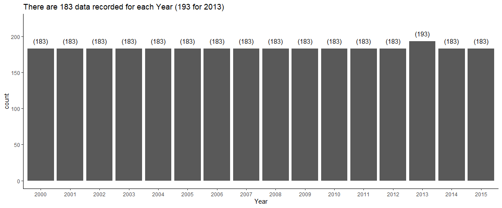
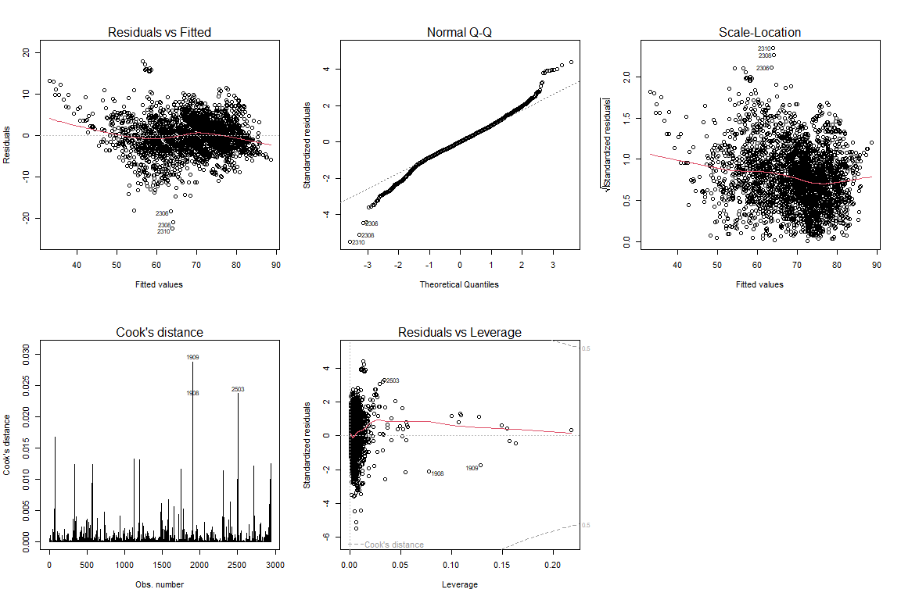
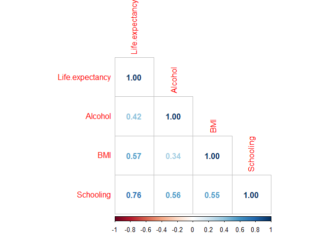
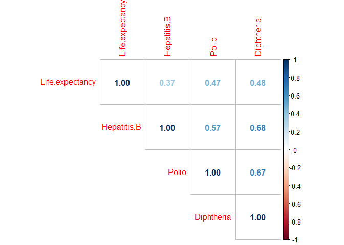
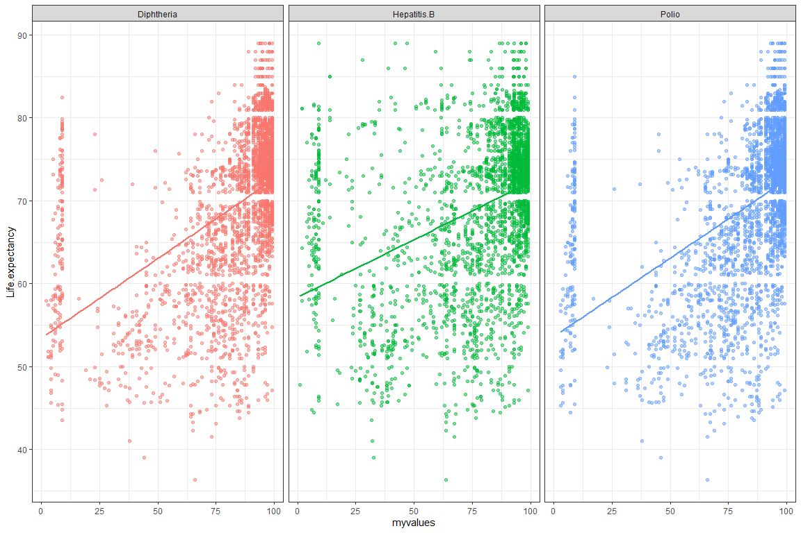
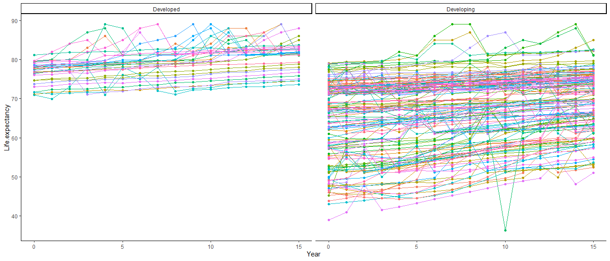

Life Expectancy Statistical Analysis (WHO)
================
Kar Ng
2022-07

-   [1 ABSTRACT](#1-abstract)
-   [2 R PACKAGES](#2-r-packages)
-   [3 DATA PREPARATION](#3-data-preparation)
    -   [3.1 Data Import](#31-data-import)
    -   [3.2 Data Description](#32-data-description)
    -   [3.3 Data Exploration](#33-data-exploration)
        -   [3.3.1 Data type and
            structure](#331-data-type-and-structure)
        -   [3.3.2 Vertical NA Check
            (Column)](#332-vertical-na-check-column)
        -   [3.3.3 Horizontal NA Check
            (Row)](#333-horizontal-na-check-row)
-   [4 DATA CLEANING](#4-data-cleaning)
    -   [4.1 White Space Trimming and punctuation
        remove](#41-white-space-trimming-and-punctuation-remove)
    -   [4.2 Rename Levels](#42-rename-levels)
    -   [4.3 Factor conversion](#43-factor-conversion)
    -   [4.4 Bag imputation](#44-bag-imputation)
-   [5 EDA](#5-eda)
    -   [5.1 Histogram for Distribution](#51-histogram-for-distribution)
    -   [5.2 Boxplot for Outliers](#52-boxplot-for-outliers)
    -   [5.3 MFA](#53-mfa)
-   [6 SUMMARY STATISTICS](#6-summary-statistics)
    -   [6.1 Categorical variables](#61-categorical-variables)
    -   [6.2 Sample size assessment](#62-sample-size-assessment)
    -   [6.3 Central tendency
        statistics](#63-central-tendency-statistics)
-   [7 STATISTICAL ANALYSIS](#7-statistical-analysis)
    -   [7.1 Q1. Factors that Affecting Life
        Expectancy](#71-q1-factors-that-affecting-life-expectancy)
        -   [7.1.1 Multicollinearity Test](#711-multicollinearity-test)
        -   [7.1.2 MLR Model](#712-mlr-model)
        -   [7.1.3 VIF check](#713-vif-check)
        -   [7.1.4 Assumptions diagnostic](#714-assumptions-diagnostic)
        -   [7.1.5 MLR Model 2](#715-mlr-model-2)
        -   [7.1.6 Model Interpretation](#716-model-interpretation)
    -   [7.2 Q2. Investigate the Effectiveness of Health
        Expenditure](#72-q2-investigate-the-effectiveness-of-health-expenditure)
        -   [7.2.1 Welch’s T-test](#721-welchs-t-test)
    -   [7.3 Q3. Infant and Adult Mortality versus Life
        Expectancy](#73-q3-infant-and-adult-mortality-versus-life-expectancy)
    -   [7.4 Q4. Correlation of schooling, BMI, and alcohol with Life
        Expectancy](#74-q4-correlation-of-schooling-bmi-and-alcohol-with-life-expectancy)
        -   [7.4.1 Correlation](#741-correlation)
        -   [7.4.2 PCA](#742-pca)
        -   [7.4.3 Regression](#743-regression)
    -   [7.5 Q5. Population versus lower life
        expectancy?](#75-q5-population-versus-lower-life-expectancy)
    -   [7.6 Q6. Does developed countries have higher life
        expectancy?](#76-q6-does-developed-countries-have-higher-life-expectancy)
        -   [7.6.1 Shapiro-Wilk test](#761-shapiro-wilk-test)
        -   [7.6.2 Wilcoxon Signed Rank
            Test](#762-wilcoxon-signed-rank-test)
    -   [7.7 Q7. What is the impact of Immunization coverage on life
        Expectancy?](#77-q7-what-is-the-impact-of-immunization-coverage-on-life-expectancy)
    -   [7.8 Q8 Longiditudinal Multilevel Modeling with
        Years](#78-q8-longiditudinal-multilevel-modeling-with-years)
        -   [7.8.1 Time-transformation](#781-time-transformation)
        -   [7.8.2 Multicollinearity
            Check](#782-multicollinearity-check)
        -   [7.8.3 Visualisation](#783-visualisation)
        -   [7.8.4 Unconditional Mean
            Model](#784-unconditional-mean-model)
        -   [7.8.5 Unconditional Growth
            Model](#785-unconditional-growth-model)
        -   [7.8.6 Conditional Growth
            Model](#786-conditional-growth-model)
-   [8 CONCLUSION](#8-conclusion)
-   [9 ACKNOWLEDGEMENTS](#9-acknowledgements)
-   [10 REFERENCE](#10-reference)

------------------------------------------------------------------------


------------------------------------------------------------------------

# 1 ABSTRACT

This project analyses the factors related to life expectancy based on a
public dataset from WHO. The data was collected between 2000 and 2015.
Studied factors include development status of a country, GDP,
population, schooling years, alcohol consumption, BMI, government
expenditure on health, per-capital expenditure on health, various
immunisation coverage, thinness disease, measles cases, HIV/AIDS deaths,
and mortality rate of adult, children, and infants.

During data processing, data were thoroughly checked (horizontally and
vertically), cleaned, and transformed. Missing values were imputed using
Bagged-trees algorithm. During exploratory data analysis (EDA), box and
whisker plot, histogram, and multiple factor analysis (MFA) were applied
to explore and mine the overall trends within the data. MFA is an
unsupervised machine learning technique. 8 questions were designed and
answered statistically in this project. Depending on the nature of each
question, multiple analysis techniques were applied such as multiple
linear regression, correlation matrix, VIF, assumption diagnostic plots,
Welch’s t-test, principal component analysis (PCA), Shapiro-wilk test,
Wilcoxon signed-rank test, and longitudinal multilevel mixed-effect
modelling.

Multiple linear regression model that passed the assumption tests shown
that the positively correlated significant variables (p \< 0.05) in
relation to life expectancy are schooling (Coeff. Est: 1.15), total
expenditure by government on health (Coeff. Est: 0.08), BMI (0.03), GDP
(Coeff. Est: 0.00004), and the immunisation of Diphtheria (Coeff. Est:
0.03) and Polio (Coeff. Est: 0.02), whereas, the negatively correlated
significant variables (p \< 0.05) are developing country status (Coeff.
Est: -1.12), HIV/AIDS Death rate (Coeff. Est: -0.51), Adult mortality
rate (Coeff. Est: -0.02), and infant deaths (Coeff. Est: -0.002)
(adjusted R-squared: 0.85, F(15, 2775) = 1087, p \< 0.001). A partial
analysis from the full model of longitudinal multilevel modeling
supports similar outcomes and it detected that if a country has lower
initial life expectancy in year-2000, it would have a higher rate in
life expectancy improvement across the year between 2000 and 2015
(intercept-slope corr = -0.55). It implies improvement of life
expectancy in developing countries that associated with lower life
expectancy since 2000 to 2015. The full model also concludes that life
expectancy of human increases each year by 0.25 year on average, with a
confidence level between 0.16 year and 0.34 year (p \< 0.001).

**Highlights**


# 2 R PACKAGES

Following R packages are loaded for this project.

``` r
# Environment setting (to remove scientific notation)

options(scipen = 999)  

# Packages loaded

library(tidyverse)
library(kableExtra)
library(skimr)
library(caret)
library(tableone)
library(factoextra)
library(FactoMineR)
library(car)
library(mvnormtest)
library(biotools)
library(corrplot)
library(cowplot)
library(hrbrthemes)
library(broom)
library(ggpubr)
library(rstatix)
library(nlme)
library(performance)
```

# 3 DATA PREPARATION

Dataset used in this project is publicly available on *Kaggle* website.
*Kaggle* is a well-known platform for data analysts and data scientists
for sharing data, codes, resources, and ideas. The dataset is accessible
via this
[Link](https://www.kaggle.com/datasets/kumarajarshi/life-expectancy-who).

## 3.1 Data Import

Following are 10 randomly selected observations (rows) from the dataset:

``` r
life <- read.csv("Life Expectancy Data.csv")
  
sample_n(life, 10) %>% 
  kbl() %>% 
  kable_material_dark()
```

<table class=" lightable-material-dark" style="font-family: &quot;Source Sans Pro&quot;, helvetica, sans-serif; margin-left: auto; margin-right: auto;">
<thead>
<tr>
<th style="text-align:left;">

Country

</th>
<th style="text-align:right;">

Year

</th>
<th style="text-align:left;">

Status

</th>
<th style="text-align:right;">

Life.expectancy

</th>
<th style="text-align:right;">

Adult.Mortality

</th>
<th style="text-align:right;">

infant.deaths

</th>
<th style="text-align:right;">

Alcohol

</th>
<th style="text-align:right;">

percentage.expenditure

</th>
<th style="text-align:right;">

Hepatitis.B

</th>
<th style="text-align:right;">

Measles

</th>
<th style="text-align:right;">

BMI

</th>
<th style="text-align:right;">

under.five.deaths

</th>
<th style="text-align:right;">

Polio

</th>
<th style="text-align:right;">

Total.expenditure

</th>
<th style="text-align:right;">

Diphtheria

</th>
<th style="text-align:right;">

HIV.AIDS

</th>
<th style="text-align:right;">

GDP

</th>
<th style="text-align:right;">

Population

</th>
<th style="text-align:right;">

thinness..1.19.years

</th>
<th style="text-align:right;">

thinness.5.9.years

</th>
<th style="text-align:right;">

Income.composition.of.resources

</th>
<th style="text-align:right;">

Schooling

</th>
</tr>
</thead>
<tbody>
<tr>
<td style="text-align:left;">

Equatorial Guinea

</td>
<td style="text-align:right;">

2012

</td>
<td style="text-align:left;">

Developing

</td>
<td style="text-align:right;">

56.7

</td>
<td style="text-align:right;">

337

</td>
<td style="text-align:right;">

3

</td>
<td style="text-align:right;">

11.89

</td>
<td style="text-align:right;">

1500.41263

</td>
<td style="text-align:right;">

NA

</td>
<td style="text-align:right;">

1190

</td>
<td style="text-align:right;">

23.0

</td>
<td style="text-align:right;">

4

</td>
<td style="text-align:right;">

3

</td>
<td style="text-align:right;">

4.00

</td>
<td style="text-align:right;">

24

</td>
<td style="text-align:right;">

8.2

</td>
<td style="text-align:right;">

21557.6528

</td>
<td style="text-align:right;">

138593

</td>
<td style="text-align:right;">

8.7

</td>
<td style="text-align:right;">

8.7

</td>
<td style="text-align:right;">

0.583

</td>
<td style="text-align:right;">

9.2

</td>
</tr>
<tr>
<td style="text-align:left;">

Namibia

</td>
<td style="text-align:right;">

2009

</td>
<td style="text-align:left;">

Developing

</td>
<td style="text-align:right;">

62.4

</td>
<td style="text-align:right;">

36

</td>
<td style="text-align:right;">

3

</td>
<td style="text-align:right;">

7.99

</td>
<td style="text-align:right;">

575.67481

</td>
<td style="text-align:right;">

NA

</td>
<td style="text-align:right;">

4076

</td>
<td style="text-align:right;">

31.0

</td>
<td style="text-align:right;">

4

</td>
<td style="text-align:right;">

83

</td>
<td style="text-align:right;">

8.50

</td>
<td style="text-align:right;">

83

</td>
<td style="text-align:right;">

8.7

</td>
<td style="text-align:right;">

4153.4979

</td>
<td style="text-align:right;">

21374

</td>
<td style="text-align:right;">

1.9

</td>
<td style="text-align:right;">

1.9

</td>
<td style="text-align:right;">

0.598

</td>
<td style="text-align:right;">

11.4

</td>
</tr>
<tr>
<td style="text-align:left;">

Samoa

</td>
<td style="text-align:right;">

2014

</td>
<td style="text-align:left;">

Developing

</td>
<td style="text-align:right;">

73.8

</td>
<td style="text-align:right;">

128

</td>
<td style="text-align:right;">

0

</td>
<td style="text-align:right;">

0.01

</td>
<td style="text-align:right;">

660.27779

</td>
<td style="text-align:right;">

56

</td>
<td style="text-align:right;">

0

</td>
<td style="text-align:right;">

74.3

</td>
<td style="text-align:right;">

0

</td>
<td style="text-align:right;">

58

</td>
<td style="text-align:right;">

7.22

</td>
<td style="text-align:right;">

63

</td>
<td style="text-align:right;">

0.1

</td>
<td style="text-align:right;">

4178.9734

</td>
<td style="text-align:right;">

19229

</td>
<td style="text-align:right;">

0.2

</td>
<td style="text-align:right;">

0.1

</td>
<td style="text-align:right;">

0.701

</td>
<td style="text-align:right;">

12.9

</td>
</tr>
<tr>
<td style="text-align:left;">

Libya

</td>
<td style="text-align:right;">

2015

</td>
<td style="text-align:left;">

Developing

</td>
<td style="text-align:right;">

72.7

</td>
<td style="text-align:right;">

138

</td>
<td style="text-align:right;">

1

</td>
<td style="text-align:right;">

NA

</td>
<td style="text-align:right;">

0.00000

</td>
<td style="text-align:right;">

97

</td>
<td style="text-align:right;">

82

</td>
<td style="text-align:right;">

64.8

</td>
<td style="text-align:right;">

2

</td>
<td style="text-align:right;">

97

</td>
<td style="text-align:right;">

NA

</td>
<td style="text-align:right;">

97

</td>
<td style="text-align:right;">

0.1

</td>
<td style="text-align:right;">

NA

</td>
<td style="text-align:right;">

NA

</td>
<td style="text-align:right;">

5.8

</td>
<td style="text-align:right;">

5.5

</td>
<td style="text-align:right;">

0.719

</td>
<td style="text-align:right;">

13.4

</td>
</tr>
<tr>
<td style="text-align:left;">

Kiribati

</td>
<td style="text-align:right;">

2005

</td>
<td style="text-align:left;">

Developing

</td>
<td style="text-align:right;">

64.9

</td>
<td style="text-align:right;">

213

</td>
<td style="text-align:right;">

0

</td>
<td style="text-align:right;">

0.60

</td>
<td style="text-align:right;">

111.73921

</td>
<td style="text-align:right;">

5

</td>
<td style="text-align:right;">

0

</td>
<td style="text-align:right;">

72.1

</td>
<td style="text-align:right;">

0

</td>
<td style="text-align:right;">

74

</td>
<td style="text-align:right;">

1.60

</td>
<td style="text-align:right;">

79

</td>
<td style="text-align:right;">

0.1

</td>
<td style="text-align:right;">

1214.5567

</td>
<td style="text-align:right;">

92325

</td>
<td style="text-align:right;">

0.2

</td>
<td style="text-align:right;">

0.2

</td>
<td style="text-align:right;">

0.000

</td>
<td style="text-align:right;">

12.2

</td>
</tr>
<tr>
<td style="text-align:left;">

Sierra Leone

</td>
<td style="text-align:right;">

2015

</td>
<td style="text-align:left;">

Developing

</td>
<td style="text-align:right;">

51.0

</td>
<td style="text-align:right;">

413

</td>
<td style="text-align:right;">

22

</td>
<td style="text-align:right;">

NA

</td>
<td style="text-align:right;">

0.00000

</td>
<td style="text-align:right;">

86

</td>
<td style="text-align:right;">

607

</td>
<td style="text-align:right;">

24.4

</td>
<td style="text-align:right;">

30

</td>
<td style="text-align:right;">

86

</td>
<td style="text-align:right;">

NA

</td>
<td style="text-align:right;">

86

</td>
<td style="text-align:right;">

0.5

</td>
<td style="text-align:right;">

587.5382

</td>
<td style="text-align:right;">

723725

</td>
<td style="text-align:right;">

7.4

</td>
<td style="text-align:right;">

7.3

</td>
<td style="text-align:right;">

0.431

</td>
<td style="text-align:right;">

9.5

</td>
</tr>
<tr>
<td style="text-align:left;">

Syrian Arab Republic

</td>
<td style="text-align:right;">

2005

</td>
<td style="text-align:left;">

Developing

</td>
<td style="text-align:right;">

73.5

</td>
<td style="text-align:right;">

127

</td>
<td style="text-align:right;">

9

</td>
<td style="text-align:right;">

0.92

</td>
<td style="text-align:right;">

116.25859

</td>
<td style="text-align:right;">

83

</td>
<td style="text-align:right;">

375

</td>
<td style="text-align:right;">

47.6

</td>
<td style="text-align:right;">

10

</td>
<td style="text-align:right;">

83

</td>
<td style="text-align:right;">

4.11

</td>
<td style="text-align:right;">

8

</td>
<td style="text-align:right;">

0.1

</td>
<td style="text-align:right;">

1577.4572

</td>
<td style="text-align:right;">

18294611

</td>
<td style="text-align:right;">

6.5

</td>
<td style="text-align:right;">

6.3

</td>
<td style="text-align:right;">

0.624

</td>
<td style="text-align:right;">

11.0

</td>
</tr>
<tr>
<td style="text-align:left;">

Lesotho

</td>
<td style="text-align:right;">

2012

</td>
<td style="text-align:left;">

Developing

</td>
<td style="text-align:right;">

52.2

</td>
<td style="text-align:right;">

513

</td>
<td style="text-align:right;">

4

</td>
<td style="text-align:right;">

0.01

</td>
<td style="text-align:right;">

168.13490

</td>
<td style="text-align:right;">

95

</td>
<td style="text-align:right;">

179

</td>
<td style="text-align:right;">

3.8

</td>
<td style="text-align:right;">

6

</td>
<td style="text-align:right;">

93

</td>
<td style="text-align:right;">

11.14

</td>
<td style="text-align:right;">

95

</td>
<td style="text-align:right;">

9.0

</td>
<td style="text-align:right;">

1281.5160

</td>
<td style="text-align:right;">

289928

</td>
<td style="text-align:right;">

6.4

</td>
<td style="text-align:right;">

6.2

</td>
<td style="text-align:right;">

0.479

</td>
<td style="text-align:right;">

11.0

</td>
</tr>
<tr>
<td style="text-align:left;">

Nicaragua

</td>
<td style="text-align:right;">

2005

</td>
<td style="text-align:left;">

Developing

</td>
<td style="text-align:right;">

71.2

</td>
<td style="text-align:right;">

194

</td>
<td style="text-align:right;">

3

</td>
<td style="text-align:right;">

3.70

</td>
<td style="text-align:right;">

218.57162

</td>
<td style="text-align:right;">

86

</td>
<td style="text-align:right;">

0

</td>
<td style="text-align:right;">

46.4

</td>
<td style="text-align:right;">

4

</td>
<td style="text-align:right;">

87

</td>
<td style="text-align:right;">

6.11

</td>
<td style="text-align:right;">

86

</td>
<td style="text-align:right;">

0.3

</td>
<td style="text-align:right;">

1175.1162

</td>
<td style="text-align:right;">

5379328

</td>
<td style="text-align:right;">

2.0

</td>
<td style="text-align:right;">

1.9

</td>
<td style="text-align:right;">

0.592

</td>
<td style="text-align:right;">

11.0

</td>
</tr>
<tr>
<td style="text-align:left;">

Nicaragua

</td>
<td style="text-align:right;">

2000

</td>
<td style="text-align:left;">

Developing

</td>
<td style="text-align:right;">

73.0

</td>
<td style="text-align:right;">

192

</td>
<td style="text-align:right;">

4

</td>
<td style="text-align:right;">

3.61

</td>
<td style="text-align:right;">

15.25519

</td>
<td style="text-align:right;">

83

</td>
<td style="text-align:right;">

0

</td>
<td style="text-align:right;">

42.8

</td>
<td style="text-align:right;">

5

</td>
<td style="text-align:right;">

85

</td>
<td style="text-align:right;">

5.39

</td>
<td style="text-align:right;">

83

</td>
<td style="text-align:right;">

0.4

</td>
<td style="text-align:right;">

116.2743

</td>
<td style="text-align:right;">

526796

</td>
<td style="text-align:right;">

2.2

</td>
<td style="text-align:right;">

2.1

</td>
<td style="text-align:right;">

0.562

</td>
<td style="text-align:right;">

10.1

</td>
</tr>
</tbody>
</table>

## 3.2 Data Description

``` r
No. <- c(1:22)

Variable <- c("Country", 
              "Year",
              "Status",
              "Life expectancy",
              "Adult Mortality",
              "infant deaths",
              "Alcohol",
              "percentage expenditure",
              "Hepatitis B",
              "Measles",
              "BMI",
              "under-five deaths",
              "Polio",
              "Total expenditure",
              "Diphtheria",
              "HIV/AIDS",
              "GDP",
              "Population",
              "thinness 10-19 years",
              "thinness 5-9 years",
              "Income composition of resources",
              "Schooling")

Description <- c("Country", 
                 "Year",
                 "Developed or Developing status",
                 "Life Expectancy in age",
                 "Adult Mortality Rates of both sexes (probability of dying between 15 and 60 years per 1000 population)",
                 "Number of Infant Deaths per 1000 population",
                 "Alcohol, recorded per capita (15+) consumption (in litres of pure alcohol)",
                 "Expenditure on health as a percentage of Gross Domestic Product per capita(%)",
                 "Hepatitis B (HepB) immunization coverage among 1-year-olds (%)",
                 "Measles - number of reported cases per 1000 population",
                 "Average Body Mass Index of entire population",
                 "Number of under-five deaths per 1000 population",
                 "Polio (Pol3) immunization coverage among 1-year-olds (%)",
                 "General government expenditure on health as a percentage of total government expenditure (%)",
                 "Diphtheria tetanus toxoid and pertussis (DTP3) immunization coverage among 1-year-olds (%)",
                 "Deaths per 1 000 live births HIV/AIDS (0-4 years)",
                 "Gross Domestic Product per capita (in USD)",
                 "Population of the country",
                 "Prevalence of thinness among children and adolescents for Age 10 to 19 (%)",
                 "Prevalence of thinness among children for Age 5 to 9(%)",
                 "Human Development Index in terms of income composition of resources (index ranging from 0 to 1)",
                 "Number of years of Schooling(years)"
                 )

data.frame(No., Variable, Description) %>% 
  kbl() %>% 
  kable_styling(bootstrap_options = c("bordered", "stripped", "hover"), 
                full_width = T)
```

<table class="table table-bordered table-hover" style="margin-left: auto; margin-right: auto;">
<thead>
<tr>
<th style="text-align:right;">

No. 

</th>
<th style="text-align:left;">

Variable

</th>
<th style="text-align:left;">

Description

</th>
</tr>
</thead>
<tbody>
<tr>
<td style="text-align:right;">

1

</td>
<td style="text-align:left;">

Country

</td>
<td style="text-align:left;">

Country

</td>
</tr>
<tr>
<td style="text-align:right;">

2

</td>
<td style="text-align:left;">

Year

</td>
<td style="text-align:left;">

Year

</td>
</tr>
<tr>
<td style="text-align:right;">

3

</td>
<td style="text-align:left;">

Status

</td>
<td style="text-align:left;">

Developed or Developing status

</td>
</tr>
<tr>
<td style="text-align:right;">

4

</td>
<td style="text-align:left;">

Life expectancy

</td>
<td style="text-align:left;">

Life Expectancy in age

</td>
</tr>
<tr>
<td style="text-align:right;">

5

</td>
<td style="text-align:left;">

Adult Mortality

</td>
<td style="text-align:left;">

Adult Mortality Rates of both sexes (probability of dying between 15 and
60 years per 1000 population)

</td>
</tr>
<tr>
<td style="text-align:right;">

6

</td>
<td style="text-align:left;">

infant deaths

</td>
<td style="text-align:left;">

Number of Infant Deaths per 1000 population

</td>
</tr>
<tr>
<td style="text-align:right;">

7

</td>
<td style="text-align:left;">

Alcohol

</td>
<td style="text-align:left;">

Alcohol, recorded per capita (15+) consumption (in litres of pure
alcohol)

</td>
</tr>
<tr>
<td style="text-align:right;">

8

</td>
<td style="text-align:left;">

percentage expenditure

</td>
<td style="text-align:left;">

Expenditure on health as a percentage of Gross Domestic Product per
capita(%)

</td>
</tr>
<tr>
<td style="text-align:right;">

9

</td>
<td style="text-align:left;">

Hepatitis B

</td>
<td style="text-align:left;">

Hepatitis B (HepB) immunization coverage among 1-year-olds (%)

</td>
</tr>
<tr>
<td style="text-align:right;">

10

</td>
<td style="text-align:left;">

Measles

</td>
<td style="text-align:left;">

Measles - number of reported cases per 1000 population

</td>
</tr>
<tr>
<td style="text-align:right;">

11

</td>
<td style="text-align:left;">

BMI

</td>
<td style="text-align:left;">

Average Body Mass Index of entire population

</td>
</tr>
<tr>
<td style="text-align:right;">

12

</td>
<td style="text-align:left;">

under-five deaths

</td>
<td style="text-align:left;">

Number of under-five deaths per 1000 population

</td>
</tr>
<tr>
<td style="text-align:right;">

13

</td>
<td style="text-align:left;">

Polio

</td>
<td style="text-align:left;">

Polio (Pol3) immunization coverage among 1-year-olds (%)

</td>
</tr>
<tr>
<td style="text-align:right;">

14

</td>
<td style="text-align:left;">

Total expenditure

</td>
<td style="text-align:left;">

General government expenditure on health as a percentage of total
government expenditure (%)

</td>
</tr>
<tr>
<td style="text-align:right;">

15

</td>
<td style="text-align:left;">

Diphtheria

</td>
<td style="text-align:left;">

Diphtheria tetanus toxoid and pertussis (DTP3) immunization coverage
among 1-year-olds (%)

</td>
</tr>
<tr>
<td style="text-align:right;">

16

</td>
<td style="text-align:left;">

HIV/AIDS

</td>
<td style="text-align:left;">

Deaths per 1 000 live births HIV/AIDS (0-4 years)

</td>
</tr>
<tr>
<td style="text-align:right;">

17

</td>
<td style="text-align:left;">

GDP

</td>
<td style="text-align:left;">

Gross Domestic Product per capita (in USD)

</td>
</tr>
<tr>
<td style="text-align:right;">

18

</td>
<td style="text-align:left;">

Population

</td>
<td style="text-align:left;">

Population of the country

</td>
</tr>
<tr>
<td style="text-align:right;">

19

</td>
<td style="text-align:left;">

thinness 10-19 years

</td>
<td style="text-align:left;">

Prevalence of thinness among children and adolescents for Age 10 to 19
(%)

</td>
</tr>
<tr>
<td style="text-align:right;">

20

</td>
<td style="text-align:left;">

thinness 5-9 years

</td>
<td style="text-align:left;">

Prevalence of thinness among children for Age 5 to 9(%)

</td>
</tr>
<tr>
<td style="text-align:right;">

21

</td>
<td style="text-align:left;">

Income composition of resources

</td>
<td style="text-align:left;">

Human Development Index in terms of income composition of resources
(index ranging from 0 to 1)

</td>
</tr>
<tr>
<td style="text-align:right;">

22

</td>
<td style="text-align:left;">

Schooling

</td>
<td style="text-align:left;">

Number of years of Schooling(years)

</td>
</tr>
</tbody>
</table>

## 3.3 Data Exploration

### 3.3.1 Data type and structure

There are 2938 rows of observations and 22 columns of variables.

``` r
glimpse(life)
```

    ## Rows: 2,938
    ## Columns: 22
    ## $ Country                         <chr> "Afghanistan", "Afghanistan", "Afghani…
    ## $ Year                            <int> 2015, 2014, 2013, 2012, 2011, 2010, 20…
    ## $ Status                          <chr> "Developing", "Developing", "Developin…
    ## $ Life.expectancy                 <dbl> 65.0, 59.9, 59.9, 59.5, 59.2, 58.8, 58…
    ## $ Adult.Mortality                 <int> 263, 271, 268, 272, 275, 279, 281, 287…
    ## $ infant.deaths                   <int> 62, 64, 66, 69, 71, 74, 77, 80, 82, 84…
    ## $ Alcohol                         <dbl> 0.01, 0.01, 0.01, 0.01, 0.01, 0.01, 0.…
    ## $ percentage.expenditure          <dbl> 71.279624, 73.523582, 73.219243, 78.18…
    ## $ Hepatitis.B                     <int> 65, 62, 64, 67, 68, 66, 63, 64, 63, 64…
    ## $ Measles                         <int> 1154, 492, 430, 2787, 3013, 1989, 2861…
    ## $ BMI                             <dbl> 19.1, 18.6, 18.1, 17.6, 17.2, 16.7, 16…
    ## $ under.five.deaths               <int> 83, 86, 89, 93, 97, 102, 106, 110, 113…
    ## $ Polio                           <int> 6, 58, 62, 67, 68, 66, 63, 64, 63, 58,…
    ## $ Total.expenditure               <dbl> 8.16, 8.18, 8.13, 8.52, 7.87, 9.20, 9.…
    ## $ Diphtheria                      <int> 65, 62, 64, 67, 68, 66, 63, 64, 63, 58…
    ## $ HIV.AIDS                        <dbl> 0.1, 0.1, 0.1, 0.1, 0.1, 0.1, 0.1, 0.1…
    ## $ GDP                             <dbl> 584.25921, 612.69651, 631.74498, 669.9…
    ## $ Population                      <dbl> 33736494, 327582, 31731688, 3696958, 2…
    ## $ thinness..1.19.years            <dbl> 17.2, 17.5, 17.7, 17.9, 18.2, 18.4, 18…
    ## $ thinness.5.9.years              <dbl> 17.3, 17.5, 17.7, 18.0, 18.2, 18.4, 18…
    ## $ Income.composition.of.resources <dbl> 0.479, 0.476, 0.470, 0.463, 0.454, 0.4…
    ## $ Schooling                       <dbl> 10.1, 10.0, 9.9, 9.8, 9.5, 9.2, 8.9, 8…

### 3.3.2 Vertical NA Check (Column)

There are 2 character variables “Country” and “Status”, and the rest of
the variables are numerical.

``` r
skim_without_charts(life)
```

<table style="width: auto;" class="table table-condensed">
<caption>

Data summary

</caption>
<tbody>
<tr>
<td style="text-align:left;">

Name

</td>
<td style="text-align:left;">

life

</td>
</tr>
<tr>
<td style="text-align:left;">

Number of rows

</td>
<td style="text-align:left;">

2938

</td>
</tr>
<tr>
<td style="text-align:left;">

Number of columns

</td>
<td style="text-align:left;">

22

</td>
</tr>
<tr>
<td style="text-align:left;">

\_\_\_\_\_\_\_\_\_\_\_\_\_\_\_\_\_\_\_\_\_\_\_

</td>
<td style="text-align:left;">
</td>
</tr>
<tr>
<td style="text-align:left;">

Column type frequency:

</td>
<td style="text-align:left;">
</td>
</tr>
<tr>
<td style="text-align:left;">

character

</td>
<td style="text-align:left;">

2

</td>
</tr>
<tr>
<td style="text-align:left;">

numeric

</td>
<td style="text-align:left;">

20

</td>
</tr>
<tr>
<td style="text-align:left;">

\_\_\_\_\_\_\_\_\_\_\_\_\_\_\_\_\_\_\_\_\_\_\_\_

</td>
<td style="text-align:left;">
</td>
</tr>
<tr>
<td style="text-align:left;">

Group variables

</td>
<td style="text-align:left;">

None

</td>
</tr>
</tbody>
</table>

**Variable type: character**

<table>
<thead>
<tr>
<th style="text-align:left;">

skim_variable

</th>
<th style="text-align:right;">

n_missing

</th>
<th style="text-align:right;">

complete_rate

</th>
<th style="text-align:right;">

min

</th>
<th style="text-align:right;">

max

</th>
<th style="text-align:right;">

empty

</th>
<th style="text-align:right;">

n_unique

</th>
<th style="text-align:right;">

whitespace

</th>
</tr>
</thead>
<tbody>
<tr>
<td style="text-align:left;">

Country

</td>
<td style="text-align:right;">

0

</td>
<td style="text-align:right;">

1

</td>
<td style="text-align:right;">

4

</td>
<td style="text-align:right;">

52

</td>
<td style="text-align:right;">

0

</td>
<td style="text-align:right;">

193

</td>
<td style="text-align:right;">

0

</td>
</tr>
<tr>
<td style="text-align:left;">

Status

</td>
<td style="text-align:right;">

0

</td>
<td style="text-align:right;">

1

</td>
<td style="text-align:right;">

9

</td>
<td style="text-align:right;">

10

</td>
<td style="text-align:right;">

0

</td>
<td style="text-align:right;">

2

</td>
<td style="text-align:right;">

0

</td>
</tr>
</tbody>
</table>

**Variable type: numeric**

<table>
<thead>
<tr>
<th style="text-align:left;">

skim_variable

</th>
<th style="text-align:right;">

n_missing

</th>
<th style="text-align:right;">

complete_rate

</th>
<th style="text-align:right;">

mean

</th>
<th style="text-align:right;">

sd

</th>
<th style="text-align:right;">

p0

</th>
<th style="text-align:right;">

p25

</th>
<th style="text-align:right;">

p50

</th>
<th style="text-align:right;">

p75

</th>
<th style="text-align:right;">

p100

</th>
</tr>
</thead>
<tbody>
<tr>
<td style="text-align:left;">

Year

</td>
<td style="text-align:right;">

0

</td>
<td style="text-align:right;">

1.00

</td>
<td style="text-align:right;">

2007.52

</td>
<td style="text-align:right;">

4.61

</td>
<td style="text-align:right;">

2000.00

</td>
<td style="text-align:right;">

2004.00

</td>
<td style="text-align:right;">

2008.00

</td>
<td style="text-align:right;">

2012.00

</td>
<td style="text-align:right;">

2015.00

</td>
</tr>
<tr>
<td style="text-align:left;">

Life.expectancy

</td>
<td style="text-align:right;">

10

</td>
<td style="text-align:right;">

1.00

</td>
<td style="text-align:right;">

69.22

</td>
<td style="text-align:right;">

9.52

</td>
<td style="text-align:right;">

36.30

</td>
<td style="text-align:right;">

63.10

</td>
<td style="text-align:right;">

72.10

</td>
<td style="text-align:right;">

75.70

</td>
<td style="text-align:right;">

89.00

</td>
</tr>
<tr>
<td style="text-align:left;">

Adult.Mortality

</td>
<td style="text-align:right;">

10

</td>
<td style="text-align:right;">

1.00

</td>
<td style="text-align:right;">

164.80

</td>
<td style="text-align:right;">

124.29

</td>
<td style="text-align:right;">

1.00

</td>
<td style="text-align:right;">

74.00

</td>
<td style="text-align:right;">

144.00

</td>
<td style="text-align:right;">

228.00

</td>
<td style="text-align:right;">

723.00

</td>
</tr>
<tr>
<td style="text-align:left;">

infant.deaths

</td>
<td style="text-align:right;">

0

</td>
<td style="text-align:right;">

1.00

</td>
<td style="text-align:right;">

30.30

</td>
<td style="text-align:right;">

117.93

</td>
<td style="text-align:right;">

0.00

</td>
<td style="text-align:right;">

0.00

</td>
<td style="text-align:right;">

3.00

</td>
<td style="text-align:right;">

22.00

</td>
<td style="text-align:right;">

1800.00

</td>
</tr>
<tr>
<td style="text-align:left;">

Alcohol

</td>
<td style="text-align:right;">

194

</td>
<td style="text-align:right;">

0.93

</td>
<td style="text-align:right;">

4.60

</td>
<td style="text-align:right;">

4.05

</td>
<td style="text-align:right;">

0.01

</td>
<td style="text-align:right;">

0.88

</td>
<td style="text-align:right;">

3.76

</td>
<td style="text-align:right;">

7.70

</td>
<td style="text-align:right;">

17.87

</td>
</tr>
<tr>
<td style="text-align:left;">

percentage.expenditure

</td>
<td style="text-align:right;">

0

</td>
<td style="text-align:right;">

1.00

</td>
<td style="text-align:right;">

738.25

</td>
<td style="text-align:right;">

1987.91

</td>
<td style="text-align:right;">

0.00

</td>
<td style="text-align:right;">

4.69

</td>
<td style="text-align:right;">

64.91

</td>
<td style="text-align:right;">

441.53

</td>
<td style="text-align:right;">

19479.91

</td>
</tr>
<tr>
<td style="text-align:left;">

Hepatitis.B

</td>
<td style="text-align:right;">

553

</td>
<td style="text-align:right;">

0.81

</td>
<td style="text-align:right;">

80.94

</td>
<td style="text-align:right;">

25.07

</td>
<td style="text-align:right;">

1.00

</td>
<td style="text-align:right;">

77.00

</td>
<td style="text-align:right;">

92.00

</td>
<td style="text-align:right;">

97.00

</td>
<td style="text-align:right;">

99.00

</td>
</tr>
<tr>
<td style="text-align:left;">

Measles

</td>
<td style="text-align:right;">

0

</td>
<td style="text-align:right;">

1.00

</td>
<td style="text-align:right;">

2419.59

</td>
<td style="text-align:right;">

11467.27

</td>
<td style="text-align:right;">

0.00

</td>
<td style="text-align:right;">

0.00

</td>
<td style="text-align:right;">

17.00

</td>
<td style="text-align:right;">

360.25

</td>
<td style="text-align:right;">

212183.00

</td>
</tr>
<tr>
<td style="text-align:left;">

BMI

</td>
<td style="text-align:right;">

34

</td>
<td style="text-align:right;">

0.99

</td>
<td style="text-align:right;">

38.32

</td>
<td style="text-align:right;">

20.04

</td>
<td style="text-align:right;">

1.00

</td>
<td style="text-align:right;">

19.30

</td>
<td style="text-align:right;">

43.50

</td>
<td style="text-align:right;">

56.20

</td>
<td style="text-align:right;">

87.30

</td>
</tr>
<tr>
<td style="text-align:left;">

under.five.deaths

</td>
<td style="text-align:right;">

0

</td>
<td style="text-align:right;">

1.00

</td>
<td style="text-align:right;">

42.04

</td>
<td style="text-align:right;">

160.45

</td>
<td style="text-align:right;">

0.00

</td>
<td style="text-align:right;">

0.00

</td>
<td style="text-align:right;">

4.00

</td>
<td style="text-align:right;">

28.00

</td>
<td style="text-align:right;">

2500.00

</td>
</tr>
<tr>
<td style="text-align:left;">

Polio

</td>
<td style="text-align:right;">

19

</td>
<td style="text-align:right;">

0.99

</td>
<td style="text-align:right;">

82.55

</td>
<td style="text-align:right;">

23.43

</td>
<td style="text-align:right;">

3.00

</td>
<td style="text-align:right;">

78.00

</td>
<td style="text-align:right;">

93.00

</td>
<td style="text-align:right;">

97.00

</td>
<td style="text-align:right;">

99.00

</td>
</tr>
<tr>
<td style="text-align:left;">

Total.expenditure

</td>
<td style="text-align:right;">

226

</td>
<td style="text-align:right;">

0.92

</td>
<td style="text-align:right;">

5.94

</td>
<td style="text-align:right;">

2.50

</td>
<td style="text-align:right;">

0.37

</td>
<td style="text-align:right;">

4.26

</td>
<td style="text-align:right;">

5.76

</td>
<td style="text-align:right;">

7.49

</td>
<td style="text-align:right;">

17.60

</td>
</tr>
<tr>
<td style="text-align:left;">

Diphtheria

</td>
<td style="text-align:right;">

19

</td>
<td style="text-align:right;">

0.99

</td>
<td style="text-align:right;">

82.32

</td>
<td style="text-align:right;">

23.72

</td>
<td style="text-align:right;">

2.00

</td>
<td style="text-align:right;">

78.00

</td>
<td style="text-align:right;">

93.00

</td>
<td style="text-align:right;">

97.00

</td>
<td style="text-align:right;">

99.00

</td>
</tr>
<tr>
<td style="text-align:left;">

HIV.AIDS

</td>
<td style="text-align:right;">

0

</td>
<td style="text-align:right;">

1.00

</td>
<td style="text-align:right;">

1.74

</td>
<td style="text-align:right;">

5.08

</td>
<td style="text-align:right;">

0.10

</td>
<td style="text-align:right;">

0.10

</td>
<td style="text-align:right;">

0.10

</td>
<td style="text-align:right;">

0.80

</td>
<td style="text-align:right;">

50.60

</td>
</tr>
<tr>
<td style="text-align:left;">

GDP

</td>
<td style="text-align:right;">

448

</td>
<td style="text-align:right;">

0.85

</td>
<td style="text-align:right;">

7483.16

</td>
<td style="text-align:right;">

14270.17

</td>
<td style="text-align:right;">

1.68

</td>
<td style="text-align:right;">

463.94

</td>
<td style="text-align:right;">

1766.95

</td>
<td style="text-align:right;">

5910.81

</td>
<td style="text-align:right;">

119172.74

</td>
</tr>
<tr>
<td style="text-align:left;">

Population

</td>
<td style="text-align:right;">

652

</td>
<td style="text-align:right;">

0.78

</td>
<td style="text-align:right;">

12753375.12

</td>
<td style="text-align:right;">

61012096.51

</td>
<td style="text-align:right;">

34.00

</td>
<td style="text-align:right;">

195793.25

</td>
<td style="text-align:right;">

1386542.00

</td>
<td style="text-align:right;">

7420359.00

</td>
<td style="text-align:right;">

1293859294.00

</td>
</tr>
<tr>
<td style="text-align:left;">

thinness..1.19.years

</td>
<td style="text-align:right;">

34

</td>
<td style="text-align:right;">

0.99

</td>
<td style="text-align:right;">

4.84

</td>
<td style="text-align:right;">

4.42

</td>
<td style="text-align:right;">

0.10

</td>
<td style="text-align:right;">

1.60

</td>
<td style="text-align:right;">

3.30

</td>
<td style="text-align:right;">

7.20

</td>
<td style="text-align:right;">

27.70

</td>
</tr>
<tr>
<td style="text-align:left;">

thinness.5.9.years

</td>
<td style="text-align:right;">

34

</td>
<td style="text-align:right;">

0.99

</td>
<td style="text-align:right;">

4.87

</td>
<td style="text-align:right;">

4.51

</td>
<td style="text-align:right;">

0.10

</td>
<td style="text-align:right;">

1.50

</td>
<td style="text-align:right;">

3.30

</td>
<td style="text-align:right;">

7.20

</td>
<td style="text-align:right;">

28.60

</td>
</tr>
<tr>
<td style="text-align:left;">

Income.composition.of.resources

</td>
<td style="text-align:right;">

167

</td>
<td style="text-align:right;">

0.94

</td>
<td style="text-align:right;">

0.63

</td>
<td style="text-align:right;">

0.21

</td>
<td style="text-align:right;">

0.00

</td>
<td style="text-align:right;">

0.49

</td>
<td style="text-align:right;">

0.68

</td>
<td style="text-align:right;">

0.78

</td>
<td style="text-align:right;">

0.95

</td>
</tr>
<tr>
<td style="text-align:left;">

Schooling

</td>
<td style="text-align:right;">

163

</td>
<td style="text-align:right;">

0.94

</td>
<td style="text-align:right;">

11.99

</td>
<td style="text-align:right;">

3.36

</td>
<td style="text-align:right;">

0.00

</td>
<td style="text-align:right;">

10.10

</td>
<td style="text-align:right;">

12.30

</td>
<td style="text-align:right;">

14.30

</td>
<td style="text-align:right;">

20.70

</td>
</tr>
</tbody>
</table>

From the variables “n_missing” and “complete_rate”, they detected a lot
of missing data in many variables. Mean and standard deviation are also
being computed.

A good thing is that there is no variable having more than 40% missing
data because I will follow a 60% rule that if a column (variable) has
less than 0.6 completion rate (having 0.4 or 40% missing data), I will
consider dropping the variable.

The number of missing data in each column can also be examined using
following code:

``` r
colSums(is.na(life))
```

    ##                         Country                            Year 
    ##                               0                               0 
    ##                          Status                 Life.expectancy 
    ##                               0                              10 
    ##                 Adult.Mortality                   infant.deaths 
    ##                              10                               0 
    ##                         Alcohol          percentage.expenditure 
    ##                             194                               0 
    ##                     Hepatitis.B                         Measles 
    ##                             553                               0 
    ##                             BMI               under.five.deaths 
    ##                              34                               0 
    ##                           Polio               Total.expenditure 
    ##                              19                             226 
    ##                      Diphtheria                        HIV.AIDS 
    ##                              19                               0 
    ##                             GDP                      Population 
    ##                             448                             652 
    ##            thinness..1.19.years              thinness.5.9.years 
    ##                              34                              34 
    ## Income.composition.of.resources                       Schooling 
    ##                             167                             163

### 3.3.3 Horizontal NA Check (Row)

Here performs horizontal missing value check.

``` r
life %>% 
  mutate(row.id = c(1:nrow(life))) %>% 
  relocate(row.id, .before = Country) %>% 
  gather(key = "variables", value = "values", -row.id) %>% 
  filter(is.na(values)) %>% 
  group_by(row.id) %>% 
  summarise(count = n()) %>% 
  arrange(-count) %>% 
  mutate(total.column = 22,
         propor.NA.per.row = paste0(round(count/total.column*100,1), "%")) 
```

<div data-pagedtable="false">

<script data-pagedtable-source type="application/json">
{"columns":[{"label":["row.id"],"name":[1],"type":["int"],"align":["right"]},{"label":["count"],"name":[2],"type":["int"],"align":["right"]},{"label":["total.column"],"name":[3],"type":["dbl"],"align":["right"]},{"label":["propor.NA.per.row"],"name":[4],"type":["chr"],"align":["left"]}],"data":[{"1":"1716","2":"9","3":"22","4":"40.9%"},{"1":"2418","2":"9","3":"22","4":"40.9%"},{"1":"2419","2":"9","3":"22","4":"40.9%"},{"1":"2420","2":"9","3":"22","4":"40.9%"},{"1":"2421","2":"9","3":"22","4":"40.9%"},{"1":"2422","2":"9","3":"22","4":"40.9%"},{"1":"2423","2":"9","3":"22","4":"40.9%"},{"1":"2424","2":"9","3":"22","4":"40.9%"},{"1":"2425","2":"9","3":"22","4":"40.9%"},{"1":"2217","2":"8","3":"22","4":"36.4%"},{"1":"2415","2":"8","3":"22","4":"36.4%"},{"1":"2416","2":"8","3":"22","4":"36.4%"},{"1":"2417","2":"8","3":"22","4":"36.4%"},{"1":"433","2":"6","3":"22","4":"27.3%"},{"1":"625","2":"6","3":"22","4":"27.3%"},{"1":"690","2":"6","3":"22","4":"27.3%"},{"1":"706","2":"6","3":"22","4":"27.3%"},{"1":"719","2":"6","3":"22","4":"27.3%"},{"1":"720","2":"6","3":"22","4":"27.3%"},{"1":"721","2":"6","3":"22","4":"27.3%"},{"1":"722","2":"6","3":"22","4":"27.3%"},{"1":"1910","2":"6","3":"22","4":"27.3%"},{"1":"2088","2":"6","3":"22","4":"27.3%"},{"1":"2104","2":"6","3":"22","4":"27.3%"},{"1":"2381","2":"6","3":"22","4":"27.3%"},{"1":"2382","2":"6","3":"22","4":"27.3%"},{"1":"2383","2":"6","3":"22","4":"27.3%"},{"1":"2384","2":"6","3":"22","4":"27.3%"},{"1":"2385","2":"6","3":"22","4":"27.3%"},{"1":"2386","2":"6","3":"22","4":"27.3%"},{"1":"2387","2":"6","3":"22","4":"27.3%"},{"1":"2388","2":"6","3":"22","4":"27.3%"},{"1":"2389","2":"6","3":"22","4":"27.3%"},{"1":"2390","2":"6","3":"22","4":"27.3%"},{"1":"2391","2":"6","3":"22","4":"27.3%"},{"1":"2392","2":"6","3":"22","4":"27.3%"},{"1":"2393","2":"6","3":"22","4":"27.3%"},{"1":"2414","2":"6","3":"22","4":"27.3%"},{"1":"2763","2":"6","3":"22","4":"27.3%"},{"1":"2779","2":"6","3":"22","4":"27.3%"},{"1":"2795","2":"6","3":"22","4":"27.3%"},{"1":"448","2":"5","3":"22","4":"22.7%"},{"1":"704","2":"5","3":"22","4":"22.7%"},{"1":"705","2":"5","3":"22","4":"22.7%"},{"1":"707","2":"5","3":"22","4":"22.7%"},{"1":"708","2":"5","3":"22","4":"22.7%"},{"1":"709","2":"5","3":"22","4":"22.7%"},{"1":"710","2":"5","3":"22","4":"22.7%"},{"1":"711","2":"5","3":"22","4":"22.7%"},{"1":"712","2":"5","3":"22","4":"22.7%"},{"1":"713","2":"5","3":"22","4":"22.7%"},{"1":"714","2":"5","3":"22","4":"22.7%"},{"1":"715","2":"5","3":"22","4":"22.7%"},{"1":"716","2":"5","3":"22","4":"22.7%"},{"1":"717","2":"5","3":"22","4":"22.7%"},{"1":"718","2":"5","3":"22","4":"22.7%"},{"1":"731","2":"5","3":"22","4":"22.7%"},{"1":"732","2":"5","3":"22","4":"22.7%"},{"1":"733","2":"5","3":"22","4":"22.7%"},{"1":"734","2":"5","3":"22","4":"22.7%"},{"1":"735","2":"5","3":"22","4":"22.7%"},{"1":"736","2":"5","3":"22","4":"22.7%"},{"1":"737","2":"5","3":"22","4":"22.7%"},{"1":"2378","2":"5","3":"22","4":"22.7%"},{"1":"2410","2":"5","3":"22","4":"22.7%"},{"1":"2411","2":"5","3":"22","4":"22.7%"},{"1":"2412","2":"5","3":"22","4":"22.7%"},{"1":"2413","2":"5","3":"22","4":"22.7%"},{"1":"2458","2":"5","3":"22","4":"22.7%"},{"1":"2764","2":"5","3":"22","4":"22.7%"},{"1":"2765","2":"5","3":"22","4":"22.7%"},{"1":"2766","2":"5","3":"22","4":"22.7%"},{"1":"2767","2":"5","3":"22","4":"22.7%"},{"1":"2768","2":"5","3":"22","4":"22.7%"},{"1":"2769","2":"5","3":"22","4":"22.7%"},{"1":"2770","2":"5","3":"22","4":"22.7%"},{"1":"2771","2":"5","3":"22","4":"22.7%"},{"1":"2772","2":"5","3":"22","4":"22.7%"},{"1":"2773","2":"5","3":"22","4":"22.7%"},{"1":"2774","2":"5","3":"22","4":"22.7%"},{"1":"2775","2":"5","3":"22","4":"22.7%"},{"1":"2776","2":"5","3":"22","4":"22.7%"},{"1":"2777","2":"5","3":"22","4":"22.7%"},{"1":"2778","2":"5","3":"22","4":"22.7%"},{"1":"2793","2":"5","3":"22","4":"22.7%"},{"1":"2794","2":"5","3":"22","4":"22.7%"},{"1":"161","2":"4","3":"22","4":"18.2%"},{"1":"305","2":"4","3":"22","4":"18.2%"},{"1":"434","2":"4","3":"22","4":"18.2%"},{"1":"435","2":"4","3":"22","4":"18.2%"},{"1":"436","2":"4","3":"22","4":"18.2%"},{"1":"437","2":"4","3":"22","4":"18.2%"},{"1":"438","2":"4","3":"22","4":"18.2%"},{"1":"439","2":"4","3":"22","4":"18.2%"},{"1":"440","2":"4","3":"22","4":"18.2%"},{"1":"441","2":"4","3":"22","4":"18.2%"},{"1":"442","2":"4","3":"22","4":"18.2%"},{"1":"443","2":"4","3":"22","4":"18.2%"},{"1":"444","2":"4","3":"22","4":"18.2%"},{"1":"445","2":"4","3":"22","4":"18.2%"},{"1":"446","2":"4","3":"22","4":"18.2%"},{"1":"447","2":"4","3":"22","4":"18.2%"},{"1":"609","2":"4","3":"22","4":"18.2%"},{"1":"691","2":"4","3":"22","4":"18.2%"},{"1":"692","2":"4","3":"22","4":"18.2%"},{"1":"693","2":"4","3":"22","4":"18.2%"},{"1":"694","2":"4","3":"22","4":"18.2%"},{"1":"695","2":"4","3":"22","4":"18.2%"},{"1":"696","2":"4","3":"22","4":"18.2%"},{"1":"697","2":"4","3":"22","4":"18.2%"},{"1":"698","2":"4","3":"22","4":"18.2%"},{"1":"699","2":"4","3":"22","4":"18.2%"},{"1":"700","2":"4","3":"22","4":"18.2%"},{"1":"701","2":"4","3":"22","4":"18.2%"},{"1":"702","2":"4","3":"22","4":"18.2%"},{"1":"703","2":"4","3":"22","4":"18.2%"},{"1":"723","2":"4","3":"22","4":"18.2%"},{"1":"724","2":"4","3":"22","4":"18.2%"},{"1":"725","2":"4","3":"22","4":"18.2%"},{"1":"726","2":"4","3":"22","4":"18.2%"},{"1":"727","2":"4","3":"22","4":"18.2%"},{"1":"728","2":"4","3":"22","4":"18.2%"},{"1":"729","2":"4","3":"22","4":"18.2%"},{"1":"730","2":"4","3":"22","4":"18.2%"},{"1":"803","2":"4","3":"22","4":"18.2%"},{"1":"851","2":"4","3":"22","4":"18.2%"},{"1":"963","2":"4","3":"22","4":"18.2%"},{"1":"1219","2":"4","3":"22","4":"18.2%"},{"1":"1411","2":"4","3":"22","4":"18.2%"},{"1":"1427","2":"4","3":"22","4":"18.2%"},{"1":"1507","2":"4","3":"22","4":"18.2%"},{"1":"1651","2":"4","3":"22","4":"18.2%"},{"1":"1700","2":"4","3":"22","4":"18.2%"},{"1":"1743","2":"4","3":"22","4":"18.2%"},{"1":"1813","2":"4","3":"22","4":"18.2%"},{"1":"2089","2":"4","3":"22","4":"18.2%"},{"1":"2090","2":"4","3":"22","4":"18.2%"},{"1":"2091","2":"4","3":"22","4":"18.2%"},{"1":"2092","2":"4","3":"22","4":"18.2%"},{"1":"2093","2":"4","3":"22","4":"18.2%"},{"1":"2094","2":"4","3":"22","4":"18.2%"},{"1":"2095","2":"4","3":"22","4":"18.2%"},{"1":"2096","2":"4","3":"22","4":"18.2%"},{"1":"2097","2":"4","3":"22","4":"18.2%"},{"1":"2098","2":"4","3":"22","4":"18.2%"},{"1":"2099","2":"4","3":"22","4":"18.2%"},{"1":"2100","2":"4","3":"22","4":"18.2%"},{"1":"2101","2":"4","3":"22","4":"18.2%"},{"1":"2102","2":"4","3":"22","4":"18.2%"},{"1":"2103","2":"4","3":"22","4":"18.2%"},{"1":"2105","2":"4","3":"22","4":"18.2%"},{"1":"2106","2":"4","3":"22","4":"18.2%"},{"1":"2107","2":"4","3":"22","4":"18.2%"},{"1":"2108","2":"4","3":"22","4":"18.2%"},{"1":"2109","2":"4","3":"22","4":"18.2%"},{"1":"2110","2":"4","3":"22","4":"18.2%"},{"1":"2111","2":"4","3":"22","4":"18.2%"},{"1":"2112","2":"4","3":"22","4":"18.2%"},{"1":"2113","2":"4","3":"22","4":"18.2%"},{"1":"2114","2":"4","3":"22","4":"18.2%"},{"1":"2115","2":"4","3":"22","4":"18.2%"},{"1":"2116","2":"4","3":"22","4":"18.2%"},{"1":"2117","2":"4","3":"22","4":"18.2%"},{"1":"2118","2":"4","3":"22","4":"18.2%"},{"1":"2119","2":"4","3":"22","4":"18.2%"},{"1":"2168","2":"4","3":"22","4":"18.2%"},{"1":"2169","2":"4","3":"22","4":"18.2%"},{"1":"2185","2":"4","3":"22","4":"18.2%"},{"1":"2330","2":"4","3":"22","4":"18.2%"},{"1":"2379","2":"4","3":"22","4":"18.2%"},{"1":"2380","2":"4","3":"22","4":"18.2%"},{"1":"2469","2":"4","3":"22","4":"18.2%"},{"1":"2470","2":"4","3":"22","4":"18.2%"},{"1":"2471","2":"4","3":"22","4":"18.2%"},{"1":"2472","2":"4","3":"22","4":"18.2%"},{"1":"2473","2":"4","3":"22","4":"18.2%"},{"1":"2586","2":"4","3":"22","4":"18.2%"},{"1":"2780","2":"4","3":"22","4":"18.2%"},{"1":"2781","2":"4","3":"22","4":"18.2%"},{"1":"2782","2":"4","3":"22","4":"18.2%"},{"1":"2783","2":"4","3":"22","4":"18.2%"},{"1":"2784","2":"4","3":"22","4":"18.2%"},{"1":"2785","2":"4","3":"22","4":"18.2%"},{"1":"2786","2":"4","3":"22","4":"18.2%"},{"1":"2787","2":"4","3":"22","4":"18.2%"},{"1":"2788","2":"4","3":"22","4":"18.2%"},{"1":"2789","2":"4","3":"22","4":"18.2%"},{"1":"2790","2":"4","3":"22","4":"18.2%"},{"1":"2791","2":"4","3":"22","4":"18.2%"},{"1":"2792","2":"4","3":"22","4":"18.2%"},{"1":"2796","2":"4","3":"22","4":"18.2%"},{"1":"2797","2":"4","3":"22","4":"18.2%"},{"1":"2798","2":"4","3":"22","4":"18.2%"},{"1":"2799","2":"4","3":"22","4":"18.2%"},{"1":"2800","2":"4","3":"22","4":"18.2%"},{"1":"2801","2":"4","3":"22","4":"18.2%"},{"1":"2802","2":"4","3":"22","4":"18.2%"},{"1":"2803","2":"4","3":"22","4":"18.2%"},{"1":"2804","2":"4","3":"22","4":"18.2%"},{"1":"2805","2":"4","3":"22","4":"18.2%"},{"1":"2806","2":"4","3":"22","4":"18.2%"},{"1":"2807","2":"4","3":"22","4":"18.2%"},{"1":"2808","2":"4","3":"22","4":"18.2%"},{"1":"2809","2":"4","3":"22","4":"18.2%"},{"1":"2810","2":"4","3":"22","4":"18.2%"},{"1":"2859","2":"4","3":"22","4":"18.2%"},{"1":"2875","2":"4","3":"22","4":"18.2%"},{"1":"2891","2":"4","3":"22","4":"18.2%"},{"1":"65","2":"3","3":"22","4":"13.6%"},{"1":"176","2":"3","3":"22","4":"13.6%"},{"1":"177","2":"3","3":"22","4":"13.6%"},{"1":"209","2":"3","3":"22","4":"13.6%"},{"1":"369","2":"3","3":"22","4":"13.6%"},{"1":"618","2":"3","3":"22","4":"13.6%"},{"1":"619","2":"3","3":"22","4":"13.6%"},{"1":"620","2":"3","3":"22","4":"13.6%"},{"1":"621","2":"3","3":"22","4":"13.6%"},{"1":"622","2":"3","3":"22","4":"13.6%"},{"1":"623","2":"3","3":"22","4":"13.6%"},{"1":"624","2":"3","3":"22","4":"13.6%"},{"1":"658","2":"3","3":"22","4":"13.6%"},{"1":"738","2":"3","3":"22","4":"13.6%"},{"1":"770","2":"3","3":"22","4":"13.6%"},{"1":"915","2":"3","3":"22","4":"13.6%"},{"1":"1043","2":"3","3":"22","4":"13.6%"},{"1":"1155","2":"3","3":"22","4":"13.6%"},{"1":"1171","2":"3","3":"22","4":"13.6%"},{"1":"1315","2":"3","3":"22","4":"13.6%"},{"1":"1395","2":"3","3":"22","4":"13.6%"},{"1":"1440","2":"3","3":"22","4":"13.6%"},{"1":"1441","2":"3","3":"22","4":"13.6%"},{"1":"1442","2":"3","3":"22","4":"13.6%"},{"1":"1744","2":"3","3":"22","4":"13.6%"},{"1":"1745","2":"3","3":"22","4":"13.6%"},{"1":"1746","2":"3","3":"22","4":"13.6%"},{"1":"1747","2":"3","3":"22","4":"13.6%"},{"1":"1748","2":"3","3":"22","4":"13.6%"},{"1":"1927","2":"3","3":"22","4":"13.6%"},{"1":"1959","2":"3","3":"22","4":"13.6%"},{"1":"1976","2":"3","3":"22","4":"13.6%"},{"1":"2072","2":"3","3":"22","4":"13.6%"},{"1":"2183","2":"3","3":"22","4":"13.6%"},{"1":"2184","2":"3","3":"22","4":"13.6%"},{"1":"2198","2":"3","3":"22","4":"13.6%"},{"1":"2199","2":"3","3":"22","4":"13.6%"},{"1":"2200","2":"3","3":"22","4":"13.6%"},{"1":"2234","2":"3","3":"22","4":"13.6%"},{"1":"2346","2":"3","3":"22","4":"13.6%"},{"1":"2459","2":"3","3":"22","4":"13.6%"},{"1":"2460","2":"3","3":"22","4":"13.6%"},{"1":"2461","2":"3","3":"22","4":"13.6%"},{"1":"2462","2":"3","3":"22","4":"13.6%"},{"1":"2463","2":"3","3":"22","4":"13.6%"},{"1":"2464","2":"3","3":"22","4":"13.6%"},{"1":"2465","2":"3","3":"22","4":"13.6%"},{"1":"2466","2":"3","3":"22","4":"13.6%"},{"1":"2467","2":"3","3":"22","4":"13.6%"},{"1":"2468","2":"3","3":"22","4":"13.6%"},{"1":"2522","2":"3","3":"22","4":"13.6%"},{"1":"2538","2":"3","3":"22","4":"13.6%"},{"1":"2597","2":"3","3":"22","4":"13.6%"},{"1":"2598","2":"3","3":"22","4":"13.6%"},{"1":"2599","2":"3","3":"22","4":"13.6%"},{"1":"2600","2":"3","3":"22","4":"13.6%"},{"1":"2601","2":"3","3":"22","4":"13.6%"},{"1":"2616","2":"3","3":"22","4":"13.6%"},{"1":"2617","2":"3","3":"22","4":"13.6%"},{"1":"2714","2":"3","3":"22","4":"13.6%"},{"1":"2747","2":"3","3":"22","4":"13.6%"},{"1":"2888","2":"3","3":"22","4":"13.6%"},{"1":"2889","2":"3","3":"22","4":"13.6%"},{"1":"2890","2":"3","3":"22","4":"13.6%"},{"1":"33","2":"2","3":"22","4":"9.1%"},{"1":"49","2":"2","3":"22","4":"9.1%"},{"1":"80","2":"2","3":"22","4":"9.1%"},{"1":"81","2":"2","3":"22","4":"9.1%"},{"1":"97","2":"2","3":"22","4":"9.1%"},{"1":"113","2":"2","3":"22","4":"9.1%"},{"1":"129","2":"2","3":"22","4":"9.1%"},{"1":"145","2":"2","3":"22","4":"9.1%"},{"1":"162","2":"2","3":"22","4":"9.1%"},{"1":"163","2":"2","3":"22","4":"9.1%"},{"1":"164","2":"2","3":"22","4":"9.1%"},{"1":"165","2":"2","3":"22","4":"9.1%"},{"1":"166","2":"2","3":"22","4":"9.1%"},{"1":"167","2":"2","3":"22","4":"9.1%"},{"1":"168","2":"2","3":"22","4":"9.1%"},{"1":"169","2":"2","3":"22","4":"9.1%"},{"1":"170","2":"2","3":"22","4":"9.1%"},{"1":"171","2":"2","3":"22","4":"9.1%"},{"1":"172","2":"2","3":"22","4":"9.1%"},{"1":"173","2":"2","3":"22","4":"9.1%"},{"1":"174","2":"2","3":"22","4":"9.1%"},{"1":"175","2":"2","3":"22","4":"9.1%"},{"1":"193","2":"2","3":"22","4":"9.1%"},{"1":"224","2":"2","3":"22","4":"9.1%"},{"1":"225","2":"2","3":"22","4":"9.1%"},{"1":"241","2":"2","3":"22","4":"9.1%"},{"1":"257","2":"2","3":"22","4":"9.1%"},{"1":"273","2":"2","3":"22","4":"9.1%"},{"1":"289","2":"2","3":"22","4":"9.1%"},{"1":"306","2":"2","3":"22","4":"9.1%"},{"1":"307","2":"2","3":"22","4":"9.1%"},{"1":"308","2":"2","3":"22","4":"9.1%"},{"1":"309","2":"2","3":"22","4":"9.1%"},{"1":"310","2":"2","3":"22","4":"9.1%"},{"1":"311","2":"2","3":"22","4":"9.1%"},{"1":"312","2":"2","3":"22","4":"9.1%"},{"1":"313","2":"2","3":"22","4":"9.1%"},{"1":"314","2":"2","3":"22","4":"9.1%"},{"1":"315","2":"2","3":"22","4":"9.1%"},{"1":"316","2":"2","3":"22","4":"9.1%"},{"1":"317","2":"2","3":"22","4":"9.1%"},{"1":"318","2":"2","3":"22","4":"9.1%"},{"1":"319","2":"2","3":"22","4":"9.1%"},{"1":"320","2":"2","3":"22","4":"9.1%"},{"1":"321","2":"2","3":"22","4":"9.1%"},{"1":"337","2":"2","3":"22","4":"9.1%"},{"1":"353","2":"2","3":"22","4":"9.1%"},{"1":"385","2":"2","3":"22","4":"9.1%"},{"1":"401","2":"2","3":"22","4":"9.1%"},{"1":"417","2":"2","3":"22","4":"9.1%"},{"1":"449","2":"2","3":"22","4":"9.1%"},{"1":"465","2":"2","3":"22","4":"9.1%"},{"1":"481","2":"2","3":"22","4":"9.1%"},{"1":"497","2":"2","3":"22","4":"9.1%"},{"1":"513","2":"2","3":"22","4":"9.1%"},{"1":"529","2":"2","3":"22","4":"9.1%"},{"1":"545","2":"2","3":"22","4":"9.1%"},{"1":"561","2":"2","3":"22","4":"9.1%"},{"1":"577","2":"2","3":"22","4":"9.1%"},{"1":"593","2":"2","3":"22","4":"9.1%"},{"1":"610","2":"2","3":"22","4":"9.1%"},{"1":"611","2":"2","3":"22","4":"9.1%"},{"1":"612","2":"2","3":"22","4":"9.1%"},{"1":"613","2":"2","3":"22","4":"9.1%"},{"1":"614","2":"2","3":"22","4":"9.1%"},{"1":"615","2":"2","3":"22","4":"9.1%"},{"1":"616","2":"2","3":"22","4":"9.1%"},{"1":"617","2":"2","3":"22","4":"9.1%"},{"1":"626","2":"2","3":"22","4":"9.1%"},{"1":"642","2":"2","3":"22","4":"9.1%"},{"1":"674","2":"2","3":"22","4":"9.1%"},{"1":"754","2":"2","3":"22","4":"9.1%"},{"1":"771","2":"2","3":"22","4":"9.1%"},{"1":"787","2":"2","3":"22","4":"9.1%"},{"1":"804","2":"2","3":"22","4":"9.1%"},{"1":"805","2":"2","3":"22","4":"9.1%"},{"1":"806","2":"2","3":"22","4":"9.1%"},{"1":"807","2":"2","3":"22","4":"9.1%"},{"1":"808","2":"2","3":"22","4":"9.1%"},{"1":"809","2":"2","3":"22","4":"9.1%"},{"1":"810","2":"2","3":"22","4":"9.1%"},{"1":"811","2":"2","3":"22","4":"9.1%"},{"1":"812","2":"2","3":"22","4":"9.1%"},{"1":"813","2":"2","3":"22","4":"9.1%"},{"1":"814","2":"2","3":"22","4":"9.1%"},{"1":"815","2":"2","3":"22","4":"9.1%"},{"1":"816","2":"2","3":"22","4":"9.1%"},{"1":"817","2":"2","3":"22","4":"9.1%"},{"1":"818","2":"2","3":"22","4":"9.1%"},{"1":"819","2":"2","3":"22","4":"9.1%"},{"1":"835","2":"2","3":"22","4":"9.1%"},{"1":"852","2":"2","3":"22","4":"9.1%"},{"1":"853","2":"2","3":"22","4":"9.1%"},{"1":"854","2":"2","3":"22","4":"9.1%"},{"1":"867","2":"2","3":"22","4":"9.1%"},{"1":"883","2":"2","3":"22","4":"9.1%"},{"1":"899","2":"2","3":"22","4":"9.1%"},{"1":"931","2":"2","3":"22","4":"9.1%"},{"1":"947","2":"2","3":"22","4":"9.1%"},{"1":"964","2":"2","3":"22","4":"9.1%"},{"1":"965","2":"2","3":"22","4":"9.1%"},{"1":"966","2":"2","3":"22","4":"9.1%"},{"1":"967","2":"2","3":"22","4":"9.1%"},{"1":"968","2":"2","3":"22","4":"9.1%"},{"1":"969","2":"2","3":"22","4":"9.1%"},{"1":"970","2":"2","3":"22","4":"9.1%"},{"1":"971","2":"2","3":"22","4":"9.1%"},{"1":"972","2":"2","3":"22","4":"9.1%"},{"1":"973","2":"2","3":"22","4":"9.1%"},{"1":"974","2":"2","3":"22","4":"9.1%"},{"1":"975","2":"2","3":"22","4":"9.1%"},{"1":"976","2":"2","3":"22","4":"9.1%"},{"1":"977","2":"2","3":"22","4":"9.1%"},{"1":"978","2":"2","3":"22","4":"9.1%"},{"1":"979","2":"2","3":"22","4":"9.1%"},{"1":"995","2":"2","3":"22","4":"9.1%"},{"1":"1011","2":"2","3":"22","4":"9.1%"},{"1":"1027","2":"2","3":"22","4":"9.1%"},{"1":"1058","2":"2","3":"22","4":"9.1%"},{"1":"1059","2":"2","3":"22","4":"9.1%"},{"1":"1075","2":"2","3":"22","4":"9.1%"},{"1":"1091","2":"2","3":"22","4":"9.1%"},{"1":"1107","2":"2","3":"22","4":"9.1%"},{"1":"1123","2":"2","3":"22","4":"9.1%"},{"1":"1139","2":"2","3":"22","4":"9.1%"},{"1":"1187","2":"2","3":"22","4":"9.1%"},{"1":"1203","2":"2","3":"22","4":"9.1%"},{"1":"1220","2":"2","3":"22","4":"9.1%"},{"1":"1221","2":"2","3":"22","4":"9.1%"},{"1":"1222","2":"2","3":"22","4":"9.1%"},{"1":"1223","2":"2","3":"22","4":"9.1%"},{"1":"1224","2":"2","3":"22","4":"9.1%"},{"1":"1225","2":"2","3":"22","4":"9.1%"},{"1":"1226","2":"2","3":"22","4":"9.1%"},{"1":"1227","2":"2","3":"22","4":"9.1%"},{"1":"1228","2":"2","3":"22","4":"9.1%"},{"1":"1229","2":"2","3":"22","4":"9.1%"},{"1":"1230","2":"2","3":"22","4":"9.1%"},{"1":"1231","2":"2","3":"22","4":"9.1%"},{"1":"1232","2":"2","3":"22","4":"9.1%"},{"1":"1233","2":"2","3":"22","4":"9.1%"},{"1":"1234","2":"2","3":"22","4":"9.1%"},{"1":"1235","2":"2","3":"22","4":"9.1%"},{"1":"1248","2":"2","3":"22","4":"9.1%"},{"1":"1249","2":"2","3":"22","4":"9.1%"},{"1":"1250","2":"2","3":"22","4":"9.1%"},{"1":"1251","2":"2","3":"22","4":"9.1%"},{"1":"1267","2":"2","3":"22","4":"9.1%"},{"1":"1283","2":"2","3":"22","4":"9.1%"},{"1":"1299","2":"2","3":"22","4":"9.1%"},{"1":"1331","2":"2","3":"22","4":"9.1%"},{"1":"1347","2":"2","3":"22","4":"9.1%"},{"1":"1363","2":"2","3":"22","4":"9.1%"},{"1":"1379","2":"2","3":"22","4":"9.1%"},{"1":"1412","2":"2","3":"22","4":"9.1%"},{"1":"1413","2":"2","3":"22","4":"9.1%"},{"1":"1414","2":"2","3":"22","4":"9.1%"},{"1":"1415","2":"2","3":"22","4":"9.1%"},{"1":"1416","2":"2","3":"22","4":"9.1%"},{"1":"1417","2":"2","3":"22","4":"9.1%"},{"1":"1418","2":"2","3":"22","4":"9.1%"},{"1":"1419","2":"2","3":"22","4":"9.1%"},{"1":"1420","2":"2","3":"22","4":"9.1%"},{"1":"1421","2":"2","3":"22","4":"9.1%"},{"1":"1422","2":"2","3":"22","4":"9.1%"},{"1":"1423","2":"2","3":"22","4":"9.1%"},{"1":"1424","2":"2","3":"22","4":"9.1%"},{"1":"1425","2":"2","3":"22","4":"9.1%"},{"1":"1426","2":"2","3":"22","4":"9.1%"},{"1":"1428","2":"2","3":"22","4":"9.1%"},{"1":"1429","2":"2","3":"22","4":"9.1%"},{"1":"1430","2":"2","3":"22","4":"9.1%"},{"1":"1431","2":"2","3":"22","4":"9.1%"},{"1":"1432","2":"2","3":"22","4":"9.1%"},{"1":"1433","2":"2","3":"22","4":"9.1%"},{"1":"1434","2":"2","3":"22","4":"9.1%"},{"1":"1435","2":"2","3":"22","4":"9.1%"},{"1":"1436","2":"2","3":"22","4":"9.1%"},{"1":"1437","2":"2","3":"22","4":"9.1%"},{"1":"1438","2":"2","3":"22","4":"9.1%"},{"1":"1439","2":"2","3":"22","4":"9.1%"},{"1":"1443","2":"2","3":"22","4":"9.1%"},{"1":"1459","2":"2","3":"22","4":"9.1%"},{"1":"1475","2":"2","3":"22","4":"9.1%"},{"1":"1491","2":"2","3":"22","4":"9.1%"},{"1":"1508","2":"2","3":"22","4":"9.1%"},{"1":"1509","2":"2","3":"22","4":"9.1%"},{"1":"1510","2":"2","3":"22","4":"9.1%"},{"1":"1523","2":"2","3":"22","4":"9.1%"},{"1":"1539","2":"2","3":"22","4":"9.1%"},{"1":"1555","2":"2","3":"22","4":"9.1%"},{"1":"1571","2":"2","3":"22","4":"9.1%"},{"1":"1587","2":"2","3":"22","4":"9.1%"},{"1":"1603","2":"2","3":"22","4":"9.1%"},{"1":"1619","2":"2","3":"22","4":"9.1%"},{"1":"1635","2":"2","3":"22","4":"9.1%"},{"1":"1652","2":"2","3":"22","4":"9.1%"},{"1":"1668","2":"2","3":"22","4":"9.1%"},{"1":"1684","2":"2","3":"22","4":"9.1%"},{"1":"1701","2":"2","3":"22","4":"9.1%"},{"1":"1702","2":"2","3":"22","4":"9.1%"},{"1":"1703","2":"2","3":"22","4":"9.1%"},{"1":"1704","2":"2","3":"22","4":"9.1%"},{"1":"1705","2":"2","3":"22","4":"9.1%"},{"1":"1706","2":"2","3":"22","4":"9.1%"},{"1":"1707","2":"2","3":"22","4":"9.1%"},{"1":"1708","2":"2","3":"22","4":"9.1%"},{"1":"1709","2":"2","3":"22","4":"9.1%"},{"1":"1710","2":"2","3":"22","4":"9.1%"},{"1":"1711","2":"2","3":"22","4":"9.1%"},{"1":"1712","2":"2","3":"22","4":"9.1%"},{"1":"1713","2":"2","3":"22","4":"9.1%"},{"1":"1714","2":"2","3":"22","4":"9.1%"},{"1":"1715","2":"2","3":"22","4":"9.1%"},{"1":"1717","2":"2","3":"22","4":"9.1%"},{"1":"1733","2":"2","3":"22","4":"9.1%"},{"1":"1749","2":"2","3":"22","4":"9.1%"},{"1":"1765","2":"2","3":"22","4":"9.1%"},{"1":"1781","2":"2","3":"22","4":"9.1%"},{"1":"1797","2":"2","3":"22","4":"9.1%"},{"1":"1814","2":"2","3":"22","4":"9.1%"},{"1":"1830","2":"2","3":"22","4":"9.1%"},{"1":"1846","2":"2","3":"22","4":"9.1%"},{"1":"1862","2":"2","3":"22","4":"9.1%"},{"1":"1878","2":"2","3":"22","4":"9.1%"},{"1":"1894","2":"2","3":"22","4":"9.1%"},{"1":"1911","2":"2","3":"22","4":"9.1%"},{"1":"1943","2":"2","3":"22","4":"9.1%"},{"1":"1960","2":"2","3":"22","4":"9.1%"},{"1":"1992","2":"2","3":"22","4":"9.1%"},{"1":"2008","2":"2","3":"22","4":"9.1%"},{"1":"2024","2":"2","3":"22","4":"9.1%"},{"1":"2040","2":"2","3":"22","4":"9.1%"},{"1":"2056","2":"2","3":"22","4":"9.1%"},{"1":"2120","2":"2","3":"22","4":"9.1%"},{"1":"2136","2":"2","3":"22","4":"9.1%"},{"1":"2152","2":"2","3":"22","4":"9.1%"},{"1":"2170","2":"2","3":"22","4":"9.1%"},{"1":"2171","2":"2","3":"22","4":"9.1%"},{"1":"2172","2":"2","3":"22","4":"9.1%"},{"1":"2173","2":"2","3":"22","4":"9.1%"},{"1":"2174","2":"2","3":"22","4":"9.1%"},{"1":"2175","2":"2","3":"22","4":"9.1%"},{"1":"2176","2":"2","3":"22","4":"9.1%"},{"1":"2177","2":"2","3":"22","4":"9.1%"},{"1":"2178","2":"2","3":"22","4":"9.1%"},{"1":"2179","2":"2","3":"22","4":"9.1%"},{"1":"2180","2":"2","3":"22","4":"9.1%"},{"1":"2181","2":"2","3":"22","4":"9.1%"},{"1":"2182","2":"2","3":"22","4":"9.1%"},{"1":"2186","2":"2","3":"22","4":"9.1%"},{"1":"2187","2":"2","3":"22","4":"9.1%"},{"1":"2188","2":"2","3":"22","4":"9.1%"},{"1":"2189","2":"2","3":"22","4":"9.1%"},{"1":"2190","2":"2","3":"22","4":"9.1%"},{"1":"2191","2":"2","3":"22","4":"9.1%"},{"1":"2192","2":"2","3":"22","4":"9.1%"},{"1":"2193","2":"2","3":"22","4":"9.1%"},{"1":"2194","2":"2","3":"22","4":"9.1%"},{"1":"2195","2":"2","3":"22","4":"9.1%"},{"1":"2196","2":"2","3":"22","4":"9.1%"},{"1":"2197","2":"2","3":"22","4":"9.1%"},{"1":"2201","2":"2","3":"22","4":"9.1%"},{"1":"2218","2":"2","3":"22","4":"9.1%"},{"1":"2233","2":"2","3":"22","4":"9.1%"},{"1":"2250","2":"2","3":"22","4":"9.1%"},{"1":"2266","2":"2","3":"22","4":"9.1%"},{"1":"2282","2":"2","3":"22","4":"9.1%"},{"1":"2298","2":"2","3":"22","4":"9.1%"},{"1":"2314","2":"2","3":"22","4":"9.1%"},{"1":"2331","2":"2","3":"22","4":"9.1%"},{"1":"2332","2":"2","3":"22","4":"9.1%"},{"1":"2333","2":"2","3":"22","4":"9.1%"},{"1":"2334","2":"2","3":"22","4":"9.1%"},{"1":"2335","2":"2","3":"22","4":"9.1%"},{"1":"2336","2":"2","3":"22","4":"9.1%"},{"1":"2337","2":"2","3":"22","4":"9.1%"},{"1":"2338","2":"2","3":"22","4":"9.1%"},{"1":"2339","2":"2","3":"22","4":"9.1%"},{"1":"2340","2":"2","3":"22","4":"9.1%"},{"1":"2341","2":"2","3":"22","4":"9.1%"},{"1":"2342","2":"2","3":"22","4":"9.1%"},{"1":"2343","2":"2","3":"22","4":"9.1%"},{"1":"2344","2":"2","3":"22","4":"9.1%"},{"1":"2345","2":"2","3":"22","4":"9.1%"},{"1":"2362","2":"2","3":"22","4":"9.1%"},{"1":"2394","2":"2","3":"22","4":"9.1%"},{"1":"2426","2":"2","3":"22","4":"9.1%"},{"1":"2442","2":"2","3":"22","4":"9.1%"},{"1":"2474","2":"2","3":"22","4":"9.1%"},{"1":"2490","2":"2","3":"22","4":"9.1%"},{"1":"2506","2":"2","3":"22","4":"9.1%"},{"1":"2554","2":"2","3":"22","4":"9.1%"},{"1":"2570","2":"2","3":"22","4":"9.1%"},{"1":"2587","2":"2","3":"22","4":"9.1%"},{"1":"2588","2":"2","3":"22","4":"9.1%"},{"1":"2589","2":"2","3":"22","4":"9.1%"},{"1":"2590","2":"2","3":"22","4":"9.1%"},{"1":"2591","2":"2","3":"22","4":"9.1%"},{"1":"2592","2":"2","3":"22","4":"9.1%"},{"1":"2593","2":"2","3":"22","4":"9.1%"},{"1":"2594","2":"2","3":"22","4":"9.1%"},{"1":"2595","2":"2","3":"22","4":"9.1%"},{"1":"2596","2":"2","3":"22","4":"9.1%"},{"1":"2602","2":"2","3":"22","4":"9.1%"},{"1":"2618","2":"2","3":"22","4":"9.1%"},{"1":"2634","2":"2","3":"22","4":"9.1%"},{"1":"2650","2":"2","3":"22","4":"9.1%"},{"1":"2666","2":"2","3":"22","4":"9.1%"},{"1":"2682","2":"2","3":"22","4":"9.1%"},{"1":"2698","2":"2","3":"22","4":"9.1%"},{"1":"2715","2":"2","3":"22","4":"9.1%"},{"1":"2731","2":"2","3":"22","4":"9.1%"},{"1":"2811","2":"2","3":"22","4":"9.1%"},{"1":"2827","2":"2","3":"22","4":"9.1%"},{"1":"2843","2":"2","3":"22","4":"9.1%"},{"1":"2860","2":"2","3":"22","4":"9.1%"},{"1":"2861","2":"2","3":"22","4":"9.1%"},{"1":"2862","2":"2","3":"22","4":"9.1%"},{"1":"2863","2":"2","3":"22","4":"9.1%"},{"1":"2864","2":"2","3":"22","4":"9.1%"},{"1":"2865","2":"2","3":"22","4":"9.1%"},{"1":"2866","2":"2","3":"22","4":"9.1%"},{"1":"2867","2":"2","3":"22","4":"9.1%"},{"1":"2868","2":"2","3":"22","4":"9.1%"},{"1":"2869","2":"2","3":"22","4":"9.1%"},{"1":"2870","2":"2","3":"22","4":"9.1%"},{"1":"2871","2":"2","3":"22","4":"9.1%"},{"1":"2872","2":"2","3":"22","4":"9.1%"},{"1":"2873","2":"2","3":"22","4":"9.1%"},{"1":"2874","2":"2","3":"22","4":"9.1%"},{"1":"2876","2":"2","3":"22","4":"9.1%"},{"1":"2877","2":"2","3":"22","4":"9.1%"},{"1":"2878","2":"2","3":"22","4":"9.1%"},{"1":"2879","2":"2","3":"22","4":"9.1%"},{"1":"2880","2":"2","3":"22","4":"9.1%"},{"1":"2881","2":"2","3":"22","4":"9.1%"},{"1":"2882","2":"2","3":"22","4":"9.1%"},{"1":"2883","2":"2","3":"22","4":"9.1%"},{"1":"2884","2":"2","3":"22","4":"9.1%"},{"1":"2885","2":"2","3":"22","4":"9.1%"},{"1":"2886","2":"2","3":"22","4":"9.1%"},{"1":"2887","2":"2","3":"22","4":"9.1%"},{"1":"2892","2":"2","3":"22","4":"9.1%"},{"1":"2893","2":"2","3":"22","4":"9.1%"},{"1":"2894","2":"2","3":"22","4":"9.1%"},{"1":"2895","2":"2","3":"22","4":"9.1%"},{"1":"2896","2":"2","3":"22","4":"9.1%"},{"1":"2897","2":"2","3":"22","4":"9.1%"},{"1":"2898","2":"2","3":"22","4":"9.1%"},{"1":"2899","2":"2","3":"22","4":"9.1%"},{"1":"2900","2":"2","3":"22","4":"9.1%"},{"1":"2901","2":"2","3":"22","4":"9.1%"},{"1":"2902","2":"2","3":"22","4":"9.1%"},{"1":"2903","2":"2","3":"22","4":"9.1%"},{"1":"2904","2":"2","3":"22","4":"9.1%"},{"1":"2905","2":"2","3":"22","4":"9.1%"},{"1":"2906","2":"2","3":"22","4":"9.1%"},{"1":"2907","2":"2","3":"22","4":"9.1%"},{"1":"2923","2":"2","3":"22","4":"9.1%"},{"1":"45","2":"1","3":"22","4":"4.5%"},{"1":"46","2":"1","3":"22","4":"4.5%"},{"1":"47","2":"1","3":"22","4":"4.5%"},{"1":"48","2":"1","3":"22","4":"4.5%"},{"1":"58","2":"1","3":"22","4":"4.5%"},{"1":"59","2":"1","3":"22","4":"4.5%"},{"1":"60","2":"1","3":"22","4":"4.5%"},{"1":"61","2":"1","3":"22","4":"4.5%"},{"1":"62","2":"1","3":"22","4":"4.5%"},{"1":"63","2":"1","3":"22","4":"4.5%"},{"1":"64","2":"1","3":"22","4":"4.5%"},{"1":"66","2":"1","3":"22","4":"4.5%"},{"1":"67","2":"1","3":"22","4":"4.5%"},{"1":"68","2":"1","3":"22","4":"4.5%"},{"1":"69","2":"1","3":"22","4":"4.5%"},{"1":"70","2":"1","3":"22","4":"4.5%"},{"1":"71","2":"1","3":"22","4":"4.5%"},{"1":"72","2":"1","3":"22","4":"4.5%"},{"1":"73","2":"1","3":"22","4":"4.5%"},{"1":"74","2":"1","3":"22","4":"4.5%"},{"1":"75","2":"1","3":"22","4":"4.5%"},{"1":"76","2":"1","3":"22","4":"4.5%"},{"1":"77","2":"1","3":"22","4":"4.5%"},{"1":"78","2":"1","3":"22","4":"4.5%"},{"1":"79","2":"1","3":"22","4":"4.5%"},{"1":"95","2":"1","3":"22","4":"4.5%"},{"1":"96","2":"1","3":"22","4":"4.5%"},{"1":"128","2":"1","3":"22","4":"4.5%"},{"1":"159","2":"1","3":"22","4":"4.5%"},{"1":"160","2":"1","3":"22","4":"4.5%"},{"1":"178","2":"1","3":"22","4":"4.5%"},{"1":"179","2":"1","3":"22","4":"4.5%"},{"1":"180","2":"1","3":"22","4":"4.5%"},{"1":"181","2":"1","3":"22","4":"4.5%"},{"1":"182","2":"1","3":"22","4":"4.5%"},{"1":"183","2":"1","3":"22","4":"4.5%"},{"1":"184","2":"1","3":"22","4":"4.5%"},{"1":"185","2":"1","3":"22","4":"4.5%"},{"1":"186","2":"1","3":"22","4":"4.5%"},{"1":"187","2":"1","3":"22","4":"4.5%"},{"1":"188","2":"1","3":"22","4":"4.5%"},{"1":"189","2":"1","3":"22","4":"4.5%"},{"1":"190","2":"1","3":"22","4":"4.5%"},{"1":"191","2":"1","3":"22","4":"4.5%"},{"1":"192","2":"1","3":"22","4":"4.5%"},{"1":"206","2":"1","3":"22","4":"4.5%"},{"1":"207","2":"1","3":"22","4":"4.5%"},{"1":"208","2":"1","3":"22","4":"4.5%"},{"1":"210","2":"1","3":"22","4":"4.5%"},{"1":"211","2":"1","3":"22","4":"4.5%"},{"1":"212","2":"1","3":"22","4":"4.5%"},{"1":"213","2":"1","3":"22","4":"4.5%"},{"1":"214","2":"1","3":"22","4":"4.5%"},{"1":"215","2":"1","3":"22","4":"4.5%"},{"1":"216","2":"1","3":"22","4":"4.5%"},{"1":"217","2":"1","3":"22","4":"4.5%"},{"1":"218","2":"1","3":"22","4":"4.5%"},{"1":"219","2":"1","3":"22","4":"4.5%"},{"1":"220","2":"1","3":"22","4":"4.5%"},{"1":"221","2":"1","3":"22","4":"4.5%"},{"1":"222","2":"1","3":"22","4":"4.5%"},{"1":"223","2":"1","3":"22","4":"4.5%"},{"1":"287","2":"1","3":"22","4":"4.5%"},{"1":"288","2":"1","3":"22","4":"4.5%"},{"1":"333","2":"1","3":"22","4":"4.5%"},{"1":"334","2":"1","3":"22","4":"4.5%"},{"1":"335","2":"1","3":"22","4":"4.5%"},{"1":"336","2":"1","3":"22","4":"4.5%"},{"1":"370","2":"1","3":"22","4":"4.5%"},{"1":"371","2":"1","3":"22","4":"4.5%"},{"1":"372","2":"1","3":"22","4":"4.5%"},{"1":"373","2":"1","3":"22","4":"4.5%"},{"1":"374","2":"1","3":"22","4":"4.5%"},{"1":"375","2":"1","3":"22","4":"4.5%"},{"1":"376","2":"1","3":"22","4":"4.5%"},{"1":"377","2":"1","3":"22","4":"4.5%"},{"1":"378","2":"1","3":"22","4":"4.5%"},{"1":"379","2":"1","3":"22","4":"4.5%"},{"1":"380","2":"1","3":"22","4":"4.5%"},{"1":"381","2":"1","3":"22","4":"4.5%"},{"1":"382","2":"1","3":"22","4":"4.5%"},{"1":"383","2":"1","3":"22","4":"4.5%"},{"1":"384","2":"1","3":"22","4":"4.5%"},{"1":"411","2":"1","3":"22","4":"4.5%"},{"1":"412","2":"1","3":"22","4":"4.5%"},{"1":"413","2":"1","3":"22","4":"4.5%"},{"1":"414","2":"1","3":"22","4":"4.5%"},{"1":"415","2":"1","3":"22","4":"4.5%"},{"1":"416","2":"1","3":"22","4":"4.5%"},{"1":"429","2":"1","3":"22","4":"4.5%"},{"1":"430","2":"1","3":"22","4":"4.5%"},{"1":"431","2":"1","3":"22","4":"4.5%"},{"1":"432","2":"1","3":"22","4":"4.5%"},{"1":"463","2":"1","3":"22","4":"4.5%"},{"1":"464","2":"1","3":"22","4":"4.5%"},{"1":"475","2":"1","3":"22","4":"4.5%"},{"1":"476","2":"1","3":"22","4":"4.5%"},{"1":"477","2":"1","3":"22","4":"4.5%"},{"1":"478","2":"1","3":"22","4":"4.5%"},{"1":"479","2":"1","3":"22","4":"4.5%"},{"1":"480","2":"1","3":"22","4":"4.5%"},{"1":"492","2":"1","3":"22","4":"4.5%"},{"1":"493","2":"1","3":"22","4":"4.5%"},{"1":"494","2":"1","3":"22","4":"4.5%"},{"1":"495","2":"1","3":"22","4":"4.5%"},{"1":"496","2":"1","3":"22","4":"4.5%"},{"1":"510","2":"1","3":"22","4":"4.5%"},{"1":"511","2":"1","3":"22","4":"4.5%"},{"1":"512","2":"1","3":"22","4":"4.5%"},{"1":"520","2":"1","3":"22","4":"4.5%"},{"1":"521","2":"1","3":"22","4":"4.5%"},{"1":"522","2":"1","3":"22","4":"4.5%"},{"1":"523","2":"1","3":"22","4":"4.5%"},{"1":"524","2":"1","3":"22","4":"4.5%"},{"1":"525","2":"1","3":"22","4":"4.5%"},{"1":"526","2":"1","3":"22","4":"4.5%"},{"1":"527","2":"1","3":"22","4":"4.5%"},{"1":"528","2":"1","3":"22","4":"4.5%"},{"1":"537","2":"1","3":"22","4":"4.5%"},{"1":"538","2":"1","3":"22","4":"4.5%"},{"1":"539","2":"1","3":"22","4":"4.5%"},{"1":"540","2":"1","3":"22","4":"4.5%"},{"1":"541","2":"1","3":"22","4":"4.5%"},{"1":"542","2":"1","3":"22","4":"4.5%"},{"1":"543","2":"1","3":"22","4":"4.5%"},{"1":"544","2":"1","3":"22","4":"4.5%"},{"1":"555","2":"1","3":"22","4":"4.5%"},{"1":"556","2":"1","3":"22","4":"4.5%"},{"1":"557","2":"1","3":"22","4":"4.5%"},{"1":"558","2":"1","3":"22","4":"4.5%"},{"1":"559","2":"1","3":"22","4":"4.5%"},{"1":"560","2":"1","3":"22","4":"4.5%"},{"1":"606","2":"1","3":"22","4":"4.5%"},{"1":"607","2":"1","3":"22","4":"4.5%"},{"1":"608","2":"1","3":"22","4":"4.5%"},{"1":"651","2":"1","3":"22","4":"4.5%"},{"1":"652","2":"1","3":"22","4":"4.5%"},{"1":"653","2":"1","3":"22","4":"4.5%"},{"1":"654","2":"1","3":"22","4":"4.5%"},{"1":"655","2":"1","3":"22","4":"4.5%"},{"1":"656","2":"1","3":"22","4":"4.5%"},{"1":"657","2":"1","3":"22","4":"4.5%"},{"1":"659","2":"1","3":"22","4":"4.5%"},{"1":"660","2":"1","3":"22","4":"4.5%"},{"1":"661","2":"1","3":"22","4":"4.5%"},{"1":"662","2":"1","3":"22","4":"4.5%"},{"1":"663","2":"1","3":"22","4":"4.5%"},{"1":"664","2":"1","3":"22","4":"4.5%"},{"1":"665","2":"1","3":"22","4":"4.5%"},{"1":"666","2":"1","3":"22","4":"4.5%"},{"1":"667","2":"1","3":"22","4":"4.5%"},{"1":"668","2":"1","3":"22","4":"4.5%"},{"1":"669","2":"1","3":"22","4":"4.5%"},{"1":"670","2":"1","3":"22","4":"4.5%"},{"1":"671","2":"1","3":"22","4":"4.5%"},{"1":"672","2":"1","3":"22","4":"4.5%"},{"1":"673","2":"1","3":"22","4":"4.5%"},{"1":"739","2":"1","3":"22","4":"4.5%"},{"1":"740","2":"1","3":"22","4":"4.5%"},{"1":"741","2":"1","3":"22","4":"4.5%"},{"1":"742","2":"1","3":"22","4":"4.5%"},{"1":"743","2":"1","3":"22","4":"4.5%"},{"1":"744","2":"1","3":"22","4":"4.5%"},{"1":"745","2":"1","3":"22","4":"4.5%"},{"1":"746","2":"1","3":"22","4":"4.5%"},{"1":"747","2":"1","3":"22","4":"4.5%"},{"1":"748","2":"1","3":"22","4":"4.5%"},{"1":"749","2":"1","3":"22","4":"4.5%"},{"1":"750","2":"1","3":"22","4":"4.5%"},{"1":"751","2":"1","3":"22","4":"4.5%"},{"1":"752","2":"1","3":"22","4":"4.5%"},{"1":"753","2":"1","3":"22","4":"4.5%"},{"1":"763","2":"1","3":"22","4":"4.5%"},{"1":"764","2":"1","3":"22","4":"4.5%"},{"1":"765","2":"1","3":"22","4":"4.5%"},{"1":"766","2":"1","3":"22","4":"4.5%"},{"1":"767","2":"1","3":"22","4":"4.5%"},{"1":"768","2":"1","3":"22","4":"4.5%"},{"1":"769","2":"1","3":"22","4":"4.5%"},{"1":"837","2":"1","3":"22","4":"4.5%"},{"1":"838","2":"1","3":"22","4":"4.5%"},{"1":"839","2":"1","3":"22","4":"4.5%"},{"1":"840","2":"1","3":"22","4":"4.5%"},{"1":"841","2":"1","3":"22","4":"4.5%"},{"1":"842","2":"1","3":"22","4":"4.5%"},{"1":"843","2":"1","3":"22","4":"4.5%"},{"1":"844","2":"1","3":"22","4":"4.5%"},{"1":"845","2":"1","3":"22","4":"4.5%"},{"1":"846","2":"1","3":"22","4":"4.5%"},{"1":"847","2":"1","3":"22","4":"4.5%"},{"1":"848","2":"1","3":"22","4":"4.5%"},{"1":"849","2":"1","3":"22","4":"4.5%"},{"1":"850","2":"1","3":"22","4":"4.5%"},{"1":"865","2":"1","3":"22","4":"4.5%"},{"1":"866","2":"1","3":"22","4":"4.5%"},{"1":"879","2":"1","3":"22","4":"4.5%"},{"1":"880","2":"1","3":"22","4":"4.5%"},{"1":"881","2":"1","3":"22","4":"4.5%"},{"1":"882","2":"1","3":"22","4":"4.5%"},{"1":"892","2":"1","3":"22","4":"4.5%"},{"1":"893","2":"1","3":"22","4":"4.5%"},{"1":"894","2":"1","3":"22","4":"4.5%"},{"1":"895","2":"1","3":"22","4":"4.5%"},{"1":"896","2":"1","3":"22","4":"4.5%"},{"1":"897","2":"1","3":"22","4":"4.5%"},{"1":"898","2":"1","3":"22","4":"4.5%"},{"1":"916","2":"1","3":"22","4":"4.5%"},{"1":"917","2":"1","3":"22","4":"4.5%"},{"1":"918","2":"1","3":"22","4":"4.5%"},{"1":"919","2":"1","3":"22","4":"4.5%"},{"1":"920","2":"1","3":"22","4":"4.5%"},{"1":"921","2":"1","3":"22","4":"4.5%"},{"1":"922","2":"1","3":"22","4":"4.5%"},{"1":"923","2":"1","3":"22","4":"4.5%"},{"1":"924","2":"1","3":"22","4":"4.5%"},{"1":"925","2":"1","3":"22","4":"4.5%"},{"1":"926","2":"1","3":"22","4":"4.5%"},{"1":"927","2":"1","3":"22","4":"4.5%"},{"1":"928","2":"1","3":"22","4":"4.5%"},{"1":"929","2":"1","3":"22","4":"4.5%"},{"1":"930","2":"1","3":"22","4":"4.5%"},{"1":"958","2":"1","3":"22","4":"4.5%"},{"1":"959","2":"1","3":"22","4":"4.5%"},{"1":"960","2":"1","3":"22","4":"4.5%"},{"1":"961","2":"1","3":"22","4":"4.5%"},{"1":"962","2":"1","3":"22","4":"4.5%"},{"1":"1025","2":"1","3":"22","4":"4.5%"},{"1":"1026","2":"1","3":"22","4":"4.5%"},{"1":"1044","2":"1","3":"22","4":"4.5%"},{"1":"1045","2":"1","3":"22","4":"4.5%"},{"1":"1046","2":"1","3":"22","4":"4.5%"},{"1":"1047","2":"1","3":"22","4":"4.5%"},{"1":"1048","2":"1","3":"22","4":"4.5%"},{"1":"1049","2":"1","3":"22","4":"4.5%"},{"1":"1050","2":"1","3":"22","4":"4.5%"},{"1":"1051","2":"1","3":"22","4":"4.5%"},{"1":"1052","2":"1","3":"22","4":"4.5%"},{"1":"1053","2":"1","3":"22","4":"4.5%"},{"1":"1054","2":"1","3":"22","4":"4.5%"},{"1":"1055","2":"1","3":"22","4":"4.5%"},{"1":"1056","2":"1","3":"22","4":"4.5%"},{"1":"1057","2":"1","3":"22","4":"4.5%"},{"1":"1070","2":"1","3":"22","4":"4.5%"},{"1":"1071","2":"1","3":"22","4":"4.5%"},{"1":"1072","2":"1","3":"22","4":"4.5%"},{"1":"1073","2":"1","3":"22","4":"4.5%"},{"1":"1074","2":"1","3":"22","4":"4.5%"},{"1":"1084","2":"1","3":"22","4":"4.5%"},{"1":"1085","2":"1","3":"22","4":"4.5%"},{"1":"1086","2":"1","3":"22","4":"4.5%"},{"1":"1087","2":"1","3":"22","4":"4.5%"},{"1":"1088","2":"1","3":"22","4":"4.5%"},{"1":"1089","2":"1","3":"22","4":"4.5%"},{"1":"1090","2":"1","3":"22","4":"4.5%"},{"1":"1098","2":"1","3":"22","4":"4.5%"},{"1":"1099","2":"1","3":"22","4":"4.5%"},{"1":"1100","2":"1","3":"22","4":"4.5%"},{"1":"1101","2":"1","3":"22","4":"4.5%"},{"1":"1102","2":"1","3":"22","4":"4.5%"},{"1":"1103","2":"1","3":"22","4":"4.5%"},{"1":"1104","2":"1","3":"22","4":"4.5%"},{"1":"1105","2":"1","3":"22","4":"4.5%"},{"1":"1106","2":"1","3":"22","4":"4.5%"},{"1":"1122","2":"1","3":"22","4":"4.5%"},{"1":"1126","2":"1","3":"22","4":"4.5%"},{"1":"1127","2":"1","3":"22","4":"4.5%"},{"1":"1128","2":"1","3":"22","4":"4.5%"},{"1":"1129","2":"1","3":"22","4":"4.5%"},{"1":"1130","2":"1","3":"22","4":"4.5%"},{"1":"1131","2":"1","3":"22","4":"4.5%"},{"1":"1132","2":"1","3":"22","4":"4.5%"},{"1":"1133","2":"1","3":"22","4":"4.5%"},{"1":"1134","2":"1","3":"22","4":"4.5%"},{"1":"1135","2":"1","3":"22","4":"4.5%"},{"1":"1136","2":"1","3":"22","4":"4.5%"},{"1":"1137","2":"1","3":"22","4":"4.5%"},{"1":"1138","2":"1","3":"22","4":"4.5%"},{"1":"1156","2":"1","3":"22","4":"4.5%"},{"1":"1157","2":"1","3":"22","4":"4.5%"},{"1":"1158","2":"1","3":"22","4":"4.5%"},{"1":"1159","2":"1","3":"22","4":"4.5%"},{"1":"1160","2":"1","3":"22","4":"4.5%"},{"1":"1161","2":"1","3":"22","4":"4.5%"},{"1":"1162","2":"1","3":"22","4":"4.5%"},{"1":"1163","2":"1","3":"22","4":"4.5%"},{"1":"1164","2":"1","3":"22","4":"4.5%"},{"1":"1165","2":"1","3":"22","4":"4.5%"},{"1":"1166","2":"1","3":"22","4":"4.5%"},{"1":"1167","2":"1","3":"22","4":"4.5%"},{"1":"1168","2":"1","3":"22","4":"4.5%"},{"1":"1169","2":"1","3":"22","4":"4.5%"},{"1":"1170","2":"1","3":"22","4":"4.5%"},{"1":"1172","2":"1","3":"22","4":"4.5%"},{"1":"1173","2":"1","3":"22","4":"4.5%"},{"1":"1174","2":"1","3":"22","4":"4.5%"},{"1":"1175","2":"1","3":"22","4":"4.5%"},{"1":"1176","2":"1","3":"22","4":"4.5%"},{"1":"1177","2":"1","3":"22","4":"4.5%"},{"1":"1178","2":"1","3":"22","4":"4.5%"},{"1":"1179","2":"1","3":"22","4":"4.5%"},{"1":"1180","2":"1","3":"22","4":"4.5%"},{"1":"1181","2":"1","3":"22","4":"4.5%"},{"1":"1182","2":"1","3":"22","4":"4.5%"},{"1":"1183","2":"1","3":"22","4":"4.5%"},{"1":"1184","2":"1","3":"22","4":"4.5%"},{"1":"1185","2":"1","3":"22","4":"4.5%"},{"1":"1186","2":"1","3":"22","4":"4.5%"},{"1":"1199","2":"1","3":"22","4":"4.5%"},{"1":"1200","2":"1","3":"22","4":"4.5%"},{"1":"1201","2":"1","3":"22","4":"4.5%"},{"1":"1202","2":"1","3":"22","4":"4.5%"},{"1":"1247","2":"1","3":"22","4":"4.5%"},{"1":"1257","2":"1","3":"22","4":"4.5%"},{"1":"1258","2":"1","3":"22","4":"4.5%"},{"1":"1259","2":"1","3":"22","4":"4.5%"},{"1":"1260","2":"1","3":"22","4":"4.5%"},{"1":"1261","2":"1","3":"22","4":"4.5%"},{"1":"1262","2":"1","3":"22","4":"4.5%"},{"1":"1263","2":"1","3":"22","4":"4.5%"},{"1":"1264","2":"1","3":"22","4":"4.5%"},{"1":"1265","2":"1","3":"22","4":"4.5%"},{"1":"1266","2":"1","3":"22","4":"4.5%"},{"1":"1312","2":"1","3":"22","4":"4.5%"},{"1":"1313","2":"1","3":"22","4":"4.5%"},{"1":"1314","2":"1","3":"22","4":"4.5%"},{"1":"1316","2":"1","3":"22","4":"4.5%"},{"1":"1317","2":"1","3":"22","4":"4.5%"},{"1":"1318","2":"1","3":"22","4":"4.5%"},{"1":"1319","2":"1","3":"22","4":"4.5%"},{"1":"1320","2":"1","3":"22","4":"4.5%"},{"1":"1321","2":"1","3":"22","4":"4.5%"},{"1":"1322","2":"1","3":"22","4":"4.5%"},{"1":"1323","2":"1","3":"22","4":"4.5%"},{"1":"1324","2":"1","3":"22","4":"4.5%"},{"1":"1325","2":"1","3":"22","4":"4.5%"},{"1":"1326","2":"1","3":"22","4":"4.5%"},{"1":"1327","2":"1","3":"22","4":"4.5%"},{"1":"1328","2":"1","3":"22","4":"4.5%"},{"1":"1329","2":"1","3":"22","4":"4.5%"},{"1":"1330","2":"1","3":"22","4":"4.5%"},{"1":"1377","2":"1","3":"22","4":"4.5%"},{"1":"1378","2":"1","3":"22","4":"4.5%"},{"1":"1396","2":"1","3":"22","4":"4.5%"},{"1":"1397","2":"1","3":"22","4":"4.5%"},{"1":"1398","2":"1","3":"22","4":"4.5%"},{"1":"1399","2":"1","3":"22","4":"4.5%"},{"1":"1400","2":"1","3":"22","4":"4.5%"},{"1":"1401","2":"1","3":"22","4":"4.5%"},{"1":"1402","2":"1","3":"22","4":"4.5%"},{"1":"1403","2":"1","3":"22","4":"4.5%"},{"1":"1404","2":"1","3":"22","4":"4.5%"},{"1":"1405","2":"1","3":"22","4":"4.5%"},{"1":"1406","2":"1","3":"22","4":"4.5%"},{"1":"1407","2":"1","3":"22","4":"4.5%"},{"1":"1408","2":"1","3":"22","4":"4.5%"},{"1":"1409","2":"1","3":"22","4":"4.5%"},{"1":"1410","2":"1","3":"22","4":"4.5%"},{"1":"1488","2":"1","3":"22","4":"4.5%"},{"1":"1489","2":"1","3":"22","4":"4.5%"},{"1":"1490","2":"1","3":"22","4":"4.5%"},{"1":"1499","2":"1","3":"22","4":"4.5%"},{"1":"1500","2":"1","3":"22","4":"4.5%"},{"1":"1501","2":"1","3":"22","4":"4.5%"},{"1":"1502","2":"1","3":"22","4":"4.5%"},{"1":"1503","2":"1","3":"22","4":"4.5%"},{"1":"1504","2":"1","3":"22","4":"4.5%"},{"1":"1505","2":"1","3":"22","4":"4.5%"},{"1":"1506","2":"1","3":"22","4":"4.5%"},{"1":"1511","2":"1","3":"22","4":"4.5%"},{"1":"1512","2":"1","3":"22","4":"4.5%"},{"1":"1513","2":"1","3":"22","4":"4.5%"},{"1":"1514","2":"1","3":"22","4":"4.5%"},{"1":"1515","2":"1","3":"22","4":"4.5%"},{"1":"1516","2":"1","3":"22","4":"4.5%"},{"1":"1517","2":"1","3":"22","4":"4.5%"},{"1":"1518","2":"1","3":"22","4":"4.5%"},{"1":"1519","2":"1","3":"22","4":"4.5%"},{"1":"1520","2":"1","3":"22","4":"4.5%"},{"1":"1521","2":"1","3":"22","4":"4.5%"},{"1":"1522","2":"1","3":"22","4":"4.5%"},{"1":"1569","2":"1","3":"22","4":"4.5%"},{"1":"1570","2":"1","3":"22","4":"4.5%"},{"1":"1585","2":"1","3":"22","4":"4.5%"},{"1":"1586","2":"1","3":"22","4":"4.5%"},{"1":"1632","2":"1","3":"22","4":"4.5%"},{"1":"1633","2":"1","3":"22","4":"4.5%"},{"1":"1634","2":"1","3":"22","4":"4.5%"},{"1":"1648","2":"1","3":"22","4":"4.5%"},{"1":"1649","2":"1","3":"22","4":"4.5%"},{"1":"1650","2":"1","3":"22","4":"4.5%"},{"1":"1663","2":"1","3":"22","4":"4.5%"},{"1":"1664","2":"1","3":"22","4":"4.5%"},{"1":"1665","2":"1","3":"22","4":"4.5%"},{"1":"1666","2":"1","3":"22","4":"4.5%"},{"1":"1667","2":"1","3":"22","4":"4.5%"},{"1":"1780","2":"1","3":"22","4":"4.5%"},{"1":"1794","2":"1","3":"22","4":"4.5%"},{"1":"1795","2":"1","3":"22","4":"4.5%"},{"1":"1796","2":"1","3":"22","4":"4.5%"},{"1":"1803","2":"1","3":"22","4":"4.5%"},{"1":"1804","2":"1","3":"22","4":"4.5%"},{"1":"1805","2":"1","3":"22","4":"4.5%"},{"1":"1806","2":"1","3":"22","4":"4.5%"},{"1":"1807","2":"1","3":"22","4":"4.5%"},{"1":"1808","2":"1","3":"22","4":"4.5%"},{"1":"1809","2":"1","3":"22","4":"4.5%"},{"1":"1810","2":"1","3":"22","4":"4.5%"},{"1":"1811","2":"1","3":"22","4":"4.5%"},{"1":"1812","2":"1","3":"22","4":"4.5%"},{"1":"1827","2":"1","3":"22","4":"4.5%"},{"1":"1828","2":"1","3":"22","4":"4.5%"},{"1":"1829","2":"1","3":"22","4":"4.5%"},{"1":"1835","2":"1","3":"22","4":"4.5%"},{"1":"1836","2":"1","3":"22","4":"4.5%"},{"1":"1837","2":"1","3":"22","4":"4.5%"},{"1":"1838","2":"1","3":"22","4":"4.5%"},{"1":"1839","2":"1","3":"22","4":"4.5%"},{"1":"1840","2":"1","3":"22","4":"4.5%"},{"1":"1841","2":"1","3":"22","4":"4.5%"},{"1":"1842","2":"1","3":"22","4":"4.5%"},{"1":"1843","2":"1","3":"22","4":"4.5%"},{"1":"1844","2":"1","3":"22","4":"4.5%"},{"1":"1845","2":"1","3":"22","4":"4.5%"},{"1":"1847","2":"1","3":"22","4":"4.5%"},{"1":"1848","2":"1","3":"22","4":"4.5%"},{"1":"1849","2":"1","3":"22","4":"4.5%"},{"1":"1850","2":"1","3":"22","4":"4.5%"},{"1":"1851","2":"1","3":"22","4":"4.5%"},{"1":"1852","2":"1","3":"22","4":"4.5%"},{"1":"1853","2":"1","3":"22","4":"4.5%"},{"1":"1854","2":"1","3":"22","4":"4.5%"},{"1":"1855","2":"1","3":"22","4":"4.5%"},{"1":"1856","2":"1","3":"22","4":"4.5%"},{"1":"1857","2":"1","3":"22","4":"4.5%"},{"1":"1858","2":"1","3":"22","4":"4.5%"},{"1":"1859","2":"1","3":"22","4":"4.5%"},{"1":"1860","2":"1","3":"22","4":"4.5%"},{"1":"1861","2":"1","3":"22","4":"4.5%"},{"1":"1885","2":"1","3":"22","4":"4.5%"},{"1":"1886","2":"1","3":"22","4":"4.5%"},{"1":"1887","2":"1","3":"22","4":"4.5%"},{"1":"1888","2":"1","3":"22","4":"4.5%"},{"1":"1889","2":"1","3":"22","4":"4.5%"},{"1":"1890","2":"1","3":"22","4":"4.5%"},{"1":"1891","2":"1","3":"22","4":"4.5%"},{"1":"1892","2":"1","3":"22","4":"4.5%"},{"1":"1893","2":"1","3":"22","4":"4.5%"},{"1":"1905","2":"1","3":"22","4":"4.5%"},{"1":"1906","2":"1","3":"22","4":"4.5%"},{"1":"1907","2":"1","3":"22","4":"4.5%"},{"1":"1908","2":"1","3":"22","4":"4.5%"},{"1":"1909","2":"1","3":"22","4":"4.5%"},{"1":"1912","2":"1","3":"22","4":"4.5%"},{"1":"1913","2":"1","3":"22","4":"4.5%"},{"1":"1914","2":"1","3":"22","4":"4.5%"},{"1":"1915","2":"1","3":"22","4":"4.5%"},{"1":"1916","2":"1","3":"22","4":"4.5%"},{"1":"1917","2":"1","3":"22","4":"4.5%"},{"1":"1918","2":"1","3":"22","4":"4.5%"},{"1":"1919","2":"1","3":"22","4":"4.5%"},{"1":"1920","2":"1","3":"22","4":"4.5%"},{"1":"1921","2":"1","3":"22","4":"4.5%"},{"1":"1922","2":"1","3":"22","4":"4.5%"},{"1":"1923","2":"1","3":"22","4":"4.5%"},{"1":"1924","2":"1","3":"22","4":"4.5%"},{"1":"1925","2":"1","3":"22","4":"4.5%"},{"1":"1926","2":"1","3":"22","4":"4.5%"},{"1":"1928","2":"1","3":"22","4":"4.5%"},{"1":"1929","2":"1","3":"22","4":"4.5%"},{"1":"1930","2":"1","3":"22","4":"4.5%"},{"1":"1931","2":"1","3":"22","4":"4.5%"},{"1":"1932","2":"1","3":"22","4":"4.5%"},{"1":"1933","2":"1","3":"22","4":"4.5%"},{"1":"1934","2":"1","3":"22","4":"4.5%"},{"1":"1935","2":"1","3":"22","4":"4.5%"},{"1":"1936","2":"1","3":"22","4":"4.5%"},{"1":"1937","2":"1","3":"22","4":"4.5%"},{"1":"1938","2":"1","3":"22","4":"4.5%"},{"1":"1939","2":"1","3":"22","4":"4.5%"},{"1":"1940","2":"1","3":"22","4":"4.5%"},{"1":"1941","2":"1","3":"22","4":"4.5%"},{"1":"1942","2":"1","3":"22","4":"4.5%"},{"1":"1956","2":"1","3":"22","4":"4.5%"},{"1":"1957","2":"1","3":"22","4":"4.5%"},{"1":"1958","2":"1","3":"22","4":"4.5%"},{"1":"1975","2":"1","3":"22","4":"4.5%"},{"1":"2005","2":"1","3":"22","4":"4.5%"},{"1":"2006","2":"1","3":"22","4":"4.5%"},{"1":"2007","2":"1","3":"22","4":"4.5%"},{"1":"2021","2":"1","3":"22","4":"4.5%"},{"1":"2022","2":"1","3":"22","4":"4.5%"},{"1":"2023","2":"1","3":"22","4":"4.5%"},{"1":"2073","2":"1","3":"22","4":"4.5%"},{"1":"2074","2":"1","3":"22","4":"4.5%"},{"1":"2075","2":"1","3":"22","4":"4.5%"},{"1":"2076","2":"1","3":"22","4":"4.5%"},{"1":"2077","2":"1","3":"22","4":"4.5%"},{"1":"2078","2":"1","3":"22","4":"4.5%"},{"1":"2079","2":"1","3":"22","4":"4.5%"},{"1":"2080","2":"1","3":"22","4":"4.5%"},{"1":"2081","2":"1","3":"22","4":"4.5%"},{"1":"2082","2":"1","3":"22","4":"4.5%"},{"1":"2083","2":"1","3":"22","4":"4.5%"},{"1":"2084","2":"1","3":"22","4":"4.5%"},{"1":"2085","2":"1","3":"22","4":"4.5%"},{"1":"2086","2":"1","3":"22","4":"4.5%"},{"1":"2087","2":"1","3":"22","4":"4.5%"},{"1":"2151","2":"1","3":"22","4":"4.5%"},{"1":"2166","2":"1","3":"22","4":"4.5%"},{"1":"2167","2":"1","3":"22","4":"4.5%"},{"1":"2231","2":"1","3":"22","4":"4.5%"},{"1":"2232","2":"1","3":"22","4":"4.5%"},{"1":"2235","2":"1","3":"22","4":"4.5%"},{"1":"2236","2":"1","3":"22","4":"4.5%"},{"1":"2237","2":"1","3":"22","4":"4.5%"},{"1":"2238","2":"1","3":"22","4":"4.5%"},{"1":"2239","2":"1","3":"22","4":"4.5%"},{"1":"2240","2":"1","3":"22","4":"4.5%"},{"1":"2241","2":"1","3":"22","4":"4.5%"},{"1":"2242","2":"1","3":"22","4":"4.5%"},{"1":"2243","2":"1","3":"22","4":"4.5%"},{"1":"2244","2":"1","3":"22","4":"4.5%"},{"1":"2245","2":"1","3":"22","4":"4.5%"},{"1":"2246","2":"1","3":"22","4":"4.5%"},{"1":"2247","2":"1","3":"22","4":"4.5%"},{"1":"2248","2":"1","3":"22","4":"4.5%"},{"1":"2249","2":"1","3":"22","4":"4.5%"},{"1":"2262","2":"1","3":"22","4":"4.5%"},{"1":"2263","2":"1","3":"22","4":"4.5%"},{"1":"2264","2":"1","3":"22","4":"4.5%"},{"1":"2265","2":"1","3":"22","4":"4.5%"},{"1":"2278","2":"1","3":"22","4":"4.5%"},{"1":"2279","2":"1","3":"22","4":"4.5%"},{"1":"2280","2":"1","3":"22","4":"4.5%"},{"1":"2281","2":"1","3":"22","4":"4.5%"},{"1":"2307","2":"1","3":"22","4":"4.5%"},{"1":"2308","2":"1","3":"22","4":"4.5%"},{"1":"2309","2":"1","3":"22","4":"4.5%"},{"1":"2310","2":"1","3":"22","4":"4.5%"},{"1":"2311","2":"1","3":"22","4":"4.5%"},{"1":"2312","2":"1","3":"22","4":"4.5%"},{"1":"2313","2":"1","3":"22","4":"4.5%"},{"1":"2315","2":"1","3":"22","4":"4.5%"},{"1":"2316","2":"1","3":"22","4":"4.5%"},{"1":"2317","2":"1","3":"22","4":"4.5%"},{"1":"2318","2":"1","3":"22","4":"4.5%"},{"1":"2319","2":"1","3":"22","4":"4.5%"},{"1":"2320","2":"1","3":"22","4":"4.5%"},{"1":"2321","2":"1","3":"22","4":"4.5%"},{"1":"2322","2":"1","3":"22","4":"4.5%"},{"1":"2323","2":"1","3":"22","4":"4.5%"},{"1":"2324","2":"1","3":"22","4":"4.5%"},{"1":"2325","2":"1","3":"22","4":"4.5%"},{"1":"2326","2":"1","3":"22","4":"4.5%"},{"1":"2327","2":"1","3":"22","4":"4.5%"},{"1":"2328","2":"1","3":"22","4":"4.5%"},{"1":"2329","2":"1","3":"22","4":"4.5%"},{"1":"2347","2":"1","3":"22","4":"4.5%"},{"1":"2348","2":"1","3":"22","4":"4.5%"},{"1":"2349","2":"1","3":"22","4":"4.5%"},{"1":"2350","2":"1","3":"22","4":"4.5%"},{"1":"2351","2":"1","3":"22","4":"4.5%"},{"1":"2352","2":"1","3":"22","4":"4.5%"},{"1":"2353","2":"1","3":"22","4":"4.5%"},{"1":"2354","2":"1","3":"22","4":"4.5%"},{"1":"2355","2":"1","3":"22","4":"4.5%"},{"1":"2356","2":"1","3":"22","4":"4.5%"},{"1":"2357","2":"1","3":"22","4":"4.5%"},{"1":"2358","2":"1","3":"22","4":"4.5%"},{"1":"2359","2":"1","3":"22","4":"4.5%"},{"1":"2360","2":"1","3":"22","4":"4.5%"},{"1":"2361","2":"1","3":"22","4":"4.5%"},{"1":"2455","2":"1","3":"22","4":"4.5%"},{"1":"2456","2":"1","3":"22","4":"4.5%"},{"1":"2457","2":"1","3":"22","4":"4.5%"},{"1":"2485","2":"1","3":"22","4":"4.5%"},{"1":"2486","2":"1","3":"22","4":"4.5%"},{"1":"2487","2":"1","3":"22","4":"4.5%"},{"1":"2488","2":"1","3":"22","4":"4.5%"},{"1":"2489","2":"1","3":"22","4":"4.5%"},{"1":"2511","2":"1","3":"22","4":"4.5%"},{"1":"2512","2":"1","3":"22","4":"4.5%"},{"1":"2513","2":"1","3":"22","4":"4.5%"},{"1":"2514","2":"1","3":"22","4":"4.5%"},{"1":"2515","2":"1","3":"22","4":"4.5%"},{"1":"2516","2":"1","3":"22","4":"4.5%"},{"1":"2517","2":"1","3":"22","4":"4.5%"},{"1":"2518","2":"1","3":"22","4":"4.5%"},{"1":"2519","2":"1","3":"22","4":"4.5%"},{"1":"2520","2":"1","3":"22","4":"4.5%"},{"1":"2521","2":"1","3":"22","4":"4.5%"},{"1":"2523","2":"1","3":"22","4":"4.5%"},{"1":"2524","2":"1","3":"22","4":"4.5%"},{"1":"2525","2":"1","3":"22","4":"4.5%"},{"1":"2526","2":"1","3":"22","4":"4.5%"},{"1":"2527","2":"1","3":"22","4":"4.5%"},{"1":"2528","2":"1","3":"22","4":"4.5%"},{"1":"2529","2":"1","3":"22","4":"4.5%"},{"1":"2530","2":"1","3":"22","4":"4.5%"},{"1":"2531","2":"1","3":"22","4":"4.5%"},{"1":"2532","2":"1","3":"22","4":"4.5%"},{"1":"2533","2":"1","3":"22","4":"4.5%"},{"1":"2534","2":"1","3":"22","4":"4.5%"},{"1":"2535","2":"1","3":"22","4":"4.5%"},{"1":"2536","2":"1","3":"22","4":"4.5%"},{"1":"2537","2":"1","3":"22","4":"4.5%"},{"1":"2539","2":"1","3":"22","4":"4.5%"},{"1":"2540","2":"1","3":"22","4":"4.5%"},{"1":"2541","2":"1","3":"22","4":"4.5%"},{"1":"2542","2":"1","3":"22","4":"4.5%"},{"1":"2543","2":"1","3":"22","4":"4.5%"},{"1":"2544","2":"1","3":"22","4":"4.5%"},{"1":"2545","2":"1","3":"22","4":"4.5%"},{"1":"2568","2":"1","3":"22","4":"4.5%"},{"1":"2569","2":"1","3":"22","4":"4.5%"},{"1":"2610","2":"1","3":"22","4":"4.5%"},{"1":"2611","2":"1","3":"22","4":"4.5%"},{"1":"2612","2":"1","3":"22","4":"4.5%"},{"1":"2613","2":"1","3":"22","4":"4.5%"},{"1":"2614","2":"1","3":"22","4":"4.5%"},{"1":"2615","2":"1","3":"22","4":"4.5%"},{"1":"2626","2":"1","3":"22","4":"4.5%"},{"1":"2627","2":"1","3":"22","4":"4.5%"},{"1":"2628","2":"1","3":"22","4":"4.5%"},{"1":"2629","2":"1","3":"22","4":"4.5%"},{"1":"2630","2":"1","3":"22","4":"4.5%"},{"1":"2631","2":"1","3":"22","4":"4.5%"},{"1":"2632","2":"1","3":"22","4":"4.5%"},{"1":"2633","2":"1","3":"22","4":"4.5%"},{"1":"2664","2":"1","3":"22","4":"4.5%"},{"1":"2665","2":"1","3":"22","4":"4.5%"},{"1":"2712","2":"1","3":"22","4":"4.5%"},{"1":"2713","2":"1","3":"22","4":"4.5%"},{"1":"2729","2":"1","3":"22","4":"4.5%"},{"1":"2730","2":"1","3":"22","4":"4.5%"},{"1":"2748","2":"1","3":"22","4":"4.5%"},{"1":"2749","2":"1","3":"22","4":"4.5%"},{"1":"2750","2":"1","3":"22","4":"4.5%"},{"1":"2751","2":"1","3":"22","4":"4.5%"},{"1":"2752","2":"1","3":"22","4":"4.5%"},{"1":"2753","2":"1","3":"22","4":"4.5%"},{"1":"2754","2":"1","3":"22","4":"4.5%"},{"1":"2755","2":"1","3":"22","4":"4.5%"},{"1":"2756","2":"1","3":"22","4":"4.5%"},{"1":"2757","2":"1","3":"22","4":"4.5%"},{"1":"2758","2":"1","3":"22","4":"4.5%"},{"1":"2759","2":"1","3":"22","4":"4.5%"},{"1":"2760","2":"1","3":"22","4":"4.5%"},{"1":"2761","2":"1","3":"22","4":"4.5%"},{"1":"2762","2":"1","3":"22","4":"4.5%"},{"1":"2841","2":"1","3":"22","4":"4.5%"},{"1":"2842","2":"1","3":"22","4":"4.5%"},{"1":"2918","2":"1","3":"22","4":"4.5%"},{"1":"2919","2":"1","3":"22","4":"4.5%"},{"1":"2920","2":"1","3":"22","4":"4.5%"},{"1":"2921","2":"1","3":"22","4":"4.5%"},{"1":"2922","2":"1","3":"22","4":"4.5%"}],"options":{"columns":{"min":{},"max":[10]},"rows":{"min":[10],"max":[10]},"pages":{}}}
  </script>

</div>

If a row (observation) contains too many missing values, it should be
removed otherwise filling up its missing values by estimation would be
too unrealistic and synthetic. Generally, one should remove a row if it
contains 60% of missing values. One can also choose not to remove a row
with many missing values if some of its data is useful to analyse a
particular important business question.

From the table above, there are 1289 rows out of the 2938 rows contain
missing value. It will be less practical to remove all of these rows
just to be able to ensure there is no missing data in the dataset.
Furthermore, the maximum proportion of missing value is 40.9% which is
less than 60%.

In this project, I will adopt an imputation method using machine
learning algorithm to fill up these missing values. The algorithm will
make use of the entire dataset and predict what might the best possible
estimates for these missing cells.

# 4 DATA CLEANING

## 4.1 White Space Trimming and punctuation remove

Remove leading and/or trailing white spaces in character variables
“Country” and “Status”.

``` r
life <- life %>% 
  mutate(Country = str_replace_all(Country, "[[:punct:]]", " "),
         Country = trimws(Country),
         Status = trimws(Status))
```

## 4.2 Rename Levels

Replacing spaces in some of the country names by underscore. For example
“Antigua and Barbuda” to “Antigua_and_Barbuda”. This is to avoid
complication during imputation using the machine learning technique.

``` r
life <- life %>% 
  mutate(Country = str_replace_all(Country, " ", "_"))
```

## 4.3 Factor conversion

This section converts “Country”, “Year”, and “Status” into factor
because of their categorical nature.

``` r
life <- life %>% 
  mutate(Country = as.factor(Country),
         Year = as.factor(Year),
         Status = as.factor(Status))
```

From this point onward, the dataset object name will be changed from
“life” to “life2”, so to have “life” object as a backup before further
transformations.

``` r
life2 <- life
```

## 4.4 Bag imputation

This section applies imputation model to fill up missing values in the
dataset. There are many types of imputation methods including using
mean, median, and mode (most occurring values, generally applied to
categorical data). One of the methods is applying machine learning
algorithms for imputation. They will make use of the entire dataset to
predict possible estimates for these missing values. It is generally
considered a better estimation technique if missing values are not too
much. This machine learning imputation technique I am applying will take
into account all information in the dataset when filling up missing
values.

However, one should note that it is still an estimation technique and is
not 100% accurate representation of the truth, checking and
transformation might be required, depends on the nature of the variable.
It is disputable that whether this technique is the best technique, it
depends on a case-by-case basis and the goals of each analysis. Since
the goal of this project is to demonstrate my skills instead of doing
real, detail analysis for WHO, I will use the machine learning technique
to fill up these missing value.

Following codes complete the imputation of missing values using
bagged-tree algorithm.

*One hot encoding (Making dummies):*

``` r
# dummy_function <- dummyVars(~., data = life2)
# life_dummy <- dummy_function %>% predict(life2)
```

*Impute using bagged tree models*

``` r
# bagimpute <- life_dummy %>% preProcess(method = "bagImpute")
# life_dummy_imputed <- bagimpute %>% predict(life_dummy)
# life_dummy_df <- as.tibble(life_dummy_imputed)
```

Replace the columns that has missing values in the original dataset
“life2”.

``` r
# Extract imputed columns into life2

# life2$Life.expectancy <- life_dummy_df$Life.expectancy
# life2$Adult.Mortality <- life_dummy_df$Adult.Mortality
# life2$Alcohol <- life_dummy_df$Alcohol
# life2$Hepatitis.B <- life_dummy_df$Hepatitis.B
# life2$BMI <- life_dummy_df$BMI
# life2$Polio <- life_dummy_df$Polio
# life2$Total.expenditure <- life_dummy_df$Total.expenditure
# life2$Diphtheria <- life_dummy_df$Diphtheria
# life2$GDP <- life_dummy_df$GDP
# life2$Population <- life_dummy_df$Population
# life2$thinness..1.19.years <- life_dummy_df$thinness..1.19.years
# life2$thinness.5.9.years <- life_dummy_df$thinness.5.9.years
# life2$Income.composition.of.resources <- life_dummy_df$Income.composition.of.resources
# life2$Schooling <- life_dummy_df$Schooling
```

The above imputation has actually been completed and the new imputed
dataset has been saved to my computer. Following section imports the
imputed dataset back to R with some manipulation to make sure it is
perfect prior to analysis.

``` r
# write.csv(life2, "life2.csv")

life.data <- read.csv("life2.csv", header = T, stringsAsFactors = T)

life.data <- life.data %>% 
  dplyr::select(-X) %>% 
  mutate(Year = as.factor(Year)) %>% 
  rename("thinness.btw.10.19years" = "thinness..1.19.years",
         "thinness.btw.5.9years" = "thinness.5.9.years"
         )
```

Checking the data structure.

``` r
str(life.data)
```

    ## 'data.frame':    2938 obs. of  22 variables:
    ##  $ Country                        : Factor w/ 193 levels "Afghanistan",..: 1 1 1 1 1 1 1 1 1 1 ...
    ##  $ Year                           : Factor w/ 16 levels "2000","2001",..: 16 15 14 13 12 11 10 9 8 7 ...
    ##  $ Status                         : Factor w/ 2 levels "Developed","Developing": 2 2 2 2 2 2 2 2 2 2 ...
    ##  $ Life.expectancy                : num  65 59.9 59.9 59.5 59.2 58.8 58.6 58.1 57.5 57.3 ...
    ##  $ Adult.Mortality                : num  263 271 268 272 275 279 281 287 295 295 ...
    ##  $ infant.deaths                  : int  62 64 66 69 71 74 77 80 82 84 ...
    ##  $ Alcohol                        : num  0.01 0.01 0.01 0.01 0.01 0.01 0.01 0.03 0.02 0.03 ...
    ##  $ percentage.expenditure         : num  71.3 73.5 73.2 78.2 7.1 ...
    ##  $ Hepatitis.B                    : num  65 62 64 67 68 66 63 64 63 64 ...
    ##  $ Measles                        : int  1154 492 430 2787 3013 1989 2861 1599 1141 1990 ...
    ##  $ BMI                            : num  19.1 18.6 18.1 17.6 17.2 16.7 16.2 15.7 15.2 14.7 ...
    ##  $ under.five.deaths              : int  83 86 89 93 97 102 106 110 113 116 ...
    ##  $ Polio                          : num  6 58 62 67 68 66 63 64 63 58 ...
    ##  $ Total.expenditure              : num  8.16 8.18 8.13 8.52 7.87 9.2 9.42 8.33 6.73 7.43 ...
    ##  $ Diphtheria                     : num  65 62 64 67 68 66 63 64 63 58 ...
    ##  $ HIV.AIDS                       : num  0.1 0.1 0.1 0.1 0.1 0.1 0.1 0.1 0.1 0.1 ...
    ##  $ GDP                            : num  584.3 612.7 631.7 670 63.5 ...
    ##  $ Population                     : num  33736494 327582 31731688 3696958 2978599 ...
    ##  $ thinness.btw.10.19years        : num  17.2 17.5 17.7 17.9 18.2 18.4 18.6 18.8 19 19.2 ...
    ##  $ thinness.btw.5.9years          : num  17.3 17.5 17.7 18 18.2 18.4 18.7 18.9 19.1 19.3 ...
    ##  $ Income.composition.of.resources: num  0.479 0.476 0.47 0.463 0.454 0.448 0.434 0.433 0.415 0.405 ...
    ##  $ Schooling                      : num  10.1 10 9.9 9.8 9.5 9.2 8.9 8.7 8.4 8.1 ...

Checking the missing data.

``` r
colSums(is.na(life.data))
```

    ##                         Country                            Year 
    ##                               0                               0 
    ##                          Status                 Life.expectancy 
    ##                               0                               0 
    ##                 Adult.Mortality                   infant.deaths 
    ##                               0                               0 
    ##                         Alcohol          percentage.expenditure 
    ##                               0                               0 
    ##                     Hepatitis.B                         Measles 
    ##                               0                               0 
    ##                             BMI               under.five.deaths 
    ##                               0                               0 
    ##                           Polio               Total.expenditure 
    ##                               0                               0 
    ##                      Diphtheria                        HIV.AIDS 
    ##                               0                               0 
    ##                             GDP                      Population 
    ##                               0                               0 
    ##         thinness.btw.10.19years           thinness.btw.5.9years 
    ##                               0                               0 
    ## Income.composition.of.resources                       Schooling 
    ##                               0                               0

# 5 EDA

## 5.1 Histogram for Distribution

Most of the variables have skewed distribution, except that life
expectancy, schooling, total expenditure, and income composition of
resources have a distribution near normal. BMI has a clear bimodal
distribution.

``` r
# set up df

life.data.num <- life.data %>% select_if(is.numeric)

# plot

life.data.num %>% 
  gather(key = key, value = value) %>% 
  mutate(key = as.factor(key)) %>% 
  ggplot(aes(x = value, fill = key)) +
  geom_histogram(colour = "black") +
  facet_wrap(~key, scales = "free", ncol = 5) +
  theme_classic() +
  theme(legend.position = "none",
        strip.background = element_rect(fill = "grey"),
        strip.text = element_text(colour = "black", face = "bold", size = 8)) +
  labs(x = "Values", y = "Count")
```

<!-- -->

## 5.2 Boxplot for Outliers

From following boxplot, almost all numerical independent variables have
outliers except BMI.

``` r
life.data.num %>% 
  gather(key = key, value = value) %>% 
  mutate(key = as.factor(key)) %>% 
  ggplot(aes(x = value, fill = key)) +
  geom_boxplot(colour = "black") +
  facet_wrap(~key, scales = "free") +
  theme_classic() +
  theme(legend.position = "none",
        strip.background = element_rect(fill = "grey"),
        strip.text = element_text(colour = "black", face = "bold", size = 9),
        axis.text.y = element_blank(),
        axis.ticks.y = element_blank())
```

<!-- --> Checking out
the proportion of outliers in each variable (%):

``` r
variable.name <- colnames(life.data.num)

outlier.percentage <- c(
(length(boxplot.stats(life.data.num$Life.expectancy)$out)/2938)*100,
(length(boxplot.stats(life.data.num$Adult.Mortality)$out)/2938)*100,
(length(boxplot.stats(life.data.num$infant.deaths)$out)/2938)*100,
(length(boxplot.stats(life.data.num$Alcohol)$out)/2938)*100,
(length(boxplot.stats(life.data.num$percentage.expenditure)$out)/2938)*100,
(length(boxplot.stats(life.data.num$Hepatitis.B)$out)/2938)*100,
(length(boxplot.stats(life.data.num$Measles)$out)/2938)*100,
(length(boxplot.stats(life.data.num$BMI)$out)/2938)*100,
(length(boxplot.stats(life.data.num$under.five.deaths)$out)/2938)*100,
(length(boxplot.stats(life.data.num$Polio)$out)/2938)*100,
(length(boxplot.stats(life.data.num$Total.expenditure)$out)/2938)*100,
(length(boxplot.stats(life.data.num$Diphtheria)$out)/2938)*100,
(length(boxplot.stats(life.data.num$HIV.AIDS)$out)/2938)*100,
(length(boxplot.stats(life.data.num$GDP)$out)/2938)*100,
(length(boxplot.stats(life.data.num$Population)$out)/2938)*100,
(length(boxplot.stats(life.data.num$thinness..1.19.years)$out)/2938)*100,
(length(boxplot.stats(life.data.num$thinness.5.9.years)$out)/2938)*100,
(length(boxplot.stats(life.data.num$Income.composition.of.resources)$out)/2938)*100,
(length(boxplot.stats(life.data.num$Schooling)$out)/2938)*100
)

data.frame(variable.name, outlier.percentage) %>% 
  mutate(variable.name = as.factor(variable.name),
         outlier.percentage = round(outlier.percentage, 2)) %>% 
  ggplot(aes(y = fct_reorder(variable.name, outlier.percentage), x = outlier.percentage)) +
  geom_bar(stat = "identity") +
  theme_bw() +
  theme(plot.title = element_text(face = "bold")) +
  labs(x = "Outlier Count (%)",
       y = "Variables",
       title = "Proportion of Outliers in Each Variable (By IQR Method)") +
  geom_label(aes(label = paste0(outlier.percentage, "%"))) +
  scale_x_continuous(limits = c(0, 20))
```

<!-- -->

There are different types of outliers and are broadly categorised into
(1) *false outliers* that caused by data input error or typo (which I
assume would not happen to this dataset) and (2) *true outliers* that
the outlier data points are naturally just too different from other data
points.

There are many ways to deal with outliers, one can simply rectify it if
it is caused by human error, however if it is not, there are two main
methods to use:

1)  *Trimming*, remove the entire row in a table if the row contains an
    outlier and this may cause a substantial reduction of sample size,

2)  *Winsorisation*, capping the outliers by changing them to
    pre-specified maximum and minimum quantile values, such as the 95%
    quantile and the 5% quantile.

However, trimming and winsorisation are only feasible if we have less
than 5% outliers otherwise the hypothesis testing outcome would be
affected statistically and may not revealing desirable trends.

I will not manage the outliers now, instead I will use other outlier
definitions (leverage, influential value, and cooks distance values)
when building a multiple linear regression model in later section.
Outliers will be defined based on their impact on the regression model.

## 5.3 MFA

Multiple Factor Analysis (MFA) is used in this section to find the
relationships among all variables at once. It is a type of unsupervised
machine learning technique. It reduces the dimensions of the datasets
into a few principal components for trend mining purposes.

One of the “special feature” of MFA is that all variables (both
categorical and numerical) can be grouped into sub-group based on their
nature and having their trends and inter-relationships monitored all at
once.

The variables in the dataset can be grouped into following 6
subcategories.

------------------------------------------------------------------------

**status**: Country, Year, Status

**longevity**: Life.expectancy, Adult.Mortality, infant.deaths,
under.five.deaths

**health**: Alcohol, BMI

**healthcare**: percentage.expenditure, Hepatitis.B, Polio,
Total.expenditure, Diphtheria

**disease**: Measles, HIV.AIDS, thinness..1.19.years, thinness.5.9.years

**economic**: GDP, Population, Schooling,
Income.composition.of.resources

------------------------------------------------------------------------

The “status” group will be identified as *supplementary group* in the
analysis which means that the variables in the “status” group will not
be participating in the MFA computation but will be used to understand
the output as supplementary information. All other groups will be
treated as *active group* and they will take part in MFA computation.

``` r
# Data set rearrangement

life.data.mfa <- life.data %>% 
  dplyr::select(Country, Year, Status, Life.expectancy, Adult.Mortality, infant.deaths, under.five.deaths, Alcohol, BMI, percentage.expenditure, Hepatitis.B, Polio, Total.expenditure, Diphtheria, Measles, HIV.AIDS, thinness.btw.10.19years, thinness.btw.5.9years, GDP, Population, Schooling, Income.composition.of.resources)

# mfa 

res.mfa <- MFA(life.data.mfa,
               group = c(3, 4, 2, 5, 4, 4),
               type = c("n", "s", "s", "s", "s", "s"),
               name.group = c("status", "longevity", "health", "healthcare", "disease", "economic"),
               num.group.sup = 1,
               graph = F)  
```

Total variation in the dataset has been extracted and are expressed in
10 principal components (Dimensions). The first two dimensions explain
the most variation (34.6% and 13.5%), and the amount of variation
explains in subsequent dimensions hit a drastic reduction after the
second dimension, based on the “Knee Method” of scree plot, I will use
the first two dimensions for factor map.

``` r
fviz_screeplot(res.mfa, addlabels = T, ylim = c(0, 40))
```

<!-- -->

In following plot, supplementary group “status” is colored with green
and red for the active groups.

``` r
f1 <- fviz_mfa_var(res.mfa, choice = "group", repel = T)
f2 <- fviz_contrib(res.mfa, choice = "group", axes = 1)
f3 <- fviz_contrib(res.mfa, choice = "group", axes = 2)
f4 <- fviz_contrib(res.mfa, choice = "group", axes = 1:2)
  
f234 <- plot_grid(f2, f3, f4, ncol = 3)

plot_grid(f1, f234, ncol = 1)  
```

<!-- -->

**Insights**:

-   In dimension 1 (34.6%) on the top factor map, variables in all
    active groups except “healthcare” have almost identical coordinates,
    which means they contribute similarly to the first dimension.
    Healthcare group contribution is slightly lesser than the rest.

-   In dimension 2 (13.5%) on the top factor map, the variables in the
    group “longevity” contribute the most to the second dimension,
    followed by the variables in the “economic” group.

-   In three of the following plots, the red line is “expected average
    value”, group that higher than this line are important groups in
    explaining the variability in the dataset. Variables important to
    Dim-1 belong to economic, longevity and health group. Variables
    important to Dim-2 belong to “longevity” and “economic”.

-   Variables from both “longevity” and “economic” groups are most
    important to both axes.

Now, let’s look at the most exciting Factor map of MFA:

``` r
fviz_mfa_var(res.mfa,
             choice = "quanti.var",  
             palette = "jco",  
             repel = T, 
             habillage = "Status")    
```

<!-- -->

**Guides**:

1.  Positively related variables are grouped together.

2.  Negatively related variables are positioned on opposite sides of the
    plot origin.

3.  Arrows of each variable indicate the quality of the variable on the
    factor map, variables with long arrows are well represented on the
    factor map (more important to look). The metric that related to the
    representation of variables is technically known as
    “Cosine-squared”.

**Insights**:

-   The variables associated with the “*economic*” group and
    “*healthcare*” group are positively associated with each other,
    except the variable “population”. It indicates the better the
    economic of a country, the better healthcare system a country can
    establish. Therefore, people in countries with better economic and
    healthcare have longer lifespan, as indicated by the positively
    related “Life expectancy” variable.

-   High “Body mass index - BMI” and “Alcohol consumption” would be the
    main issues of health when economic increases.

-   The “*economic*” group and “*healthcare*” group are less associated
    and negatively associated with variables in the “**disease**” group.
    When economics and healthcare variables have reduction in values,
    the variables in the *disease* group increase their magnitudes.

-   HIV/AIDS is most likely the reason causing adult mortality.

-   Measles is strongly associated with “death under 5 years old” and
    “infant deaths”. Measles is a typical infectious viral disease that
    causing fever and skin red rash in early childhood. Both the
    variables “death under 5 years old” and “infant deaths” have a
    near-perfect positive correlation.

-   “Thinness in 5 to 9 years old” and “Thinness in 10 to 19 years old”
    are also having a near-perfect positive correlation.

Following shows the “MFA-Individual” map. This plot shows all the data
points from the dataset onto the same factor map as above, with
overlapping of supplementary categorical variables, which are “Country”,
“Year”, and “Development Status”. Three bar plots located at the bottom
are guides to see what variables contribute the most to each dimension
(Dimension 1, Dimension 2, or both Dimension 1-2). Variables that
contribute the most are the most important variables in explaining the
variability in the data.

``` r
f1 <- fviz_mfa_ind(res.mfa, 
             repel = T,
             palette = "jco",
             habillage = "Status",
             addEllipses = T,
             ellipse.type = "convex")

f2 <- fviz_contrib(res.mfa, choice = "quanti.var", axes = 1) + theme(legend.position = "top")
f3 <- fviz_contrib(res.mfa, choice = "quanti.var", axes = 2) + theme(legend.position = "top")

bottom <- plot_grid(f2, f3, ncol = 2)

plot_grid(f1, bottom,
          ncol = 1)
```

<!-- --> **Insights**:

-   There is a cluster for developing countries with their data points,
    and a cluster for developed countries with their data points. The
    separation is moderately good with some overlapping.

-   Data points (or called “Individual” technically in PC methods) with
    similar profile are grouped together.

-   Dimension 1 is contributed the most by BMI, Life expectancy,
    schooling, Income composition of resources, Alcohol consumption,
    thinness between 5 to 9 years old, and thinness between 10 to 19
    years old. The red horizontal line in the bottom plots is a line of
    average contribution by all variables, variables that having a
    contribution higher than the red line is considered important for
    interpretation.

-   Dimension 2 is contributed to most by Infant deaths, under-5 death,
    population, and measles. India is the most associated country to
    these attributes.

-   Developing countries have higher positive association with “thinness
    between 10 to 19 years old” and “thinness between 5 to 9 years old”.
    They have negative relationship or lower association with BMI, Life
    expectancy, schooling, Income composition of resources, and Alcohol
    consumption. Whereas, developed countries are the opposite of these
    characterization.

Now we roughly know where are the data points (individuals) of
developing and developed countries located.

Following shows the partial points of each data points.

``` r
fviz_mfa_ind(res.mfa, 
             partial = "all",
             palette = "jco"
             ) +
  
  labs(title = "Partial Individuals Analysis",
       subtitle = "Individual - MFA")
```

<!-- -->

Since there are so many data points crowded together, We can only draw
some general trends.

-   On **disease** group point of view, developing countries (many are
    located at the left side of the vertical line in the graph) has high
    value for **disease** group (“Measles”, “HIV.AIDS”,
    “thinness..1.19.years”, and “thinness.5.9.years”).

-   “Thinness..1.19.years” and “thinness.5.9.years” contributed the most
    to dimension 1 and many developing countries have high value in
    these disease variables. This partial analysis is not very effective
    at capturing trends clearly in this dataset because of large sample
    size, let’s move on to the next section.

# 6 SUMMARY STATISTICS

## 6.1 Categorical variables

Key points:

-   There are 193 countries contributed to this survey.

-   Data in this dataset are recorded between 2000 and 2015.

-   All data are recorded for developed and developing countries.

``` r
length(unique(life.data$Country))
```

    ## [1] 193

``` r
unique(life.data$Year)
```

    ##  [1] 2015 2014 2013 2012 2011 2010 2009 2008 2007 2006 2005 2004 2003 2002 2001
    ## [16] 2000
    ## 16 Levels: 2000 2001 2002 2003 2004 2005 2006 2007 2008 2009 2010 2011 ... 2015

``` r
unique(life.data$Status)
```

    ## [1] Developing Developed 
    ## Levels: Developed Developing

## 6.2 Sample size assessment

Sample size needs to be big enough or statistically enough to represent
the profile of a particular population. There are many theories about
what is the best sample size:

-   In an environmental-controlled experiment, the absolute minimum is
    suggested to be 6

-   When a sample size reach 23 to 25, the t-distribution will become
    quite close to z-distribution (population distribution)

-   Therefore, in a rule of thumb, a minimum of 30 is commonly suggested
    the best sample size

The best sample size depends on situation and application really. The
more is better but depends on the costs allowed. There is math to help
achieving a desired sample size (using means plus/minus the margin of
error), but this usually suggests a large sample size and the
feasibility depends on approved resources. In short, the bigger the
sample size, we will hope it would start represent the population
statistics, with smaller margin of error, and the confidence interval at
a confidence level of interest (95% generally).

1)  Following are the sample sizes for the “developed” and “developing”
    category. These sample sizes are suggesting a feasibility of using
    statistical test to find significant difference between the two
    groups.

``` r
table(life.data$Status)
```

    ## 
    ##  Developed Developing 
    ##        512       2426

2)  Following are the sample sizes for the Years category. They are
    quite similar to each other. These sample sizes are suggesting a
    feasibility of using statistical tests to find significant
    difference between the year groups.

``` r
life.data %>% dplyr::select( Year) %>% group_by(Year) %>% summarise(count = n()) %>% 
  ggplot(aes(x = Year, y = count)) +
  geom_bar(stat= "identity") +
  geom_text(aes(label = paste0("(", count, ")"), vjust = -1)) +
  theme_classic() +
    scale_y_continuous(limits = c(0, 220)) +
  labs(title = "There are 183 data recorded for each Year (193 for 2013)")
```

<!-- -->

3)  The sample size of each country might be too small for statistical
    comparison.

There are 10 countries with only 1 sample collected and all remaining
183 countries have only 16 samples collected. There would be a lot of
sampling bias if the factor variable “Country” is involved in
statistical comparison, the data might be too small to represent each
country.

``` r
life.data %>% dplyr::select(Country) %>% 
  group_by(Country) %>% 
  summarise(sample.size = n()) %>% 
  arrange(sample.size) %>% 
  mutate(sample.size = as.factor(sample.size)) %>% 
  group_by(sample.size) %>% 
  summarise(count = n()) %>% 
  ggplot(aes(x = "", y = count, fill = sample.size)) +
  geom_histogram(stat = "identity") +
  coord_polar(theta = "y", start = 0) +
  geom_text(aes(label = paste0("Countries with Sample Size ", sample.size, ": \n", count)),
            position = position_stack(vjust = 0.5)) +
  theme_minimal() +
  theme(axis.title = element_blank(),
        legend.position = "none",
        strip.text = element_text(size = 15), 
        plot.title = element_text(hjust = 0.5, face = "bold", vjust = 2),
        plot.subtitle = element_text(hjust = 0.5, vjust = 2)) 
```

    ## Warning: Ignoring unknown parameters: binwidth, bins, pad

<!-- -->

## 6.3 Central tendency statistics

Following show the summary statistics of developed and developing
countries. The “skew” stands for skewness of data distribution, a 0
value of skew means normal distribution. The “kurt” stands for
“Kurtosis”, it is a metric measures the spread of the data, a positive
value indicates a less spread of the data (better), a negative value
indicates more spread of the data (flat-shape distribution).

``` r
life.df <- life.data %>% 
  dplyr::select(- Country)

mytable <- CreateTableOne(data = life.df, strata = "Status", test = F)
summary(mytable) 
```

    ## 
    ##      ### Summary of continuous variables ###
    ## 
    ## Status: Developed
    ##                                   n miss p.miss      mean          sd    median
    ## Life.expectancy                 512    0      0      79.2        3.93      79.2
    ## Adult.Mortality                 512    0      0      79.7       47.88      73.0
    ## infant.deaths                   512    0      0       1.5        4.59       0.0
    ## Alcohol                         512    0      0       9.8        2.69      10.3
    ## percentage.expenditure          512    0      0    2703.6     3824.20     846.6
    ## Hepatitis.B                     512    0      0      86.7       18.26      92.9
    ## Measles                         512    0      0     499.0     2529.08      12.0
    ## BMI                             512    0      0      51.8       17.20      57.5
    ## under.five.deaths               512    0      0       1.8        5.38       0.0
    ## Polio                           512    0      0      93.7       10.78      96.0
    ## Total.expenditure               512    0      0       7.5        2.90       7.9
    ## Diphtheria                      512    0      0      93.5       12.53      96.0
    ## HIV.AIDS                        512    0      0       0.1        0.00       0.1
    ## GDP                             512    0      0   19393.8    22520.46    8477.3
    ## Population                      512    0      0 6988754.9 13340196.29 3180573.5
    ## thinness.btw.10.19years         512    0      0       1.3        0.76       1.1
    ## thinness.btw.5.9years           512    0      0       1.3        0.83       1.0
    ## Income.composition.of.resources 512    0      0       0.8        0.05       0.9
    ## Schooling                       512    0      0      15.8        1.72      15.5
    ##                                      p25       p75    min        max  skew
    ## Life.expectancy                     76.8      81.7  69.90       89.0  0.09
    ## Adult.Mortality                     58.0      96.0   1.00      229.0  0.68
    ## infant.deaths                        0.0       1.0   0.00       28.0  4.99
    ## Alcohol                              8.7      11.6   0.01       15.2 -1.40
    ## percentage.expenditure              92.9    4102.9   0.00    19479.9  1.88
    ## Hepatitis.B                         86.5      96.0   2.00       99.0 -3.11
    ## Measles                              0.0      96.5   0.00    33812.0  8.89
    ## BMI                                 53.8      61.3   3.20       69.6 -1.91
    ## under.five.deaths                    0.0       2.0   0.00       33.0  4.97
    ## Polio                               93.0      98.0   9.00       99.0 -6.75
    ## Total.expenditure                    6.4       9.1   1.10       17.6 -0.10
    ## Diphtheria                          93.8      98.0   9.00       99.0 -6.04
    ## HIV.AIDS                             0.1       0.1   0.10        0.1   NaN
    ## GDP                               2192.4   33607.7  12.28   119172.7  1.47
    ## Population                      308063.2 7334141.7 123.00 82534176.0  3.80
    ## thinness.btw.10.19years              0.7       1.9   0.30        4.0  0.82
    ## thinness.btw.5.9years                0.6       1.9   0.20        4.3  0.93
    ## Income.composition.of.resources      0.8       0.9   0.70        0.9 -0.43
    ## Schooling                           14.8      16.6  11.50       20.7  0.44
    ##                                  kurt
    ## Life.expectancy                 -0.12
    ## Adult.Mortality                  0.50
    ## infant.deaths                   24.62
    ## Alcohol                          2.74
    ## percentage.expenditure           3.57
    ## Hepatitis.B                     10.06
    ## Measles                         91.84
    ## BMI                              2.30
    ## under.five.deaths               24.57
    ## Polio                           50.00
    ## Total.expenditure                1.56
    ## Diphtheria                      37.95
    ## HIV.AIDS                          NaN
    ## GDP                              2.16
    ## Population                      15.75
    ## thinness.btw.10.19years          0.07
    ## thinness.btw.5.9years            0.44
    ## Income.composition.of.resources -0.46
    ## Schooling                        0.28
    ## ------------------------------------------------------------ 
    ## Status: Developing
    ##                                    n miss p.miss       mean         sd
    ## Life.expectancy                 2426    0      0       67.1        9.0
    ## Adult.Mortality                 2426    0      0      182.6      127.8
    ## infant.deaths                   2426    0      0       36.4      128.9
    ## Alcohol                         2426    0      0        3.5        3.3
    ## percentage.expenditure          2426    0      0      323.5      846.7
    ## Hepatitis.B                     2426    0      0       76.4       26.2
    ## Measles                         2426    0      0     2824.9    12528.8
    ## BMI                             2426    0      0       35.2       19.4
    ## under.five.deaths               2426    0      0       50.5      175.4
    ## Polio                           2426    0      0       80.1       24.6
    ## Total.expenditure               2426    0      0        5.6        2.2
    ## Diphtheria                      2426    0      0       79.9       24.7
    ## HIV.AIDS                        2426    0      0        2.1        5.5
    ## GDP                             2426    0      0     3731.1     8149.3
    ## Population                      2426    0      0 12954433.8 58911004.3
    ## thinness.btw.10.19years         2426    0      0        5.6        4.5
    ## thinness.btw.5.9years           2426    0      0        5.7        4.6
    ## Income.composition.of.resources 2426    0      0        0.6        0.2
    ## Schooling                       2426    0      0       11.2        3.0
    ##                                    median      p25       p75   min          max
    ## Life.expectancy                      69.0     61.1      74.0 36.30         89.0
    ## Adult.Mortality                     163.0     92.0     252.8  1.00        723.0
    ## infant.deaths                         6.0      1.0      28.0  0.00       1800.0
    ## Alcohol                               2.6      0.6       5.8  0.01         17.9
    ## percentage.expenditure               48.4      3.6     257.7  0.00       9748.6
    ## Hepatitis.B                          88.0     66.0      96.0  1.00         99.0
    ## Measles                              18.0      0.0     514.5  0.00     212183.0
    ## BMI                                  34.4     18.4      53.1  1.00         87.3
    ## under.five.deaths                     7.0      1.0      39.0  0.00       2500.0
    ## Polio                                91.0     74.0      97.0  3.00         99.0
    ## Total.expenditure                     5.5      4.2       6.8  0.37         17.2
    ## Diphtheria                           89.0     74.0      96.0  2.00         99.0
    ## HIV.AIDS                              0.1      0.1       1.4  0.10         50.6
    ## GDP                                 777.1    464.5    3527.8  1.68      88564.8
    ## Population                      3742413.0 463420.2 8474064.0 34.00 1293859294.0
    ## thinness.btw.10.19years               4.8      2.1       7.9  0.10         27.7
    ## thinness.btw.5.9years                 4.7      2.1       7.9  0.10         28.6
    ## Income.composition.of.resources       0.6      0.5       0.7  0.00          0.9
    ## Schooling                            11.7      9.3      13.2  0.00         18.3
    ##                                  skew  kurt
    ## Life.expectancy                 -0.63  -0.4
    ## Adult.Mortality                  1.00   1.3
    ## infant.deaths                    8.93  96.2
    ## Alcohol                          0.97   0.4
    ## percentage.expenditure           5.52  38.7
    ## Hepatitis.B                     -1.38   0.9
    ## Measles                          8.66  96.1
    ## BMI                              0.04  -1.2
    ## under.five.deaths                8.66  91.0
    ## Polio                           -1.84   2.7
    ## Total.expenditure                0.64   1.3
    ## Diphtheria                      -1.83   2.6
    ## HIV.AIDS                         4.89  28.5
    ## GDP                              4.81  29.8
    ## Population                      16.64 323.0
    ## thinness.btw.10.19years          1.54   3.4
    ## thinness.btw.5.9years            1.61   3.8
    ## Income.composition.of.resources -1.17   1.5
    ## Schooling                       -0.82   1.3
    ## 
    ## Standardize mean differences
    ##                                    1 vs 2
    ## Life.expectancy                 1.7378374
    ## Adult.Mortality                 1.0665702
    ## infant.deaths                   0.3824245
    ## Alcohol                         2.1043509
    ## percentage.expenditure          0.8593778
    ## Hepatitis.B                     0.4545989
    ## Measles                         0.2573518
    ## BMI                             0.9044805
    ## under.five.deaths               0.3926356
    ## Polio                           0.7193888
    ## Total.expenditure               0.7551148
    ## Diphtheria                      0.6915955
    ## HIV.AIDS                        0.5089256
    ## GDP                             0.9248812
    ## Population                      0.1396753
    ## thinness.btw.10.19years         1.3359964
    ## thinness.btw.5.9years           1.3273474
    ## Income.composition.of.resources 1.8289669
    ## Schooling                       1.8549254
    ## 
    ## =======================================================================================
    ## 
    ##      ### Summary of categorical variables ### 
    ## 
    ## Status: Developed
    ##     var   n miss p.miss      level freq percent cum.percent
    ##    Year 512    0    0.0       2000   32     6.2         6.2
    ##                               2001   32     6.2        12.5
    ##                               2002   32     6.2        18.8
    ##                               2003   32     6.2        25.0
    ##                               2004   32     6.2        31.2
    ##                               2005   32     6.2        37.5
    ##                               2006   32     6.2        43.8
    ##                               2007   32     6.2        50.0
    ##                               2008   32     6.2        56.2
    ##                               2009   32     6.2        62.5
    ##                               2010   32     6.2        68.8
    ##                               2011   32     6.2        75.0
    ##                               2012   32     6.2        81.2
    ##                               2013   32     6.2        87.5
    ##                               2014   32     6.2        93.8
    ##                               2015   32     6.2       100.0
    ##                                                            
    ##  Status 512    0    0.0  Developed  512   100.0       100.0
    ##                         Developing    0     0.0       100.0
    ##                                                            
    ## ------------------------------------------------------------ 
    ## Status: Developing
    ##     var    n miss p.miss      level freq percent cum.percent
    ##    Year 2426    0    0.0       2000  151     6.2         6.2
    ##                                2001  151     6.2        12.4
    ##                                2002  151     6.2        18.7
    ##                                2003  151     6.2        24.9
    ##                                2004  151     6.2        31.1
    ##                                2005  151     6.2        37.3
    ##                                2006  151     6.2        43.6
    ##                                2007  151     6.2        49.8
    ##                                2008  151     6.2        56.0
    ##                                2009  151     6.2        62.2
    ##                                2010  151     6.2        68.5
    ##                                2011  151     6.2        74.7
    ##                                2012  151     6.2        80.9
    ##                                2013  161     6.6        87.6
    ##                                2014  151     6.2        93.8
    ##                                2015  151     6.2       100.0
    ##                                                             
    ##  Status 2426    0    0.0  Developed    0     0.0         0.0
    ##                          Developing 2426   100.0       100.0
    ##                                                             
    ## 
    ## Standardize mean differences
    ##         1 vs 2
    ## Year   0.01574
    ## Status     NaN

A box plot will help visually compares the central tendency statistics
of developed and developing countries. Following shows the box plots of
each numerical variables in the dataset, categorized by country status,
and overlapped with respective data points.

Note:

-   The central line of box plot is the **median**, and should be used
    when the distribution is skewed by outliers.  
-   I added the “cross shape” point in each box plot to indicate where
    the **mean** is.  
-   Data points that located outside of the boxplot tails (top and
    bottom) are known as **outliers**.

``` r
life.data %>% 
  dplyr::select(-Country, -Year) %>% 
  pivot_longer(c(2:20), names_to = "my.var", values_to = "my.val") %>% 
  mutate(my.var = as.factor(my.var)) %>% 
  ggplot(aes(x = Status, y = my.val, color = Status)) +
  geom_jitter(alpha = 0.1) +
  geom_boxplot(outlier.shape = NA, color = "black", alpha = 0) +
  stat_summary(fun = mean, geom = "point", color = "black", shape = 4, size = 5) +
  facet_wrap(~my.var, scales = "free") +
  stat_boxplot(geom = "errorbar", width = 0.2, color = "black") +
  theme_bw() +
  theme(legend.position = "top",
        plot.title = element_text(face = "bold", hjust = 0.5)) +
  labs(x = "Country Status",
       y = "Values",
       title = "Box Plot")
```

<!-- -->

*Insights*

I will use the 5 grouping themes in MFA to help interpretation.
Following are general trends detected from the box plot:

-   Regarding **longevity**, developed countries has higher life
    expectancy, lower adult mortality, infant deaths, and deaths among
    children under 5 years old.

-   Regarding **health**, alcohol consumption and BMI are the main
    concerns of most developed countries. However, both of the issues
    also happen in many developing countries.

-   Regarding **healthcare**, based on median point, developed countries
    have higher “percentage.expenditure”, which is the expenditure on
    health as a percentage of Gross Domestic Product per capita(%), and
    higher “Total expenditure”, which is the general government
    expenditure on health as a percentage of total government
    expenditure (%). Both developing countries and developed countries
    have similar immunisation coverage of “Hepatitis.B”, “Polio”, and
    “Diphtheria”. However, there are many data points showing some
    developing countries need improvement in immunisation of these
    diseases.

-   Regarding **disease**, Measles cases, HIV/AIDS deaths, thinness
    between 5 and 9 years old, and thinness between 10 and 19 years old
    are more severe in developing countries.

-   Regarding **economic**, GDP is generally substantially higher in
    developed countries, whereas population is generally higher in
    developing countries. People in developed countries have higher
    years of schooling. Developed countries also have higher
    “Income.composition.of.resources” which is the Human Development
    Index in terms of income composition of resources.

# 7 STATISTICAL ANALYSIS

In following sections, a series of business questions have been designed
and will be answered using statistical techniques.

## 7.1 Q1. Factors that Affecting Life Expectancy

**What are the predicting variables actually affecting the life
expectancy?**

In this question, *life expectancy* will be the dependent variables and
the other variables are independent variables.

### 7.1.1 Multicollinearity Test

First, I will examine multicollinearity problems among numerical
independent variables. Multicollinearity is an extreme problem when
there is high correlation among two or more independent numerical
variables. The consequences are that (1) standard errors in the
regression model would be inflated, and affects the accuracy of the beta
coefficient estimates, (2) lower down the t statistics, and (3)
therefore increase the P-value. It is usually understood as redundancy
of variables in the dataset when two variables are highly correlated.

Two thresholds I will be using to detect multicollinearity issue:

-   Correlation \> 0.7 (Anderson, Sweeney & Williams 2006)  
-   VIF \> 5 (James et al. 2014)

When correlation is higher than 7 or VIF (Variance inflation factor) \>
5, then there would be a serious multicollinearity problem. Although
there are these maximum thresholds for us to refer to but the general
aim is to try to keep these thresholds as low as possible.

From the correlation graph below, highly correlated independent
variables (both negatively and positively) are identified:

-   **Under.five.deaths** and **infant.deaths**, at a perfect
    correlation of 1. **Under.five.deaths** will be selected when
    building multiple linear regression model because it has slightly
    better correlation with life expectancy.

-   **GDP** and **percentage expenditure** have a correlation of 0.9.
    **GDP** will be selected with the same reason as Under.five.death.

-   Both **thinness** variables are highly correlated (0.94) and both
    are correlated to life expectancy at the same degree. I will keep
    **thinness prevalence between 5 to 9 years old** as it might be more
    important to look at because children are more vulnerable compared
    to 10 to 19 years old teenagers.

-   **Schooling** and **income.composition.of.resource** are highly
    correlated, I will choose schooling for the same reason as the
    variable **Under.five.death**.

``` r
# correlation computation
num.var <- life.data %>% select_if(is.numeric)
num.var_cor <- cor(num.var)

# plot
corrplot(num.var_cor, method = "number", type = "upper")
```

<!-- -->

Therefore, I will build my multiple linear regression model without
following numerical variables:

``` r
Removed_Variables <- c("under.five.deaths", "thinness.btw.10.19years", "percentage.expenditure", "Income.composition.of.resources")
Removed_Variables <- data.frame(Removed_Variables)
Removed_Variables %>% kbl() %>% kable_styling(bootstrap_options = c("bordered", "striped", "hover"), full_width = F)
```

<table class="table table-bordered table-striped table-hover" style="width: auto !important; margin-left: auto; margin-right: auto;">
<thead>
<tr>
<th style="text-align:left;">

Removed_Variables

</th>
</tr>
</thead>
<tbody>
<tr>
<td style="text-align:left;">

under.five.deaths

</td>
</tr>
<tr>
<td style="text-align:left;">

thinness.btw.10.19years

</td>
</tr>
<tr>
<td style="text-align:left;">

percentage.expenditure

</td>
</tr>
<tr>
<td style="text-align:left;">

Income.composition.of.resources

</td>
</tr>
</tbody>
</table>

### 7.1.2 MLR Model

Building the model:

``` r
res.mlr <- lm(Life.expectancy ~ .- Country - Year - under.five.deaths - thinness.btw.10.19years - percentage.expenditure - Income.composition.of.resources, data = life.data)
```

Before interpreting the model, I will run a series of diagnostic plots
to make sure the reliability of the statistical outcomes in the model.

### 7.1.3 VIF check

Applying variance inflation factor (VIF) to check multicollinearity.

``` r
vifout <- car::vif(res.mlr)
vifout %>% kbl(col.names = "VIF") %>% 
  kable_styling(bootstrap_options = c("stripped", "bordered", "hover"), full_width = F)
```

<table class="table table-bordered table-hover" style="width: auto !important; margin-left: auto; margin-right: auto;">
<thead>
<tr>
<th style="text-align:left;">
</th>
<th style="text-align:right;">

VIF

</th>
</tr>
</thead>
<tbody>
<tr>
<td style="text-align:left;">

Status

</td>
<td style="text-align:right;">

1.899528

</td>
</tr>
<tr>
<td style="text-align:left;">

Adult.Mortality

</td>
<td style="text-align:right;">

1.759069

</td>
</tr>
<tr>
<td style="text-align:left;">

infant.deaths

</td>
<td style="text-align:right;">

2.204212

</td>
</tr>
<tr>
<td style="text-align:left;">

Alcohol

</td>
<td style="text-align:right;">

1.953773

</td>
</tr>
<tr>
<td style="text-align:left;">

Hepatitis.B

</td>
<td style="text-align:right;">

2.027274

</td>
</tr>
<tr>
<td style="text-align:left;">

Measles

</td>
<td style="text-align:right;">

1.363928

</td>
</tr>
<tr>
<td style="text-align:left;">

BMI

</td>
<td style="text-align:right;">

1.756366

</td>
</tr>
<tr>
<td style="text-align:left;">

Polio

</td>
<td style="text-align:right;">

1.991569

</td>
</tr>
<tr>
<td style="text-align:left;">

Total.expenditure

</td>
<td style="text-align:right;">

1.185514

</td>
</tr>
<tr>
<td style="text-align:left;">

Diphtheria

</td>
<td style="text-align:right;">

2.525734

</td>
</tr>
<tr>
<td style="text-align:left;">

HIV.AIDS

</td>
<td style="text-align:right;">

1.417868

</td>
</tr>
<tr>
<td style="text-align:left;">

GDP

</td>
<td style="text-align:right;">

1.356121

</td>
</tr>
<tr>
<td style="text-align:left;">

Population

</td>
<td style="text-align:right;">

1.467981

</td>
</tr>
<tr>
<td style="text-align:left;">

thinness.btw.5.9years

</td>
<td style="text-align:right;">

2.025135

</td>
</tr>
<tr>
<td style="text-align:left;">

Schooling

</td>
<td style="text-align:right;">

2.433919

</td>
</tr>
</tbody>
</table>

VIF of all variables are closed to 1 and 2, which is excellent, and the
multicollinearity problem can be said has been removed from the model
with the aid of correlation analysis.

### 7.1.4 Assumptions diagnostic

Assumptions of multiple linear regression have to be met otherwise the
output statistics from the linear regression model would be inaccurate.
This section will check out the various diagnostic plots for linear
regression analysis and make transformation to the dataset if necessary.

To meet the linear regression model assumptions, there are a series of
“surgeries” we can do inclusively or exclusively, for examples, removal
of outliers and influential points, features section (exclude or
including variables), transforming the response or predictors, weighting
the measurement to improve fit, or switching to a different type of
model.

``` r
par(mfrow = c(2, 3))

plot(res.mlr, which = 1:5)  
```

<!-- -->

-   In “**Residuals vs Fitter**” graph, the data points of residuals
    follow roughly a straight line at approximate 0. Therefore, I assume
    that the relationship between the independent variables and life
    expectancy is linear.

-   The **Q-Q plot**, most of the data in the middle follows a straight
    line. It indicates that the residuals are roughly normally
    distributed.

-   In **Scale-Location**, there is a gradually decreasing variance
    indicating that it may be an indication of heteroscedasticity.

-   In the **Residuals vs Leverage** plot, this plot help to find
    influential data point that an inclusion or exclusion of it can
    alter the results of the multiple linear regression because these
    data points are associated with large residuals. Visually from the
    plot, there are no data points located outside of the Cook’s
    distance dash line located at the upper right and bottom right areas
    and which indicate no influential points. However, I would try to
    use mathematics method to find high influential values.

    -   Apart from searching for influential values, outliers to the
        model can be detected but they may not influence the model
        output. An outlier here is a point that has an extreme outcome
        variable value. Observations with standardized residuals higher
        than 3 in absolute values are possible outliers (James et
        al. 2014), and there are *28* of them (see below and the
        “.std.resid” column).

``` r
model.diag.metrics <- augment(res.mlr) %>% dplyr::select(.fitted, .resid, .hat, .cooksd, .std.resid)
model.diag.metrics %>% filter(.std.resid <= -3 |
                              .std.resid >= 3)
```

<div data-pagedtable="false">

<script data-pagedtable-source type="application/json">
{"columns":[{"label":[".fitted"],"name":[1],"type":["dbl"],"align":["right"]},{"label":[".resid"],"name":[2],"type":["dbl"],"align":["right"]},{"label":[".hat"],"name":[3],"type":["dbl"],"align":["right"]},{"label":[".cooksd"],"name":[4],"type":["dbl"],"align":["right"]},{"label":[".std.resid"],"name":[5],"type":["dbl"],"align":["right"]}],"data":[{"1":"59.50363","2":"-13.80363","3":"0.005986491","4":"0.004302873","5":"-3.381031"},{"1":"57.58831","2":"-12.28831","3":"0.009230709","4":"0.005292472","5":"-3.014797"},{"1":"58.74472","2":"15.85528","3":"0.015464175","4":"0.014948425","5":"3.902205"},{"1":"56.46936","2":"17.93064","3":"0.013618969","4":"0.016773754","5":"4.408850"},{"1":"56.99407","2":"17.20593","3":"0.014171757","4":"0.016090210","5":"4.231844"},{"1":"58.26555","2":"15.73445","3":"0.014263284","4":"0.013545188","5":"3.870109"},{"1":"58.33738","2":"15.46262","3":"0.014483516","4":"0.013289122","5":"3.803672"},{"1":"58.12256","2":"15.47744","3":"0.014116775","4":"0.012967809","5":"3.806609"},{"1":"58.32929","2":"16.27071","3":"0.012250890","4":"0.012389996","5":"3.997929"},{"1":"67.04915","2":"-14.24915","3":"0.001937917","4":"0.001472252","5":"-3.483071"},{"1":"54.34012","2":"-18.04012","3":"0.010741858","4":"0.013314448","5":"-4.429316"},{"1":"64.93418","2":"-12.63418","3":"0.007808775","4":"0.004719219","5":"-3.097428"},{"1":"64.72020","2":"-14.72020","3":"0.004134083","4":"0.003366581","5":"-3.602179"},{"1":"57.47184","2":"16.02816","3":"0.011921551","4":"0.011692329","5":"3.937675"},{"1":"57.24180","2":"16.15820","3":"0.011441661","4":"0.011393426","5":"3.968659"},{"1":"57.19590","2":"16.10410","3":"0.011338419","4":"0.011212801","5":"3.955165"},{"1":"57.05414","2":"15.94586","3":"0.010942589","4":"0.010601247","5":"3.915518"},{"1":"68.52088","2":"-14.52088","3":"0.004879685","4":"0.003872673","5":"-3.554735"},{"1":"63.51611","2":"-18.21611","3":"0.004547012","4":"0.005675184","5":"-4.458588"},{"1":"64.19961","2":"-20.89961","3":"0.006296331","4":"0.010380878","5":"-5.119903"},{"1":"55.41965","2":"-13.11965","3":"0.006946440","4":"0.004519032","5":"-3.215051"},{"1":"63.93310","2":"-22.43310","3":"0.005981545","4":"0.011354995","5":"-5.494700"},{"1":"53.07235","2":"-14.07235","3":"0.011285007","4":"0.008520728","5":"-3.456074"},{"1":"33.13501","2":"13.26499","3":"0.033804105","4":"0.023748557","5":"3.295539"},{"1":"34.07662","2":"13.02338","3":"0.032343966","4":"0.021836485","5":"3.233071"},{"1":"35.96729","2":"12.43271","3":"0.029227833","4":"0.017868074","5":"3.081479"},{"1":"59.64470","2":"-13.24470","3":"0.008181235","4":"0.005437793","5":"-3.247716"},{"1":"58.56055","2":"-13.06055","3":"0.009299937","4":"0.006024241","5":"-3.204367"}],"options":{"columns":{"min":{},"max":[10]},"rows":{"min":[10],"max":[10]},"pages":{}}}
  </script>

</div>

-   Compared to outliers, I will instead look at cook distance metric to
    decide whether a data point should be removed. Applying a rule of
    thumb established by P. Bruce and Bruce 2017, an observation is
    considered having a high influence to the model if its Cook’s
    distance is higher than 4/(n - p - 1), where n is the number of
    observations (2938 rows of data in our case) and p is the number of
    predictor variables (15 predictors in our case).

$$

4/(n - p - 1) = 4/(2938 - 15 -1) = 0.001368925

$$ \* From following computation, there are 212 data points from the
dataset (7.215%) are associated with large residuals and removal of them
may help improve the model.

``` r
influential.obs <- model.diag.metrics %>% 
  mutate(row.id = 1:nrow(model.diag.metrics)) %>% 
  relocate(row.id, .before = .fitted) %>% 
  dplyr::select(row.id, .cooksd) %>% 
  filter(.cooksd >= 0.001368925)

nrow(influential.obs)
```

    ## [1] 212

``` r
212/2938 * 100
```

    ## [1] 7.215793

However, I will only remove 147 data points who has the largest Cooks
distance (.cooksd) so that I will only remove a maximum of 5% of data
from the dataset instead of 7.215% to avoid the chance of influencing
the model output statistically.

``` r
5/100*2938
```

    ## [1] 146.9

Creating an influential.obs table with 147 of the targeted data points.

``` r
influential.obs2 <- model.diag.metrics %>% 
  mutate(row.id = 1:nrow(model.diag.metrics)) %>% 
  relocate(row.id, .before = .fitted) %>% 
  dplyr::select(row.id, .cooksd) %>% 
  filter(.cooksd >= 0.001368925) %>% 
  arrange(-.cooksd) %>% 
  slice_head(n = 147)
```

### 7.1.5 MLR Model 2

Anti-join the life.data dataset from the influential.obs table and
create a new table that has 2791 rows of data (147 large residual
influential points have been removed).

``` r
life.data.withoutInflenObs <- life.data %>% 
  mutate(row.id = 1:nrow(life.data)) %>% 
  relocate(row.id, .before = Country) %>% 
  anti_join(influential.obs2, by = "row.id") %>% 
  dplyr::select(-row.id)
```

Making the second multiple linear regression model:

``` r
res.mlr2 <- lm(Life.expectancy ~ .- Country - Year - under.five.deaths - thinness.btw.10.19years - percentage.expenditure - Income.composition.of.resources, data = life.data.withoutInflenObs)
```

``` r
par(mfrow = c(2, 3))
plot(res.mlr2, which = 1:5)
```

<!-- -->

Now the linear relationship, normality, and homogeneity of variance have
improved and met the assumptions of linear regression. The residual data
points on “Scale-Location” plot has become more random and equally
spread and the red line in the middle of the plot has become more
horizontal. There are no high influential points outside of the cook’s
distance on the “Residuals vs Leverage” plot.

### 7.1.6 Model Interpretation

The multiple linear regression show that:

-   According to **Adjusted R-squared**, The model can explain 85.5% of
    variability of life expectancy, which is a very high level.

-   The F-statistic is 1032 and an overall P-value of less than 0.001,
    which indicates that at least 1 variable is statistically related to
    the life expectancy.

-   Variables that has a P-value (“Pr(\>\|t\|)”) less than 0.05 (as
    indicated with “\*”) are statistically affecting life expectancy.

``` r
summary(res.mlr2)
```

    ## 
    ## Call:
    ## lm(formula = Life.expectancy ~ . - Country - Year - under.five.deaths - 
    ##     thinness.btw.10.19years - percentage.expenditure - Income.composition.of.resources, 
    ##     data = life.data.withoutInflenObs)
    ## 
    ## Residuals:
    ##      Min       1Q   Median       3Q      Max 
    ## -14.6806  -2.0555  -0.0036   2.3415  10.7489 
    ## 
    ## Coefficients:
    ##                              Estimate      Std. Error t value
    ## (Intercept)           54.919369270341  0.583007125306  94.200
    ## StatusDeveloping      -1.121308238815  0.233360456687  -4.805
    ## Adult.Mortality       -0.022175148698  0.000755442023 -29.354
    ## infant.deaths         -0.002750544488  0.001175362634  -2.340
    ## Alcohol               -0.006452559773  0.022907580577  -0.282
    ## Hepatitis.B            0.001995202829  0.003758080783   0.531
    ## Measles               -0.000011317405  0.000010211361  -1.108
    ## BMI                    0.026811680928  0.004365056982   6.142
    ## Polio                  0.022277499307  0.004128104339   5.397
    ## Total.expenditure      0.080790531836  0.029960675032   2.697
    ## Diphtheria             0.029684344213  0.004545072390   6.531
    ## HIV.AIDS              -0.513859724501  0.018484110975 -27.800
    ## GDP                    0.000044436767  0.000005653359   7.860
    ## Population             0.000000003338  0.000000002411   1.385
    ## thinness.btw.5.9years -0.037148287881  0.020796369536  -1.786
    ## Schooling              1.153671879687  0.033897730511  34.034
    ##                                   Pr(>|t|)    
    ## (Intercept)           < 0.0000000000000002 ***
    ## StatusDeveloping       0.00000162945604687 ***
    ## Adult.Mortality       < 0.0000000000000002 ***
    ## infant.deaths                      0.01935 *  
    ## Alcohol                            0.77821    
    ## Hepatitis.B                        0.59552    
    ## Measles                            0.26782    
    ## BMI                    0.00000000092950331 ***
    ## Polio                  0.00000007367039532 ***
    ## Total.expenditure                  0.00705 ** 
    ## Diphtheria             0.00000000007736926 ***
    ## HIV.AIDS              < 0.0000000000000002 ***
    ## GDP                    0.00000000000000544 ***
    ## Population                         0.16626    
    ## thinness.btw.5.9years              0.07416 .  
    ## Schooling             < 0.0000000000000002 ***
    ## ---
    ## Signif. codes:  0 '***' 0.001 '**' 0.01 '*' 0.05 '.' 0.1 ' ' 1
    ## 
    ## Residual standard error: 3.429 on 2775 degrees of freedom
    ## Multiple R-squared:  0.8545, Adjusted R-squared:  0.8538 
    ## F-statistic:  1087 on 15 and 2775 DF,  p-value: < 0.00000000000000022

-   Following are variables that statistically affecting the life
    expectancy in a **positive** way, with a P-value of less than 0.05.

``` r
output.table <- summary(res.mlr2)$coefficients %>% 
  data.frame() %>% 
  dplyr::select(Estimate, Pr...t..) %>% 
  rename("P.value" = Pr...t..) %>% 
  filter(P.value < 0.05) %>% 
  arrange(P.value) %>% 
  mutate(P.value = round(P.value, 6))
  
output.table[-1, ] %>% 
  filter(Estimate > 0) %>% 
  arrange(-Estimate) %>% 
  kbl() %>% 
  kable_styling(bootstrap_options = c("hover", "bordered"), full_width = F)
```

<table class="table table-hover table-bordered" style="width: auto !important; margin-left: auto; margin-right: auto;">
<thead>
<tr>
<th style="text-align:left;">
</th>
<th style="text-align:right;">

Estimate

</th>
<th style="text-align:right;">

P.value

</th>
</tr>
</thead>
<tbody>
<tr>
<td style="text-align:left;">

Schooling

</td>
<td style="text-align:right;">

1.1536719

</td>
<td style="text-align:right;">

0.000000

</td>
</tr>
<tr>
<td style="text-align:left;">

Total.expenditure

</td>
<td style="text-align:right;">

0.0807905

</td>
<td style="text-align:right;">

0.007048

</td>
</tr>
<tr>
<td style="text-align:left;">

Diphtheria

</td>
<td style="text-align:right;">

0.0296843

</td>
<td style="text-align:right;">

0.000000

</td>
</tr>
<tr>
<td style="text-align:left;">

BMI

</td>
<td style="text-align:right;">

0.0268117

</td>
<td style="text-align:right;">

0.000000

</td>
</tr>
<tr>
<td style="text-align:left;">

Polio

</td>
<td style="text-align:right;">

0.0222775

</td>
<td style="text-align:right;">

0.000000

</td>
</tr>
<tr>
<td style="text-align:left;">

GDP

</td>
<td style="text-align:right;">

0.0000444

</td>
<td style="text-align:right;">

0.000000

</td>
</tr>
</tbody>
</table>

-   Following are variables that statistically affecting the life
    expectancy in a **negative** way, with a P-value of less than 0.05.

``` r
output.table[-1, ] %>% 
  filter(Estimate < 0) %>% 
  arrange(Estimate) %>% 
  kbl() %>% 
  kable_styling(bootstrap_options = c("hover", "bordered"), full_width = F)
```

<table class="table table-hover table-bordered" style="width: auto !important; margin-left: auto; margin-right: auto;">
<thead>
<tr>
<th style="text-align:left;">
</th>
<th style="text-align:right;">

Estimate

</th>
<th style="text-align:right;">

P.value

</th>
</tr>
</thead>
<tbody>
<tr>
<td style="text-align:left;">

StatusDeveloping

</td>
<td style="text-align:right;">

-1.1213082

</td>
<td style="text-align:right;">

0.000002

</td>
</tr>
<tr>
<td style="text-align:left;">

HIV.AIDS

</td>
<td style="text-align:right;">

-0.5138597

</td>
<td style="text-align:right;">

0.000000

</td>
</tr>
<tr>
<td style="text-align:left;">

Adult.Mortality

</td>
<td style="text-align:right;">

-0.0221751

</td>
<td style="text-align:right;">

0.000000

</td>
</tr>
<tr>
<td style="text-align:left;">

infant.deaths

</td>
<td style="text-align:right;">

-0.0027505

</td>
<td style="text-align:right;">

0.019346

</td>
</tr>
</tbody>
</table>

## 7.2 Q2. Investigate the Effectiveness of Health Expenditure

**Question: Should a country having a lower life expectancy value(\<65)
increase its healthcare expenditure in order to improve its average
lifespan?**

Yes for two reasons.

*Reason 1*: Based on the multiple linear regression in previous section,
it indicated that total expenditure by government on healthcare is
statistically related to life expectancy in a positive way, at a
significant P-value of lower than 0.01. It indicates that 1% increase in
the healthcare expenditure by government, the life expectancy will
increase by 0.0807905 (29.5 days) on average, while keep all other
predicting variables constant.

``` r
0.0807905*365
```

    ## [1] 29.48853

*Reason 2*: Governments in countries with higher life expectancy value
(\>65) spent more on healthcare statistically than countries with lower
life expectancy (\<65). (Welch’s Two Sample t-test: t = -8.6583, df =
1821.2, p-value \< 0.001). In short, government of longer lifespan
countries spend more on healthcare.

Visualisation:

``` r
# data frame
df2 <- life.data %>% 
  dplyr::select(Life.expectancy, Total.expenditure) %>% 
  mutate(my.group = ifelse(Life.expectancy >= 65, "LifeExp>65", "LifeExp<65")) %>% 
  group_by(my.group) %>% 
  mutate(count = n(),
         label = paste0(my.group, "\n(n=", count, ")"))

# plot
  ggplot(df2, aes(x = label, y = Total.expenditure, colour = my.group)) +
  geom_jitter(alpha = 0.5) +
  geom_boxplot(outlier.shape = NA, alpha = 0.1, colour = "black") +
  stat_summary(fun = "mean", geom = "point", shape = 4, size = 5, color = "black") + 
  theme_classic()
```

<!-- -->

Both of the distributions look normal (normal distribution) based on the
distance between mean and median in the box plots as well as the overall
shape of their boxplot. Technically, the boxes of both of the plot are
symmetrical with mean and median located at the center.

### 7.2.1 Welch’s T-test

Performing **Welch’s T test** and the P-value of less than 0.05
concludes the difference between the both groups is statistically
significant. Welch’s T test is selected because the sample size
different is quite large, and this test do not have the assumption of
variance homogeneity between groups and therefore different sample size
is allowed.

``` r
t.test(df2$Total.expenditure~df2$my.group)
```

    ## 
    ##  Welch Two Sample t-test
    ## 
    ## data:  df2$Total.expenditure by df2$my.group
    ## t = -8.6583, df = 1821.2, p-value < 0.00000000000000022
    ## alternative hypothesis: true difference in means between group LifeExp<65 and group LifeExp>65 is not equal to 0
    ## 95 percent confidence interval:
    ##  -0.9709779 -0.6123292
    ## sample estimates:
    ## mean in group LifeExp<65 mean in group LifeExp>65 
    ##                 5.391601                 6.183254

## 7.3 Q3. Infant and Adult Mortality versus Life Expectancy

**Question: How does Infant and Adult mortality rates affect life
expectancy?**

Both infant and adult mortality have statistical negative impact on life
expectancy. Based on the output of multiple linear regression in
previous section:

-   Any increment in one unit of adult mortality, life expectancy will
    be reduced by 0.0222 (P-value \< 0.001)

-   Any increment in one unit of infant deaths, life expectancy will be
    reduced by 0.0028 (P-value \< 0.01)

``` r
# df
df3 <- life.data %>% 
  dplyr::select(Status, Life.expectancy, Adult.Mortality, infant.deaths) %>% 
  pivot_longer(c(3:4), names_to = "myvar", values_to = "myval") %>% 
  mutate(myvar = as.factor(myvar))

# plot
ggplot(df3, aes(y = Life.expectancy, x = myval, color = myvar)) +
  geom_point(alpha = 0.5) +
  facet_wrap(~myvar, scales = "free_x") +
  theme_classic() +
  theme(legend.position = "none") +
  labs(x = "", y = "Life Expectancy") 
```

<!-- -->

## 7.4 Q4. Correlation of schooling, BMI, and alcohol with Life Expectancy

**Question: Does Life Expectancy has positive or negative correlation
with schooling, BMI, drinking alcohol etc.**

Setting up dataframe for this section.

``` r
df4 <- life.data %>% dplyr::select(Status, Life.expectancy, Alcohol, BMI, Schooling)
```

### 7.4.1 Correlation

Correlation is a measure of association between variables **without
making any assumption whether life expectancy is dependent on alcohol,
BMI, and schooling**.

Result shows that:

-   Life expectancy has a week positive correlation with alcohol, r =
    0.42  
-   Life expectancy has a moderate positive correlation with BMI, r =
    0.57  
-   Life expectancy has a good positive correlation with schooling, r =
    0.76

``` r
cor.data <- cor(df4[2:5])
corrplot(cor.data, method = "number", type = "lower")
```

<!-- -->

### 7.4.2 PCA

A PCA and various scatter plots are graphed to act as visual aid.

**Main points**:

-   PCA supports the correlation that “life expectancy” is more related
    to “BMI” and “Schooling”, and less related to “Alcohol”
    consumption”. If a variable is negatively correlated to life
    expectancy, it will be located at the opposite side of the origin.
    The PCA also explains excellently well the variation in the dataset
    at a combination of both dimension at 82.6%.

-   PCA also help revealing that developed countries have higher degree
    in alcohol consumption, schooling, BMI, and life expectancy than
    many developing countries.

-   Three scatter plots at the bottom with an overall correlation line
    plotted (Not Based On Country Status) also supports the findings of
    correlations in previous correlation plot.

``` r
res.pca <- PCA(df4, quali.sup = 1, graph = F)

f1 <- fviz_pca_biplot(res.pca, palette = "Set2", repel = T, habillage = "Status",
                addEllipses = T, geom.ind = "point", 
                pointsize = 1.5, pointshape = 21, col.var = "blue")
f2 <- fviz_screeplot(res.pca, addlabels = T, ylim = c(0, 70))
f3 <- fviz_contrib(res.pca, choice = "var")
f4 <- ggplot(df4, aes(y = Life.expectancy, x = Alcohol)) + geom_point(aes(color = Status), alpha = 0.5) + 
  geom_smooth(se = F, method = "lm") + theme_classic() + labs(title = "Alcohol")
f5 <- ggplot(df4, aes(y = Life.expectancy, x = BMI)) + geom_point(aes(color = Status), alpha = 0.5) + 
  geom_smooth(se = F, method = "lm") + theme_classic() + labs(title = "BMI")
f6 <- ggplot(df4, aes(y = Life.expectancy, x = Schooling)) + geom_point(aes(color = Status), alpha = 0.5) + 
  geom_smooth(se = F, method = "lm") + theme_classic() + labs(title = "Schooling")


right <- plot_grid(f2, f3, ncol = 1)
top <- plot_grid(f1, right, rel_widths = c(2.5, 1))
bottom <- plot_grid(f6, f5, f4, nrow = 1)

plot_grid(top, bottom, ncol = 1)
```

<!-- -->

### 7.4.3 Regression

If attempt to describe the dependence of life expectancy on alcohol, BMI
and schooling, a multiple linear regression model can be created. Output
shows that the BMI and Schooling are statistically related to life
expectancy. However, the model has higher residual standard error rate
and explaining less variation in the life expectancy (lower adjusted
R-squared of 60%).

``` r
model1 <- lm(Life.expectancy ~., data = df4[, 2:5])
summary(model1)
```

    ## 
    ## Call:
    ## lm(formula = Life.expectancy ~ ., data = df4[, 2:5])
    ## 
    ## Residuals:
    ##      Min       1Q   Median       3Q      Max 
    ## -27.2529  -2.9112   0.3987   3.6102  30.8555 
    ## 
    ## Coefficients:
    ##              Estimate Std. Error t value            Pr(>|t|)    
    ## (Intercept) 43.348082   0.430338 100.730 <0.0000000000000002 ***
    ## Alcohol     -0.041983   0.033396  -1.257               0.209    
    ## BMI          0.104586   0.006627  15.781 <0.0000000000000002 ***
    ## Schooling    1.839998   0.045305  40.613 <0.0000000000000002 ***
    ## ---
    ## Signif. codes:  0 '***' 0.001 '**' 0.01 '*' 0.05 '.' 0.1 ' ' 1
    ## 
    ## Residual standard error: 5.991 on 2934 degrees of freedom
    ## Multiple R-squared:  0.6038, Adjusted R-squared:  0.6033 
    ## F-statistic:  1490 on 3 and 2934 DF,  p-value: < 0.00000000000000022

Compared to the output of following multiple linear regression model
that built previously, this model has a lower level of residual standard
error and adjusted R-squared. These indicates that it is a better model.

``` r
summary(res.mlr2)
```

    ## 
    ## Call:
    ## lm(formula = Life.expectancy ~ . - Country - Year - under.five.deaths - 
    ##     thinness.btw.10.19years - percentage.expenditure - Income.composition.of.resources, 
    ##     data = life.data.withoutInflenObs)
    ## 
    ## Residuals:
    ##      Min       1Q   Median       3Q      Max 
    ## -14.6806  -2.0555  -0.0036   2.3415  10.7489 
    ## 
    ## Coefficients:
    ##                              Estimate      Std. Error t value
    ## (Intercept)           54.919369270341  0.583007125306  94.200
    ## StatusDeveloping      -1.121308238815  0.233360456687  -4.805
    ## Adult.Mortality       -0.022175148698  0.000755442023 -29.354
    ## infant.deaths         -0.002750544488  0.001175362634  -2.340
    ## Alcohol               -0.006452559773  0.022907580577  -0.282
    ## Hepatitis.B            0.001995202829  0.003758080783   0.531
    ## Measles               -0.000011317405  0.000010211361  -1.108
    ## BMI                    0.026811680928  0.004365056982   6.142
    ## Polio                  0.022277499307  0.004128104339   5.397
    ## Total.expenditure      0.080790531836  0.029960675032   2.697
    ## Diphtheria             0.029684344213  0.004545072390   6.531
    ## HIV.AIDS              -0.513859724501  0.018484110975 -27.800
    ## GDP                    0.000044436767  0.000005653359   7.860
    ## Population             0.000000003338  0.000000002411   1.385
    ## thinness.btw.5.9years -0.037148287881  0.020796369536  -1.786
    ## Schooling              1.153671879687  0.033897730511  34.034
    ##                                   Pr(>|t|)    
    ## (Intercept)           < 0.0000000000000002 ***
    ## StatusDeveloping       0.00000162945604687 ***
    ## Adult.Mortality       < 0.0000000000000002 ***
    ## infant.deaths                      0.01935 *  
    ## Alcohol                            0.77821    
    ## Hepatitis.B                        0.59552    
    ## Measles                            0.26782    
    ## BMI                    0.00000000092950331 ***
    ## Polio                  0.00000007367039532 ***
    ## Total.expenditure                  0.00705 ** 
    ## Diphtheria             0.00000000007736926 ***
    ## HIV.AIDS              < 0.0000000000000002 ***
    ## GDP                    0.00000000000000544 ***
    ## Population                         0.16626    
    ## thinness.btw.5.9years              0.07416 .  
    ## Schooling             < 0.0000000000000002 ***
    ## ---
    ## Signif. codes:  0 '***' 0.001 '**' 0.01 '*' 0.05 '.' 0.1 ' ' 1
    ## 
    ## Residual standard error: 3.429 on 2775 degrees of freedom
    ## Multiple R-squared:  0.8545, Adjusted R-squared:  0.8538 
    ## F-statistic:  1087 on 15 and 2775 DF,  p-value: < 0.00000000000000022

**Insights**:

Alcohol is insignificantly related to life expectancy at a P-value of
0.778, whereas BMI and schooling are significantly related to life
expectancy at a P-value of lower than 0.01. Both BMI and schooling
relates to life expectancy positively. One unit increase in BMI, the
life expectancy is expected to increase 0.027 year on average, whereas
one unit increase in schooling, life expectancy is expected to increase
1.15 year on average (Adjusted R-squared: 0.8538, F(15, 2775) = 1087, P
\< 0.01).

## 7.5 Q5. Population versus lower life expectancy?

**Question: Do densely populated countries tend to have lower life
expectancy?**

Both parametric and non-parametric correlation methods (“pearson” and
“spearman”) suggest that the correlation between population and life
expectancy is negative and the correlation is actually extremely small.

Setting the dataset:

``` r
df5 <- life.data %>% dplyr::select(Status, Life.expectancy, Population) %>% 
  mutate(Population.log = log(Population),
         Life.expectancy.log = log(Life.expectancy))
```

Pearson correlation:

``` r
cor(y = df5$Life.expectancy, x = df5$Population, method = "pearson")
```

    ## [1] -0.0299053

More conservative non-parametric method: Spearman correlation:

``` r
cor(y = df5$Life.expectancy, x = df5$Population, method = "spearman")
```

    ## [1] -0.05657282

A scatter plot has the same result, the relationship between population
and life expectancy is quite difficult to see, and the situation is
similar for both developing and developed countries. The R-squared
values (explained variation) of two regression equations are very low.

``` r
ggscatter(df5, x = "Population.log", y = "Life.expectancy", color = "Status", add = "reg.line") +
  stat_regline_equation(aes(label = paste(..eq.label.., ..rr.label.., sep = "~~~~"), color = Status)) +
  labs(x = "log(Population)",
       title = "Life Expectancy versus Log-Population, Grouped by Country Status") +
  theme(plot.title = element_text(face = "bold", size = 15, hjust = 0.5))
```

    ## `geom_smooth()` using formula 'y ~ x'

<!-- -->

From the plot, we can see that lower life expectancy is generally
associated with developing countries, and life expectancy is generally
higher in developed countries. Life expectancy is generally dictated by
many variables, as specified in the multiple linear regression model I
have built previously. Many factors are related and are required to
understand the variability in the life expectancy.

## 7.6 Q6. Does developed countries have higher life expectancy?

Getting the data frame:

``` r
df6 <- df5 %>% dplyr::select(Status, Life.expectancy) %>% 
  group_by(Status) %>% 
  mutate(count = n(),
         Country.Status = paste0(Status, " (n=", count, ")")) 
```

### 7.6.1 Shapiro-Wilk test

The formal normality test is called Shapiro-Wilk test with a null
hypothesis that the distribution is normal. The shapiro-wilk test
rejects the null hypothesis of group and saying their data are not
normally distribution.

``` r
by(data = df6$Life.expectancy, INDICES = df6$Country.Status, shapiro.test)
```

    ## df6$Country.Status: Developed (n=512)
    ## 
    ##  Shapiro-Wilk normality test
    ## 
    ## data:  dd[x, ]
    ## W = 0.9844, p-value = 0.00002671
    ## 
    ## ------------------------------------------------------------ 
    ## df6$Country.Status: Developing (n=2426)
    ## 
    ##  Shapiro-Wilk normality test
    ## 
    ## data:  dd[x, ]
    ## W = 0.94965, p-value < 0.00000000000000022

However, I will reject the result of Shapiro-Wilk test because the
sample size are too large for this test to handle. In general,

-   if the sample size is too small, Shapiro-Wilk test will tend to
    conclude that the data is normally distributed (become harder to
    reject null hypothesis), and

-   if the sample size is too large, Shapiro-Wilk test will tend to
    conclude that a set of data is not normally distributed (become
    easier to reject null hypothesis).

Therefore, visual aids for normality assessments are required:

``` r
g1 <- ggplot(df6, aes(x = Life.expectancy, color = Status)) +
  geom_histogram(alpha = 0) +
  theme_bw() +
  facet_wrap(~Country.Status, scales = "free_x") +
  theme(legend.position = "none")


g2 <- ggplot(df6, aes(x = Life.expectancy, y = "", color = Status)) +
  geom_boxplot() +
  theme_bw() +
  facet_wrap(~Country.Status, scales = "free_x") +
  theme(legend.position = "none") +
  stat_summary(fun = "mean", geom = "point", shape = 4, size = 5, color = "black") 
  

plot_grid(g1, g2, ncol = 1)
```

    ## `stat_bin()` using `bins = 30`. Pick better value with `binwidth`.

<!-- -->

To meet the requirement of normality assumption of t-test, the data
doesn’t have to be perfectly normal but it has to be at least roughly
fits a bell curve shape.

-   From the histogram, I can see bell curve in two different degrees,  
-   However, the boxplot of developed countries suggest normality (the
    box is symmetrical with the mean and median in the center) but the
    data distribution of developing countries is not normal.

### 7.6.2 Wilcoxon Signed Rank Test

A non-parametric, median-based comparison test is run and concludes that
the difference between life expectancy in developed and developing
countries is statistically significance (Wilcoxon rank sum test: W =
1136054, p-value \< 0.001).

``` r
wilcox.test(df6$Life.expectancy~df6$Country.Status, paired = F)
```

    ## 
    ##  Wilcoxon rank sum test with continuity correction
    ## 
    ## data:  df6$Life.expectancy by df6$Country.Status
    ## W = 1136054, p-value < 0.00000000000000022
    ## alternative hypothesis: true location shift is not equal to 0

## 7.7 Q7. What is the impact of Immunization coverage on life Expectancy?

Immunization coverage has positive correlation with life expectancy, as
indicated by the immunisation of Hepatitis B, Polio, and Diphtheria at
following correlation values. The correlations are moderate.

``` r
# set up data frame
df7 <- life.data %>% 
  dplyr::select(Life.expectancy, Hepatitis.B, Polio, Diphtheria)

corrplot(cor(df7), method = "number", type = "upper")
```

<!-- -->

Visually:

``` r
df7.2 <- df7 %>% 
  pivot_longer(c(2:4), names_to = "myvar", values_to = "myvalues") %>% 
  mutate(myvar = as.factor(myvar))

ggplot(df7.2, aes(y = Life.expectancy, x = myvalues, colour = myvar)) + 
  geom_point(alpha = 0.5) + 
  facet_wrap(~myvar) + geom_smooth(se = F, method = "lm") +
  theme_bw() +
  theme(legend.position = "none")
```

<!-- -->

Statistics from the multiple linear regression model built previously
suggests that:

-   Diphtheria has a statistical positive relationship with life
    expectancy, at a P-value of less than 0.05. An increase in one % of
    Diphtheria tetanus toxoid and pertussis (DTP3) immunization coverage
    among 1-year-olds, life expectancy will increase by 0.03 year on
    average.

-   Polio has also a statistical positive relationship with life
    expectancy, at a P-value of less than 0.05. An increase in one % of
    Polio immunisation among 1-year-olds, life expectancy will increase
    by 0.02 year on average.

-   Hepatitis B immunisation do not have a statistical relationship with
    life expectancy, which means that having an increment in Hepatitis B
    immunisation can lead to zero increment in life expectancy.

## 7.8 Q8 Longiditudinal Multilevel Modeling with Years

**Question: How life expectancy has changed over the years in developed
and developing countries? Please also find the impacts of “Status”,
“Total.expenditure”, “Measles”, “HIV.AIDS”, “Schooling”, “Diphtheria”,
“Hepatitis.B”, and “Polio”.**

The section is specially designed for if there is an interest in finding
out the effect of years in relation to life expectancy.

The associated predictors are:

``` r
variables <- c("Status", "Total.expenditure", "Measles", "HIV.AIDS", "Schooling", "Diphtheria", "Hepatitis.B", "Polio")

variables %>% kbl(col.names = "Associated Predictors") %>% kable_styling(full_width = F, bootstrap_options = c("stripped", "bordered", "hover"))
```

<table class="table table-bordered table-hover" style="width: auto !important; margin-left: auto; margin-right: auto;">
<thead>
<tr>
<th style="text-align:left;">

Associated Predictors

</th>
</tr>
</thead>
<tbody>
<tr>
<td style="text-align:left;">

Status

</td>
</tr>
<tr>
<td style="text-align:left;">

Total.expenditure

</td>
</tr>
<tr>
<td style="text-align:left;">

Measles

</td>
</tr>
<tr>
<td style="text-align:left;">

HIV.AIDS

</td>
</tr>
<tr>
<td style="text-align:left;">

Schooling

</td>
</tr>
<tr>
<td style="text-align:left;">

Diphtheria

</td>
</tr>
<tr>
<td style="text-align:left;">

Hepatitis.B

</td>
</tr>
<tr>
<td style="text-align:left;">

Polio

</td>
</tr>
</tbody>
</table>

### 7.8.1 Time-transformation

There are following levels within the variable “year”.

``` r
levels(life.data$Year)
```

    ##  [1] "2000" "2001" "2002" "2003" "2004" "2005" "2006" "2007" "2008" "2009"
    ## [11] "2010" "2011" "2012" "2013" "2014" "2015"

Transforming the “year” to numerical values starting with 0 for 2000, 1
for 2001, 2 for 2002 and all the way until 15 to 2015.

``` r
life.data2 <- life.data %>% 
  mutate(Year = fct_recode(Year,
                            "0" = "2000", 
                            "1" = "2001", 
                            "2" = "2002", 
                            "3" = "2003", 
                            "4" = "2004", 
                            "5" = "2005", 
                            "6" = "2006", 
                            "7" = "2007", 
                            "8" = "2008", 
                            "9" = "2009", 
                            "10" = "2010", 
                            "11" = "2011", 
                            "12" = "2012", 
                            "13" = "2013", 
                            "14" = "2014", 
                            "15" = "2015")) %>%  
  mutate(Year = as.numeric(as.character(Year)))
```

**Set up data frame to be used for this section**

``` r
df8 <- life.data2 %>% 
  dplyr::select(Country, Year, Status, Life.expectancy, Total.expenditure, Measles, HIV.AIDS, Schooling, Diphtheria, Hepatitis.B, Polio)

glimpse(df8)
```

    ## Rows: 2,938
    ## Columns: 11
    ## $ Country           <fct> Afghanistan, Afghanistan, Afghanistan, Afghanistan, …
    ## $ Year              <dbl> 15, 14, 13, 12, 11, 10, 9, 8, 7, 6, 5, 4, 3, 2, 1, 0…
    ## $ Status            <fct> Developing, Developing, Developing, Developing, Deve…
    ## $ Life.expectancy   <dbl> 65.0, 59.9, 59.9, 59.5, 59.2, 58.8, 58.6, 58.1, 57.5…
    ## $ Total.expenditure <dbl> 8.16, 8.18, 8.13, 8.52, 7.87, 9.20, 9.42, 8.33, 6.73…
    ## $ Measles           <int> 1154, 492, 430, 2787, 3013, 1989, 2861, 1599, 1141, …
    ## $ HIV.AIDS          <dbl> 0.1, 0.1, 0.1, 0.1, 0.1, 0.1, 0.1, 0.1, 0.1, 0.1, 0.…
    ## $ Schooling         <dbl> 10.1, 10.0, 9.9, 9.8, 9.5, 9.2, 8.9, 8.7, 8.4, 8.1, …
    ## $ Diphtheria        <dbl> 65, 62, 64, 67, 68, 66, 63, 64, 63, 58, 58, 5, 41, 3…
    ## $ Hepatitis.B       <dbl> 65, 62, 64, 67, 68, 66, 63, 64, 63, 64, 66, 67, 65, …
    ## $ Polio             <dbl> 6, 58, 62, 67, 68, 66, 63, 64, 63, 58, 58, 5, 41, 36…

### 7.8.2 Multicollinearity Check

One of the assumption of linear mixed models is predictors are free from
multicollinearity issues. I will be using correlation matrix for this
assessment with correlation higher than 0.7 as a threshold that should
not be exceeded (Anderson, Sweeney & Williams 2006).

``` r
df_cor <- df8 %>%
  dplyr::select_if(is.numeric) %>% 
  dplyr::select(-Life.expectancy) %>% 
  cor()

corrplot(df_cor, method = "number", type = "lower")
```

<!-- -->

Removing “Diphtheria” from the dataset because its correlations with
“Hepatitis.B” and “Polio” are 0.68 and 0.67, these values are very
closed to 0.7 and therefore there might be a risk of multicollinearity.

``` r
df8 <- df8 %>% dplyr::select(-Diphtheria)
```

### 7.8.3 Visualisation

The purposes of visualisation here are to see confirm visually that,

-   is there inherent difference between countries at time 0 (Year-2000)
    in both developed and developing status (different intercept) ?

-   is the effect of year on life expectancy different between countries
    (different slope)?

**Graph 1**:

``` r
ggplot(df8, aes(x = Year, y = Life.expectancy, color = Country)) +
  geom_point() +
  geom_line() +
  facet_wrap(~Status) +
  theme_classic() +
  theme(legend.position = "none") +
  labs()
```

<!-- --> **Graph 2
(Alternative)**:

``` r
ggplot(df8, aes(x = Year, y = Life.expectancy)) +
  geom_point() + 
  geom_line() +  
  facet_wrap(~Country, scale = "free_x") +
  theme_classic() +
  labs(title = "Life Expectancy of Countries from 2000 to 2015")
```

<!-- -->

**Insights from graph 1 and graph 2**

-   Life expectancy grows *linearly* with time

-   Different intercept and slope for each country status (Developed vs
    Developing)

-   Differences between developed and developing countries can be strong

-   Within each country status, high individual variations between
    countries. For example, some developing countries have higher values
    for their life expectancy.

### 7.8.4 Unconditional Mean Model

**Model 1**

Following model 1 is built with only 2 variables - life expectancy as
the responding variable (y) and countries as the random effect.

``` r
model1 <- lme(Life.expectancy ~ 1, random =~ 1|Country, data = df8, method = "ML")

summary(model1)
```

    ## Linear mixed-effects model fit by maximum likelihood
    ##   Data: df8 
    ##        AIC      BIC    logLik
    ##   15116.05 15134.01 -7555.026
    ## 
    ## Random effects:
    ##  Formula: ~1 | Country
    ##         (Intercept) Residual
    ## StdDev:    8.982004  2.68177
    ## 
    ## Fixed effects:  Life.expectancy ~ 1 
    ##                Value Std.Error   DF  t-value p-value
    ## (Intercept) 69.36273 0.6497407 2745 106.7545       0
    ## 
    ## Standardized Within-Group Residuals:
    ##         Min          Q1         Med          Q3         Max 
    ## -8.80812089 -0.51499336 -0.03812818  0.41851811  6.11831705 
    ## 
    ## Number of Observations: 2938
    ## Number of Groups: 193

Output of model 1 concludes that the intercept (69.36) is significantly
differs from zero, which is the grand mean of life expectancy of all
years.

There are 193 countries in the dataset. By putting countries as a random
effect, model 1 assumes all countries have different intercept.

The 95% confidence interval of the intercept is between 68.088 and
70,636, it is a range indicating where the true intercept may be
located. The interval does not overlap with zero and therefore it is a
significant interval.

``` r
intervals(model1)
```

    ## Approximate 95% confidence intervals
    ## 
    ##  Fixed effects:
    ##                lower     est.    upper
    ## (Intercept) 68.08892 69.36273 70.63654
    ## 
    ##  Random Effects:
    ##   Level: Country 
    ##                   lower     est.    upper
    ## sd((Intercept)) 8.12366 8.982004 9.931041
    ## 
    ##  Within-group standard error:
    ##    lower     est.    upper 
    ## 2.611774 2.681770 2.753641

### 7.8.5 Unconditional Growth Model

**Model 2 - Year as fixed**

Model 2 starts having year as the predictor (fixed effect). This model
considers that all countries have the same slope profile (although
intercepts are different), which is highly unlikely but a statistical
output can help to convince when compare model 2 to model 3.

``` r
model2 <- lme(Life.expectancy ~ Year, random =~ 1|Country, data = df8, method = "ML")
summary(model2)
```

    ## Linear mixed-effects model fit by maximum likelihood
    ##   Data: df8 
    ##        AIC      BIC    logLik
    ##   13765.89 13789.83 -6878.946
    ## 
    ## Random effects:
    ##  Formula: ~1 | Country
    ##         (Intercept) Residual
    ## StdDev:    8.970939 2.096772
    ## 
    ## Fixed effects:  Life.expectancy ~ Year 
    ##                Value Std.Error   DF   t-value p-value
    ## (Intercept) 66.63670 0.6511666 2744 102.33435       0
    ## Year         0.35127 0.0084078 2744  41.77932       0
    ##  Correlation: 
    ##      (Intr)
    ## Year -0.1  
    ## 
    ## Standardized Within-Group Residuals:
    ##         Min          Q1         Med          Q3         Max 
    ## -11.6745765  -0.4492794  -0.1256430   0.2813860   6.5882440 
    ## 
    ## Number of Observations: 2938
    ## Number of Groups: 193

In the output of model 2, the p-value of Year as a fixed effect is
significant and indicates that “Year” has a significant relationship
with life expectancy. In term of the beta coefficient estimate, 0.35
year of life expectancy is expected to increase in average for each unit
increase of “Year”.

Based on simple ANOVA comparison, model 2 is a better model 1. Both
models are statistically different (P-value \< 0.001) and the
improvement of AIC, BIC, logLik is significant.

``` r
anova(model1, model2)
```

<div data-pagedtable="false">

<script data-pagedtable-source type="application/json">
{"columns":[{"label":[""],"name":["_rn_"],"type":[""],"align":["left"]},{"label":["call"],"name":[1],"type":["chr"],"align":["left"]},{"label":["Model"],"name":[2],"type":["int"],"align":["right"]},{"label":["df"],"name":[3],"type":["dbl"],"align":["right"]},{"label":["AIC"],"name":[4],"type":["dbl"],"align":["right"]},{"label":["BIC"],"name":[5],"type":["dbl"],"align":["right"]},{"label":["logLik"],"name":[6],"type":["dbl"],"align":["right"]},{"label":["Test"],"name":[7],"type":["fct"],"align":["left"]},{"label":["L.Ratio"],"name":[8],"type":["dbl"],"align":["right"]},{"label":["p-value"],"name":[9],"type":["dbl"],"align":["right"]}],"data":[{"1":"lme.formula(fixed = Life.expectancy ~ 1, data = df8, random = ~1 |     Country, method = \"ML\")","2":"1","3":"3","4":"15116.05","5":"15134.01","6":"-7555.026","7":"","8":"NA","9":"NA","_rn_":"model1"},{"1":"lme.formula(fixed = Life.expectancy ~ Year, data = df8, random = ~1 |     Country, method = \"ML\")","2":"2","3":"4","4":"13765.89","5":"13789.83","6":"-6878.946","7":"1 vs 2","8":"1352.159","9":"0.00000000000000000000000000000000000000000000000000000000000000000000000000000000000000000000000000000000000000000000000000000000000000000000000000000000000000000000000000000000000000000000000000000000000000000000000000000000000000000000000000000000000000000000000000000000000000000000000000000005229801","_rn_":"model2"}],"options":{"columns":{"min":{},"max":[10]},"rows":{"min":[10],"max":[10]},"pages":{}}}
  </script>

</div>

**Model 3 - Year as fixed and random**

Model 3 considers “Year” as a fixed effect (significant) but also a
random effect because each country is likely to have different slope of
life expectancy across years between 2000 and 2015.

Again, this section considers that the slope is different for different
countries, and the intercept is different because of inherent difference
among countries.

``` r
model3 <- lme(Life.expectancy ~ Year, random =~ Year|Country, 
              data = df8,
              method = "ML")

summary(model3)
```

    ## Linear mixed-effects model fit by maximum likelihood
    ##   Data: df8 
    ##        AIC      BIC    logLik
    ##   12774.88 12810.79 -6381.438
    ## 
    ## Random effects:
    ##  Formula: ~Year | Country
    ##  Structure: General positive-definite, Log-Cholesky parametrization
    ##             StdDev     Corr  
    ## (Intercept) 10.2606698 (Intr)
    ## Year         0.2752756 -0.678
    ## Residual     1.6338512       
    ## 
    ## Fixed effects:  Life.expectancy ~ Year 
    ##                Value Std.Error   DF  t-value p-value
    ## (Intercept) 66.64570 0.7438319 2744 89.59780       0
    ## Year         0.35062 0.0213107 2744 16.45292       0
    ##  Correlation: 
    ##      (Intr)
    ## Year -0.663
    ## 
    ## Standardized Within-Group Residuals:
    ##          Min           Q1          Med           Q3          Max 
    ## -14.69500370  -0.36806884  -0.04919564   0.11894894   4.98117142 
    ## 
    ## Number of Observations: 2938
    ## Number of Groups: 193

**Important Insights**

-   In random effect chunk of the output, there is a negative
    correlation (Corr = -0.69) which indicates that there is a negative
    correlation between intercept and slope. When a country intercept is
    *increased* by one unit, the slope of life expectancy across years
    of the country would decrease by *0.69* standard deviation.

-   Many developing countries have lower intercepts (lower life
    expectancy at year 2000) than developed countries, and therefore
    their slope of life expectancy improvement across the years would be
    experiencing a higher degree of gradient than develop countries.

Model 3 is better and statistically different from model 2 (p-value of
less than 0.001) in terms of the improvements of AIC, BIC, and logLik.
Model 3 is a better fit of the data than model 2.

``` r
anova(model3, model2)
```

<div data-pagedtable="false">

<script data-pagedtable-source type="application/json">
{"columns":[{"label":[""],"name":["_rn_"],"type":[""],"align":["left"]},{"label":["call"],"name":[1],"type":["chr"],"align":["left"]},{"label":["Model"],"name":[2],"type":["int"],"align":["right"]},{"label":["df"],"name":[3],"type":["dbl"],"align":["right"]},{"label":["AIC"],"name":[4],"type":["dbl"],"align":["right"]},{"label":["BIC"],"name":[5],"type":["dbl"],"align":["right"]},{"label":["logLik"],"name":[6],"type":["dbl"],"align":["right"]},{"label":["Test"],"name":[7],"type":["fct"],"align":["left"]},{"label":["L.Ratio"],"name":[8],"type":["dbl"],"align":["right"]},{"label":["p-value"],"name":[9],"type":["dbl"],"align":["right"]}],"data":[{"1":"lme.formula(fixed = Life.expectancy ~ Year, data = df8, random = ~Year |     Country, method = \"ML\")","2":"1","3":"6","4":"12774.88","5":"12810.79","6":"-6381.438","7":"","8":"NA","9":"NA","_rn_":"model3"},{"1":"lme.formula(fixed = Life.expectancy ~ Year, data = df8, random = ~1 |     Country, method = \"ML\")","2":"2","3":"4","4":"13765.89","5":"13789.83","6":"-6878.946","7":"1 vs 2","8":"995.0166","9":"0.000000000000000000000000000000000000000000000000000000000000000000000000000000000000000000000000000000000000000000000000000000000000000000000000000000000000000000000000000000000000000000000000000000000000000000000000860758","_rn_":"model2"}],"options":{"columns":{"min":{},"max":[10]},"rows":{"min":[10],"max":[10]},"pages":{}}}
  </script>

</div>

### 7.8.6 Conditional Growth Model

**Model 4 - Year as fixed and random**

Model 4 is an improvement from model 3. This model will start adding in
predictors as main effects (fixed effects) and interaction terms.

``` r
model4 <- lme(Life.expectancy ~ Status*Year + Status*Total.expenditure +
                Measles + HIV.AIDS + 
                Status*Schooling + Hepatitis.B + Polio, 
              random =~ Year|Country,
              data = df8, 
              method = "ML")
```

Model 4 is better statistically than model 3 (p-value \< 0.0001) with
following statistics.

``` r
anova(model3, model4)
```

<div data-pagedtable="false">

<script data-pagedtable-source type="application/json">
{"columns":[{"label":[""],"name":["_rn_"],"type":[""],"align":["left"]},{"label":["call"],"name":[1],"type":["chr"],"align":["left"]},{"label":["Model"],"name":[2],"type":["int"],"align":["right"]},{"label":["df"],"name":[3],"type":["dbl"],"align":["right"]},{"label":["AIC"],"name":[4],"type":["dbl"],"align":["right"]},{"label":["BIC"],"name":[5],"type":["dbl"],"align":["right"]},{"label":["logLik"],"name":[6],"type":["dbl"],"align":["right"]},{"label":["Test"],"name":[7],"type":["fct"],"align":["left"]},{"label":["L.Ratio"],"name":[8],"type":["dbl"],"align":["right"]},{"label":["p-value"],"name":[9],"type":["dbl"],"align":["right"]}],"data":[{"1":"lme.formula(fixed = Life.expectancy ~ Year, data = df8, random = ~Year |     Country, method = \"ML\")","2":"1","3":"6","4":"12774.88","5":"12810.79","6":"-6381.438","7":"","8":"NA","9":"NA","_rn_":"model3"},{"1":"lme.formula(fixed = Life.expectancy ~ Status * Year + Status *     Total.expenditure + Measles + HIV.AIDS + Status * Schooling +     Hepatitis.B + Polio, data = df8, random = ~Year | Country,     method = \"ML\")","2":"2","3":"16","4":"12559.95","5":"12655.72","6":"-6263.975","7":"1 vs 2","8":"234.9257","9":"0.000000000000000000000000000000000000000000007958605","_rn_":"model4"}],"options":{"columns":{"min":{},"max":[10]},"rows":{"min":[10],"max":[10]},"pages":{}}}
  </script>

</div>

``` r
summary(model4)
```

    ## Linear mixed-effects model fit by maximum likelihood
    ##   Data: df8 
    ##        AIC      BIC    logLik
    ##   12559.95 12655.72 -6263.975
    ## 
    ## Random effects:
    ##  Formula: ~Year | Country
    ##  Structure: General positive-definite, Log-Cholesky parametrization
    ##             StdDev    Corr  
    ## (Intercept) 7.3489689 (Intr)
    ## Year        0.2133883 -0.55 
    ## Residual    1.6121132       
    ## 
    ## Fixed effects:  Life.expectancy ~ Status * Year + Status * Total.expenditure +      Measles + HIV.AIDS + Status * Schooling + Hepatitis.B + Polio 
    ##                                       Value Std.Error   DF    t-value p-value
    ## (Intercept)                        71.90917 2.8732768 2735  25.026885  0.0000
    ## StatusDeveloping                   -8.61653 2.9615502  191  -2.909466  0.0041
    ## Year                                0.25211 0.0442544 2735   5.696813  0.0000
    ## Total.expenditure                  -0.05806 0.0396145 2735  -1.465540  0.1429
    ## Measles                             0.00000 0.0000042 2735  -1.135735  0.2562
    ## HIV.AIDS                           -0.32987 0.0252655 2735 -13.056304  0.0000
    ## Schooling                           0.34129 0.1695601 2735   2.012810  0.0442
    ## Hepatitis.B                         0.00227 0.0018281 2735   1.243771  0.2137
    ## Polio                               0.00310 0.0019533 2735   1.587519  0.1125
    ## StatusDeveloping:Year               0.01101 0.0488691 2735   0.225203  0.8218
    ## StatusDeveloping:Total.expenditure  0.02686 0.0469881 2735   0.571631  0.5676
    ## StatusDeveloping:Schooling         -0.11911 0.1749960 2735  -0.680649  0.4962
    ##  Correlation: 
    ##                                    (Intr) SttsDv Year   Ttl.xp Measls HIV.AI
    ## StatusDeveloping                   -0.966                                   
    ## Year                                0.114 -0.110                            
    ## Total.expenditure                  -0.050  0.049 -0.046                     
    ## Measles                             0.000 -0.011  0.005  0.002              
    ## HIV.AIDS                            0.000 -0.025  0.000  0.000  0.020       
    ## Schooling                          -0.882  0.856 -0.379 -0.052 -0.002  0.000
    ## Hepatitis.B                        -0.053  0.024 -0.018 -0.003 -0.017  0.012
    ## Polio                              -0.039  0.003 -0.002  0.001  0.011 -0.021
    ## StatusDeveloping:Year              -0.100  0.077 -0.905  0.041  0.015  0.100
    ## StatusDeveloping:Total.expenditure  0.044 -0.071  0.039 -0.843  0.021  0.011
    ## StatusDeveloping:Schooling          0.855 -0.865  0.367  0.051  0.005 -0.008
    ##                                    Schlng Hptt.B Polio  SttD:Y StD:T.
    ## StatusDeveloping                                                     
    ## Year                                                                 
    ## Total.expenditure                                                    
    ## Measles                                                              
    ## HIV.AIDS                                                             
    ## Schooling                                                            
    ## Hepatitis.B                         0.021                            
    ## Polio                              -0.009 -0.292                     
    ## StatusDeveloping:Year               0.342 -0.022 -0.007              
    ## StatusDeveloping:Total.expenditure  0.044 -0.017 -0.017 -0.048       
    ## StatusDeveloping:Schooling         -0.969 -0.016  0.007 -0.368 -0.036
    ## 
    ## Standardized Within-Group Residuals:
    ##          Min           Q1          Med           Q3          Max 
    ## -14.87299259  -0.38258009  -0.05594946   0.12625152   4.94117545 
    ## 
    ## Number of Observations: 2938
    ## Number of Groups: 193

**Insights**

-   Model 4 assumes different slope and intercepts (starting life
    expectancy in year-2000) for each country

-   Developing country status has a significant negative relationship
    with life expectancy (p-value \< 0.01).

-   Year has significant effect on life expectancy (p-value \< 0.001).
    Output shows that life expectancy of human increases each year by
    0.25 year on average.

-   HIV/AIDS deaths is significantly and negatively related to life
    expectancy at a p-value of \< 0.001.

-   Schooling is significantly related to life expectancy in a positve
    way at a p-value of 0.0442.

-   There is no interaction effect of developing status with year, total
    expenditure, and schooling.

Following are the 95% confidence level of bata coefficient estimate
(“Value”) from above output. Reading guide: A fixed term is considered
insignificant if its confidence interval overlaps with zero.

``` r
intervals(model4)
```

    ## Approximate 95% confidence intervals
    ## 
    ##  Fixed effects:
    ##                                              lower            est.
    ## (Intercept)                         66.28667374318 71.909168567447
    ## StatusDeveloping                   -14.44613441884 -8.616531004408
    ## Year                                 0.16551112985  0.252109241517
    ## Total.expenditure                   -0.13557528161 -0.058056666231
    ## Measles                             -0.00001292782 -0.000004747713
    ## HIV.AIDS                            -0.37931420978 -0.329874086014
    ## Schooling                            0.00949314847  0.341292358855
    ## Hepatitis.B                         -0.00130352345  0.002273726142
    ## Polio                               -0.00072135071  0.003100853115
    ## StatusDeveloping:Year               -0.08462267657  0.011005485276
    ## StatusDeveloping:Total.expenditure  -0.06508751995  0.026859856479
    ## StatusDeveloping:Schooling          -0.46154694529 -0.119110770934
    ##                                              upper
    ## (Intercept)                        77.531663391709
    ## StatusDeveloping                   -2.786927589981
    ## Year                                0.338707353180
    ## Total.expenditure                   0.019461949152
    ## Measles                             0.000003432395
    ## HIV.AIDS                           -0.280433962253
    ## Schooling                           0.673091569243
    ## Hepatitis.B                         0.005850975734
    ## Polio                               0.006923056938
    ## StatusDeveloping:Year               0.106633647124
    ## StatusDeveloping:Total.expenditure  0.118807232904
    ## StatusDeveloping:Schooling          0.223325403423
    ## 
    ##  Random Effects:
    ##   Level: Country 
    ##                            lower       est.      upper
    ## sd((Intercept))        6.6056111  7.3489689  8.1759800
    ## sd(Year)               0.1891571  0.2133883  0.2407235
    ## cor((Intercept),Year) -0.6532606 -0.5504987 -0.4278220
    ## 
    ##  Within-group standard error:
    ##    lower     est.    upper 
    ## 1.568451 1.612113 1.656991

**ICC**

Following show the intraclass Coefficient Coefficient. ICC is an
indication of how much variation in the life expectancy is captured by
the random effect (Countries), by looking at the adjusted ICC.

*ICC of model 3*

``` r
performance::icc(model3)
```

    ## # Intraclass Correlation Coefficient
    ## 
    ##     Adjusted ICC: 0.969
    ##   Unadjusted ICC: 0.940

*ICC of model 4*

``` r
performance::icc(model4)
```

    ## # Intraclass Correlation Coefficient
    ## 
    ##     Adjusted ICC: 0.945
    ##   Unadjusted ICC: 0.605

There is 98% of clustering taking place when model has no predictors
(model 3). After addition of predictors in the full model (model 4), ICC
is now at 94.5%. Both of ICC values are still considered at a very high
level, which indicates that there are still a high amount of unexplained
clustering taking place. Therefore, the researcher who are interested in
this research question should consider including more variables to
capture the unexplained information.

# 8 CONCLUSION

**Question 1: What are the predicting variables actually affecting the
life expectancy?**

Based on multiple linear regression analysis, the positively statistical
correlated variables (p \< 0.05) are schooling (Coeff. Est: 1.15), total
expenditure by government on health (Coeff. Est: 0.08), BMI (0.03), GDP
(Coeff. Est: 0.00004), and the immunisation of Diphtheria (Coeff. Est:
0.03) and Polio (Coeff. Est: 0.02). The negatively statistical
correlated variables (p \< 0.05) are developing country status (Coeff.
Est: -1.12), HIV/AIDS Death rate (Coeff. Est: -0.51), Adult mortality
rate (Coeff. Est: -0.02), and infant deaths (Coeff. Est: -0.002)
(Adjusted R^2: 0.85, F(15, 2775) = 1087, p \< 0.001).

**Question 2: Should a country having a lower life expectancy value
(\<65) increase its healthcare expenditure in order to improve its
average lifespan?**

Yes. 1% increase in the healthcare expenditure by government, the life
expectancy will increase by 0.081 (29.5 days) on average, while keep all
other predicting variables constant (p \< 0.05). Governments in
countries with higher life expectancy value (\>65) spent more on
healthcare statistically than countries with lower life expectancy
(\<65) (Welch’s Two Sample t-test: t = -8.6583, df = 1821.2, p \<
0.001).

**Question 3: How does Infant and Adult mortality rates affect life
expectancy?**

Output from multiple linear regression shows that any increment in one
unit of adult mortality, life expectancy will be reduced by 0.0222 (p \<
0.001), whereas any increment in one unit of infant deaths, life
expectancy will be reduced by 0.0028 (p \< 0.01).

**Question 4: Does Life Expectancy has positive or negative correlation
with schooling, BMI, drinking alcohol etc.**

Life expectancy has a week positive correlation with alcohol (r = 0.42),
moderate positive correlation with BMI (r = 0.57), and a good positive
correlation with schooling (r = 0.76). Principle component analysis
(PCA) supports the correlation outcomes that “life expectancy” is more
related to BMI and schooling, and less related to alcohol consumption.

Alcohol is insignificantly related to life expectancy at a p-value of
0.778, whereas BMI and schooling are significantly related to life
expectancy at a p-value of lower than 0.01. Both BMI and schooling
relates to life expectancy positively. One unit increase in BMI, the
life expectancy is expected to increase 0.027 year on average, whereas
one unit increase in schooling, life expectancy is expected to increase
1.15 year on average (Adjusted R-squared: 0.8538, F(15, 2775) = 1087, p
\< 0.01).

**Question 5: Do densely populated countries tend to have lower life
expectancy?**

Non-parametric (spearman) and parametric (Pearson) correlation
measurement methods suggest the correlation between population and life
expectancy is negative but the correlation is extremely small.

**Question 6. Does developed countries have higher life expectancy?**

Yes. A non-parametric, median-based comparison test was run and
concluded that the difference between developed and developing countries
in life expectancy is statistically significant (Wilcoxon rank sum test:
W = 1136054, p-value \< 0.001).

**Question 7. What is the impact of Immunization coverage on life
Expectancy?**

-   Diphtheria has a statistical positive relationship with life
    expectancy, at a p-value of less than 0.05. An increase in one % of
    Diphtheria tetanus toxoid and pertussis (DTP3) immunization coverage
    among 1-year-olds, life expectancy will increase by 0.03 year on
    average.

-   Polio has also a statistical positive relationship with life
    expectancy, at a p-value of less than 0.05. An increase in one % of
    Polio immunisation among 1-year-olds, life expectancy will increase
    by 0.02 year on average.

-   Hepatitis B immunisation do not have a statistical relationship with
    life expectancy, which means that having an increment in Hepatitis B
    immunisation can lead to zero increment in life expectancy.

**Question 8: How life expectancy has changed over the years in
developed and developing countries? Please also find the impacts of
“Status”, “Total.expenditure”, “Measles”, “HIV.AIDS”, “Schooling”,
“Diphtheria”, “Hepatitis.B”, and “Polio”.**

A full model that considered the trends of life expectancy between 2000
to 2015 have inherent differences among countries with the effect of
year was the best model based on p-value comparison, AIC, BIC, logLik
and ICC statistics. Significantly correlated variables are only (p \<
0.05) developing country status (Coeff. Est: -8.6), year (Coeff. Est:
0.25), HIV/AIDS death rate (Coeff. Est: -0.33), and schooling (Coeff.
Est: 0.34). There is no interaction effect between development status
and year (p = 0.823).

The full model detected that if a country has lower initial life
expectancy in year-2000, it would have a higher slope in life expectancy
across the year between 2000 and 2015 (intercept-slope corr = -0.55). It
implies improvement of life expectancy in developing countries since
2000 to 2015. The full model also concludes that life expectancy of
human increases each year by 0.25 year on average, with a confidence
level between 0.16 year and 0.34 year (p \< 0.001).

*Thank you for reading*

# 9 ACKNOWLEDGEMENTS

Many thanks to

The data used in this project was collected from WHO and United Nations
website with the help of Deeksha Russell and Duan Wang (KUMARRAJARSHI
2018).

# 10 REFERENCE

Anderson D.R., Sweeney D.J, Williams T.A., 2006, *Essentials of
Statistics for Business & Economics*, South-Western, Division of Thomson
Learning, United States of America

Bruce, Peter, and Andrew Bruce. 2017. Practical Statistics for Data
Scientists. O’Reilly Media.

James, Gareth, Daniela Witten, Trevor Hastie, and Robert Tibshirani.
2014. An Introduction to Statistical Learning: With Applications in R .
Springer Publishing Company, Incorporated.

Kassambara.A 2018, *Machine Learning Essentials: Practical Guide in R*,
eBook.

Kassambara.A n.d., *COMPARING MULTIPLE MEANS IN R*, viewed 1 July 2022,
<https://www.datanovia.com/en/lessons/ancova-in-r/#two-way-ancova>

Kumarrajarshi 2018, “Life Expectancy (WHO)”, viewed 23 June 2022,
<https://www.kaggle.com/datasets/kumarajarshi/life-expectancy-who>
